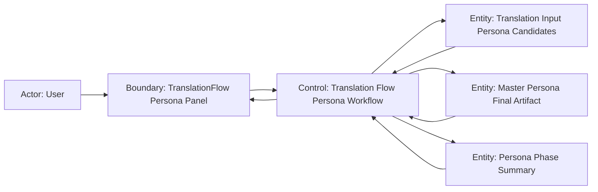

# Scenario Design

## Goal
ユーザーが翻訳フローの `ペルソナ生成` phase で、翻訳対象に登場する NPC を確認し、既存 Master Persona を持つ NPC を再利用対象として除外したうえで、未保有 NPC の persona だけを生成できること。

## Trigger
- ユーザーが `TranslationFlow` の `ペルソナ生成` タブを開く
- ユーザーが `ペルソナ生成を開始` を押す
- 既存の `translation_project` task を再表示し、`ペルソナ生成` phase を復元する

## Preconditions
- `translation_project` task にロード済みの抽出データが紐づいている
- translation input artifact から NPC と会話データを取得できる
- `master_persona_artifact` の final 成果物が `source_plugin + speaker_id` で検索できる
- persona slice が未保有 NPC だけに対して prompt 生成と保存を行える
- `ペルソナ生成` 用のモデル設定と prompt 設定が有効である

## Robustness Diagram


## Main Flow
1. ユーザーが `TranslationFlow` の `ペルソナ生成` タブを開く。
2. システムが translation input artifact から翻訳対象に登場する NPC と関連会話を読み込み、`source_plugin + speaker_id` を正規化した候補集合を構築する。
3. システムが各候補について `master_persona_artifact` の final 成果物を検索し、`既存 Master Persona を再利用する行` と `新規生成対象行` に分ける。
4. システムが `検出 NPC 数` `既存 Master Persona 再利用数` `新規生成数` を summary に表示し、一覧の各行へ `既存 Master Persona` または `生成対象` badge を付与する。
5. ユーザーが一覧から NPC を選択し、既存 persona 本文または未生成対象の会話抜粋とメタ情報を確認する。
6. ユーザーがモデル設定と prompt 設定を確認し、`ペルソナ生成を開始` を押す。
7. システムが preview と同じ候補集合を再構築し、`生成対象` 行だけを persona slice の request 生成へ渡す。
8. システムが生成成功した行を `master_persona_artifact` の final 成果物へ保存し、一覧と summary を `生成済み` として更新する。
9. システムが `既存 Master Persona` 行と `生成済み` 行を合わせた最終状態を表示し、`次へ` を有効化する。
10. ユーザーが `次へ` を押して `要約` phase へ進む。

## Alternate Flow
- 全件が既存 Master Persona:
  - 候補集合のすべてに対応する final persona が既に存在する場合、システムは `新規生成数 0 件` を表示する。
  - `ペルソナ生成を開始` は無効化され、phase は no-op 完了として `次へ` を即時有効化する。
- NPC が 0 件:
  - translation input artifact に persona 対象 NPC が存在しない場合、システムは空状態を表示する。
  - 一覧は 0 件で、`次へ` は有効、`ペルソナ生成を開始` は表示しないか無効にする。
- 同一 NPC が複数ファイルに現れる:
  - 同じ `source_plugin + speaker_id` を持つ NPC が複数ファイルや複数行に現れても、システムは 1 つの候補として扱う。
  - 一覧と request 生成は同じ正規化済み候補集合を使い、重複 request を作成しない。
- cached 行の確認:
  - ユーザーが `既存 Master Persona` 行を選択した場合、システムは final 成果物から既存 persona 本文を詳細ペインへ表示する。
  - 当該行は開始対象にも retry 対象にもならない。
- 既存 task の再表示:
  - ユーザーが翻訳 task を開き直した場合、システムは保存済み phase summary と final 成果物を使って `既存 Master Persona` `生成済み` `生成失敗` の状態を復元する。
  - すでに保存済みの行を再度 `生成対象` に戻してはならない。

## Error Flow
- 候補集合の構築失敗:
  - translation input artifact の読み込みや lookup key 正規化に失敗した場合、システムは一覧の構築を中断し、phase エラーを表示する。
  - `ペルソナ生成を開始` は有効にしてはならない。
- Master Persona lookup 失敗:
  - final 成果物の検索に失敗した場合、システムは除外判定を行えないまま request 生成へ進んではならない。
  - ユーザーには `既存 Master Persona の確認に失敗しました` を表示し、再試行導線だけを提供する。
- LLM 実行または保存の一部失敗:
  - 一部の `生成対象` 行だけが失敗した場合、成功済み行と `既存 Master Persona` 行は保持したまま `partialFailed` に遷移する。
  - 失敗行は `生成失敗` として残し、ユーザーに `再試行` と `次へ` を提示する。
- 開始前後の致命失敗:
  - request 構築や phase 開始で全体失敗した場合、`生成対象` 行は未生成のまま残る。
  - `次へ` は無効のまま、`再試行` のみを提示する。

## Empty State Flow
- persona 対象 NPC が 0 件のとき、システムは空の一覧と説明文だけを表示する。
- `既存 Master Persona` が全件をカバーして `新規生成数` が 0 件のとき、システムは `再利用済み` 状態として扱い、empty ではなく no-op 完了状態を表示する。
- いずれの状態でも LLM request は 1 件も生成しない。

## Resume / Retry / Cancel
- Resume:
  - 既存 task の再表示時、システムは同じ `source_plugin + speaker_id` 正規化ルールで候補集合を再構築する。
  - 既に final 成果物に存在する行は `既存 Master Persona` または `生成済み` として復元し、再度 `生成対象` にしてはならない。
- Retry:
  - `partialFailed` または `failed` からの再試行では、システムは `生成失敗` または未生成の行だけを再度 request 化する。
  - `既存 Master Persona` 行と `生成済み` 行は再送してはならない。
- Cancel:
  - 本 change では `ペルソナ生成` phase 専用の cancel 操作は追加しない。
  - 実行中に画面を離れても、再表示時に保存済み summary から状態を復元する。

## Acceptance Criteria
- preview と execute は同じ `source_plugin + speaker_id` 正規化ルールを使い、候補集合がずれてはならない。
- `master_persona_artifact` に既存 final persona がある NPC は一覧に表示されても `新規生成数` と request 件数に含まれてはならない。
- `新規生成数` が 0 件のとき、phase は no-op 完了として扱われ、LLM request を 1 件も生成してはならない。
- 同一 NPC が複数ファイルに現れても、重複 request を作らず 1 候補として扱わなければならない。
- 生成成功した NPC は `master_persona_artifact` の final 成果物へ保存され、同一 task 再表示時に `生成済み` として復元されなければならない。
- cached 行を選択したときは final 成果物の persona 本文を詳細へ表示し、未生成行では未生成理由と会話抜粋だけを表示しなければならない。
- `partialFailed` では成功済み行を保持したまま失敗行だけを `再試行` 対象にし、`次へ` は persona 未保有 NPC が残ることを明示したうえで有効にしなければならない。
- E2E 観点:
  - `既存 Master Persona` と `生成対象` が同時に存在するケースで、summary 件数と row badge が一致することを確認できる。
  - 全件再利用ケースで `生成開始` が無効、`次へ` が即時有効、request 0 件であることを確認できる。
  - 同一 NPC が複数ファイルに現れても一覧と request が 1 件に統合されることを確認できる。
  - 実行成功後に `生成済み` 行の詳細へ persona 本文が表示されることを確認できる。
  - `partialFailed` で失敗行だけが `再試行` 対象として残ることを確認できる。

## Out of Scope
- Master Persona 画面の一覧・詳細仕様変更
- persona 本文の手動編集・承認ワークフロー
- 失敗行ごとの手動スキップ設定
- `要約` 以降の phase ロジック変更

## Open Questions
- なし

## Context Board Entry
```md
### Scenario Design Handoff
- 確定した main flow: translation input から候補集合を構築 -> final Master Persona lookup で再利用対象を除外 -> 新規対象だけを request 化 -> 生成結果を final 成果物へ保存 -> 次 phase へ handoff
- 確定した acceptance: 既存 Master Persona 除外、all-cached no-op 完了、重複候補統合、resume/retry の未解決行限定再送、partialFailed 時の続行導線を確認対象にした
- 未確定事項: なし
- 次に読むべき board: logic.md
```
