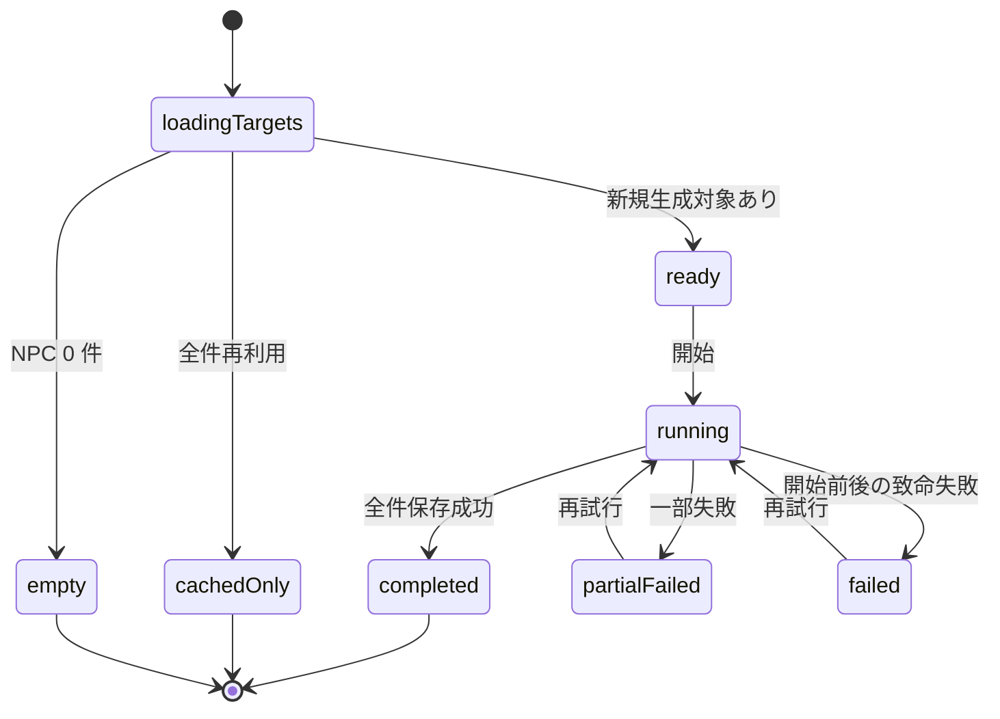

# UI Contract

## Purpose
翻訳フローの `ペルソナ生成` タブで、翻訳対象から検出した NPC を一覧し、既存 Master Persona を再利用する対象と新規生成が必要な対象を分けて確認したうえで、新規対象だけの生成を開始し、完了後に次 phase へ進める。

## Entry
- `TranslationFlow` の `単語翻訳` phase 完了後に `ペルソナ生成` タブへ遷移する
- 既存の `translation_project` task を再表示し、`ペルソナ生成` phase の状態を復元する

## Primary Action
ユーザーが「新規生成が必要な NPC だけ」を対象にペルソナ生成を実行し、既存 Master Persona を含む最終状態を確認して次 phase へ進む。

## State Machine


## State Facts
- `loadingTargets`: 要約カード、NPC 一覧、詳細ペインは skeleton または loading 表示になる。開始、再試行、次へ進む操作は無効である。
- `empty`: `ペルソナ対象 NPC はありません` の空状態を表示する。NPC 一覧は 0 件で、詳細ペインは説明文だけを表示する。`次へ` は有効、`生成開始` は表示しないか無効にする。
- `ready`: 要約カードに `検出 NPC 数` `既存 Master Persona 再利用数` `新規生成数` を並べて表示する。NPC 一覧の各行は `既存 Master Persona` または `生成対象` の badge を持つ。cached 行を選ぶと既存 persona 本文を read-only で表示し、pending 行を選ぶと NPC メタ情報と会話抜粋を表示する。`生成開始` は有効、`次へ` は無効である。
- `cachedOnly`: 要約カードに `新規生成 0 件` と `既存 Master Persona を再利用します` を表示する。一覧の全行は `既存 Master Persona` badge を持つ。`生成開始` は無効、`次へ` は即時有効である。
- `running`: 要約カードに `再利用済み / 生成済み / 残り` を含む進捗表示を出す。cached 行はそのまま read-only、生成対象行は `生成中` または `生成済み` に遷移する。`生成開始` と `次へ` は無効、`再試行` は表示しない。
- `completed`: 要約カードに `生成済み` `再利用` `失敗 0` を表示する。生成済み行を選ぶと保存済み persona 本文を read-only で表示する。`次へ` は有効である。
- `partialFailed`: 要約カードに `一部の NPC でペルソナ生成に失敗しました` を警告表示し、`生成済み` `再利用` `失敗` 件数を同時に出す。失敗行は `生成失敗` badge と再試行案内を表示する。`再試行` と `次へ` は有効であり、`次へ` は失敗行が persona なしで後続 phase に進むことを明示する。
- `failed`: lookup または開始処理が失敗した alert を表示する。cached 行は閲覧できるが pending 行は未生成のままである。`再試行` は有効、`次へ` は無効である。

## Structure
- summary card: 検出数、再利用数、新規生成数、進捗、警告
- settings card: ペルソナ生成用のモデル設定と prompt 設定
- list: NPC 一覧、status badge、source plugin、speaker/editor 識別情報
- detail: 選択 NPC の persona 本文、会話抜粋、メタ情報
- footer actions: `生成開始` `再試行` `次へ`

## Content Priority
1. 既存 Master Persona をどれだけ再利用できるか
2. 今回新規生成が必要な NPC が誰か
3. 選択 NPC の persona 本文または未生成理由
4. 実行設定と phase 遷移操作

## Copy Tone
ユーザーへ「再利用」「新規生成」「失敗時の影響」を明確に伝える、短く運用的な文言を使う。内部実装語の `cache hit` ではなく `既存 Master Persona を再利用` を基本表現にする。

## Verification Facts
- preview と execute の両方で `既存 Master Persona` 行が `新規生成数` に含まれない
- `cachedOnly` では LLM 実行を開始せず、`次へ` が即時有効になる
- cached 行を選択したときは既存 persona 本文を表示し、pending 行は未生成状態として表示する
- 実行後は `生成済み` `再利用` `失敗` 件数が一覧 badge と summary で矛盾しない
- `partialFailed` では `再試行` と `次へ` が同時に表示され、失敗行だけが未解決として残る

## Non-goals
- Master Persona 自体の編集や再生成
- 行単位の手動除外・手動強制生成
- `ペルソナ生成` phase 専用の pause / resume UI
- persona 本文の手動編集機能

## Open Questions
- なし

## Context Board Entry
```md
### UI Design Handoff
- 確定した state: loadingTargets / empty / ready / cachedOnly / running / completed / partialFailed / failed
- 確定した UI 事実: 既存 Master Persona は一覧には表示するが新規生成数には含めず、全件再利用時は no-op 完了として即時に次 phase へ進める
- 未確定事項: なし
- 次に読むべき board: scenarios.md
```
