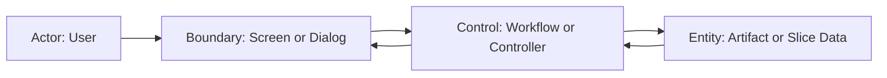

# Scenario Design Examples

## 基本構成の例
- Goal: ユーザーが翻訳対象を選び、実行を開始できる
- Trigger: 一覧から対象を選んで開始操作を行う
- Preconditions: 対象データが読み込まれている
- Main Flow: 選択 -> 確認 -> 実行開始 -> 進捗表示
- Error Flow: 実行要求が失敗した場合はエラー表示と再試行導線を出す

## Resume / Retry / Cancel を含む例
- Resume: 中断済みジョブが存在するとき再開導線を出す
- Retry: 失敗時に再試行できる
- Cancel: 実行中のみ取消可能とする

## ロバストネス図の例

