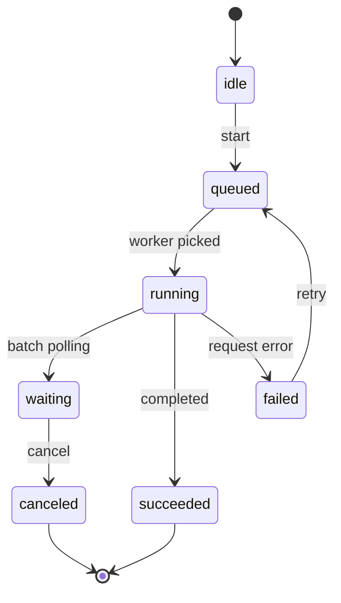
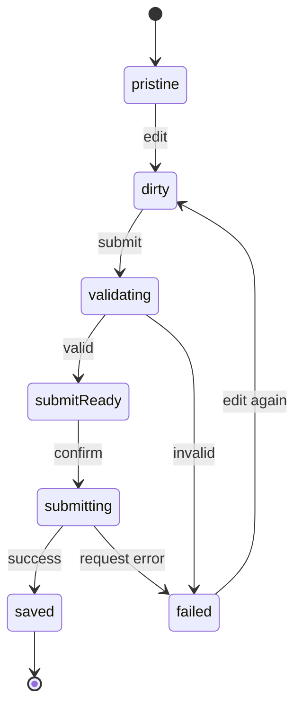
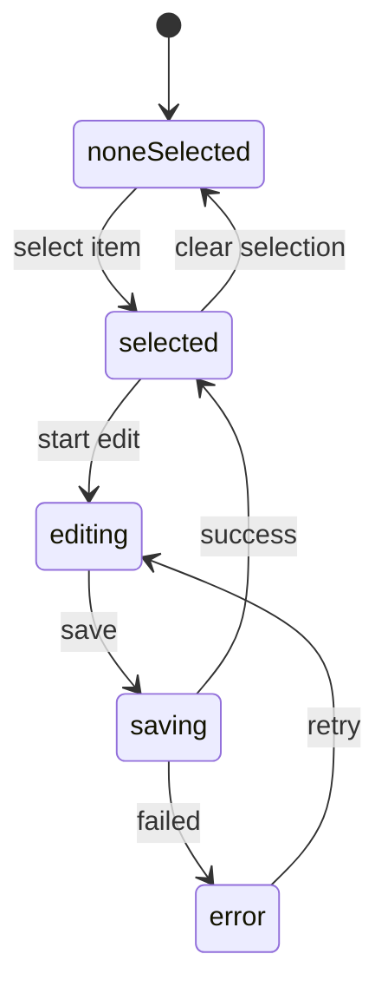

# UI Design Examples

## 非同期実行画面の例

```mermaid
stateDiagram-v2
  [*] --> idle
  idle --> queued: start
  queued --> running: worker picked
  running --> waiting: batch polling
  running --> succeeded: completed
  running --> failed: request error
  waiting --> canceled: cancel
  failed --> queued: retry
  succeeded --> [*]
  canceled --> [*]
```

state facts の例:
- `idle`: Start が有効、進捗表示なし
- `queued`: 開始操作は無効、待機文言あり
- `running`: 進捗表示あり、編集操作は無効
- `failed`: エラー文言あり、Retry が有効

## フォーム画面の例

```mermaid
stateDiagram-v2
  [*] --> pristine
  pristine --> dirty: edit
  dirty --> validating: submit
  validating --> submitReady: valid
  validating --> failed: invalid
  submitReady --> submitting: confirm
  submitting --> saved: success
  submitting --> failed: request error
  failed --> dirty: edit again
  saved --> [*]
```

## 一覧詳細画面の例

```mermaid
stateDiagram-v2
  [*] --> noneSelected
  noneSelected --> selected: select item
  selected --> editing: start edit
  editing --> saving: save
  saving --> selected: success
  saving --> error: failed
  error --> editing: retry
  selected --> noneSelected: clear selection
```
