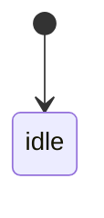

# UI Contract

## Purpose
この画面が達成する目的

## Entry
どこから来るか

## Primary Action
ユーザーがこの画面で達成すべき主操作

## State Machine


## State Facts
- `idle`: 画面上で観測可能な事実
- `loading`: 画面上で観測可能な事実
- `error`: 画面上で観測可能な事実
- `success`: 画面上で観測可能な事実

## Structure
- main area
- list
- detail
- dialog
- progress

## Content Priority
何を優先表示するか

## Copy Tone
文言トーン

## Verification Facts
- 各 state で後続 skill に渡す観測事実
- 実装前に固定したい確認観点

## Non-goals
今回決めないこと

## Open Questions
未確定事項

## Context Board Entry
```md
### UI Design Handoff
- 確定した state:
- 確定した UI 事実:
- 未確定事項:
- 次に読むべき board:
```
