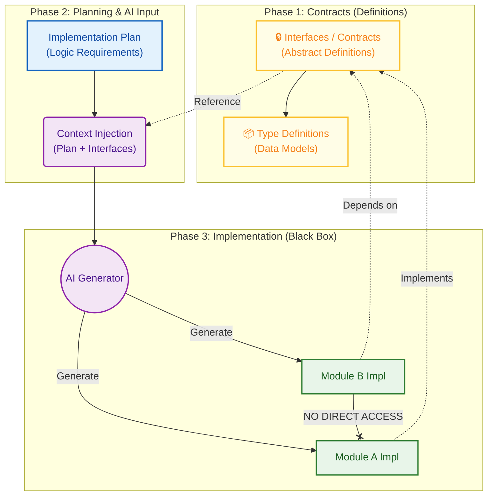
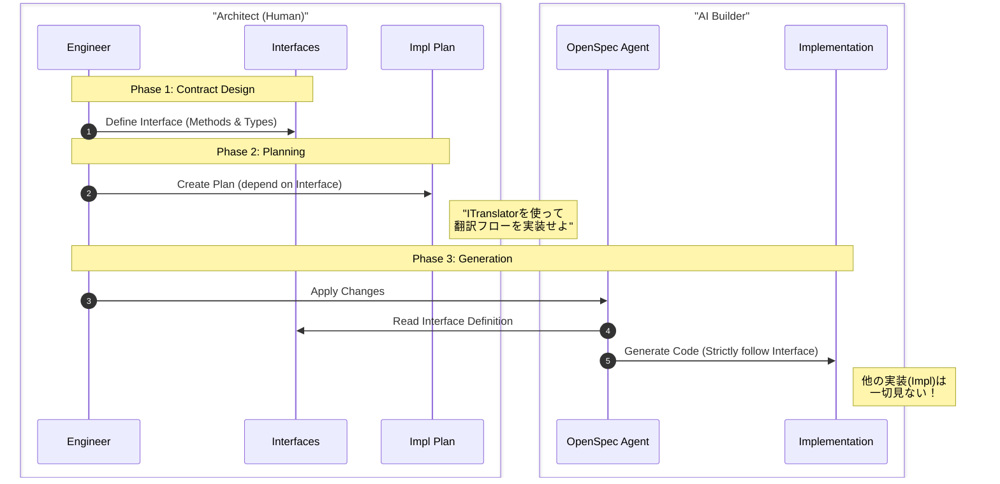

# **Interface-First AIDD (AI-Driven Development) Architecture**

## **インターフェース駆動による依存分離と、決定的コード生成モデル**

### **1. Executive Summary**

本アーキテクチャは、**「実装（Implementation）を入力せず、インターフェース（Contract）のみをコンテキストとして扱う」**ことを核心とする。  
各モジュールの「振る舞いの契約（Contract）」のみを定義・共有し、実装詳細はAIによるブラックボックス生成対象とする。これにより、不要なコンテキストの共有を廃止し、疎結合かつ堅牢な開発スタイルを確立する。

### **2. Core Philosophy (基本原則)**

#### **① Interface as the Contract (インターフェースは契約である)**

*   **概念**: すべてのモジュール操作は、抽象的な「インターフェース定義（Contract）」を介して行われなければならない。
*   **制約**: AI（および人間）は、他モジュールの「実装」を直接参照してはならない。必ず「抽象（Interface）」に依存する（DIP: Dependency Inversion Principle）。

#### **② Code is an Artifact (コードは成果物である)**

*   **概念**: 実装コードは、人間が管理する資産ではなく、仕様書とインターフェース定義から生成される「ビルド中間生成物（Artifact）」とみなす。
*   **制約**: 生成された実装コードへの手修正は禁止。修正は「Implementation Plan」または「Interface Definition」に対して行う。

#### **③ Two-Tier Documentation (仕様書と実装計画書の分離)**

*   **Requirements Spec (全体仕様書)**: ビジネス要求、UXフロー。
*   **Implementation Plan (実装計画書)**:
    *   **役割**: 1ユースケース単位の技術的指示書。
    *   **入力**: エンジニアは「実装の詳細」ではなく**「必要なインターフェース定義」のみ**を入力として与える。

#### **④ Separation of "Contract" & "Implementation" (契約と実装の分離)**

*   **Contract (Interface Definition)**: 関数シグネチャ、型定義、ドキュメントコメント。モジュール間の接着剤。
*   **Implementation (Logic)**: 実際のロジック。AIが生成・廃棄・再生成を繰り返す部分。

### **3. Architecture Overview (Interface-First Flow)**

「データ（Schema）」中心から、「振る舞い（Interface）」中心へ依存の方向を転換する。

### **4. Technical Tactics: Interface-Based Isolation**

#### **Contract-Oriented Design (契約指向)**

*   **実装戦略**: 言語固有の抽象化機能（Interface, Abstract Class, Protocol等）を活用し、疎結合を実現する。
*   **メリット**: 実装の詳細に依存せず、必要なメソッドを持つかどうか（契約を満たすか）だけで依存関係を定義できる。

#### **Mockability & Testing (モック容易性とテスト)**

*   **戦略**: インターフェースが定義されているため、本物のDBや外部APIの代わりに「Mock」を差し込むことが極めて容易になる。
*   **AIへの指示**: 「このインターフェースを満たすMockを作成せよ」という指示が明確になり、テストコードの生成精度が向上する。

#### **Interface-Limited Context Injection (インターフェース限定コンテキスト注入)**

*   **設計思想**: `Context` オブジェクトに全てを詰め込むのではなく、必要なインターフェースのみを注入する。
*   **解決策**:
    *   AIには「依存するInterface定義」と「自分の担当するImplementation Plan」しか見せない。
    *   他モジュールの実装詳細（ソースコード）はコンテキストから**物理的に遮断**する。
    *   これにより、コンテキストウィンドウの節約と、ハルシネーション（存在しないメソッドの捏造）の防止を同時に達成する。

### **5. Implementation Strategy**

| Layer         | Source of Truth          | AI Role (Artifacts)                                          | Human Role                                                    |
| :------------ | :----------------------- | :----------------------------------------------------------- | :------------------------------------------------------------ |
| **Contracts** | **Abstract Definitions** | (AIによる補完提案は可)                                       | **インターフェース設計** 型定義、メソッドシグネチャの決定 |
| **Logic**     | **Implementation Plan**  | **Concrete Implementation** インターフェースの実装コード | アルゴリズムの要件定義 成功条件(テスト)の記述             |
| **Wiring**    | **Dependency Injection** | **Container Config** (Wiring Definitions)                | どのインターフェースに どの実装を紐付けるかの指示         |

### **6. Operational Workflow with OpenSpec**

