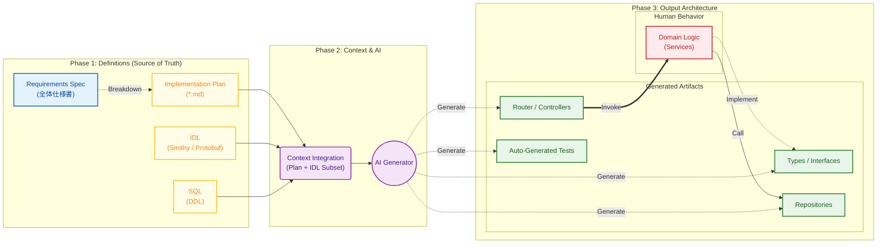
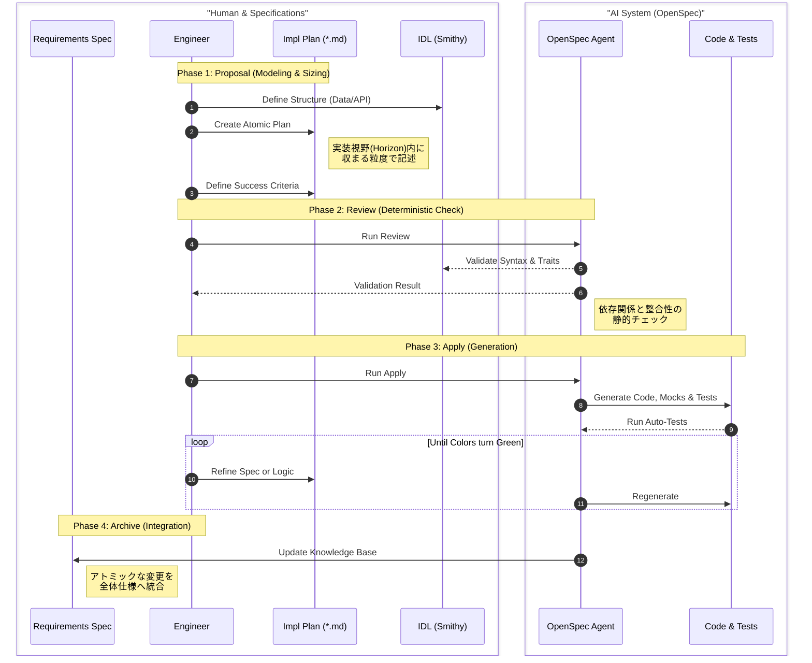

# **Schema-First AIDD (AI-Driven Development) Architecture**

## **仕様駆動による決定的コード生成と、責務分離による高効率開発モデル**

### **1\. Executive Summary**

本アーキテクチャは、\*\*「ソースコードを資産（Asset）ではなく、ビルド中間生成物（Artifact）と見なす」\*\*ことを核心とする。  
エンジニアはビジネス価値に直結する「データ構造（Schema）」と「ドメインロジック」の管理に集中し、ボイラープレートやデータアクセス層は、厳格な定義ファイルに基づきAIが決定的（Deterministic）に生成する。これにより、ハルシネーションのリスクを排除し、コンテキスト維持の認知負荷を最小化する。

### **2\. Core Philosophy (基本原則)**

#### **① Code is an Artifact (コードは成果物である)**

* **概念**: .java, .go, .ts などの実装コードは、人間が管理する資産ではなく、仕様書からコンパイルされた「バイナリ」と同等とみなす。  
* **制約**: 生成されたコードへの手修正は禁止（再生成で上書きされるため）。修正は必ず「Source of Truth（実装計画書およびIDL）」に対して行う。

#### **② Two-Tier Documentation (仕様書と実装計画書の分離)**

* **Requirements Spec (仕様書)**:  
  * **役割**: プロダクト全体の要件、UXフロー、ビジネスルールを定義する人間用のドキュメント。AIには読ませない（ノイズになるため）。  
* **Implementation Plan (実装計画書)**:  
  * **役割**: 仕様書を元に、ユースケース単位で技術的に噛み砕いたAIへの直接入力指示書。  
  * **構造**: 「1ユースケース \= 1 Markdownファイル」。自然言語によるロジック制約を含む。

#### **③ Mandatory Success Criteria (成功条件の提示義務)**

* **概念**: AIに対して「何を作るか」だけでなく「何をもって完了とするか」を明確にする。  
* **制約**: すべての Implementation Plan（実装計画書） には、必ず **「成功条件 (Success Criteria)」** を明記しなければならない。  
  * 例: 「ユーザー作成後、DBにレコードが存在し、かつウェルカムメール送信ジョブがキューイングされていること」  
* **効果**: これによりAIは実装コードと同時にテストコードを自動生成でき、出力の品質を機械的に検証可能にする。

#### **④ Separation of "Structure" & "Behavior" (構造と振る舞いの分離)**

* **Structure (AI担当)**: スキーマ、レイアウト、型定義、ルーティング。  
* **Behavior (人間担当/AI支援)**: 複雑な計算、状態遷移、UXの機微。

#### **⑤ Regenerable & Replaceable (再生成と交換の自由)**

* **Regenerability (再生成可能性)**: 実装コードはいつでも rm \-rf で削除でき、実装計画書さえあれば即座に復元される。  
* **Replaceability (交換可能性)**: 実装計画書（Markdown）単位で独立しているため、特定機能の実装技術（言語やライブラリ）だけを容易に交換できる。

### **3\. Architecture Overview (Data Flow)**

「全体仕様書」から「アトミックな実装計画書」へのブレイクダウンプロセスを追加。  

### **4\. Technical Tactics: Determinism & Context Optimization**

AIによる生成を「確率的な提案」から「決定論的なビルドプロセス」へと昇華させるための技術的要件。

#### **Strict Schema Definition via IDL (IDLによる厳格なスキーマ定義)**

* **推奨技術**: **AWS Smithy** (推奨), Protocol Buffers, GraphQL SDL等  
* **根拠と目的**:  
  1. **自然言語の曖昧性排除**: Markdown上の表やJSON例による型定義は、AIによる解釈の揺らぎ（Ambiguity）を生み、ハルシネーションの原因となる。AWS SmithyのようなIDL（Interface Definition Language）を用いることで、型、制約（長さ、パターン）、依存関係を構文レベルで確定させ、AIへの指示を「解釈」ではなく「変換」タスクへと単純化する。  
  2. **言語非依存の資産化**: 本アーキテクチャの「交換可能性（Replaceability）」を担保するため、データ構造定義は特定の実装言語（TSやGo）から切り離されている必要がある。Smithyは言語に依存しない「Structure」の定義に特化しており、Trait（@readonly, @required等）を用いてAPIの挙動や意図まで記述できるため、AIにとって極めて高解像度な入力情報となる。  
  3. **バリデーションのシフトレフト**: IDL自体がValidatorを持つため、AIにコードを書かせる前にスキーマの整合性を機械的に保証できる。

#### **Atomic Context Injection (原子的コンテキスト注入)**

* **依存グラフの切断**: 生成プロセスにおいて、AIエージェントにプロジェクト全体のソースコードツリーへのアクセス権を与えない。  
* **Input Isolation**: AIへの入力は、常に「対象の実装計画書1つ」と「関連するIDL定義」のみに限定する。

#### **Sizing the Implementation Horizon (実装視野のサイジング)**

* **概念**: 2026年時点の戦略的エンジニアリングにおいて重要視される指標。AIエージェントが一度の実行（イテレーション）で確実に、かつ信頼性を持って実装できる作業量を\*\*「実装視野（Implementation Horizon）」\*\*と呼ぶ。  
* **制約**: 実装計画書（Implementation Plan）は、常にこの視野内に収まる粒度でサイジングされなければならない。仕様がこの視野を超えて肥大化すると、AIはコンテキストウィンドウを使い果たし、注意力の散漫によるエラーを誘発する。

#### **Verification-Driven Generation (検証駆動生成)**

* **成功条件の活用**: AIにコードを書かせる前に、実装計画書の「成功条件」を読み込ませ、それを満たすためのテストコード（またはテストシナリオ）を先に生成・意識させることで、ロジックの整合性を高める。

### **5\. Implementation Strategy: Backend Layer**

「仕様＝実装」の完全同期を実現するため、以下の分担を徹底する。IDLの導入により、入出力定義の責務を実装計画書から独立させる。

| Layer                   | Source of Truth                                     | AI Role (Artifacts)                                      | Human Role (Behavior)                                                 |
| :---------------------- | :-------------------------------------------------- | :------------------------------------------------------- | :-------------------------------------------------------------------- |
| **Plan & Verification** | **Implementation Plan** (Logic \+ Success Criteria) | テストコードの生成 バリデーションロジック                | 全体仕様書からのブレイクダウン 成功条件の定義                         |
| **Interface / Schema**  | **IDL (AWS Smithy)**                                | **型定義・DTO・Client** APIドキュメント                  | **リソースモデルの設計** Traitによる制約定義                          |
| **Data Access**         | **SQL (DDL)**                                       | Entity (Struct/Class) O/R Mapper設定 基本CRUD Repository | \-                                                                    |
| **Business Logic**      | (Defined in Plan)                                   | Serviceのインターフェース 単純なデータマッピングの実装   | **Serviceクラスのコア実装** 複雑な計算・外部連携 トランザクション境界 |
| **API Docs**            | (Generated from IDL)                                | OpenAPI (yaml) (IDLから自動生成)                         | \-                                                                    |

### **6\. Operational Workflow with OpenSpec**

本アーキテクチャの実践において、AI協働フレームワーク「OpenSpec」の標準ワークフローを採用する。  

