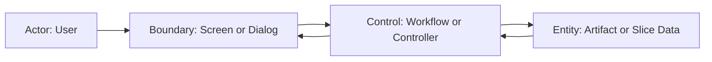

# Scenario Design

## Goal
このシナリオが達成するユーザー目的

## Trigger
何が開始条件になるか

## Preconditions
開始前に満たされている条件

## Robustness Diagram

## Main Flow
1. ユーザーが何をするか
2. システムがどう応答するか
3. ユーザーに何が見えるか

## Alternate Flow
- 主経路から外れる分岐

## Error Flow
- 失敗時の流れ
- エラー時にユーザーへどう見えるか

## Empty State Flow
- 対象データが無いときの流れ

## Resume / Retry / Cancel
- 再開条件
- 再試行条件
- 取消条件

## Acceptance Criteria
- 受け入れ条件
- E2E で確認したい事実

## Out of Scope
今回扱わないこと

## Open Questions
未確定事項
