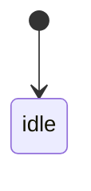

# UI Contract

## Purpose
この画面が達成する目的

## Entry
どこから来るか

## Primary Action
ユーザーがこの画面で達成すべき主操作

## State Machine

## State Facts
- `idle`: 画面上で観測可能な事実
- `loading`: 画面上で観測可能な事実
- `error`: 画面上で観測可能な事実
- `success`: 画面上で観測可能な事実

## Structure
- main area
- list
- detail
- dialog
- progress

## Content Priority
何を優先表示するか

## Copy Tone
文言トーン

## Playwright MCP Checks
- どの state をどう確認するか
- 何を snapshot し、何を screenshot するか
- どの操作で遷移を発火するか

## Non-goals
今回決めないこと

## Open Questions
未確定事項
