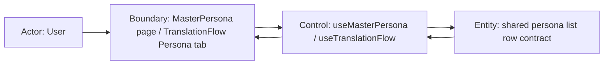

# Scenario Design

## Goal
TranslationFlow の persona phase でも、MasterPersona と同じ一覧体験で NPC を選択しつつ、phase 固有の再利用・生成・失敗状態を見失わないようにする。

## Trigger
- ユーザーが `TranslationFlow` の `ペルソナ生成` タブを開く
- ユーザーが `MasterPersona` 画面を開く
- 既存 translation task を再表示して persona phase 状態を復元する

## Preconditions
- `MasterPersona` 一覧と `TranslationFlow` persona target 一覧の双方が frontend で共通 row contract へ正規化できる
- TranslationFlow は `source_plugin + speaker_id` を stable key として行を返せる
- MasterPersona は final artifact 由来の一覧 DTO を返し続ける

## Robustness Diagram


## Main Flow
1. ユーザーが `MasterPersona` または `TranslationFlow` の persona 一覧を開く。
2. 親 hook が各画面の DTO を shared list row contract に正規化し、同じ list component へ渡す。
3. shared list component が共通の table shell とページャーで行を描画する。
4. ユーザーが行を選択すると、親 hook が選択 key を更新し、右ペインに画面固有の詳細を表示する。
5. TranslationFlow では phase state を補助表示として残しつつ、一覧の見た目自体は MasterPersona と同じ構造を保つ。

## Alternate Flow
- TranslationFlow の選択行がページ切替後に存在しない場合、親 hook は先頭行または未選択へ戻す。
- MasterPersona は既存の検索・プラグイン絞り込みを継続し、shared list には絞り込み済み rows だけを渡す。

## Error Flow
- TranslationFlow の target 取得に失敗した場合、phase カード側でエラーメッセージを表示し、shared list は loading / empty 以外の独自レイアウトを持ち込まない。
- MasterPersona の NPC 一覧取得に失敗した場合、shared list に部分的な menu UI を残さず、親が管理するエラー表示へ委譲する。

## Empty State Flow
- TranslationFlow に persona 対象 NPC がない場合、共有一覧は空状態メッセージを表示し、phase summary は `empty` または `cachedOnly` を維持する。
- MasterPersona に final persona が 0 件の場合、共有一覧は空状態で表示され、右ペインは選択待ち表示のままになる。

## Resume / Retry / Cancel
- 既存 translation task を再表示したとき、親 hook は同じ stable key で shared list の選択を復元または再評価する。
- retry 後に row state が `failed` から `running` / `generated` へ変わっても、一覧 shell と列順は変わらない。
- cancel / pause は phase summary と action button だけを変え、shared list の構造は維持する。

## Acceptance Criteria
- TranslationFlow の persona 一覧は MasterPersona と同じ table shell と行選択スタイルを使う。
- TranslationFlow の row state は shared list の補助表示で識別でき、`既存 Master Persona` と `生成失敗` を取り落とさない。
- 共通 component は一覧表示だけを担当し、詳細ペインの違いを吸収しようとしない。
- MasterPersona の既存フィルタとページングは共通 component 導入後も退行しない。
- TranslationFlow の resume / retry 後も、同じ行 key に対する selection と page refresh が成立する。

## Out of Scope
- TranslationFlow persona detail の `generation_request` 表示追加
- MasterPersona の詳細タブ構成変更
- backend の persona candidate planner ルール変更

## Open Questions
- TranslationFlow でフィルタ UI を出す場合、server-side filtering を追加するか、current page 限定にするかは別途判断が必要

## Context Board Entry
```md
### Scenario Design Handoff
- 確定した main flow: 親 hook 正規化 -> shared list 描画 -> 親で選択反映
- 確定した acceptance: 一覧 shell 共通化、phase state 維持、resume / retry 非退行
- 未確定事項: TranslationFlow 側のフィルタ戦略
- 次に読むべき board: changes/persona-phase-shared-npc-list/logic.md
```
