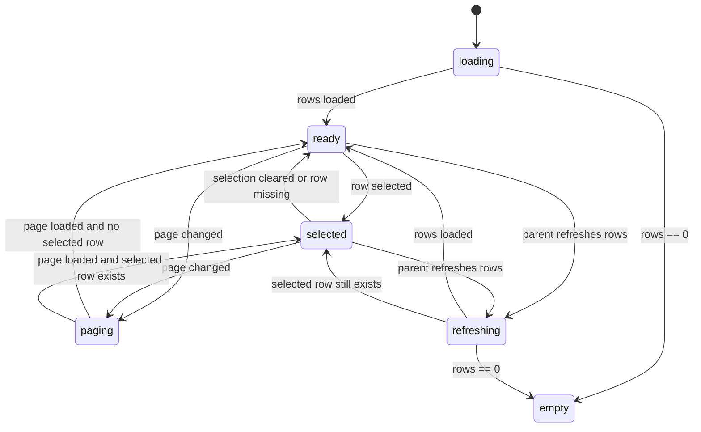

# UI Contract

## Purpose
`MasterPersona` 一覧と `TranslationFlow` の `ペルソナ生成` phase 一覧を同じ表形式の UI 契約へ揃え、NPC 選択体験を統一する。

## Entry
- `MasterPersona` 画面を開いたとき
- `TranslationFlow` で `ペルソナ生成` タブを開いたとき
- 既存 translation task を再表示して persona phase 一覧を復元したとき

## Primary Action
ユーザーが同じ見た目の NPC 一覧から対象行を選択し、右側の詳細ペインで画面ごとの詳細や操作を確認できること。

## State Machine


## State Facts
- `loading`: 両画面とも同じカード枠とヘッダー位置を保ったまま、一覧領域だけが読込中表示になる。
- `empty`: 一覧領域は表形式の空状態メッセージへ切り替わり、右ペインは各画面の既存 empty 表示を維持する。
- `ready`: 一覧は `FormID` `プラグイン名` `NPC名` を主列とする table shell を表示し、MasterPersona と TranslationFlow で同じ行高、選択ハイライト、ページャー配置を使う。
- `selected`: 選択行は両画面で同じ強調スタイルを使い、右ペインだけが画面固有の詳細へ切り替わる。
- `paging`: ページ切替中は共有ページャーの操作位置を変えず、必要なボタンだけを disabled にする。
- `refreshing`: translation task の再表示や retry 後も一覧 shell を崩さず、phase 状態や persona 本文だけを再同期する。

## Structure
- shared list shell
- title / count / pager header
- common table columns: `FormID`, `プラグイン名`, `NPC名`
- optional row meta slot: `EditorID`, `更新日時`, phase state badge
- external detail pane owned by each page
- external action area owned by each page

## Content Priority
1. NPC 識別に必要な `FormID` と `NPC名`
2. 同名衝突を避ける `source_plugin`
3. 文脈補助としての `EditorID`、`更新日時`、phase state

## Copy Tone
既存 Persona UI に合わせて、短く操作的な文言を使う。phase 固有状態は badge または補助テキストで示し、列名そのものは MasterPersona 基準で揃える。

## Verification Facts
- `MasterPersona.tsx` と `PersonaPanel.tsx` は同じ shared list component を使う。
- TranslationFlow 行の `speakerId` は shared list の `FormID` 列へ正規化される。
- TranslationFlow の `reused / pending / running / generated / failed` は shared list の補助表示で識別できる。
- shared list 自体は詳細ペインを持たず、選択イベントだけを親へ返す。
- MasterPersona の検索・プラグイン絞り込みは shared list の外側から差し込める。

## Non-goals
- `PersonaDetail` と `TranslationFlow PersonaPanel` の詳細ペインを共通化すること
- persona phase の backend 集計ロジックを変更すること
- terminology phase や summary phase の UI を揃えること

## Open Questions
- TranslationFlow 側でも MasterPersona と同じ検索 / プラグイン絞り込みを追加するかは実装時に判断する

## Context Board Entry
```md
### UI Design Handoff
- 確定した state: loading, empty, ready, selected, paging, refreshing
- 確定した UI 事実: shared table shell、共通列、共通選択ハイライト、親管理の詳細ペイン分離
- 未確定事項: TranslationFlow 側の検索 / フィルタ有無
- 次に読むべき board: changes/persona-phase-shared-npc-list/scenarios.md
```
