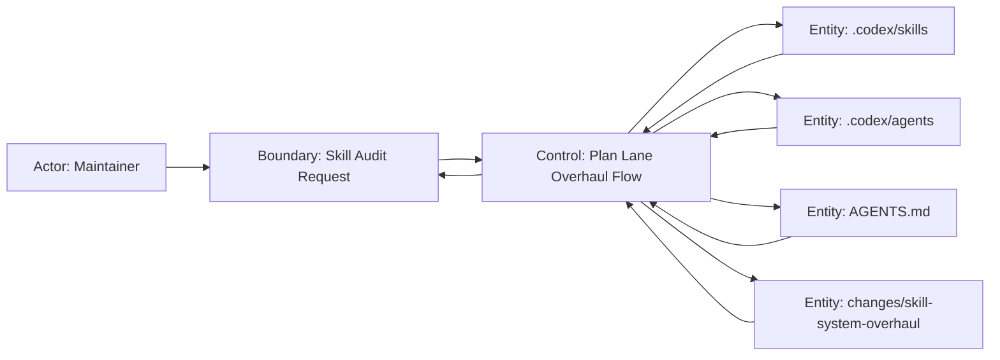

# Scenario Design

## Goal
maintainer が `.codex/skills` を監査し、矛盾した入口ルール、存在しない workflow、実行不能なテンプレート参照を解消したうえで、`impl-workplan` と専用 agent を含む新しい impl lane へ skill オーバーホールを段階的に進められること。

## Trigger
- maintainer が `.codex/skills` 配下の整合性監査を依頼する
- 新しい skill を追加する前に、既存 skill の責務衝突やテンプレート不整合を棚卸ししたい
- AGENTS.md と skill 群のルール差分を解消したい
- `tasks.md` の生成責務を plan lane ではなく impl lane に移したい

## Preconditions
- `.codex/skills/` `.codex/agents/` `AGENTS.md` が読める
- `changes/` に今回の差分仕様を残せる
- 各 skill が参照する `references/*.md` の実在確認ができる
- skill 間リンク、agent 名、template の schema を確認できる

## Robustness Diagram


## Main Flow
1. Maintainer が `.codex/skills` の矛盾点洗い出しを依頼する。
2. システムが direction skill、non-direction skill、agent 定義、reference template を走査する。
3. システムが user-facing 入口、下流 workflow、テンプレート schema、tool 利用規約の衝突を抽出する。
4. システムが `即時修正が必要な矛盾` と `設計方針の再編が必要な論点` を分けて整理する。
5. システムが `impl-direction -> impl-distill -> impl-workplan -> impl-frontend-work / impl-backend-work -> impl-review` を impl lane の正本 chain として確定する。
6. システムが `impl-workplan` 専用 agent と `changes/<id>/tasks.md` の役割を定義する。
7. システムが改善提案を `責務整理` `workflow 正規化` `検証自動化` の 3 系統で列挙する。
8. システムが change 文書に段階的なオーバーホール計画を記録する。
9. Maintainer が計画を基に実装修正 lane へ handoff できる状態になる。

## Alternate Flow
- 参照ファイルが欠落している:
  - システムは欠落パスを blocking issue として記録する。
  - 以降の提案では、まず参照整備を Phase 0 の必須項目に繰り上げる。
- skill が旧 workflow と新 workflow を併記している:
  - システムは両方を暫定共存とは扱わず、正本 workflow 不明として記録する。
  - 提案では、正本 workflow を 1 本に決めるまで新規 skill 追加を止める。
- `tasks.md` の生成主体が複数ある:
  - システムは plan lane 側の生成責務を削除対象として扱う。
  - 提案では `impl-workplan` だけを `tasks.md` の生成主体として固定する。
- AGENTS.md と skill 記述が衝突している:
  - システムは AGENTS.md を優先ルールとして扱う。
  - skill 側には handoff か補助 skill 化のどちらが必要かを明示する。

## Error Flow
- skill 群の走査中に schema を判定できない記述がある:
  - システムは曖昧な箇所を `Open Questions` ではなく `required clarification` として記録する。
  - 実装 lane への handoff は、その clarification を解消するまで行わない。
- 参照された skill / agent / template が存在しない:
  - システムはその skill を実行可能と見なさず、重大 finding として記録する。
  - 改善計画では削除か置換のどちらかを必ず指定する。

## Empty State Flow
- 矛盾が検出されない場合、システムは `overhaul 不要` と結論づける。
- この change では empty state を想定せず、最低でも監査結果の記録を残す。

## Resume / Retry / Cancel
- Resume:
  - 途中で監査を再開する場合、既存 `review.md` と `tasks.md` を読み、未着手 phase から再開する。
- Retry:
  - 指摘修正後に再監査する場合、同じ finding カテゴリで再チェックし、解消済みと残件を分ける。
- Cancel:
  - 本 change では overhaul 設計だけを扱い、skill 実装変更の cancel / rollback 手順は定義しない。

## Acceptance Criteria
- user-facing 入口 skill は AGENTS.md と矛盾しない集合に整理されている。
- direction skill から下流 skill への chain は、存在する skill / agent / template だけで完結している。
- `tasks.md` は impl lane でのみ生成され、`impl-workplan` と専用 agent が section 単位の実装計画を確定できる。
- section はモジュール/契約単位で分割され、各 section が frontend または backend の単一 owner だけを持つ。
- `impl-review` は統合差分に対して 1 回実行され、差し戻し時だけ affected section が再投入される。
- review skill の出力 schema は direction skill 側の判定条件と一致している。
- logging 系 skill は追加と削除のライフサイクルが矛盾なく定義されている。
- tool 利用規約は server-filesystem / go-llm-lens / ts-lsp に揃い、存在しない tool 名を含まない。
- overhaul tasks は hotfix、正規化、検証自動化の段階に分かれ、順番依存が明示されている。

## Out of Scope
- 今回の change 内で `.codex/skills` 実ファイルをすべて改修し切ること
- agent モデル選定の最適化
- docs 正本への同期そのもの

## Open Questions
- 将来の UI polish 用 skill を `impl-direction` 配下の補助フローに統合するか、第五の内部入口として残すか

## Context Board Entry
```md
### Scenario Design Handoff
- 確定した main flow: 監査依頼受付 -> skill/agent/template 走査 -> impl-workplan を含む impl chain 確定 -> tasks.md の ownership 固定 -> 改善提案整理 -> change 文書へ計画記録 -> impl lane へ handoff
- 確定した acceptance: 入口 skill 整理、impl-workplan と専用 agent の新設、tasks.md の impl lane 移管、統合 review 前提、logging lifecycle 正規化、tool 規約統一、段階的 tasks 管理
- 未確定事項: UI polish skill の最終配置
- 次に読むべき board: logic.md
```
