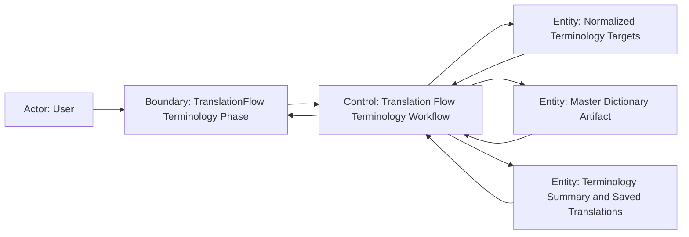

# Scenario Design

## Goal
ユーザーが翻訳フローの `単語翻訳` phase で、日本語の行を対象外として除外したうえで、マスター辞書の全文完全一致は即時に確定訳へ置き換え、未確定行はキーワード完全一致区間だけを先に日本語化した本文と reference terms を使って LLM 翻訳できること。

## Trigger
- ユーザーが `データロード` phase 完了後に `単語翻訳` phase を開く
- ユーザーが `単語翻訳を実行` を押す
- 既存の翻訳 task を再表示し、`単語翻訳` phase の状態を復元する

## Preconditions
- 対象 task に 1 件以上のロード済みデータが紐づいている
- Dictionary Builder によりマスター辞書 artifact が構築済みで、translation flow から検索できる
- workflow が task 境界から raw terminology input を取得できる
- terminology slice が保存済み訳と phase summary を復元できる
- LLM 実行が必要な場合は、request 設定と prompt 設定が有効である

## Robustness Diagram


## Main Flow
1. ユーザーが `データロード` phase を完了し、`単語翻訳` phase を開く。
2. システムが task 境界の raw terminology input を読み込み、shared REC allow-list・重複統合・NPC ペア規則を維持したまま terminology 対象候補を正規化する。
3. システムが候補のうち、既に日本語の文字列、空文字、非対象 REC を除外し、`単語翻訳` phase の対象一覧には残さない。
4. ユーザーが除外後の対象一覧を確認し、必要に応じて既に保存済みの訳を確認する。
5. ユーザーが `単語翻訳を実行` を押す。
6. システムが同じ正規化ルールで実行対象を再構築し、マスター辞書 artifact に対してソース全文の完全一致を検索する。
7. システムが全文完全一致した行は辞書の日本語訳を `cached` として即時保存し、LLM dispatch 対象から外す。
8. システムが全文未解決行について、キーワード境界の厳密一致だけを対象にキーワード完全一致を検索し、longest-first / non-overlap で部分置換区間を決定する。
9. システムが一致区間だけを辞書の日本語訳へ置き換え、`Skeever Den -> スキーヴァー Den` のような LLM 入力本文を構築する。この部分置換は `cached` ではなく、LLM 前処理として扱う。
10. システムが部分置換後の本文とは別に、未解決行の reference terms を収集し、NPC 行では人名部分一致候補も追加して system prompt に含める。
11. システムが未解決行だけを LLM へ dispatch し、レスポンスを保存する。
12. システムが exact match で確定した行と、部分置換済み本文から LLM が翻訳した行を同じ terminology 結果として復元し、ユーザーは内容を確認して後続 phase へ進む。

## Alternate Flow
- 完全一致のみで完了:
  - 正規化後の対象がすべて辞書完全一致で解決できる場合、システムは `cached` 保存だけで terminology phase を完了する。
  - LLM request は 1 件も生成されず、ユーザーは完了済みの訳を確認できる。
- キーワード完全一致の部分置換:
  - 全文完全一致が無い未解決行に `Skeever` のようなキーワード完全一致がある場合、システムは一致区間だけを辞書訳へ置き換えた本文を LLM に渡す。
  - 部分置換は longest-first / non-overlap で決まり、短い一致候補が長い一致候補の区間を上書きしてはならない。
  - 部分置換済みの本文は reference terms とは別に扱われ、行全体を `cached` 完了へ昇格させない。
- 複数キーワードが同時に一致する場合:
  - 同じ未解決行に複数のキーワード完全一致候補がある場合、システムはキーワード境界の厳密一致だけを採用する。
  - `Broken Tower Redoubt` のように長い候補と短い候補が競合する場合、長い候補を優先し、重複区間へ別候補を重ねてはならない。
- NPC の人名部分一致:
  - NPC 行に全文完全一致が無い場合、システムは未消費キーワードに対する人名部分一致候補を収集し、reference terms として prompt に含める。
  - 人名部分一致候補は参考情報であり、確定置換には使わない。
- 同一語の重複統合:
  - 非 NPC で同じ `RecordType + SourceText` を持つ行は 1 つの翻訳単位として扱う。
  - 保存時は同じ統合キーに属する行へ同じ訳を fan-out する。
- 既存 task の再表示:
  - ユーザーが既存 task を開き直すと、システムは日本語除外後の対象一覧と、exact match / LLM 翻訳の保存結果を復元する。
  - exact match で確定した行は再表示時も辞書訳として表示され、再度 LLM 対象にならない。

## Error Flow
- マスター辞書検索失敗:
  - terminology 実行開始時にマスター辞書 artifact の検索へ失敗した場合、システムは LLM dispatch を開始しない。
  - phase は `run_error` とし、ユーザーへ辞書参照に失敗したことを示す。
- 部分置換候補の解決失敗:
  - キーワード完全一致候補の検索または部分置換本文の構築に失敗した場合、システムは不完全な置換本文を LLM へ渡してはならない。
  - phase は `run_error` とし、ユーザーへ辞書参照または前処理に失敗したことを示す。
- LLM 実行の一部失敗:
  - exact match で保存済みの行は保持したまま、未解決行のうち成功したものだけを保存する。
  - 失敗行は未翻訳のまま残し、ユーザーは partial completion を識別できる。
- 保存失敗:
  - exact match または LLM 結果の保存に失敗した場合、システムは phase を失敗として扱い、途中まで確定済みの保存結果だけを保持する。
  - ユーザーは再実行により未確定分を再処理できる。

## Empty State Flow
- raw terminology input が存在しても、shared REC allow-list で対象にならない行、空文字、既に日本語の行しか無い場合、システムは terminology 対象 0 件として扱う。
- `単語翻訳` phase には翻訳対象一覧を表示せず、LLM request も生成しない。
- ユーザーは terminology 実行を行わずに空状態を確認できる。

## Resume / Retry / Cancel
- Resume:
  - 既存 task の再表示時、システムは日本語除外後の対象集合、exact match の保存結果、部分置換を経た LLM 翻訳結果、phase summary を復元する。
  - exact match 済みの行は resume 後も再計算不要な確定訳として扱う。
- Retry:
  - `run_error` または partial completion 後の再実行では、システムは同じ正規化ルールを再適用する。
  - 日本語行と exact match 済み行は再度 LLM request を作らず、未確定行には同じキーワード境界・longest-first / non-overlap の部分置換ルールを再適用してから再 dispatch する。
- Cancel:
  - terminology phase 専用の cancel 操作は追加しない。
  - 実行中は terminal state に戻るまで待機する。

## Acceptance Criteria
- 日本語を含む行は terminology 対象一覧、request 構築、辞書索引、LLM 翻訳のいずれにも含まれない。
- raw terminology input に対象 REC が含まれていても、日本語行だけは preview / execute の両方で除外される。
- マスター辞書 artifact にソース全文の完全一致がある場合、LLM request は生成されず、辞書の日本語訳が `cached` として保存される。
- exact match で保存された行は terminology phase 再表示時に翻訳済みとして復元される。
- 全文未解決行に `Skeever -> スキーヴァー` のようなキーワード完全一致がある場合、LLM に渡す本文は `スキーヴァー Den` のように一致区間だけ日本語へ先置換される。
- 部分置換はキーワード境界の厳密一致だけを採用し、ステム一致や LIKE ベースの曖昧ヒットでは本文を書き換えてはならない。
- 長い一致候補と短い一致候補が重なる場合、部分置換は longest-first / non-overlap で決まり、短い候補が長い候補の置換区間へ重なってはならない。
- 未解決行では部分置換後の本文とは別に `reference_terms` が構築され、NPC 行では人名部分一致候補も prompt に追加される。
- 部分置換は reference terms とは別の前処理ステージであり、行全体を `cached` 完了へ昇格させない。
- 人名部分一致候補は参考情報としてだけ使われ、辞書完全一致のような強制置換にはならない。
- exact match だけで全対象が解決した場合、phase は LLM dispatch なしで完了する。
- LLM 実行失敗時も、exact match で保存済みの行と成功済み行は保持され、失敗行だけが未翻訳で残る。
- E2E 観点:
  - 日本語行が terminology 対象一覧に現れないことを確認できる。
  - exact match 行が LLM dispatch 数に含まれず、辞書訳として復元されることを確認できる。
  - `Skeever Den` のような全文未解決行で、LLM 入力本文だけが `スキーヴァー Den` に置き換わることを確認できる。
  - 重複区間を持つ候補で longest-first / non-overlap が適用され、短い候補が長い候補を上書きしないことを確認できる。
  - NPC 行で人名部分一致候補が prompt 構築に含まれることを確認できる。
  - exact match のみで完了するケースと partial completion のケースを確認できる。
  - 既存 task 再表示と retry で同じ対象集合、部分置換ルール、保存済み結果が再現されることを確認できる。

## Out of Scope
- 日本語判定アルゴリズムの実装詳細
- dictionary_artifact の保存スキーマ変更
- terminology phase UI レイアウトや progress 表示の変更
- `ペルソナ生成` 以降の phase 変更

## Open Questions
- なし

## Context Board Entry
```md
### Scenario Design Handoff
- 確定した main flow: raw terminology input 正規化 -> 日本語除外 -> exact match を cached 保存 -> 全文未解決行にキーワード完全一致の部分置換 -> reference_terms / NPC partial 付与 -> LLM 実行 -> 保存結果を復元
- 確定した acceptance: 日本語除外、exact match の LLM short-circuit、keyword exact partial replacement、strict boundary と longest-first / non-overlap、NPC 人名部分一致の参考語化、resume/retry 時の同一ルール再適用を確認対象にした
- 未確定事項: なし
- 次に読むべき board: logic.md
```
