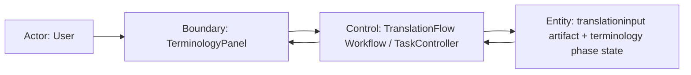

# Scenario Design

## Goal
単語翻訳 phase へ遷移したユーザーが、実行前に対象単語リストを確認し、対象範囲を理解したうえで Terminology phase を開始できるようにする。

## Trigger
- ユーザーが `データロード` phase でロード済みファイルを持つ task から `ロード完了して次へ` を押す。
- または既存の translation project task を再訪して `単語翻訳` タブを開く。

## Preconditions
- translation project task が存在する。
- 少なくとも 1 件のロード済み translation input file が artifact に保存されている。
- workflow は task 単位で terminology phase summary を取得できる。
- workflow は task 単位で terminology 対象単語リスト preview を取得できる。

## Robustness Diagram

## Main Flow
1. ユーザーが `ロード完了して次へ` を押して `単語翻訳` phase を開く。
2. `TerminologyPanel` は phase summary と対象単語リスト preview の取得を開始する。
3. controller は taskID を解決して workflow へ委譲する。
4. workflow は task に紐づく translationinput artifact を参照し、Terminology 対象 preview を返す。
5. UI は `対象件数` summary と `対象単語リスト` テーブルを表示する。
6. ユーザーは `Record Type`、`Editor ID`、`Source Text`、`Variant`、`Source File` を確認する。
7. ユーザーが `単語翻訳を実行` を押す。
8. workflow は同じ対象集合を使って terminology phase を実行する。
9. UI は実行中状態を表示し、完了後に summary を更新する。
10. UI は対象単語リストを維持したまま `単語翻訳を確定して次へ` を有効化する。

## Alternate Flow
- 既存 task を再訪する
  - 画面表示時に workflow が既存の phase summary と対象単語リスト preview を返す。
  - UI はファイル再選択なしで対象単語リストを復元表示する。
- ユーザーが `状態を再読込` を押す
  - UI は summary と対象単語リストの両方を再取得する。
  - 取得完了後、テーブル内容と件数を最新状態に差し替える。
- summary は取得できるが preview が複数ページになる
  - UI は初期ページだけを表示する。
  - ユーザーはページング操作で次ページを参照できる。

## Error Flow
- 対象単語リスト取得に失敗する
  - UI は phase ヘッダと summary を維持したまま、list card に取得失敗メッセージを表示する。
  - `状態を再読込` は有効のまま残る。
- 単語翻訳実行に失敗する
  - UI は対象単語リストを消さない。
  - エラーは phase ヘッダ直下に表示する。
  - ユーザーは対象を再確認して再実行できる。
- task 解決に失敗する
  - UI は phase 遷移を成立させず、task 未解決として実行操作を無効のままにする。

## Empty State Flow
- translationinput artifact に Terminology 対象が 0 件しかない
  - workflow は `target_count = 0` と空の対象単語リスト preview を返す。
  - UI は空 state と `ロード済みデータに Terminology 対象 REC がありません。` を表示する。
  - `単語翻訳を実行` は無効にする。

## Resume / Retry / Cancel
- Resume
  - 既存 task の再訪時、UI は task を解決した時点で対象単語リスト preview を自動取得する。
  - 既に完了済みの場合も対象単語リストは残る。
- Retry
  - 対象取得失敗時は `状態を再読込`、実行失敗時は `単語翻訳を実行` の再押下で再試行できる。
- Cancel
  - 今回の変更では terminology phase 実行中の cancel UI は追加しない。

## Acceptance Criteria
- `単語翻訳` タブ表示時に `対象単語リスト` card が summary より下、設定カードより上に表示される。
- 対象件数と list card の件数 badge が一致する。
- fixture の代表行が `Record Type / Editor ID / Source Text / Variant / Source File` として表示される。
- NPC FULL/SHRT を含む fixture で `Variant` 列により識別できる。
- 既存 task 再訪時も対象単語リストが復元される。
- 実行完了後も対象単語リストは消えず、summary だけが更新される。
- 対象 0 件では空 state と disabled な実行ボタンが見える。
- 対象取得失敗と実行失敗は別メッセージで見分けられる。

## Out of Scope
- 対象単語の手動除外
- 対象単語の inline 編集
- list 上での全文検索や高度なフィルタ
- 用語訳結果の同画面比較
- Persona phase 以降での対象単語再掲

## Open Questions
- 非 NPC の重複統合を preview で request 単位に潰すか、保存先 entry 単位で表示するか。
- Source File をファイル名だけにするか、相対パスまで表示するか。
