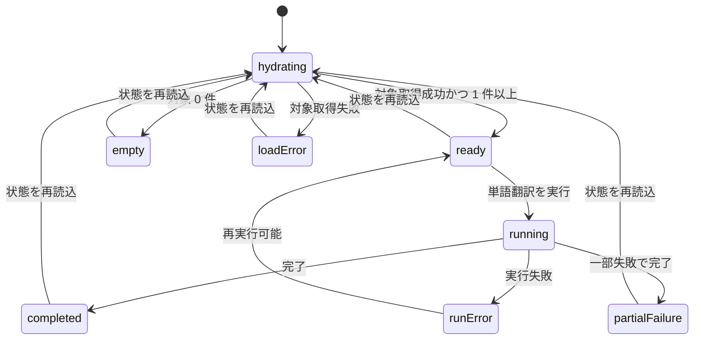

# UI Contract

## Purpose
`TerminologyPanel` で単語翻訳 phase の実行前に対象単語リストを表示し、ユーザーが今回どの単語が翻訳対象になるかを確認してから実行できるようにする。加えて、`データロード` phase では同じプラグインを 2 重に処理しないため、同一ファイル名の重複読み込みをブロックする。

## Entry
- `TranslationFlow` の `データロード` phase を完了して `単語翻訳` タブへ遷移する。
- 既存の translation project task を再訪して `単語翻訳` タブを開く。
- `状態を再読込` を押して、phase 状態と対象単語リストを再取得する。

## Primary Action
- データロード phase では、ユーザーは重複していない抽出ファイルだけをロード対象に追加する。
- 単語翻訳 phase では、ユーザーは対象単語リストを確認し、対象範囲に問題がないことを見たうえで `単語翻訳を実行` を押す。

## State Machine

## State Facts
- `hydrating`: phase ヘッダと summary は見える。対象単語リスト領域には skeleton または `読込中` 表示が出る。前回の stale なリストをそのまま見せない。
- `ready`: `対象単語リスト` card が表示され、件数 badge とテーブルが見える。`単語翻訳を実行` が有効になる。
- `empty`: 対象単語リスト領域には空 state を表示し、対象がない理由を短く説明する。実行ボタンは無効にする。
- `loadError`: 対象単語リスト領域に取得失敗メッセージを表示する。`状態を再読込` は押せる。
- `running`: status badge は `running`。対象単語リストは参照専用のまま固定し、実行中に内容が揺れない。`単語翻訳を実行` は disabled。
- `completed`: summary の保存件数が更新される。対象単語リストは残る。`単語翻訳を確定して次へ` が有効になる。
- `partialFailure`: summary の失敗件数が更新される。対象単語リストは残る。ユーザーは何が対象だったかを確認し続けられる。
- `runError`: 実行失敗メッセージを phase ヘッダ直下に表示する。対象単語リストは消さない。
- `duplicateBlocked`: データロード phase で同一ファイル名の選択を追加しようとすると、そのファイルは選択一覧へ追加されず、重複ブロック理由が見える。

## Structure
- data load selection area
  - 選択済みファイル一覧
  - 同一ファイル名の重複ブロックメッセージ
- info alert
  - `辞書参照を使って単語翻訳を先行実行し...` の説明を維持する
- phase header card
  - `単語翻訳 phase`
  - status badge
  - status label
  - `状態を再読込`
  - `単語翻訳を実行`
  - 実行失敗や対象なしのメッセージ
- summary row
  - `保存件数`
  - `失敗件数`
- terminology target list card
  - title: `対象単語リスト`
  - subtitle: `Dictionary import と同じ対象集合から抽出した単語です。`
  - right area: 件数 badge とページング操作
  - body: [DataTable.tsx](F:\ai translation engine 2\frontend\src\components\DataTable.tsx) を使った参照専用テーブル
  - empty / loading / error をこの card 内で切り替える
- model settings
- prompt settings
- footer action
  - `Terminology Task: {taskId}`
  - `単語翻訳を確定して次へ`

## Target List Table
配置:
- summary row の直下に置く
- モデル設定より前に置く
- 実装コンポーネントは [DataTable.tsx](F:\ai translation engine 2\frontend\src\components\DataTable.tsx) を使う

表示列:
- `Record Type`: `NPC_:FULL` などの対象 REC を表示する
- `Editor ID`: 保存先識別用の editor id を表示する
- `Source Text`: 翻訳対象の英語名を表示する。最重要列として扱う
- `Variant`: artifact が保持する `full` / `short` / `single` をそのまま表示し、NPC FULL/SHRT を見分けられるようにする
- `Source File`: データロード時点でファイル名へ正規化された値を表示する

表示ルール:
- 初期表示は 50 件ページングの一覧とする
- 実行前確認用なので行クリックによる編集導線は持たない
- 同一 NPC の FULL/SHRT は隣接表示されるべきである
- 非 NPC は一覧実装を複雑化させないため、保存先 entry 単位で並べる
- table title は `対象単語リスト ({件数} 件)` とする
- モノスペースが有効な列は `Record Type` と `Editor ID` に限定する

## Data Load Rules
- 重複ファイル判定は `ファイル名一致` を正とする
- 同一ファイル名の候補は選択済み一覧にもロード済み一覧にも追加してはならない
- 重複ブロック文言は `同じプラグインを2重で処理しないため、同名ファイルは追加できません。` を基準にする

## Content Priority
1. 具体的にどの単語が対象か
2. 実行可能かどうか
3. 保存件数と失敗件数
4. モデルと prompt の設定
5. 次 phase へ進めるかどうか

## Copy Tone
- 実行前確認の画面として、断定的で短い文言を使う
- 空状態は `ロード済みデータに Terminology 対象 REC がありません。` を基準にする
- 重複ブロックは、同じプラグインを 2 重に処理しないためだと説明する
- 取得失敗と実行失敗は別メッセージで分ける
- status label は `未実行` `対象なし` `単語翻訳を実行中` `単語翻訳完了` のように phase 状態を直接表す

## Playwright MCP Checks
- データロード phase で同一ファイル名の候補を追加しても選択一覧に増えない
- データロード phase で重複ブロックメッセージが見える
- `単語翻訳 phase` 表示時に `対象単語リスト` card が見える
- fixture の代表行が `Record Type / Editor ID / Source Text / Variant / Source File` として [DataTable.tsx](F:\ai translation engine 2\frontend\src\components\DataTable.tsx) 上に表示される
- NPC FULL/SHRT を含む fixture で `Variant` 列が識別可能で、行が隣接している
- 対象 0 件 fixture で空 state と disabled な実行ボタンが見える
- 対象取得失敗 fixture で list card に取得失敗メッセージが見える
- 実行完了後も対象単語リストが残り、summary の数値だけが更新される

## Non-goals
- 対象単語の手動除外
- 対象単語の inline 編集
- 高度なフィルタや検索 UI
- 用語訳結果の同画面比較表示
- Persona phase 以降での再掲方法

## Open Questions
- なし
