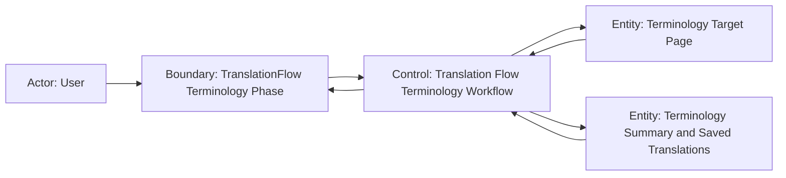

# Scenario Design

## Goal
ユーザーが翻訳フローの `単語翻訳` phase で、翻訳対象語を確認し、実行中の進捗を把握し、完了後は各対象語の翻訳済みテキストを同じ一覧で確認したうえで次の phase へ進めること。

## Trigger
- ユーザーが `データロード` phase 完了後に `単語翻訳` phase へ進む
- 既存の翻訳 task を再表示し、`単語翻訳` phase の状態を復元する

## Preconditions
- 対象 task に 1 件以上のロード済みデータが紐づいている
- workflow が terminology phase 用の対象語一覧を task 境界から取得できる
- `単語翻訳を実行` を開始する時点では、必要なモデル設定と prompt 設定が有効である
- 既存 task の再表示時は、保存済みの terminology summary と翻訳済みテキストを復元できる

## Robustness Diagram


## Main Flow
1. ユーザーが `データロード` phase を完了し、`単語翻訳` phase を開く。
2. システムが対象語一覧を取得し、`Translated Text` 列を含む一覧を表示する。
3. ユーザーが対象語、既存の `未翻訳` 行、LLM 設定、prompt 設定を確認する。
4. ユーザーが `単語翻訳を実行` を押す。
5. システムが terminology 実行を開始し、`単語翻訳を実行` を無効化しつつ、その右隣に進捗バーと進捗ラベルを表示する。
6. システムが対象単語リスト本文を loading 表示へ切り替え、`状態を再読込`、pagination、`単語翻訳を確定して次へ` を無効化する。
7. システムが terminology 実行の進捗更新を反映し続ける。
8. 実行完了後、システムが進捗バーを消し、summary に保存件数と失敗件数を反映し、対象単語リストに翻訳済みテキストを表示する。
9. ユーザーが翻訳結果を確認し、`単語翻訳を確定して次へ` を押して後続 phase へ進む。

## Alternate Flow
- 既存 task の再表示:
  - ユーザーが既存の翻訳 task を開き直すと、システムは task 境界に保存された terminology phase の対象語一覧、summary、保存済み translated text を復元して表示する。
  - 完了済み task では、ユーザーは再度ファイル選択をやり直さずに terminology 結果を確認できる。
- 一部失敗を含む完了:
  - terminology 実行が一部失敗を含んで完了した場合、システムは成功行の translated text を表示しつつ、失敗行だけを `未翻訳` のまま残す。
  - summary と status label で failure の存在を識別できる。
  - ユーザーは failure を認識したうえで後続 phase へ進める。
- 実行前の一覧確認:
  - ユーザーは実行前に pagination を使って対象語全体を確認できる。
  - `Translated Text` が未取得の行は空欄ではなく `未翻訳` として識別される。

## Error Flow
- 対象一覧取得失敗:
  - システムが terminology 対象語一覧の取得に失敗した場合、一覧領域に error panel を表示する。
  - `単語翻訳を実行` は無効のままとし、ユーザーは `状態を再読込` のみ実行できる。
- terminology 実行失敗:
  - 実行中に terminology 処理全体が失敗した場合、システムは進捗バーを消して一覧を ready 状態へ戻す。
  - phase header 直下に失敗メッセージを表示し、ユーザーが再実行できる状態に戻す。
  - 直前までに取得済みの translated text がある場合は維持して表示する。
- 実行開始不可:
  - モデル設定や必須条件が不足している場合、`単語翻訳を実行` は無効のままとし、ユーザーは不足条件を満たすまで実行できない。

## Empty State Flow
- terminology 対象が 0 件の場合、システムは `ロード済みデータに Terminology 対象 REC がありません。` を表示する。
- 一覧 table と進捗バーは表示しない。
- `単語翻訳を実行` は無効のままとし、ユーザーは `状態を再読込` により再判定できる。

## Resume / Retry / Cancel
- Resume:
  - ユーザーが既存 task を再表示した場合、システムは最後に確定した terminology 状態を task 境界から復元して表示する。
  - `completed` または `completedPartial` に達している場合、translated text と summary を即座に再表示する。
- Retry:
  - `runError` 後、ユーザーは設定を見直したうえで `単語翻訳を実行` を再度押せる。
  - `completedPartial` 後は failure を可視化したまま後続 phase へ進めるが、この change では同 phase 内の再実行導線は追加しない。
- Cancel:
  - terminology phase 内で専用の cancel 操作は提供しない。
  - 実行中は phase 遷移確定操作を無効化し、ユーザーは terminal state に戻るまで待機する。

## Acceptance Criteria
- terminology phase を開いたとき、対象語がある場合は一覧に `Translated Text` 列が存在する。
- `Translated Text` が未保存の行は空欄ではなく `未翻訳` と識別できる。
- `単語翻訳を実行` を押すと、ボタン右隣に進捗バーが表示され、対象単語リスト本文は loading 表示へ切り替わる。
- 実行中は `状態を再読込`、pagination、`単語翻訳を確定して次へ` が無効になる。
- 実行成功後は進捗バーが消え、summary の保存件数と失敗件数が更新され、translated text が一覧へ反映される。
- 一部失敗時は成功行の translated text を表示しつつ、未保存行だけ `未翻訳` のまま残る。
- 対象一覧取得失敗時は error panel が表示され、`単語翻訳を実行` は無効のままとなる。
- 対象 0 件時は empty state を表示し、table と progress bar は表示されない。
- 既存 task の再表示時は、保存済み terminology summary と translated text が復元される。
- E2E 観点:
  - terminology phase 初期表示で `Translated Text` 列と `未翻訳` 行を確認できる。
  - terminology 実行開始で progress bar 表示、一覧 loading、操作無効化を確認できる。
  - terminology 実行成功で summary 更新と translated text 反映を確認できる。
  - partial completion で failure 可視化と後続 phase 進行可能を確認できる。
  - 対象 0 件と対象一覧取得失敗の分岐を確認できる。

## Out of Scope
- terminology slice の保存ロジックや retry 実装詳細
- progress bridge の実装方式や transport 技術選定
- `ペルソナ生成` 以降の phase UI や workflow 変更

## Open Questions
- なし

## Context Board Entry
```md
### Scenario Design Handoff
- 確定した main flow: terminology phase で対象語確認 -> 実行開始 -> 進捗表示と一覧 loading -> 完了後に translated text 確認 -> 次 phase へ進行
- 確定した acceptance: translated text 列、実行中 progress/loading、成功/一部失敗/empty/error の各分岐を E2E 観点まで定義
- 未確定事項: なし
- 次に読むべき board: logic.md
```
