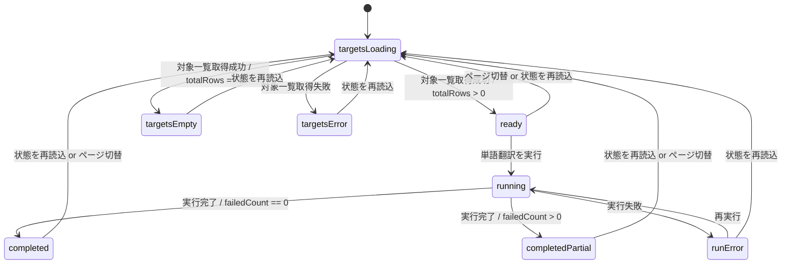

# UI Contract

## Purpose
翻訳フローの `単語翻訳` phase で、実行前に対象単語を確認し、実行中は進捗を見失わず、実行後は各対象語の翻訳済みテキストを同じ一覧で確認できるようにする。

## Entry
- `データロード` phase で 1 件以上のロード済みデータを持つ task から遷移する
- 既存 task を再表示した場合も、task 境界に保存された terminology phase の一覧と実行結果を復元して表示する

## Primary Action
ユーザーが terminology phase で `単語翻訳を実行` を押し、進捗を見ながら完了後の翻訳済みテキストを確認して `単語翻訳を確定して次へ` に進めること。

## State Machine


## Workflow Status Mapping
- workflow public status の正本は `pending` `running` `completed` `completed_partial` `run_error` とする
- UI internal state は `completed_partial -> completedPartial`、`run_error -> runError` として解釈する
- progress public contract の正本は `progress_mode` `progress_current` `progress_total` `progress_message` とする
- `progress_mode=determinate` のとき値付き progress bar、`progress_mode=indeterminate` のとき不定 progress bar、`progress_mode=hidden` のとき progress bar 非表示とする

## State Facts
- `targetsLoading`: phase 見出し、ステータス badge、`状態を再読込` ボタン、`単語翻訳を実行` ボタンの枠は表示されたまま、対象単語リスト card の本文は `skeleton` または loading プレースホルダに置き換わる。pagination 表示は残すが操作は無効。run button は無効。進捗バーは非表示。
- `targetsError`: 対象単語リスト card の本文にエラー panel を表示し、対象一覧取得失敗を明示する。run button は無効。`状態を再読込` は有効。summary card は最後に確定した件数を保持する。
- `targetsEmpty`: 対象単語リスト card の本文に `ロード済みデータに Terminology 対象 REC がありません。` を表示する。run button は無効。translated text 列付き table は表示しない。`状態を再読込` は有効。
- `ready`: 対象単語リストは table 表示とし、列順は `Record Type` `Editor ID` `Source Text` `Translated Text` `Variant` `Source File` とする。`Translated Text` が未取得の行は空欄にせず `未翻訳` badge または同等の未翻訳表示を出す。モデル未選択時は run button を無効化し、補助文を表示する。pagination は有効。
- `running`: workflow status は `running`。run button のラベルは `単語翻訳を実行中...` に切り替わり無効化される。run button の右隣に inline progress cluster を表示し、`progress` バーと進捗ラベルを同一行で出す。対象単語リスト本文は ready table をそのまま見せ続けず、loading 表示へ切り替える。pagination、`状態を再読込`、`単語翻訳を確定して次へ` は無効。summary card は画面上に残す。
- `runError`: workflow status は `run_error`。phase header 直下に実行失敗メッセージを表示する。進捗バーは消え、対象単語リストは ready と同じ table 表示へ戻る。run button は再実行可能。直前に取得済みの translated text があれば保持して表示する。
- `completed`: workflow status は `completed`。status badge は `completed` を示し、進捗バーは非表示。summary card に保存件数と失敗件数の確定値を表示する。対象単語リスト table の `Translated Text` 列に保存済み翻訳を表示し、`単語翻訳を確定して次へ` を有効化する。
- `completedPartial`: workflow status は `completed_partial`。`completed` の観測事実を維持しつつ、status label は `単語翻訳完了（一部失敗あり）` に固定する。`Translated Text` が保存されなかった行は `未翻訳` 表示のまま残る。次フェーズへの進行は許可する。

## Structure
- main area: phase 説明 alert、phase 見出し、status badge、status label、`状態を再読込`、`単語翻訳を実行`、inline progress cluster
- progress: 実行中だけ run button の右隣に横幅固定の progress バーを表示し、その右または直下に進捗ラベルを表示する。`progress_mode=indeterminate` でも cluster 自体は欠かさず表示する
- list: `対象単語リスト` card は件数 badge、pagination、table / loading / empty / error の切替領域を持つ
- settings: LLM 設定 card と prompt card は対象一覧の下に残し、実行中は編集不能にする
- footer: `Terminology Task` 表示と `単語翻訳を確定して次へ` ボタンを最下部に固定し、完了前は無効にする

## Content Priority
1. 今すぐ必要な操作が可能かどうか
2. terminology 実行中か、完了したか、失敗したか
3. 対象単語リストと各行の `Translated Text` の有無
4. 保存件数 / 失敗件数
5. LLM 設定と prompt 設定

## Copy Tone
進行中の phase を短く明示する業務的な文言を使う。内部 DTO 名や backend 用語は前面に出さず、ユーザーには `読込中` `未翻訳` `単語翻訳完了` `一部失敗あり` のような操作判断に必要な言葉だけを見せる。

## Verification Facts
- terminology phase を開いて対象がある場合、対象単語リスト table に `Translated Text` 列が存在する
- `Translated Text` が未保存の行は空欄ではなく `未翻訳` と識別できる
- `単語翻訳を実行` を押すと run button の右隣に progress bar が現れ、対象単語リスト本文は loading 表示へ切り替わる
- 実行中は `状態を再読込`、pagination、`単語翻訳を確定して次へ` が無効になる
- 実行成功後、progress bar は消え、summary card の件数と `Translated Text` 列が更新される
- 一部失敗時は workflow status `completed_partial` に対応する UI として failure が可視化され、翻訳がない行だけ `未翻訳` 表示で残る
- 対象一覧取得失敗時は error panel が出て run button は無効のままになる
- 対象 0 件時は empty panel を表示し、table も progress bar も表示しない

## Non-goals
- terminology slice の保存ロジックや retry 実装の詳細設計
- progress bridge の実装詳細や transport 技術選定
- `ペルソナ生成` 以降の phase UI 変更

## Open Questions
- なし

## Context Board Entry
```md
### UI Design Handoff
- 確定した state: targetsLoading, targetsError, targetsEmpty, ready, running, runError, completed, completedPartial
- 確定した UI 事実: 対象単語リストに `Translated Text` 列を追加し、実行中は run button 横の progress bar と一覧 loading を同時表示する
- 未確定事項: なし
- 次に読むべき board: scenarios.md
```
