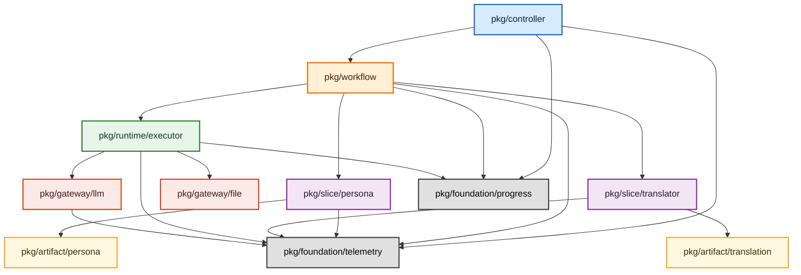

# アーキテクチャ概要

本ドキュメントは、このリポジトリのバックエンドをどの責務区分に分け、どの方向に依存させるかを定義する純粋なアーキテクチャ文書である。

この文書が扱うのは以下だけとする。

- パッケージの責務境界
- 依存方向
- DTO / Contract / DI の原則
- Composition Root の責務

この文書が扱わないものは、専用 spec に委譲する。

- バックエンドの実装規約: `openspec/specs/governance/backend-coding-standards/guide.md`
- 品質ゲートと lint 導線: `openspec/specs/governance/backend-quality-gates/spec.md`
- テスト設計標準: `openspec/specs/governance/standard-test/spec.md`
- ログ設計詳細: `openspec/specs/governance/log-guide/spec.md`
- フロントエンド構造: `openspec/specs/frontend/frontend-architecture/spec.md`

---

## 1. 目的

このプロジェクトは Interface-First AIDD を前提に、変更時の影響範囲を局所化し、AI と人間の両方が責務境界を読み取りやすい構造を維持することを目的とする。

そのために、以下を守る。

- 接続は契約から考える
- 具象実装の知識は composition root に閉じ込める
- usecase slice は自分の業務ロジックと DTO に集中する
- usecase slice は自 slice の永続化契約と artifact 契約に集中する
- UI 入出力とユースケース進行を分離する
- 実行制御基盤と外部依頼口を分離する
- slice 間受け渡しを slice 直接依存ではなく artifact に集約する

---

## 2. 基本原則

### 2.1 Contract First

- モジュール間連携は interface を契約として定義する
- 具象型への直接依存を標準形にしない
- コンストラクタは可能な限り interface を受け取る

### 2.2 Composition Root Only Concrete

- 具象型を知ってよいのは composition root のみとする
- `main.go`、Wire injector、初期化専用 provider 以外が他区分の具象型を `new` してはならない
- 通常の package は他区分の contract だけを知る

### 2.3 Slice Autonomy

- usecase slice は自分の DTO、業務ロジック、永続化ルールに集中する
- slice は他 slice の DTO や具象実装を参照しない
- slice 間のデータ変換は呼び出し側が担う

### 2.4 Explicit Orchestration

- 複数 contract を束ねる責務は `workflow` に集約する
- controller は orchestration しない
- runtime はユースケース進行を決定しない
- artifact はユースケース進行を決定しない
- gateway はユースケース進行を決定しない
- usecase slice は UI イベントを送信せず、進行事実や結果を workflow へ返す

### 2.5 Runtime Executes External IO

- LLM、外部 API、ファイル、secret、config などの外部 I/O を伴う実処理は `runtime` が実行する
- `workflow` は実行要求と進行管理を担い、外部 I/O の中身を実装しない
- usecase slice は `gateway` を直接使わず、外部実行結果を業務的に解釈して自 slice の永続化契約へ反映する
- `runtime` は外部実行結果を workflow に返し、workflow が後続 slice への受け渡しを制御する

### 2.6 Artifact Is Shared Handoff Boundary

- `artifact` は slice 間で受け渡す中間成果物、共有済みデータ、resume 用状態を保存・参照する共有境界とする
- 他 slice が必要とするデータを、ある slice の内部保存物として直接参照してはならない
- slice 間の受け渡しは、workflow が artifact 識別子や検索条件を束ねて実現する
- artifact は保存・検索の責務だけを持ち、業務判断や進行決定を持たない
- 永続化の配置詳細は `openspec/specs/governance/database-erd/spec.md` に従い、slice ローカル DB と shared artifact ストアを明示的に分離する

---

## 3. システムの責務区分

このプロジェクトは、厳密な直列レイヤーではなく、責務を 7 区分に分ける。

1. `pkg/controller`
2. `pkg/workflow`
3. `pkg/slice/<usecase-slice>`
4. `pkg/runtime`
5. `pkg/artifact`
6. `pkg/gateway`
7. `pkg/foundation`

### 3.1 `pkg/controller`

役割:

- Wails binding、HTTP、CLI など外部入力の受け口
- request/response の境界整形
- `workflow` 契約の呼び出し

持ってはいけない責務:

- ユースケース進行
- phase / progress / resume / cancel の決定
- slice 間 DTO 変換
- runtime / artifact / gateway の直接制御

### 3.2 `pkg/workflow`

役割:

- application service / orchestrator
- ユースケース進行の制御
- phase / progress / resume / cancel / state の管理
- controller から slice への DTO マッピング
- runtime の利用
- slice に渡す artifact 識別子や検索条件の管理
- slice の呼び分け

持ってはいけない責務:

- slice 固有の業務ロジック本体
- UI の描画都合
- runtime 内部の状態機械
- artifact / gateway 実装の詳細

### 3.3 `pkg/slice/<usecase-slice>`

役割:

- 個別ユースケースの業務ロジック
- 自前 DTO / contract の定義
- 自分の永続化ルール
- 自 slice の永続化契約と artifact 契約の利用

持ってはいけない責務:

- 他 slice の都合に合わせた DTO 参照
- controller 依存
- workflow 依存
- runtime の主導
- gateway 直接依存

### 3.4 `pkg/runtime`

役割:

- executor、progress、workflow state、event、telemetry など実行制御の基盤
- workflow がユースケース進行を実現するための実行時サービス
- 外部 I/O を伴う実処理の実行
- 実行結果の返却や完了通知

持ってはいけない責務:

- 特定ユースケースの進行決定
- UI 状態の意味解釈
- slice 固有ロジックの内包
- slice 保存判定や slice 固有 DTO の解釈

### 3.5 `pkg/artifact`

役割:

- slice 間で共有する中間成果物、共有済みデータ、resume 用状態の保存・参照
- workflow が次工程へ受け渡すための識別子、検索条件、保存先の境界
- slice が後続工程へ渡す成果物の貯蔵先

持ってはいけない責務:

- ユースケース進行の決定
- phase / progress / resume / cancel の管理
- 特定 workflow の状態解釈
- 特定 slice 固有の業務判断

### 3.6 `pkg/gateway`

役割:

- LLM、外部 API、file、secret、config など外部資源への依頼口
- runtime が外部 I/O を実行するための技術接続の具象実装

持ってはいけない責務:

- ユースケース進行の決定
- phase / progress / resume / cancel の管理
- 特定 workflow の状態解釈
- slice への直接公開

### 3.7 `pkg/foundation`

役割:

- telemetry、progress など複数責務区分から横断的に利用される基盤
- logger provider、context 補助、span 補助、Wails bridge、progress notifier といった観測・通知 transport の提供
- `controller`、`workflow`、`slice`、`runtime`、`gateway` から直接参照できる共通基盤

持ってはいけない責務:

- 業務進行の意味づけ (phase の解釈、進行率の業務的判定)
- 特定 workflow や slice 固有のロジック
- ユースケース進行の決定
- UI 状態の解釈

補足:

- foundation は transport / observability だけを提供する
- 何を何%として通知するか、phase がどの段階にあるかの意味解釈は workflow が保持する
- foundation から上位区分 (controller、workflow、slice、runtime、artifact、gateway) への逆依存は禁止する

---

## 4. 依存方向ルール

許可する依存:

- `controller -> workflow`
- `workflow -> usecase slice`
- `workflow -> runtime`
- `usecase slice -> artifact`
- `runtime -> gateway`
- `controller -> foundation`
- `workflow -> foundation`
- `usecase slice -> foundation`
- `runtime -> foundation`
- `artifact -> foundation`
- `gateway -> foundation`

禁止する依存:

- `controller -> usecase slice`
- `controller -> runtime`
- `controller -> artifact`
- `controller -> gateway`
- `usecase slice -> controller`
- `usecase slice -> workflow`
- `usecase slice -> runtime`
- `usecase slice -> gateway`
- `runtime -> controller`
- `runtime -> workflow`
- `runtime -> usecase slice`
- `artifact -> controller`
- `artifact -> workflow`
- `artifact -> runtime`
- `artifact -> usecase slice`
- `artifact -> gateway`
- `gateway -> controller`
- `gateway -> workflow`
- `gateway -> usecase slice`
- `gateway -> artifact`
- `usecase slice -> usecase slice` の具象依存
- `foundation -> controller`
- `foundation -> workflow`
- `foundation -> usecase slice`
- `foundation -> runtime`
- `foundation -> artifact`
- `foundation -> gateway`

補足:

- usecase slice 同士の連携が必要な場合は workflow で両者を束ねる
- 他 slice が必要とする成果物を、ある slice の内部保存物として直接参照してはならない
- slice 間受け渡しは artifact を通し、workflow は artifact 識別子や検索条件だけを束ねる
- `runtime -> gateway` を許可しても、runtime が slice 固有の保存処理や業務判断を持ってはならない
- 共通化は技術的関心事に限定し、業務ロジックの安易な shared kernel 化を避ける
- foundation は横断基盤専用区分であり、全区分から参照できるが foundation から上位区分への逆依存は禁止する

---

## 5. DTO と Contract の原則

### 5.1 DTO は消費側基準で定義する

- 各 slice は自身が必要とする入力 DTO / 出力 DTO を自前で持つ
- `pkg/domain` のような横断共有 DTO を基本形にしない
- parser の出力を persona が直接読む、といった構造を避ける
- slice 間共有が必要な場合も、他 slice の内部 DTO を直接参照せず artifact 契約を介する

### 5.2 マッピングは workflow が担う

- controller 入力 -> slice 入力 DTO の変換は workflow が行う
- slice A 出力 -> slice B 入力 DTO の変換も workflow が行う
- runtime の実行結果や artifact 上の中間成果物を slice 入力 DTO へ束ねるのも workflow の責務とする
- runtime が gateway を使う場合でも、gateway の返却値を slice 保存 DTO や UI 状態へ解釈する責務は workflow が持つ
- usecase slice が返す進行事実やドメインイベントを `phase/current/total/message` や UI 通知へ翻訳する責務も workflow が持つ
- workflow は大規模データ本体を常時保持するのではなく、artifact 識別子、検索条件、batch / page / cursor を束ねて進行制御する

### 5.3 Contract は振る舞い単位で設計する

- interface は役割ごとに分ける
- ただし 1 メソッドごとに過剰分割しない
- workflow、runtime、slice が必要とする操作単位で contract を切る
- artifact 契約は保存・検索・参照の操作に限定し、業務判断 API を持たせない

---

## 6. DI と Composition Root

依存注入の原則:

- 依存解決は `google/wire` を第一候補とする
- 手組み DI を行う場合も、ルールは同じとする
- contract を受ける側が、他区分の具象型 import に引きずられないことを優先する

composition root の責務:

- 具象実装の生成
- interface への束縛
- 初期化順序の制御
- 環境依存値の注入

composition root の責務外:

- 業務ロジック
- DTO 変換
- phase / progress の決定

---

## 7. 判断基準

新しいコードや package を追加する際は、まず以下で判断する。

1. これは外部入出力の adapter か
2. これはユースケース進行の制御か
3. これは slice 固有の業務ロジックか
4. これは実行制御基盤か
5. これは slice 間で受け渡す成果物や共有状態か
6. これは外部資源への依頼口か
7. これは複数区分から横断的に利用される観測・通知基盤か

対応先:

- 1 は `controller`
- 2 は `workflow`
- 3 は usecase slice
- 4 は `runtime`
- 5 は `artifact`
- 6 は `gateway`
- 7 は `foundation`

曖昧な場合の原則:

- UI 都合があるなら controller
- 複数 contract を束ねるなら workflow
- ドメイン知識が強いなら slice
- 実行制御なら runtime
- 工程間で受け渡す保存物なら artifact
- 外部資源への依頼なら gateway
- 複数区分から利用される観測・通知 transport なら foundation

---

## 8. 関連文書の責務分担

- `architecture.md`
  - 構造、責務、依存方向、DI 原則
- `governance/backend-coding-standards/guide.md`
  - Go 実装時のコーディング規約
- `governance/backend-quality-gates/spec.md`
  - lint / check / test の実行導線
- `governance/standard-test/spec.md`
  - テスト設計書の書式と原則
- `governance/log-guide/spec.md`
  - ログ設計と AI デバッグ向け運用
- `governance/database-erd/spec.md`
  - slice ローカル DB と shared artifact ストアの保存境界
- `governance/spec-structure/spec.md`
  - OpenSpec 文書の責務境界と配置ルール
- `frontend/frontend-architecture/spec.md`
  - フロントエンド専用構造

この分担を崩して重複を書かないこと。
