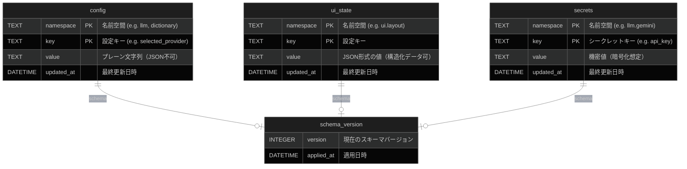
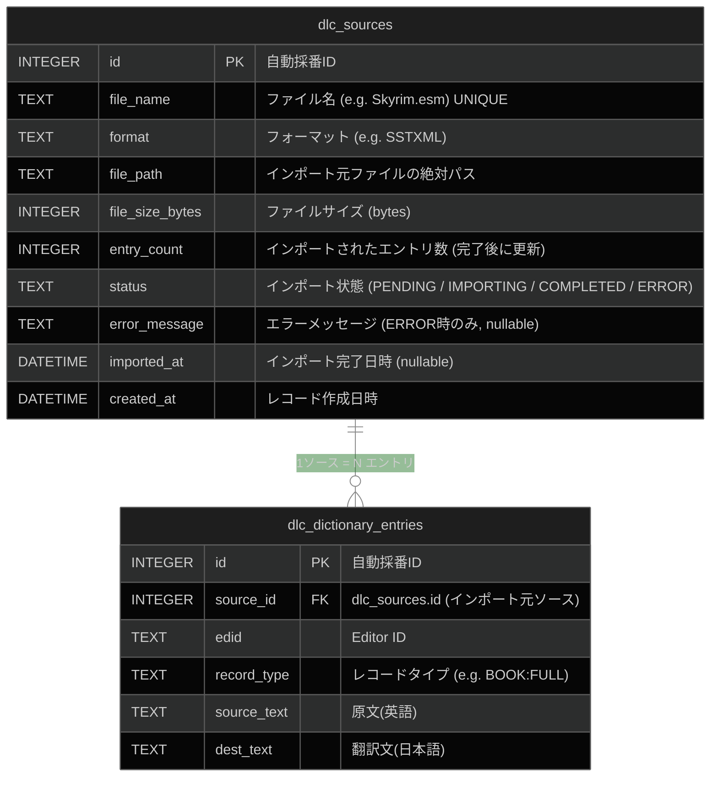
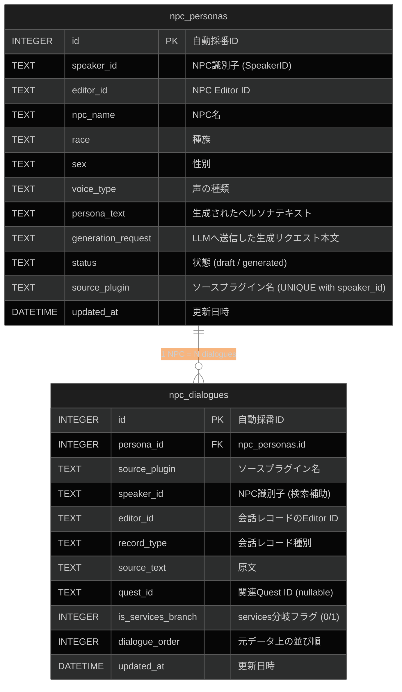
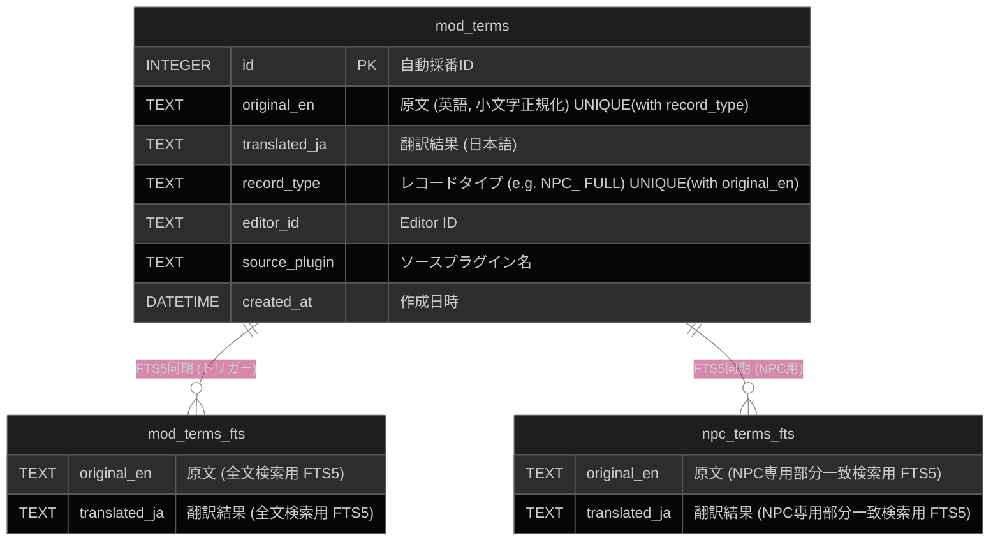
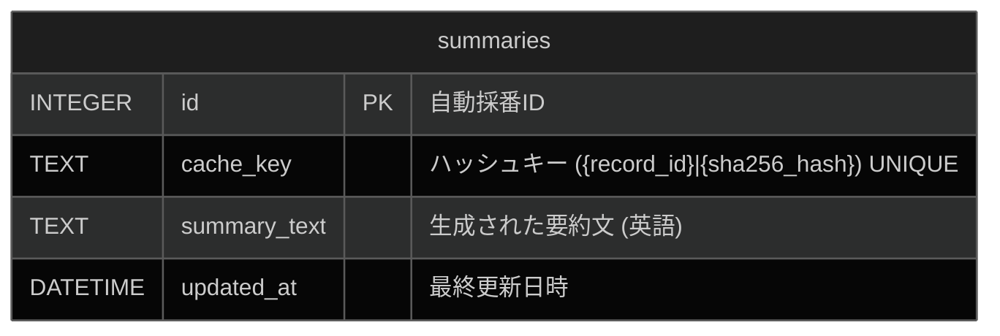
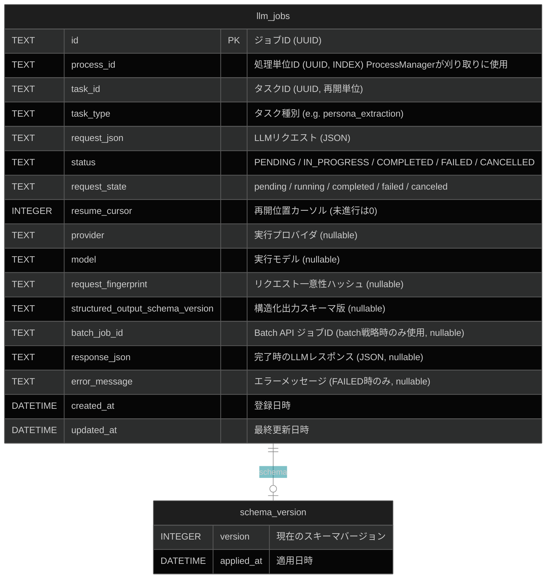
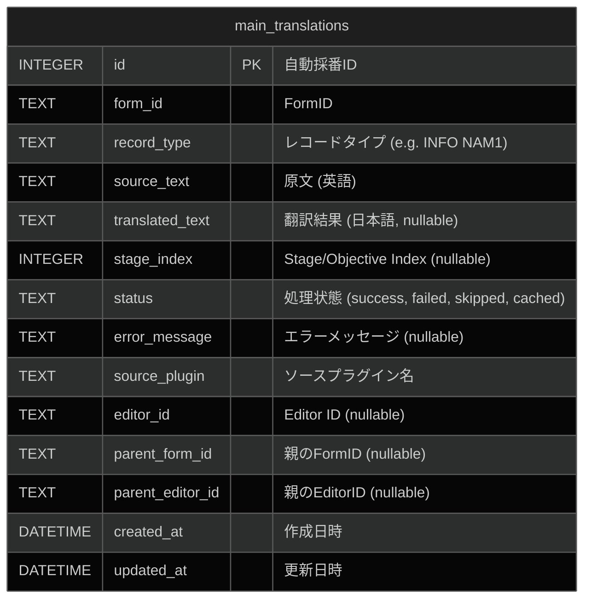
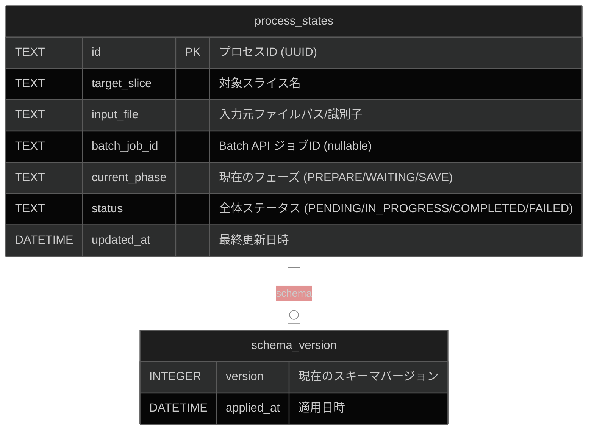
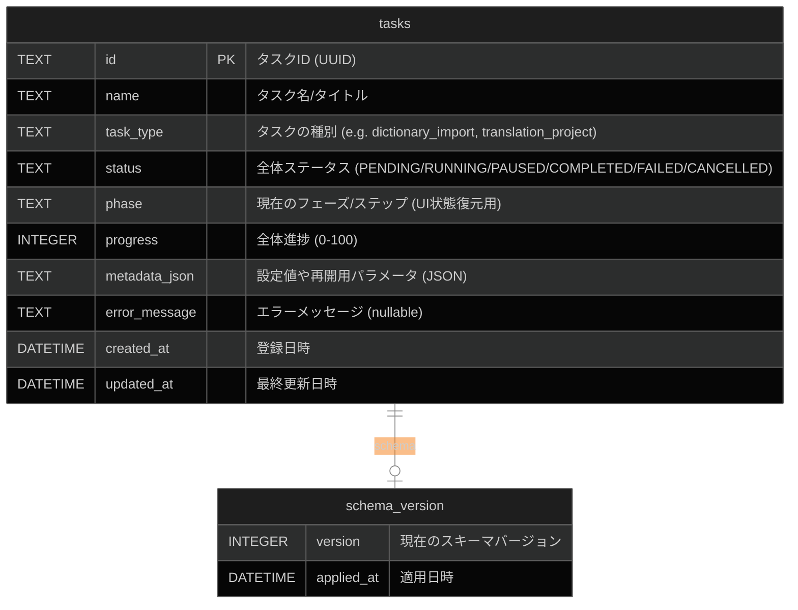

# データベース ER 図

Interface-First AIDD v2アーキテクチャおよびVertical Slice Architecture (VSA)に従った、各Sliceのデータベース設計を以下に示します。各Sliceは独自の責務範囲に応じて、独立したコンテキスト（ファイル・テーブル群）として管理されます。

## DB配置方針

- すべてのSQLite DBは **プロセスのカレントディレクトリ（ワークスペースルート）配下の `db/`** に配置する。
- 例: ワークスペースが `F:\ai translation engine 2` の場合、DBは `F:\ai translation engine 2\db\*.db`。
- VSA原則に従い、スライスごとにDBファイルを分離する（例: `config.db`, `dictionary.db`, `task.db`）。
- 複数 slice から参照する shared data / handoff data は `artifact` 専用ストアへ配置し、slice ローカル DB から直接参照させない。

## artifact (slice間共有成果物)

slice 間受け渡しで使う共有データ、中間成果物、resume 用状態を保存するコンテキストです。
**データベース名:** `artifact.db` (shared artifact 専用)

artifact は汎用 `artifact_records` へ JSON blob を保存するのではなく、slice ごとに必要な構造化テーブル群を配置する。翻訳フロー入力では `task_id` を親キーとして parser の DTO 構造に対応するテーブル群を持つ。
また、translation flow から再利用される shared dictionary と master persona の正本は artifact ストアへ配置する。

```mermaid
erDiagram
    translation_input_tasks ||--o{ translation_input_files : "1 task = N files"
    translation_input_files ||--o{ translation_input_dialogue_groups : "1 file = N dialogue groups"
    translation_input_dialogue_groups ||--o{ translation_input_dialogue_responses : "1 group = N responses"
    translation_input_files ||--o{ translation_input_quests : "1 file = N quests"
    translation_input_quests ||--o{ translation_input_quest_stages : "1 quest = N stages"
    translation_input_quests ||--o{ translation_input_quest_objectives : "1 quest = N objectives"
    translation_input_files ||--o{ translation_input_items : "1 file = N items"
    translation_input_files ||--o{ translation_input_magic : "1 file = N magic"
    translation_input_files ||--o{ translation_input_locations : "1 file = N locations"
    translation_input_files ||--o{ translation_input_cells : "1 file = N cells"
    translation_input_files ||--o{ translation_input_system_records : "1 file = N system records"
    translation_input_files ||--o{ translation_input_messages : "1 file = N messages"
    translation_input_files ||--o{ translation_input_load_screens : "1 file = N load screens"
    translation_input_files ||--o{ translation_input_npcs : "1 file = N npcs"
    artifact_dictionary_sources ||--o{ artifact_dictionary_entries : "1 source = N entries"
    artifact_master_persona_final ||--o{ artifact_master_persona_temp : "lookup key を共有（物理FKなし）"

    translation_input_tasks {
        TEXT task_id PK "task.db の tasks.id と同じ値"
        TEXT status "pending / loaded / failed"
        DATETIME created_at "作成日時"
        DATETIME updated_at "更新日時"
    }

    translation_input_files {
        INTEGER id PK "ファイル行ID"
        TEXT task_id "translation_input_tasks.task_id に論理紐付け"
        TEXT source_file_path "入力ファイル絶対パス"
        TEXT source_file_name "表示用ファイル名"
        TEXT source_file_hash "重複検出用ハッシュ"
        TEXT parse_status "pending / loaded / failed"
        INTEGER preview_row_count "preview 対象合計件数 (保存時に確定)"
        DATETIME parsed_at "パース完了日時"
        DATETIME created_at "作成日時"
        DATETIME updated_at "更新日時"
    }

    translation_input_dialogue_groups {
        INTEGER id PK
        INTEGER file_id FK
        TEXT source_record_id "BaseExtractedRecord.ID"
        TEXT editor_id "BaseExtractedRecord.EditorID"
        TEXT record_type "BaseExtractedRecord.Type"
        TEXT source_json_path "BaseExtractedRecord.SourceJSON"
        TEXT player_text
        TEXT quest_id
        INTEGER is_services_branch
        TEXT services_type
        TEXT nam1
        TEXT source
    }

    translation_input_dialogue_responses {
        INTEGER id PK
        INTEGER dialogue_group_id FK
        TEXT source_record_id
        TEXT editor_id
        TEXT record_type
        TEXT source_json_path
        TEXT text
        TEXT prompt
        TEXT topic_text
        TEXT menu_display_text
        TEXT speaker_id
        TEXT voice_type
        INTEGER response_order
        TEXT previous_id
        TEXT source
        INTEGER response_index
    }

    translation_input_quests {
        INTEGER id PK
        INTEGER file_id FK
        TEXT source_record_id
        TEXT editor_id
        TEXT record_type
        TEXT source_json_path
        TEXT name
        TEXT source
    }

    translation_input_quest_stages {
        INTEGER id PK
        INTEGER quest_id FK
        INTEGER stage_index
        INTEGER log_index
        TEXT stage_type
        TEXT text
        TEXT parent_id
        TEXT parent_editor_id
        TEXT source
    }

    translation_input_quest_objectives {
        INTEGER id PK
        INTEGER quest_id FK
        TEXT objective_index
        TEXT objective_type
        TEXT text
        TEXT parent_id
        TEXT parent_editor_id
        TEXT source
    }

    translation_input_items {
        INTEGER id PK
        INTEGER file_id FK
        TEXT source_record_id
        TEXT editor_id
        TEXT record_type
        TEXT source_json_path
        TEXT name
        TEXT description
        TEXT text
        TEXT type_hint
        TEXT source
    }

    translation_input_magic {
        INTEGER id PK
        INTEGER file_id FK
        TEXT source_record_id
        TEXT editor_id
        TEXT record_type
        TEXT source_json_path
        TEXT name
        TEXT description
        TEXT source
    }

    translation_input_locations {
        INTEGER id PK
        INTEGER file_id FK
        TEXT source_record_id
        TEXT editor_id
        TEXT record_type
        TEXT source_json_path
        TEXT name
        TEXT parent_id
        TEXT source
    }

    translation_input_cells {
        INTEGER id PK
        INTEGER file_id FK
        TEXT source_record_id
        TEXT editor_id
        TEXT record_type
        TEXT source_json_path
        TEXT name
        TEXT parent_id
        TEXT source
    }

    translation_input_system_records {
        INTEGER id PK
        INTEGER file_id FK
        TEXT source_record_id
        TEXT editor_id
        TEXT record_type
        TEXT source_json_path
        TEXT name
        TEXT description
        TEXT source
    }

    translation_input_messages {
        INTEGER id PK
        INTEGER file_id FK
        TEXT source_record_id
        TEXT editor_id
        TEXT record_type
        TEXT source_json_path
        TEXT text
        TEXT title
        TEXT quest_id
        TEXT source
    }

    translation_input_load_screens {
        INTEGER id PK
        INTEGER file_id FK
        TEXT source_record_id
        TEXT editor_id
        TEXT record_type
        TEXT source_json_path
        TEXT text
        TEXT source
    }

    translation_input_npcs {
        INTEGER id PK
        INTEGER file_id FK
        TEXT npc_key "ParserOutput.NPCs の map key"
        TEXT source_record_id
        TEXT editor_id
        TEXT record_type
        TEXT source_json_path
        TEXT name
        TEXT race
        TEXT voice
        TEXT sex
        TEXT class_name
        TEXT source
    }

    artifact_dictionary_sources {
        INTEGER id PK "自動採番ID"
        TEXT file_name
        TEXT format
        TEXT file_path
        INTEGER file_size
        INTEGER entry_count
        TEXT status "PENDING / IMPORTING / COMPLETED / ERROR"
        TEXT error_message
        DATETIME imported_at
        DATETIME created_at
    }

    artifact_dictionary_entries {
        INTEGER id PK "自動採番ID"
        INTEGER source_id FK "artifact_dictionary_sources.id"
        TEXT edid
        TEXT record_type
        TEXT source_text
        TEXT dest_text
    }

    artifact_master_persona_final {
        INTEGER persona_id PK "自動採番ID"
        TEXT form_id "UI 表示用 FormID"
        TEXT source_plugin "lookup key (unique with speaker_id)"
        TEXT speaker_id "lookup key (unique with source_plugin)"
        TEXT npc_name
        TEXT editor_id
        TEXT race
        TEXT sex
        TEXT voice_type
        DATETIME updated_at
        TEXT persona_text "最終成果物テキスト"
        TEXT generation_request "UI表示用リクエスト本文"
        TEXT dialogues_json "UI表示用 dialogue 一覧(JSON)"
    }

    artifact_master_persona_temp {
        INTEGER id PK "自動採番ID"
        TEXT task_id "task スコープ cleanup キー"
        TEXT source_plugin "lookup key"
        TEXT speaker_id "lookup key"
        TEXT editor_id
        TEXT npc_name
        TEXT race
        TEXT sex
        TEXT voice_type
        TEXT generation_request "中間生成物"
        TEXT dialogues_json "中間生成物"
        DATETIME updated_at
    }
```

## config (設定・レイアウト保存)

共通の設定やUI状態を永続化するインフラストラクチャ層のコンテキストです。
**データベース名:** `config.db` (システム設定・全Mod共通)

## dictionary (辞書構築)

公式DLCや基本辞書など、xTranslatorフォーマットから構築される汎用辞書データのコンテキストです。
**データベース名:** `dictionary.db` (システム辞書・全Mod共通)

### テーブル設計の補足

| テーブル                 | 画面対応                                         | 変更頻度                          |
| ------------------------ | ------------------------------------------------ | --------------------------------- |
| `dlc_sources`            | 辞書構築画面①「登録済みソース一覧」              | ファイルインポート時のみ (低頻度) |
| `dlc_dictionary_entries` | 辞書構築画面②「エントリ一覧」・③「エントリ編集」 | エントリ手動修正時 (中頻度)       |

> [!NOTE]
> `dlc_sources.entry_count` は `dlc_dictionary_entries` の行数と冗長になるが、一覧表示でのカウントクエリを省略するためのキャッシュカラムとして許容する。

## persona (ペルソナ生成)

NPCの会話履歴から生成された性格や口調のペルソナ情報を管理するコンテキストです。
**データベース名:** `persona.db` (ペルソナスライス専用・全Mod共通)

## terminology (Mod用語翻訳)

対象Mod固有の固有名詞翻訳結果と、その部分一致検索用のFTS（全文検索）テーブルを管理するコンテキストです。
**データベース名:** `{PluginName}_terms.db` (翻訳対象Mod専用データベース)

## summary (要約キャッシュ)

会話やクエストの背景情報をLLMで要約し、再利用するためのキャッシュを管理するコンテキストです。
**データベース名:** `{PluginName}_summary_cache.db` (ソースプラグイン別)

## queue (LLMジョブキュー)

インフラ層の汎用ジョブキュー。ドメイン知識を一切持たず、`process_id` / `task_id` / `task_type` と `request` のペアを永続化し、request単位の再開状態を保持します。`Completed` になった MasterPersona task の job は `task_id` 単位で削除されます。
**データベース名:** `llm_queue.db` (インフラ専用・全Mod共通)

## translator (本文翻訳結果)

Pass 2: 本文翻訳のスライスが管理する翻訳結果のコンテキストです。
**データベース名:** `{PluginName}_translations.db` (ソースプラグイン別)

## pipeline (進行状態管理)

各スライスの実行状態やJobQueueとの紐付けを管理し、プロセスのレジューム（再開）を可能にするコンテキストです。
**データベース名:** `pipeline.db` (管理用データベース)

## frontend_tasks (UIタスク・進捗管理)

フロントエンドと連携する非同期タスク（辞書構築、ペルソナ抽出、翻訳プロジェクト等）のメタデータと進捗状態を永続化し、クラッシュリカバーやフェーズに応じた画面遷移を可能にするコンテキストです。
**データベース名:** `task.db` (タスクスライス専用データベース)

## 補足事項
- **Vertical Slice Architecture の原則**: VSAの原則（Architecture Section 5）に基づき、上記テーブルはDRY原則を避け「あえて分断」されています。各Slice（`config`, `dictionary`, `persona`, `terminology`）は自身が必要とするテーブルのみに依存し、他Sliceのテーブルに直接クエリを発行することはありません。
