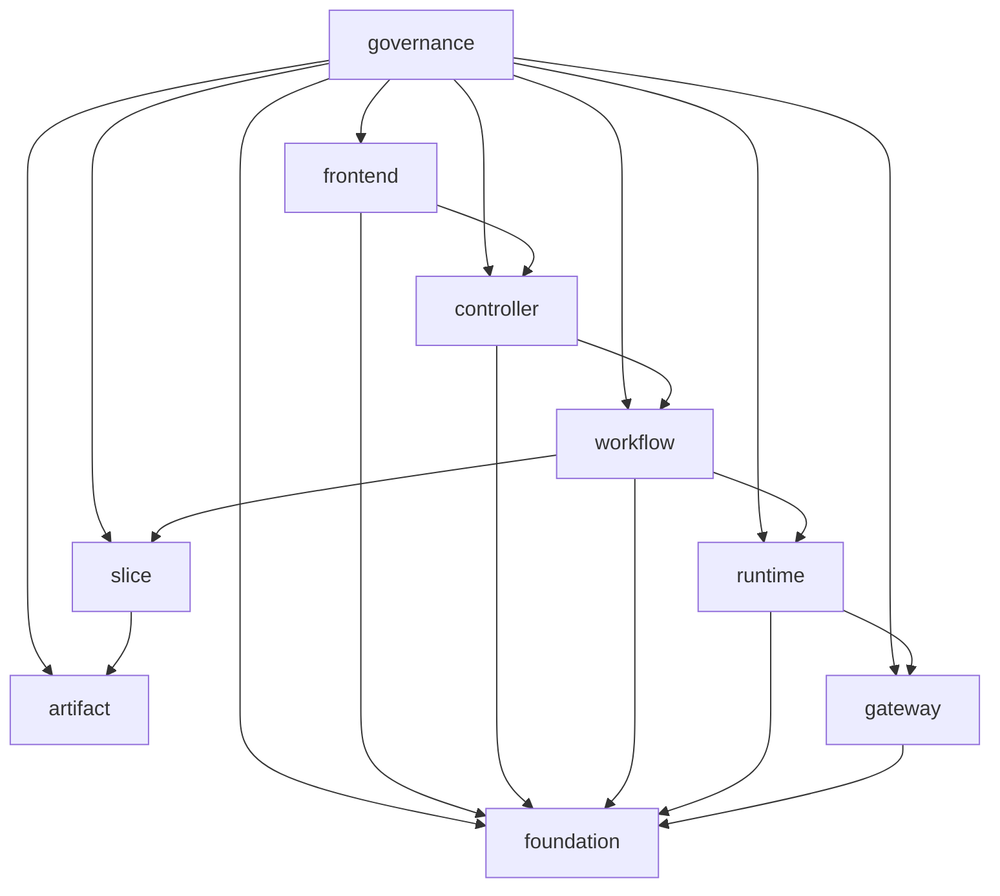

# Spec 構成ルール

## Overview

OpenSpec 文書群の責務境界と canonical path を定義する共通 spec である。`architecture` の実装責務区分と `docs/` の物理配置を一致させ、AI と人間が同じ入口から文書を辿れる状態を維持する。

## Document Boundaries

spec は以下の 9 区分で整理する。

1. `governance`
2. `frontend`
3. `controller`
4. `workflow`
5. `slice`
6. `runtime`
7. `artifact`
8. `gateway`
9. `foundation`

### 1. `governance`

役割:

- repo 全体の基準、品質ゲート、テスト標準、ログ標準、配置ルール、全体要件を定義する
- 各責務区分の入口を案内する

現在の canonical spec:

- `governance/architecture/spec.md`
- `governance/spec-structure/spec.md`
- `governance/backend-coding-standards/spec.md`
- `governance/backend-quality-gates/spec.md`
- `governance/standard-test/spec.md`
- `governance/log-guide/spec.md`
- `governance/requirements/spec.md`
- `governance/database-erd/spec.md`
- `governance/api-test/spec.md`
- `governance/playwright-quality-gate/spec.md`

### 2. `frontend`

役割:

- React 画面、ページ構造、UI レイアウト、画面遷移、view model 境界、画面単位の UX を定義する

### 3. `controller`

役割:

- Wails binding、HTTP、CLI など外部入力の受け口契約を定義する

### 4. `workflow`

役割:

- phase 管理、resume / cancel、複数 slice の呼び分け、DTO マッピング、進行制御を定義する

### 5. `slice`

役割:

- 個別ユースケース固有の振る舞い、DTO、契約、補助図を定義する

### 6. `runtime`

役割:

- queue、task、executor などの実行制御基盤を定義する

### 7. `artifact`

役割:

- slice 間 handoff の保存・検索境界と shared artifact の正本を定義する

### 8. `gateway`

役割:

- config、datastore、llm など外部依頼口の契約と技術接続を定義する

### 9. `foundation`

役割:

- telemetry、progress など複数区分から参照される横断基盤を定義する

## Current Layout

物理配置の正本は `docs/<zone>/<capability>/spec.md` とする。補助文書は同じ capability ディレクトリ配下へ同居させる。`docs/` root 直下の単独 `.md` は正本として扱わない。

## Title Naming

文書タイトルは日本語中心で統一し、1 行目の見出しと Starlight の表示タイトルを一致させる。

- タイトルは「対象 + 責務」を基本にする
- `仕様書`、`仕様`、`Spec` のような冗長な接尾辞は原則付けない
- `UI`、`API`、`DTO`、`LLM`、`Wails` などの定着済み英略語は残してよい
- zone 直下の overview は短い zone 名に寄せる
- capability spec は他文書と区別できる具体名にする

## Requirements

### Requirement: architecture は構造責務だけを保持しなければならない
`architecture` は責務区分、依存方向、DTO / Contract / DI 原則、composition root の責務だけを保持しなければならない。品質ゲート、テスト設計、ログ運用、frontend 構造の詳細を内包してはならない。

#### Scenario: 品質ゲートやログ規約を参照する
- **WHEN** 開発者が品質ゲート、テスト設計、ログ運用、frontend 構造を確認したい
- **THEN** `architecture` は専用 spec を参照するだけに留まらなければならない
- **AND** 具体的な運用ルールは `governance` または `frontend` 配下に置かれなければならない

### Requirement: 共通要件の配置先は責務ごとに固定されなければならない
複数ユースケースで共有される要件は、`governance / frontend / controller / workflow / slice / runtime / artifact / gateway / foundation` のいずれか 1 区分へ配置しなければならない。

#### Scenario: ユースケース spec に共通要件を書こうとする
- **WHEN** 開発者が UI、workflow、runtime、artifact、gateway、foundation の共通ルールをユースケース spec に追加しようとする
- **THEN** その要件は責務に応じた共通 spec へ移されなければならない
- **AND** ユースケース spec には固有の振る舞いと契約だけを残さなければならない

### Requirement: spec の分類は実装責務に最も近い区分へ合わせなければならない
spec の置き場は、機能名や画面名ではなく、その文書が最終的にどの責務区分の判断材料になるかで決めなければならない。

#### Scenario: Go binding 契約を定義する
- **WHEN** 文書が Wails binding の公開メソッドや request/response 契約を扱う
- **THEN** その文書は `controller` 区分へ置かなければならない

#### Scenario: phase 進行を定義する
- **WHEN** 文書が enqueue、resume、dispatch、save の進行規則を扱う
- **THEN** その文書は `workflow` または `runtime` 区分へ置かなければならない

#### Scenario: UI 表示責務を定義する
- **WHEN** 文書が画面表示、入力 UI、レイアウト、page hook 境界を扱う
- **THEN** その文書は feature 名にかかわらず `frontend` 区分へ置かなければならない
- **AND** `slice` 区分へ置いてはならない

### Requirement: canonical path は zone/capability 配下へ統一されなければならない
spec の正本は `docs/<zone>/<capability>/spec.md` に配置しなければならない。補助文書は同じ capability ディレクトリへ同居させなければならない。

#### Scenario: 新しい capability spec を追加する
- **WHEN** 開発者が新しい capability spec を追加する
- **THEN** 文書は `docs/<zone>/<capability>/spec.md` に配置されなければならない
- **AND** root 直下へ単独 `.md` を追加してはならない

### Requirement: browse/render 層は正本を複製してはならない
Starlight などの browser generator は、`docs/` の正本を直接読み込む browse/render 層として構成しなければならない。site 用に同一内容の Markdown を別ディレクトリへ複製してはならない。

#### Scenario: spec をブラウザで閲覧可能にする
- **WHEN** 開発者が `docs/` 配下の spec を Starlight 等でブラウズ可能にしたい
- **THEN** browse/render 層は `docs/` を content source として直接読み込まなければならない
- **AND** `docs-site/` のような site ワークスペースは renderer とルーティングだけを持たなければならない
- **AND** 正本の Markdown を site 専用ディレクトリへ重複配置してはならない

#### Scenario: 補助文書を追加する
- **WHEN** capability が test scope や interface note を持つ
- **THEN** 補助文書は同じ capability ディレクトリ配下へ配置されなければならない
- **AND** 別 zone へ分散してはならない

### Requirement: 誤分類または混在 spec は移設または分割されなければならない
内容と置き場が一致しない spec は正しい zone へ移設しなければならない。1 文書に複数責務が明確に混在する場合は責務ごとに分割しなければならない。

#### Scenario: UI spec が slice 配下に置かれている
- **WHEN** `master-persona-ui` のように UI 表示責務を持つ spec が `slice` 配下に存在する
- **THEN** 当該 spec は `frontend` 区分へ移設されなければならない

#### Scenario: UI と workflow が 1 文書へ混在している
- **WHEN** `translation-flow-data-load` のように入力 UI と phase 進行の両方を 1 文書で扱っている
- **THEN** 文書は `frontend` と `workflow` の別 capability へ分割されなければならない
- **AND** 元文書に混在状態を残してはならない

### Requirement: AGENTS は canonical path ベースの入口を示さなければならない
`AGENTS.md` は、設計・提案・実装時に参照すべき spec を責務ごとに案内しなければならない。旧パスではなく canonical path を案内しなければならない。

#### Scenario: AI が参照先を決める
- **WHEN** AI がアーキテクチャ、品質ゲート、テスト設計、ログ設計、spec 配置方針を検討する
- **THEN** `AGENTS.md` から該当 spec を一意に辿れなければならない
- **AND** root 直下の旧パスを前提にしてはならない
