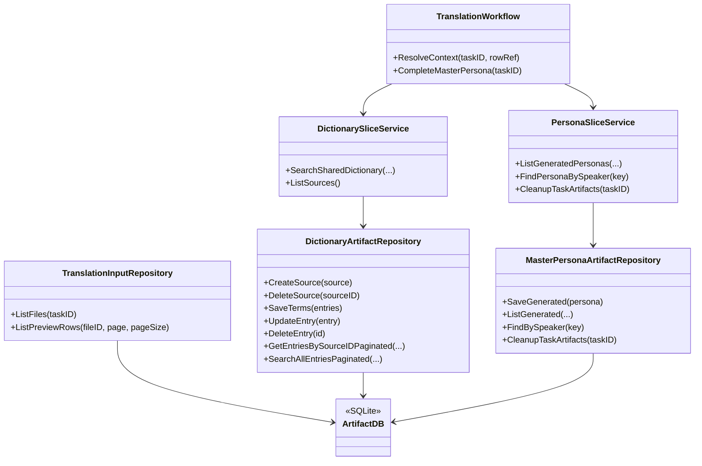

## Context

現在の `translation flow` は `pkg/workflow` 経由で `artifact/translationinput` を参照できる一方、`Dictionary Builder` の成果物は `dictionary.db`、`MasterPersona` の成果物は `persona.db` に閉じている。そのため translation flow が dictionary / persona の共有成果物を安定して利用できず、architecture.md が定義する「slice 間共有データは artifact へ置く」という原則を満たせていない。

今回の変更では、共有参照される成果物を `artifact.db` 側の正本へ移す。ただし workflow は artifact を直接読まない。workflow は slice 契約だけを呼び、slice が artifact を読む。`MasterPersona` では画面表示も translation flow 参照も final 成果物に統一し、下書きや request 準備用の中間生成物は task 単位で保持して終了時に cleanup する。

対象は以下の 2 系統である。

- `Dictionary Builder` が保持する共有辞書成果物
- `MasterPersona` が保持する final ペルソナ成果物と task 単位の中間生成物

制約は以下の通り。

- `pkg/workflow` は artifact を直接参照しない
- `pkg/workflow` は slice 契約だけを呼び、slice が artifact 契約を使う
- `pkg/artifact` は slice DTO に依存せず、artifact 自前の contract と DTO を持つ
- `MasterPersona` 一覧表示は final 成果物だけを読む
- task 完了後に中間生成物を削除できるよう、中間生成物は `task_id` で束ねる
- DB スキーマ変更は `openspec/specs/governance/database-erd/spec.md` の shared artifact 範囲に明示する
- 新規ライブラリは追加せず、既存の `database/sql` / SQLite / Wire 構成で実装する

## Goals / Non-Goals

**Goals:**
- translation flow が dictionary / persona を slice 経由で artifact の正本から参照できるようにする
- `MasterPersona` 一覧の参照元を生成済み成果物だけに統一し、下書き取得、status 表示、セリフ数表示をなくす
- task 単位の中間生成物を final 保存後に cleanup できる contract を定義する
- dictionary と persona の保存・更新・削除が artifact 上で完結する契約を定義する
- `store.go` にある既存の保存ロジックを artifact 向け contract に再配置できる形へ整理する

**Non-Goals:**
- translation flow の全文実装や prompt 組み立てロジック自体をこの設計で完了させること
- `translationinput` を含む全 artifact の全面再設計
- Dictionary Builder UI の大規模な再設計
- `MasterPersona` 画面に下書き状態を残したまま二系統参照を維持すること
- 辞書 lookup 優先順位をこの change で確定すること

## Decisions

### Decision 1: 共有成果物の正本は artifact に置くが、workflow は slice 経由で扱う

今回 artifact 化するのは translation flow から共有参照される成果物の正本である。ただし `pkg/workflow` は artifact を直接読まない。`pkg/workflow` は `pkg/slice/dictionary` と `pkg/slice/persona` の契約だけを呼び、各 slice が内部で artifact repository を使う。

理由:
- controller -> workflow -> slice の基本依存を崩さない
- workflow の責務を orchestration に留められる
- artifact への保存詳細を slice 内に閉じ込められる

代替案:
- workflow が artifact repository を直接持つ
  - 却下。workflow が保存境界の詳細に寄り過ぎる
- workflow が `dictionary.db` / `persona.db` を直接読む
  - 却下。workflow が slice 内部保存へ依存し、責務境界を壊す

### Decision 2: Dictionary Builder の共有辞書成果物は全面 artifact 化する

Dictionary Builder が管理する辞書エントリ群は translation flow から共有参照される成果物なので、`dlc_sources` と `dlc_dictionary_entries` 相当の保存責務を artifact へ移す。既存 `store.go` のソース管理、エントリ CRUD、横断検索、ページネーションのロジックは artifact package に移設し、dictionary slice はそれを利用する。

artifact 側の責務:
- source 一覧取得
- source 作成 / 削除
- source 単位の entry 保存
- entry 更新 / 削除
- source 単位検索 / 横断検索

理由:
- 辞書は translation flow から再利用される共有資産である
- 既存の `DictionaryStore` はほぼそのまま artifact repository の責務に変換できる
- 1 source = N entries の構造は artifact に置いても意味が変わらない

### Decision 3: MasterPersona は final 成果物テーブルと task 単位の中間テーブルを artifact 内で分離する

`MasterPersona` は final 成果物と中間生成物を同じ保存面に混ぜない。artifact 内で用途を分ける。

- final 成果物テーブル: 生成済みペルソナだけを保持する正本
- 中間テーブル: 下書き、request 準備、task 再開に必要な一時データを `task_id` 単位で保持する

UI と translation flow が参照するのは final 成果物テーブルだけとし、中間テーブルは参照しない。これにより画面表示で下書き取得を行わず、status 表示とセリフ数表示も不要になる。

final 成果物に含めるのは、現在の [MasterPersona.tsx](/F:/ai%20translation%20engine%202/frontend/src/pages/MasterPersona.tsx) と [PersonaDetail.tsx](/F:/ai%20translation%20engine%202/frontend/src/components/PersonaDetail.tsx) で実際に表示に使う項目だけとする。対象は以下とする。
- `persona_id`
- `form_id`
- `source_plugin`
- `npc_name`
- `editor_id`
- `race`
- `sex`
- `voice_type`
- `updated_at`
- `persona_text`
- `generation_request`（生成リクエストタブ表示用）
- `dialogues`（セリフ一覧タブ表示用）

含めないもの:
- `status`
- `dialogue_count`
- `dialogue_count_snapshot`
- 下書き状態の識別用列

理由:
- UI が下書きと確定結果を二箇所から取る構造を避けられる
- dynamic count のためだけのスナップショット列を持たずに済む
- final 成果物テーブルを画面表示要件に合わせて最小化できる

### Decision 4: generation_request と npc_dialogues は「画面表示に必要なものだけ」を final に含める

`generation_request` と `npc_dialogues` は、現在の画面表示で使っているため final 正本に含める。一方で UI で使わない補助状態は final に含めず、中間生成物として cleanup 対象にする。

理由:
- final 成果物の責務を UI / translation flow が使う確定データに限定できる
- 現在の詳細表示を維持しつつ、不要な詳細を正本へ残さずに済む

### Decision 5: task 終了時に中間生成物を cleanup する

`MasterPersona` は task が終了したら、`task_id` に紐づく中間生成物を削除する。cleanup の責務は workflow が task の終了タイミングで slice 契約を呼び、slice が artifact cleanup を行う。

cleanup 対象:
- 下書き状態の task スコープ行
- request 準備・再開にしか使わない一時データ
- final 成果物へ反映済みの中間保存物

cleanup 非対象:
- 生成済み final 成果物
- UI / translation flow が継続参照する確定データ

理由:
- タスク終了後に不要な中間データを残さず、UI と translation flow の参照面を final だけに保てる
- resume に必要な期間だけ task スコープの一時データを保持できる

### Decision 6: `store.go` のロジックは contract ごと artifact に再配置する

既存 `store.go` の保存責務は artifact 側へ寄せる。ただしファイルをそのまま移すのではなく、artifact が slice DTO に依存しないよう contract と DTO を artifact 基準へ切り直す。persona lookup に必要な `source_plugin` / `speaker_id` のキー DTO は `pkg/artifact/master_persona_artifact` 側に置き、slice 契約もその DTO を受ける。

実装方針:
- `pkg/artifact/dictionary_artifact` に dictionary 用の contract / migration / repository を作る
- `pkg/artifact/master_persona_artifact` に persona 用の final / temp 契約、migration、repository を作る
- 既存 `pkg/slice/dictionary/store.go` と `pkg/slice/persona/store.go` のうち、共有成果物に関する SQL と CRUD を artifact 側へ移す
- slice 側の service / generator / workflow は slice DTO を維持したまま artifact repository を注入して使う

理由:
- `artifact -> slice` 依存禁止を守るため、artifact は自前 DTO を持つ必要がある
- translation flow に必要な DTO と保存 DTO を切り離せる
- 既存ロジックの再利用はしつつ、責務境界だけを正しく引き直せる

## Risks / Trade-offs

- [artifact DTO への再設計コスト] → `store.go` の単純移植ではなく contract の置き直しが必要になる。dictionary / master persona に絞って進める。
- [UI 依存の final 項目固定] → final 成果物の項目は現行 UI に依存する。`MasterPersona.tsx` / `PersonaDetail.tsx` の表示項目変更時は artifact schema も見直す必要がある。
- [既存 UI 変更] → status 表示・フィルタ・セリフ数表示を前提にした UI を削る必要がある。specs で persona UI 要件を明示的に更新する。
- [artifact DTO 露出] → slice 契約が artifact 側の lookup key DTO をそのまま受けるため、境界の一貫性を specs で固定する必要がある。

### Class Diagram



### Sequence Diagram: translation flow から dictionary / persona を読む

```mermaid
sequenceDiagram
    participant TW as Translation Workflow
    participant DS as Dictionary Slice
    participant PS as Persona Slice
    participant DAR as DictionaryArtifactRepository
    participant PAR as MasterPersonaArtifactRepository
    participant ADB as artifact.db

    TW->>DS: SearchSharedDictionary(...)
    DS->>DAR: SearchAllEntriesPaginated(...)
    DAR->>ADB: SELECT dictionary rows
    DAR-->>DS: artifact DTO
    DS-->>TW: slice DTO

    TW->>PS: FindPersonaBySpeaker(key)
    PS->>PAR: FindBySpeaker(key)
    PAR->>ADB: SELECT final persona row
    PAR-->>PS: artifact DTO
    PS-->>TW: slice DTO
```

### Sequence Diagram: MasterPersona final 保存と cleanup

```mermaid
sequenceDiagram
    participant MP as MasterPersona Workflow
    participant PS as Persona Slice
    participant PAR as MasterPersonaArtifactRepository
    participant ADB as artifact.db
    participant UI as MasterPersona UI

    MP->>PS: SavePersona(result, overwrite)
    PS->>PAR: SaveGenerated(final persona)
    PAR->>ADB: UPSERT final persona row
    MP->>PS: CleanupTaskArtifacts(taskID)
    PS->>PAR: CleanupTaskArtifacts(taskID)
    PAR->>ADB: DELETE temp rows by task_id
    UI->>PS: ListGeneratedPersonas(...)
    PS->>PAR: ListGenerated(...)
    PAR->>ADB: SELECT final persona rows
    PAR-->>PS: artifact DTO
    PS-->>UI: slice DTO
```

## Migration Plan

1. `database_erd.md` を更新し、dictionary の final テーブルと master persona の final / temp テーブルを artifact 正本として定義する。
2. `pkg/artifact/dictionary_artifact` と `pkg/artifact/master_persona_artifact` を追加する。
3. 既存 `store.go` の共有成果物に関する SQL / CRUD を artifact repository へ移す。
4. `pkg/slice/dictionary` の service / importer が artifact repository を使うよう差し替える。
5. `pkg/slice/persona` の generated persona 保存、一覧取得、lookup、cleanup が artifact repository を使うよう差し替える。
6. `MasterPersona` 一覧を final 成果物の全取得に切り替え、status 表示・セリフ数表示・下書き取得を削除する。
7. `pkg/workflow` は slice 契約だけを束ねる形へ揃える。

Rollback:
- slice 側の DI を旧 store 実装へ戻せるよう、移行中は interface 差し替えで進める。
- cleanup 導線を入れる前の段階では、中間生成物の削除を無効化して切り戻し可能にする。

## Open Questions

- なし
