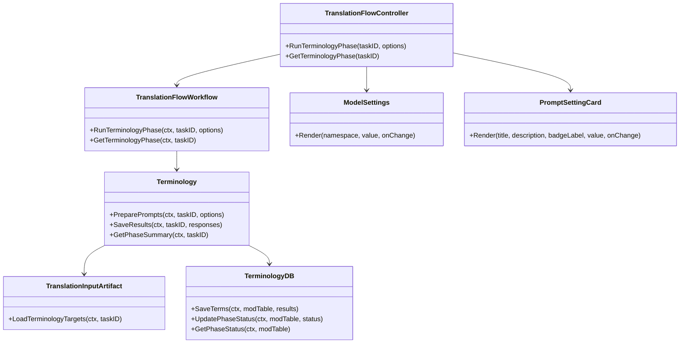
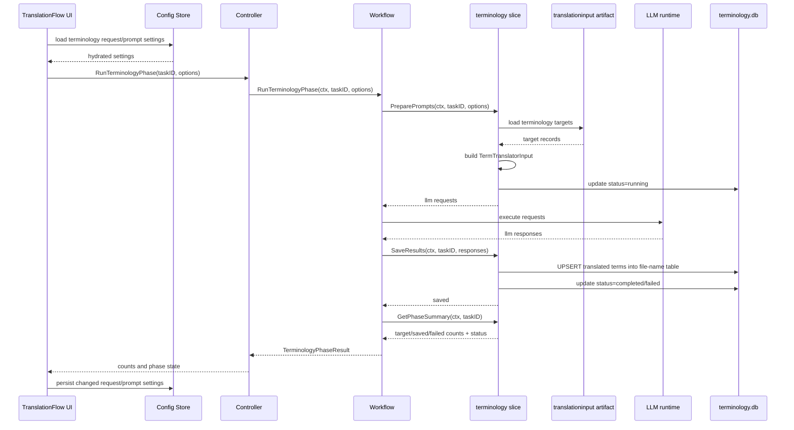

## Context

`openspec/specs/governance/requirements/spec.md` は 2-Pass System を定義しており、Pass 1 では固有名詞や用語を本文翻訳より先に翻訳して用語辞書を構築することを求めている。既存の `pkg/slice/terminology` はこの Pass 1 の中核であり、artifact から単語翻訳対象を読み出し、LLM リクエストを生成し、レスポンスを保存する 2 フェーズモデルを担う。

今回の変更は、translation flow から terminology slice を phase として起動し、翻訳対象単語を事前翻訳してから本文翻訳へ進める導線を定義するものである。artifact 境界の原則に従い、artifact へのアクセスは terminology slice が担い、workflow は task ID などの境界情報だけを渡す。phase 完了状態も terminology 側の保存状態を正本とする。

また、Pass 1 の品質を operator が調整できるように、translation flow UI は terminology 用の LLM リクエスト設定と prompt 編集を提供する。既存の `frontend/src/components/ModelSettings.tsx` と `frontend/src/components/masterPersona/PromptSettingCard.tsx` を共有 UI として再利用し、master persona と terminology phase の両方で使える props 境界に揃える。

## Goals / Non-Goals

**Goals:**
- translation flow に `単語翻訳` phase を追加する。
- terminology slice が artifact から単語翻訳対象を抽出して `TermTranslatorInput` を組み立てる形にする。
- terminology の `PreparePrompts` / `SaveResults` を workflow から実行できるようにする。
- 単語翻訳の結果を `terminology.db` に保存し、ファイル名ベースの mod テーブルで管理する。
- workflow が保持する実行結果サマリを `対象件数 / 保存件数 / 失敗件数` に固定する。
- phase 完了状態を terminology 側の status カラムで保持し、workflow/UI がそれを参照できるようにする。
- translation flow UI で terminology 用の LLM リクエスト設定と prompt を編集できるようにする。
- `ModelSettings` と `PromptSettingCard` を terminology phase でも再利用できる共有コンポーネントにする。

**Non-Goals:**
- terminology slice の本質的責務を辞書適用や exact match 置換に広げない。
- dictionary artifact の競合解決 UI を追加しない。
- 本文翻訳の LLM 実装そのものを変更しない。
- task metadata に terminology DB パスや phase 状態 JSON を持たせない。
- 単語翻訳 phase を runtime queue 化することまでは今回の必須範囲に含めない。
- master persona 専用の保存 namespace を terminology と共有化することまでは求めない。

## Decisions

### 1. translation flow の既存 2 番目タブを `単語翻訳` phase として実装する
現状 UI にはデータロード直後の第 2 タブとして `用語` が存在する。この位置は requirements spec の Pass 1 に一致するため、新しい phase を増やすのではなく、既存タブを `単語翻訳` phase として実装する。

代替案:
- 新しい phase を追加して step を増やす案
  - 却下理由: 既存の `用語` タブと役割が重複し、translation flow の phase 構造が冗長になる。

### 2. artifact 読み出しと単語翻訳対象の組み立ては terminology slice が担う
artifact へアクセスできるのは slice 側であるため、workflow が `translationinput` を直接読み出して `TermTranslatorInput` を組み立てる設計は採らない。workflow は task ID などの artifact 識別子だけを terminology slice に渡し、terminology slice が artifact から NPC、Item、Magic、Message、Location、Quest を抽出して入力 DTO を構築する。

想定 workflow 契約:
- `RunTerminologyPhase(ctx, taskID string, options TerminologyPhaseOptions) (TerminologyPhaseResult, error)`
- `GetTerminologyPhase(ctx, taskID string) (TerminologyPhaseResult, error)`

想定 terminology 利用:
- `PreparePrompts(ctx, taskID string, options TerminologyPromptOptions) ([]llm.Request, error)`
- `SaveResults(ctx, taskID string, responses []llm.Response) error`
- `GetPhaseSummary(ctx, taskID string) (TerminologyPhaseSummary, error)`

代替案:
- workflow 側で DTO を組み立てる案
  - 却下理由: workflow が artifact を直接扱うことになり、責務境界に反する。
- translation flow slice 側へ単語翻訳ロジックを複製する案
  - 却下理由: Pass 1 の責務が terminology から分散し、既存 spec と矛盾する。

### 3. 単語翻訳結果の正本は単一の `terminology.db` とし、mod ごとにファイル名ベースのテーブルを使う
従来の mod ごとの別 DB ファイル運用はやめ、今後は単一の `terminology.db` を用いる。mod ごとの分離はファイル名から決定したテーブル名で管理する。これにより、保存先の解決は DB パスではなく対象ファイル名で行えるため、task metadata に DB パスを持たせる必要がない。

保存方針:
- DB ファイルは `terminology.db` に固定する
- mod ごとにファイル名ベースでテーブルを分離する
- terminology slice が保存先テーブル名の解決を担う
- 後続フェーズは対象ファイル名から参照テーブルを決定する

代替案:
- mod ごとに別 DB ファイルを維持する案
  - 却下理由: 保存先解決が分散し、後続フェーズ連携時に DB パス管理が必要になる。
- task metadata に DB パスを持つ案
  - 却下理由: 単一 DB 化後は不要であり、メタデータ責務を増やすだけになる。

### 4. workflow サマリは `対象件数 / 保存件数 / 失敗件数` に限定する
単語翻訳 phase の UI と後続 phase が必要とする進捗情報としては、`対象件数 / 保存件数 / 失敗件数` で十分と判断する。リクエスト件数や内部の中間件数は terminology slice 内部の詳細とし、workflow の公開サマリには含めない。

代替案:
- リクエスト件数や skipped 件数まで公開する案
  - 却下理由: 現時点では UI と workflow の判断材料として過剰であり、契約が肥大化する。

### 5. phase 完了状態は terminology 側の status カラムを正本とする
phase 完了状態は task metadata の JSON ではなく、terminology 側の status カラムで保持する。workflow と UI はこの status を参照して、未開始・進行中・完了・失敗を判定する。

代替案:
- task metadata JSON で phase 状態を持つ案
  - 却下理由: 正本が terminology 側と二重化し、状態不整合の原因になる。

### 6. phase 初回は同期 orchestration で開始する
terminology の 2 フェーズモデル自体は非同期実行にも対応できるが、translation flow への組み込み初回は同期 orchestration で十分である。必要になれば後続 change で queue 化する。

### 7. terminology phase の設定 UI は既存 shared component を再利用する
terminology phase 専用に新しい LLM 設定フォームや prompt editor を作らず、既存の `ModelSettings` と `PromptSettingCard` を再利用する。`ModelSettings` は provider / model / execution profile / endpoint / apiKey / temperature / contextLength / syncConcurrency などの request 設定を namespace 単位で保持できる props に揃える。`PromptSettingCard` は title / description / badge / value / readOnly / onChange に加え、feature 固有説明文を差し替え可能な共有 UI として扱う。

設定保存方針:
- terminology phase の request 設定と prompt 設定は master persona とは別 namespace で保存する
- task metadata には prompt 本文や request 設定を複製しない
- translation flow 再訪時は config から復元した設定を初期表示する
- workflow は phase 実行時に UI から確定した設定 DTO を terminology slice に渡す

代替案:
- terminology 専用の UI コンポーネントを別実装する案
  - 却下理由: 既存 UI と同種入力が重複し、設定体験も分断される。
- task metadata に prompt 本文を保存する案
  - 却下理由: config 正本と二重化し、タスクごとの差分管理が不要な段階では過剰である。

## Class Diagram

## Sequence Diagram

## Risks / Trade-offs

- [Risk] terminology slice が artifact 読み出しまで担うことで責務が広く見える -> Mitigation: それでも Pass 1 の単語翻訳責務の範囲内に留め、本文翻訳や辞書適用責務は追加しない。
- [Risk] 単語翻訳対象の抽出範囲が広すぎて本文翻訳対象まで混ざる -> Mitigation: terminology spec の対象レコードタイプだけを明示的に許可する。
- [Risk] 単一 `terminology.db` でテーブル数が増える -> Mitigation: ファイル名ベースのテーブル命名規則と migration 戦略を terminology slice 側で固定する。
- [Risk] status カラム管理が不十分だと phase 復元が不安定になる -> Mitigation: 提案開始時、保存完了時、失敗時の各タイミングで status 更新を必須化する。
- [Risk] shared component 再利用で master persona と terminology の設定文言が衝突する -> Mitigation: namespace と表示文言を props で分離し、保存キーも feature ごとに分ける。

## Migration Plan

1. translation flow workflow に `単語翻訳` phase を追加する。
2. terminology slice が artifact から対象レコードを読み出す API を実装する。
3. terminology の保存先を単一 `terminology.db` + ファイル名ベースの mod テーブル方式へ切り替える。
4. terminology 側に phase 状態用の status カラムを追加する。
5. translation flow UI の第 2 タブを単語翻訳フェーズへ差し替え、shared component ベースの request/prompt 編集 UI を追加する。
6. backend は `backend:lint:file -> 修正 -> 再実行 -> lint:backend`、frontend は `lint:file -> 修正 -> 再実行 -> typecheck -> lint:frontend -> Playwright` で検証する。
