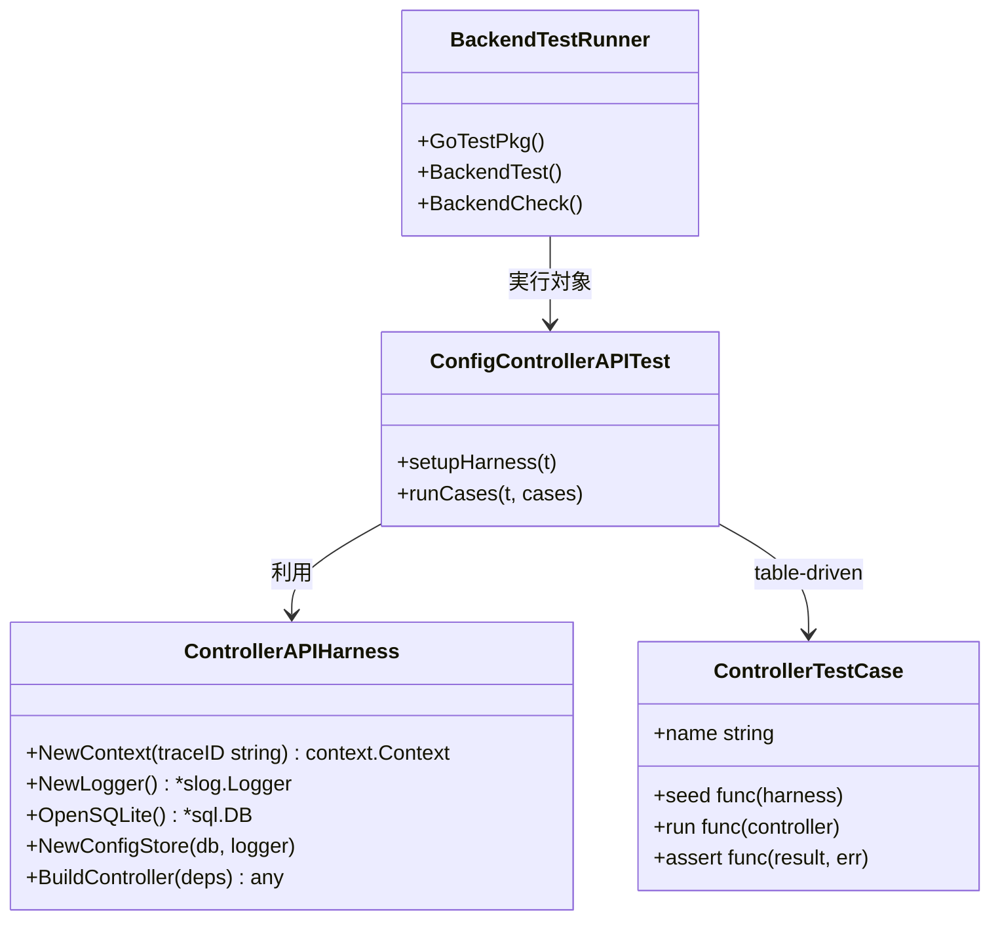
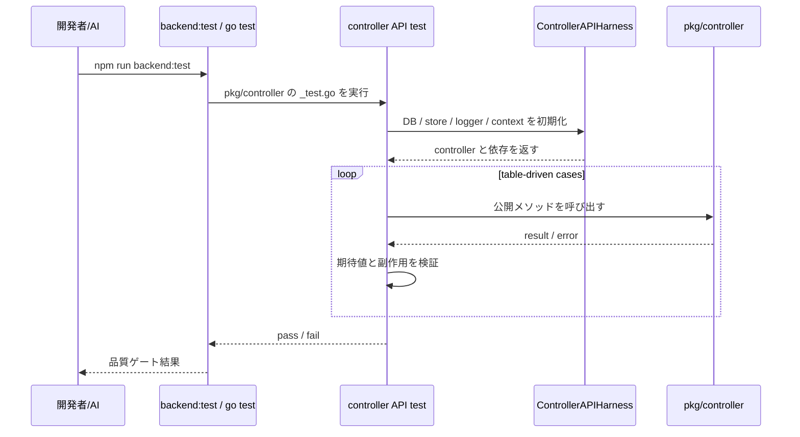

## Context

本変更は、`pkg/controller/**` の公開メソッドを API とみなし、controller API テストを追加しやすくする共通実行基盤を整備するための設計である。`architecture.md` では外部入力の入口が `controller` に集約されているため、API テスト基盤も同じ責務境界に合わせて `pkg/controller` へ限定する。

現状でも `pkg/controller/config_controller_test.go` のような個別テストは存在するが、controller ごとに DB 初期化、store 準備、logger、`context.Context` を都度組み立てており、今後 controller が増えるとセットアップの重複と品質のばらつきが増えやすい。今回の変更では、`standard_test_spec.md` に沿う table-driven test を前提に、controller API テストで共通利用する harness と配置方針を定義する。

制約は次のとおり。

- 対象は `pkg/controller/**` の公開メソッドに限定し、`workflow`、`slice`、`runtime` の内部契約テスト基盤は扱わない
- テストは Go 標準 `testing` を中心に構成し、導入ライブラリはデファクトスタンダードに限定する
- 実行導線は既存の `go test ./pkg/...`、`npm run backend:test`、`npm run backend:check` を崩さずに拡張する
- `standard_test_spec.md` の table-driven / context 伝播 / 構造化ログ前提を満たす

## Goals / Non-Goals

**Goals:**

- controller API テストで再利用する共通 harness を定義する
- DB、config store、logger、`context.Context` などのセットアップ重複を減らす
- controller 公開メソッドの正常系・異常系を table-driven に追加しやすくする
- 既存の `backend:test` / `backend:check` 導線へ自然に接続する
- 今後の controller API テストの標準配置と責務境界を固定する

**Non-Goals:**

- `pkg/workflow/**`、`pkg/slice/**`、`pkg/runtime/**` のテスト基盤整備
- HTTP サーバーや外部実サービスを起動する結合テスト基盤の導入
- テストランナーの全面刷新
- フロントエンド E2E や Wails UI テストの追加

## Decisions

### 1. API テスト対象は `pkg/controller/**` の公開メソッドに限定する

- Decision:
  - API テスト基盤は controller 公開メソッドだけを対象とする。
- Rationale:
  - `architecture.md` 上の外部入口は controller であり、API テストの責務境界もそこへ揃えるのが自然だから。
- Alternatives Considered:
  - `pkg/**` 全体を API テスト対象にする案
    - 却下。workflow / slice / runtime は内部契約であり、API テストと内部テストの境界が曖昧になる。

### 2. 共通 harness は controller テスト専用の helper package として配置する

- Decision:
  - `pkg/controller/test` のような controller 配下のテスト補助パッケージ、または同等の controller 専用配置へ harness を置く。
  - harness は controller 初期化、インメモリ SQLite、必要な store / logger / context 生成を担当する。
- Rationale:
  - controller API テストの責務に閉じた共通化にでき、他区分のテスト基盤へ不要な依存を広げずに済むから。
- Alternatives Considered:
  - ルート共通の `testutil` を作る案
    - 却下。責務の違うテストまで同居しやすく、共通化が肥大化しやすい。
  - 各テストファイルで初期化を継続する案
    - 却下。初期化の重複が増え、`context` や logger の扱いがぶれやすい。

### 3. テストケースは table-driven を標準形にする

- Decision:
  - controller API テストは、原則として入力、前提状態、期待結果を持つ table-driven test で記述する。
  - 1 つの公開メソッドに対して正常系と異常系を同じテーブルで管理できる形を優先する。
- Rationale:
  - `standard_test_spec.md` と整合し、ケース追加時の差分が読みやすくなるから。
- Alternatives Considered:
  - 単発テストを公開メソッドごとに増やす案
    - 却下。ケースが増えたときに網羅性と見通しが落ちる。

### 4. 実行導線は既存 `go test ./pkg/...` に統合する

- Decision:
  - controller API テストは通常の `_test.go` として `pkg/controller/**` 配下で実装し、既存の `go test ./pkg/...`、`npm run backend:test`、`npm run backend:check` から実行されるようにする。
- Rationale:
  - 新しい専用ランナーを作らずに、既存品質ゲートへ最小変更で統合できるから。
- Alternatives Considered:
  - `backend:api-test` のような別コマンドを必須化する案
    - 却下。日常フローが増え、既存の `backend:test` との責務が分散する。

### 5. 採用ライブラリは最小限にとどめる

- Decision:
  - アサーションとサブテスト制御はまず Go 標準 `testing` を優先する。
  - 必要であれば `stretchr/testify` を許容するが、導入前提にはしない。
  - goroutine leak 検知が必要な箇所は既存方針どおり `go.uber.org/goleak` を利用する。
- Rationale:
  - 追加依存を増やしすぎず、既存コードベースとの整合を取りやすいから。
- Alternatives Considered:
  - アサーションライブラリ前提で全面統一する案
    - 却下。今回の目的は API テスト基盤であり、記法統一が主目的ではない。

## クラス図

## シーケンス図

## Risks / Trade-offs

- [Risk] harness が肥大化し、controller 固有ロジックまで吸い込み始める
  - Mitigation: harness は初期化責務だけに限定し、controller 固有の seed や assert は各テストに残す
- [Risk] 共通化によりテストの前提が見えにくくなる
  - Mitigation: 共通化は DB・logger・context・依存初期化までに留め、業務前提データは各ケースの `seed` に明示する
- [Risk] `backend:check` 実行時間が増える
  - Mitigation: API テストは `pkg/controller/**` 配下の通常テストとして実装し、外部プロセス起動や重い統合処理は含めない
- [Risk] logger / context の扱いが harness に閉じて追跡しづらくなる
  - Mitigation: `trace_id` をテストケースごとに明示的に生成し、必要ならログ出力先を差し替えられる構造にする

## Migration Plan

1. `openspec` 上で `api-test` と `backend-quality-gates` の変更 spec を確定する
2. `pkg/controller/**` の既存テストを棚卸しし、重複しているセットアップを抽出する
3. controller 専用 harness の配置を追加し、インメモリ DB・logger・context 初期化を集約する
4. 既存 controller テストを必要に応じて table-driven へ寄せながら harness 利用へ移行する
5. `go test ./pkg/...`、`npm run backend:test`、`npm run backend:check` で controller API テストが通ることを確認する

Rollback Strategy:
- harness 導入で複雑化した場合は、共通 helper を最小限まで戻し、個別テストへ再分配する
- 実行導線は既存 `go test ./pkg/...` を使うため、専用ランナー撤去のような大きなロールバックは不要

## Open Questions

- harness の物理配置を `pkg/controller/test` にするか、controller 配下のより限定的なサブパッケージにするか
- `stretchr/testify` を導入せず標準 `testing` のみで運用するか
- controller ごとに依存構成が異なる場合、単一 harness で吸収するか、controller 別 builder を併設するか
