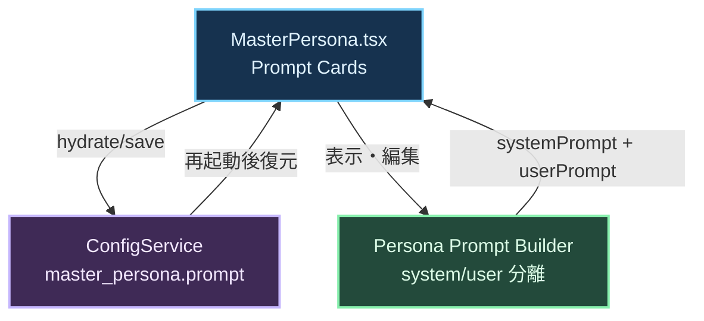
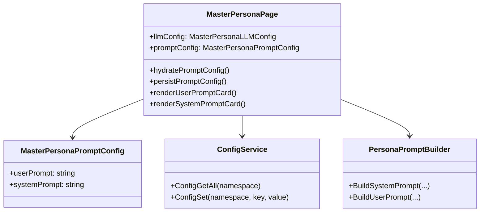
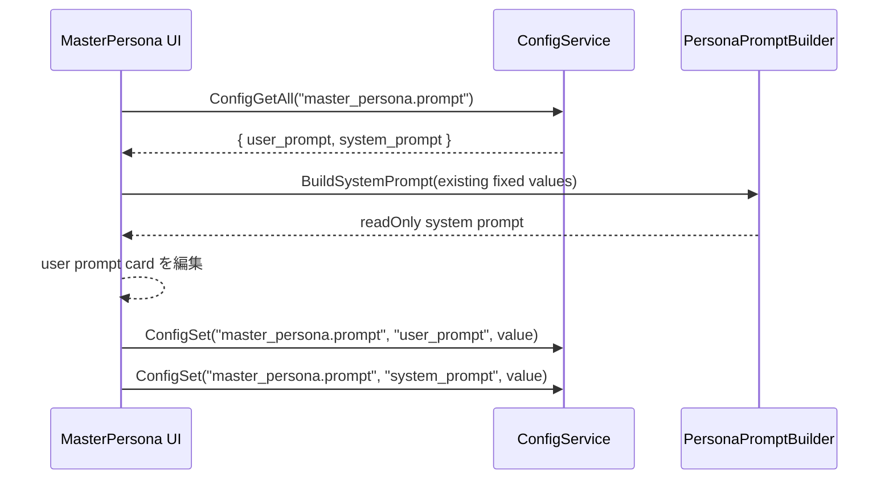

## Context

`MasterPersona` 画面は現在、JSON 選択、進捗、LLM 設定を中心に構成されており、ペルソナ生成時に使われるプロンプトをユーザーが確認・編集する領域を持たない。既存実装ではユーザープロンプトにシステム補完値が混在する前提になりやすく、UI 上の責務分離と `config` の永続化ルールが揃っていない。

本変更は、`frontend/src/pages/MasterPersona.tsx` の UI 拡張だけでなく、MasterPersona 用 prompt 設定の保存キー設計、画面初期化時の hydrate、ペルソナ生成時の prompt 組み立て責務の整理を含む。`architecture.md` の Interface-First AIDD と Config の namespace 分離原則に従い、既存 `ConfigGetAll` / `ConfigSet` を再利用して実装する。

関係者は次の通り。

- MasterPersona を使ってペルソナ生成条件を調整するユーザー
- ペルソナ生成 prompt を消費するフロントエンド/バックエンドの統合処理
- `config` spec を保守する設定インフラ担当

## Goals / Non-Goals

**Goals:**

- MasterPersona 画面にユーザープロンプト編集カードと、読み取り専用のシステムプロンプト表示カードを追加する
- システムが注入する固定文言・補完値をユーザープロンプトから分離し、システムプロンプトへ集約する
- MasterPersona 用 prompt 設定を `config` で永続化し、画面再表示時に安定して復元する
- 既存 LLM 設定と同じ画面ライフサイクルで保存されるようにし、追加ライブラリなしで完結する

**Non-Goals:**

- Persona 生成アルゴリズム自体の刷新やプロンプト文面の大幅な最適化
- 汎用 Prompt Editor コンポーネントの新設
- `config` の保存テーブル構造変更や新規 DB 追加
- MasterPersona 以外の画面の prompt UI 変更

## Decisions

### 1. Prompt 設定は `config` の専用 namespace に保存する

MasterPersona 用 prompt は LLM 設定とは別責務なので、`master_persona.prompt` のような専用 namespace に分離して保存する。キーは `user_prompt` と `system_prompt` を基本とし、画面初期化時は `ConfigGetAll(namespace)` で一括取得する。

理由:

- `master_persona.llm` 配下へ混在させると、プロバイダ設定と prompt 設定の責務が曖昧になる
- `config/spec.md` の namespace 分離原則と整合する
- 既存の `ConfigGetAll` / `ConfigSet` だけで実装でき、追加依存が不要

代替案:

- `ui_state` に JSON で保存する案は、prompt が UI レイアウトではなくアプリ設定であり、バックエンドでも利用し得るため不採用
- `master_persona.llm.<provider>` に保存する案は、provider を跨いで共通利用される prompt との整合が悪いため不採用

### 2. UI は 2 枚のカードで責務を明示する

`MasterPersona.tsx` に次の 2 カードを追加する。

- ユーザープロンプト入力カード: 編集可能 textarea
- システムプロンプトカード: `readOnly` textarea または preformatted 表示

システムプロンプトは「ユーザーが変えるべきではないシステム補完ルール」を可視化するための参照領域として扱う。ユーザー入力と固定制約を同居させないことで、プロンプト責務を UI 上で明示する。

代替案:

- 単一 textarea 内でセクション分割する案は、誤編集や責務混在を防ぎにくいため不採用
- システムプロンプトを非表示にする案は、ユーザーが実際の送信コンテキストを把握できないため不採用

### 3. システム補完値の移設は prompt builder 側の責務として扱う

既存ユーザープロンプト中のうち、システムが埋める説明、出力形式、入力データの意味付けなど固定値は、送信時に組み立てる system prompt 側へ寄せる。UI ではその完成形を読み取り専用表示し、実際の生成処理でも同じ内容を使用する。

理由:

- 「どこまでがユーザー意図で、どこからがシステム制約か」を一貫させられる
- UI 表示と実送信内容の乖離を減らせる
- 仕様上の「システム上で値を入れる部分はシステムプロンプトに移動すること」を満たせる

代替案:

- UI だけ分離して送信時は従来のまま結合する案は、仕様と実装が乖離するため不採用

### 4. 保存タイミングは既存 LLM 設定と同様の自動保存に寄せる

prompt 設定は画面 hydrate 後の state 変更を監視して逐次 `ConfigSet` する。これにより「保存ボタン」を新設せず、現在の MasterPersona 設定体験を崩さない。

理由:

- 既存 `MasterPersona.tsx` は LLM 設定を自動保存しており、操作モデルが揃う
- Wails 画面で保存忘れを防げる

代替案:

- 明示保存ボタン方式は UX が分岐し、LLM 設定との一貫性が崩れるため不採用

### クラス図

### シーケンス図

## Risks / Trade-offs

- [システムプロンプト表示と実際の送信内容がズレる] → 表示用文字列を別管理せず、送信時に使う builder 出力または同一 state を UI 表示へ流用する
- [自動保存の連続発火で設定書き込みが増える] → 既存 LLM 設定と同様に直列キューで保存し、差分があるキーだけ `ConfigSet` する
- [既存 prompt 文面の移設時に意味が変わる] → 固定値と可変値の境界を design/spec で明示し、system prompt へ移す文言を限定する
- [namespace 設計が曖昧だと将来の prompt 機能と衝突する] → `master_persona.prompt` を専用 namespace として spec に明記する

## Migration Plan

1. `config` spec に MasterPersona prompt 用 namespace と保存要件を追加する
2. `persona` spec に UI 表示ルールと prompt 責務分離要件を追加する
3. `MasterPersona.tsx` に prompt state の hydrate/save と 2 カード UI を実装する
4. ペルソナ生成時の prompt 組み立て処理で、固定補完値を system prompt 側へ移設する
5. 既存保存値がない場合はデフォルト文面で初期化し、ロールバック時は該当 namespace を未参照に戻す

## Open Questions

- 実際に送信している MasterPersona prompt builder の定義箇所が複数ある場合、どの層を単一の正本にするか最終確認が必要
- `system_prompt` を完全固定にするか、将来の管理者向け編集余地を残すかは今回スコープ外だが、namespace は拡張可能な形で保持する
