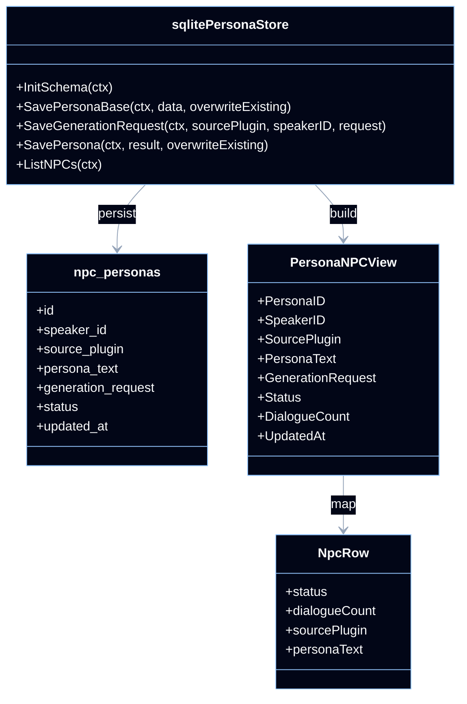
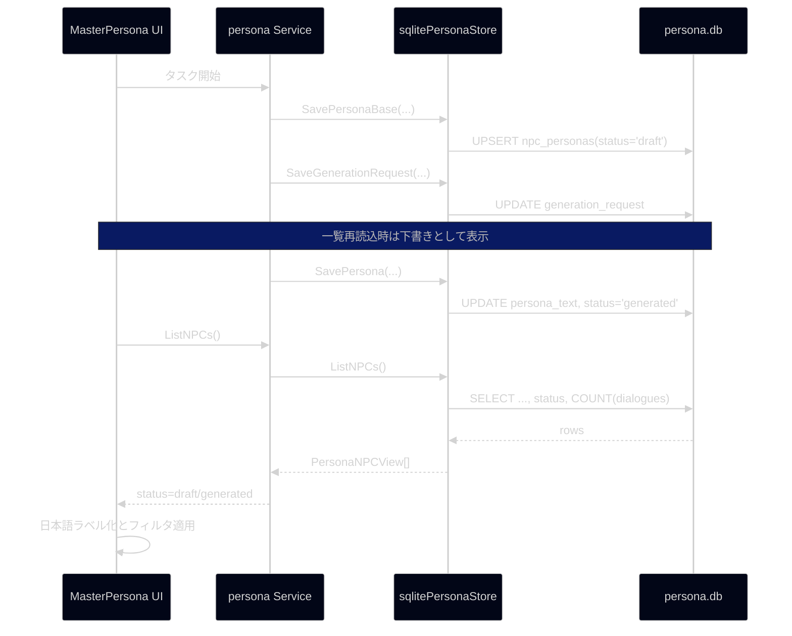

## Context

現在の MasterPersona 一覧は [frontend/src/pages/MasterPersona.tsx](C:/Users/shiba/.codex/worktrees/75c7/ai%20translation%20engine%202/frontend/src/pages/MasterPersona.tsx) 内で `ListNPCs()` の結果を `NpcRow` に変換する際、全件を固定で `完了` として扱っている。一方、バックエンドの [pkg/persona/store.go](C:/Users/shiba/.codex/worktrees/75c7/ai%20translation%20engine%202/pkg/persona/store.go) は `npc_personas` に一覧用の状態を保持しておらず、リクエスト生成だけ完了した下書きレコードと、保存済みペルソナを区別できない。

今回の要件では、状態の意味を以下に固定する。

- `draft`: タスク開始時のリクエスト生成フェーズで、`SavePersonaBase` と `SaveGenerationRequest` が完了した状態
- `generated`: LLM 応答を保存する `SavePersona` が完了し、`persona_text` が確定した状態

この変更は SQLite スキーマ、`pkg/persona` の DTO、Wails サービス応答、React 一覧 UI の複数モジュールに跨るため、先に状態管理と移行方針を設計で固定する。

## Goals / Non-Goals

**Goals:**

- `npc_personas` に英語の状態値を追加し、リクエスト生成時と保存時で一貫した状態遷移を実現する
- `ListNPCs` の応答に状態を含め、UI が固定値ではなくDBの実状態を表示できるようにする
- MasterPersona 一覧で `下書き` / `生成済み` の表示とステータスフィルタを提供する
- 既存データに対して後方互換を保ちつつマイグレーションできるようにする

**Non-Goals:**

- `failed` や `in_progress` など追加の中間状態を今回の一覧ステータスとして導入すること
- ペルソナ生成ジョブキューやタスク状態の仕様を変更すること
- Persona 詳細表示やダイアログ詳細のレイアウトを全面的に見直すこと

## Decisions

### 1. 一覧ステータスのソースは `npc_personas.status` に統一する

`npc_personas` に `status TEXT NOT NULL DEFAULT 'draft'` を追加し、値は `draft` と `generated` のみ許可する。状態を `persona_text` の空文字有無から推測する案もあるが、将来の再開・再保存フローでは「要求生成済みだが未保存」の意味を明示的に持たせる必要があるため、独立カラムの方が仕様を保ちやすい。

代替案:

- `persona_text != ''` なら生成済みとみなす
  理由: 既存データには近いが、下書き状態をDB上で検索・集計できず、一覧フィルタ条件も曖昧になるため不採用
- `generation_request != ''` と `persona_text != ''` の組み合わせで推論する
  理由: 遷移条件が複数カラム依存になり、DTO と UI 側で判定ロジックが重複するため不採用

### 2. 状態遷移は保存APIの責務境界に合わせて固定する

状態遷移は既存の保存責務に合わせて以下で固定する。

- `SavePersonaBase`: 新規作成時と既存行更新時に `status='draft'`
- `SaveGenerationRequest`: `generation_request` 更新のみ。状態は変更しない
- `SavePersona`: 保存成功時に `status='generated'`

これにより「リクエスト生成時に下書き」「保存時に生成済み」という運用定義を、そのままストア層に閉じ込められる。`SaveGenerationRequest` でも `draft` を再設定する案は、保存済み行に対して再実行した場合に `generated` を巻き戻す危険があるため避ける。

### 3. 既存レコード移行は `persona_text` の有無で一度だけ補完する

マイグレーションでは `status` が存在しない旧テーブルから新テーブルへ移行する際、

- `TRIM(persona_text) <> ''` の行は `generated`
- それ以外は `draft`

で埋める。既存運用ではペルソナ本文が保存されている行は生成済みとして扱えるため、この一括補完が最も安全で単純である。

代替案:

- 全件 `draft` で初期化する
  理由: 既存の完成データが一覧上で未生成扱いになり、回帰が大きいため不採用
- 起動時にアプリ層で自動補正する
  理由: 永続データの責務がUI側へ漏れ、複数クライアントで整合しないため不採用

### 4. UI の状態表示は英語DB値を日本語ラベルへマップする

DB と DTO では `draft` / `generated` を使用し、UI 表示だけを `下書き` / `生成済み` に変換する。[frontend/src/types/npc.ts](C:/Users/shiba/.codex/worktrees/75c7/ai%20translation%20engine%202/frontend/src/types/npc.ts) に状態型とバッジ定義を寄せ、`MasterPersona.tsx` ではその型を使ってフィルタと表示を行う。

この方針により、DB命名は英語という要件を守りつつ、画面は既存の日本語UIに合わせられる。

### 5. 一覧フィルタはクライアント側の既存フィルタへ追加する

現状の一覧は `allNpcData` をクライアント側で検索・プラグイン絞り込みしている。今回も同じ構造に揃え、ステータスフィルタを `pluginFilterInput` と同列のローカル state として追加する。件数規模は `PERSONA_PAGE_SIZE=100` 前提の既存画面に対して十分小さく、サーバーAPIへ追加クエリ条件を持たせる必要はない。

代替案:

- `ListNPCs(status)` のようにサーバーサイド絞り込みを追加する
  理由: 要件規模に対してAPI変更が大きく、既存フィルタ設計とも不整合なため不採用

### クラス図

### シーケンス図

## Risks / Trade-offs

- [既存DB移行で列追加漏れがある] → `migratePersonaSchema` で新旧カラムを検査し、新テーブル再作成時に `status` を必ず含める
- [保存済み行を再度下書きへ戻してしまう] → `draft` への更新は `SavePersonaBase` のみで行い、`SaveGenerationRequest` では状態を変更しない
- [UI の状態ラベルと DB 値が乖離する] → `frontend/src/types/npc.ts` に単一のマッピング定義を置き、画面内ハードコードを排除する
- [ER図と実装がずれる] → 同変更で `specs/database_erd.md` の persona セクションも更新対象に含める

## Migration Plan

1. `npc_personas` スキーマへ `status` カラムを追加した新定義を作る
2. `migratePersonaSchema` で旧テーブルから新テーブルへデータをコピーし、`persona_text` の有無で `draft` / `generated` を補完する
3. `PersonaNPCView` と `ListNPCs` クエリへ `status` を追加する
4. `SavePersonaBase` と `SavePersona` に状態更新を組み込む
5. フロントエンドの `NpcStatus` 定義と `MasterPersona` 一覧フィルタを更新する
6. `specs/database_erd.md` を更新し、必要なテストを追加する

ロールバックは、アプリ未配布段階であれば `persona.db` を再生成して旧スキーマへ戻せる。既存データ保全が必要な場合は、マイグレーション前の DB バックアップを保持して差し戻す。

## Open Questions

- なし。状態は今回 `draft` / `generated` の2値で固定し、失敗状態は既存の task / queue 側ステータスで追跡する
