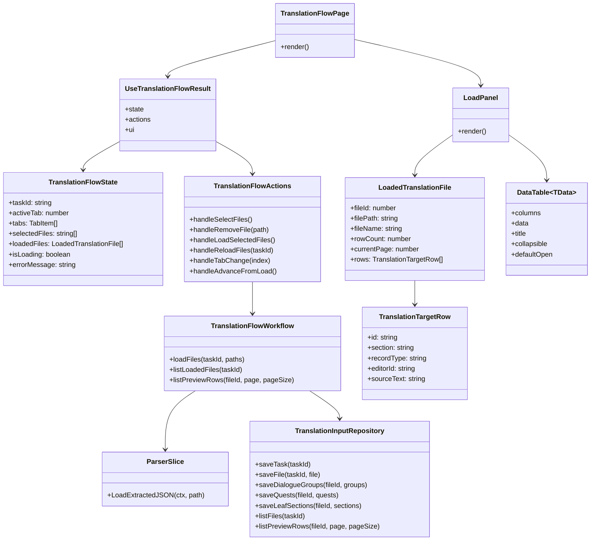
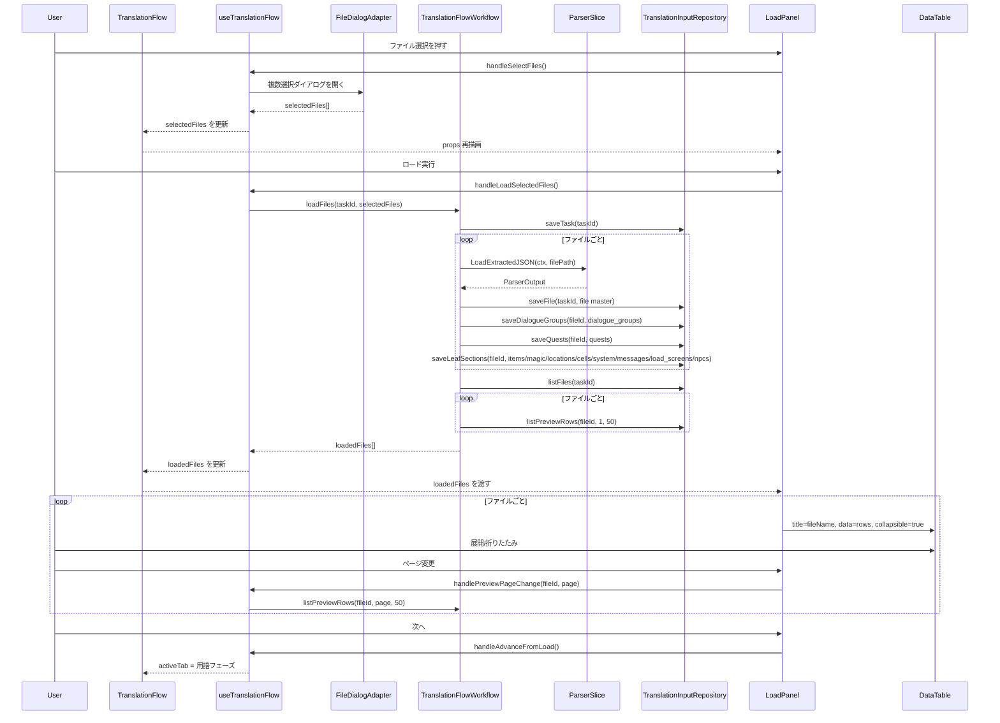

## Context

現在の `frontend/src/pages/TranslationFlow.tsx` は 5 フェーズ固定のタブ UI で、ページ内部の `useState` だけでアクティブタブを管理している。抽出データを読み込む導線が存在しないため、要件定義にある「複数ファイル対応」と「ロードした翻訳対象の確認」が翻訳フローの開始地点に反映されていない。

また、`frontend/src/components/DataTable.tsx` は汎用テーブルとして `title` と `collapsible` を持っており、ファイル単位でテーブルを並べる土台はある。一方で `TranslationFlow` 配下には headless hook がなく、ページとパネルの責務分離が `frontend_architecture.md` の方針に対して弱い。

さらに、`architecture` と `openspec/specs/artifact/shared-handoff/spec.md` は、後続 slice が利用する共有データを artifact 境界へ保存することを求めている。ここで parser のレスポンス JSON を `artifact_records.payload_json` に丸ごと保存すると、検索性、更新容易性、ファイル単位表示、後続フェーズでの再利用が弱い。今回は parser DTO に沿って構造化されたテーブルを `artifact.db` に持ち、`task_id` を論理的な親キーとして扱う方が自然である。

parser `pkg/format/parser/skyrim/dto.go` の `ParserOutput` は `dialogue_groups`, `quests`, `items`, `magic`, `locations`, `cells`, `system`, `messages`, `load_screens`, `npcs` をトップレベルに持ち、さらに `DialogueGroup -> DialogueResponse`、`Quest -> QuestStage / QuestObjective` の入れ子を持つ。DB 構成図はこの実形に寄せる。

## Goals / Non-Goals

**Goals:**
- `TranslationFlow` の先頭に「データロード」フェーズを追加し、既存ステップと整合した遷移を提供する
- 複数ファイル選択、選択済みファイル一覧、ロード済みデータの確認を 1 つのフェーズに閉じ込める
- パース済みデータを `artifact.db` 内の構造化テーブルへ保存し、後続フェーズと再開処理から再利用できるようにする
- `task_id` を軸に、1 つの翻訳タスクに紐づく複数ファイルと parser 出力全体を復元できるようにする
- 全 section の翻訳対象行を preview 対象に含めつつ、ファイルごとに 50 行単位でページング表示できるようにする
- ページを薄く保つため、翻訳フロー専用 feature hook と型定義へ状態管理を集約する

**Non-Goals:**
- `artifact.db` とは別の新規 DB ファイル追加
- 後続フェーズ（用語、ペルソナ、要約、翻訳、エクスポート）の業務ロジック変更
- `DataTable` に列フィルタや仮想スクロールなどの新機能を追加すること
- parser の生レスポンスを汎用 JSON blob として保存し続けること
- `artifact_records` をこの用途の保存先として使うこと

## Decisions

### 1. 翻訳フロー専用 feature hook `useTranslationFlow` を新設する
- 決定: `frontend/src/hooks/features/translationFlow/useTranslationFlow.tsx` と `types.ts` を追加し、ページ側は `state / actions / ui` を受け取って描画に専念する
- 理由: `frontend_architecture.md` と `frontend_coding_standards.md` は、ページが Wails 境界や複雑な状態管理を直接持たない構成を求めている。ロードフェーズの追加に伴ってタブ配列、選択ファイル、ロード済みファイル群、次フェーズ遷移条件が増えるため、ページ内 `useState` のままでは責務がさらに肥大化する
- 代替案 A: `TranslationFlow.tsx` に状態を直接追加する
  - 却下理由: 後続で実 API 接続を始めた時点で fat page 化が進む
- 代替案 B: `LoadPanel` 内だけで状態を閉じる
  - 却下理由: アクティブタブ遷移とロード済みデータの共有がページと二重管理になりやすい

### 2. 新規 `LoadPanel` を先頭フェーズとして追加する
- 決定: `frontend/src/components/translation-flow/LoadPanel.tsx` を追加し、`TABS` の先頭に `データロード` を挿入する。`LoadPanel` は `isActive`、`onNext` とロードフェーズ専用の state/action を props で受け取る
- 理由: 既存フローは各フェーズを個別パネルに分離しており、同じパターンを踏襲する方が UI 一貫性と変更局所性を保てる。ロードフェーズだけを独立させれば、後続フェーズの表示構造を崩さずに 1 フェーズ追加できる
- 代替案 A: `TerminologyPanel` の上部にロード UI を差し込む
  - 却下理由: 「ロード完了後に用語へ進む」という工程境界が曖昧になり、ステップ UI と一致しない
- 代替案 B: 別ページにロード画面を作る
  - 却下理由: 今回の要求は `TranslationFlow` に 1 フェーズ追加することであり、画面分割はスコープ過大

### 3. 親キーは既存の翻訳プロジェクト task の `task_id` をそのまま使う
- 決定: translation flow 専用 task は新設せず、翻訳プロジェクトを表す既存 task の `tasks.id` を artifact 側でもそのまま `task_id` として使う
- 理由: translation flow 自体が翻訳プロジェクト task のフェーズであり、専用 task を切ると phase の責務が分散する。今回の用途では「専用 task を新設するか既存 task を流用するか」は実質同じ親概念の話であり、二重管理を避けるため既存 task に統一する
- 代替案 A: translation flow 専用 task を新設する
  - 却下理由: 既存翻訳プロジェクト task と 1:1 対応を持つだけになり、状態同期の負担だけ増える

### 4. DB は「task -> files -> parser section tables」の構成にする
- 決定: `artifact.db` に task 親テーブルと file 親テーブルを置き、その下に parser DTO に対応する section テーブルを配置する
- 理由: parser `ParserOutput` はセクションごとに強い意味を持っており、汎用レコード表に潰すより section 単位で持つ方が正確で読みやすい。`file` を親にすれば、UI のファイル別表示と parser 入力単位が揃う
- 代替案 A: 汎用 `translation_input_records` 1 表に全部載せる
  - 却下理由: `DialogueResponse` と `QuestStage` のような形の異なるデータを無理に 1 表へ押し込むことになる
- 代替案 B: `artifact_records.payload_json` に parser レスポンス全体を保存する
  - 却下理由: 今回避けたい blob 保存そのもの

### 5. DB 構造は parser の入れ子に合わせて `DialogueGroup -> DialogueResponse` と `Quest -> Stage / Objective` を分離する
- 決定: dialogue 系と quest 系は親子テーブルを分ける。その他の top-level section はそれぞれ専用テーブルを持つ
- 理由: parser DTO の親子関係を保つことで、後続フェーズが構造依存を必要としたときに復元コストが低い。特に `previous_id` を持つ dialogue response と、`parent_id` を持つ quest stage / objective は flat 化で意味を失いやすい
- 代替案 A: すべてを file 直下の leaf テーブルに落とす
  - 却下理由: dialogue group や quest 本体の文脈が抜ける

### 6. preview は全 section を対象にし、ファイルごとに 50 行ページングする
- 決定: `DataTable` に出す preview 行は dialogue response, quest stage, quest objective, item の name/description/text, magic の name/description, location/cell の name, system の name/description, message の text/title, load screen の text, NPC の name など、翻訳対象となる全 section から抽出する。表示はファイル単位で行い、1 テーブルあたり 50 行でページングする
- 理由: 「何が入っているかは表が出ればわかる」ことを優先するなら、section を絞るより全対象を出す方が自然である。一方で全件一括描画は重いので、ページングを固定する
- 代替案 A: dialogue 系だけを preview する
  - 却下理由: ファイル全体の中身確認という用途を満たさない
- 代替案 B: 全件を 1 ページで表示する
  - 却下理由: ファイルサイズによっては UI 負荷が高い

### 7. `translation_input_files` の集計列は合計件数だけに絞り、保存時に確定する
- 決定: `translation_input_files` には section 別件数を持たせず、preview 対象として出せる総件数だけを `preview_row_count` として保存時に確定して持つ
- 理由: ファイルの中身は実際の表を開けば分かるため、初期表示では合計件数だけで十分である。section 別集計を持つと更新コストだけ増える
- 代替案 A: section ごとの件数列を持つ
  - 却下理由: UI の必須要件ではなく、冗長な集計管理になる

### 8. `artifact_records` は使わない
- 決定: translation flow の入力データでは `artifact_records` を使わず、slice ごとに必要な構造化テーブルを `artifact.db` 内へ持つ
- 理由: 汎用 artifact テーブルで無理に共通化するより、slice ごとに同じパターンの専用テーブルを持った方が明確で保守しやすい
- 代替案 A: `artifact_records` をインデックス用途だけ残す
  - 却下理由: 今回の slice では不要な抽象が増える

### 9. フロントは保存済み artifact テーブルを参照する thin client とする
- 決定: `useTranslationFlow` は `selectedFiles` に加えて `loadedFiles` を保持し、ロード実行後は backend から返るファイル一覧と preview 行を UI 用 `LoadedTranslationFile` に変換して描画する。ロード済みデータの正は frontend state ではなく artifact ストアとする
- 理由: state をキャッシュとして扱えば、画面再訪や再開時も同じ `task_id` から復元できる。UI 側の state は表示用の派生データに限定できる
- 代替案 A: フロントだけで `loadedFiles` を組み立てて持ち続ける
  - 却下理由: リロードや後続フェーズ遷移で消失し、handoff boundary を形成できない

### 10. `DataTable` の改修は最小限に留める
- 決定: 基本は既存 props を再利用し、必要な変更がある場合も複数配置時の見栄え、個別折りたたみ、ページング操作の補助に限定する
- 理由: 既存の `collapsible`、`title`、`defaultOpen` を活かしつつ、preview 50 行ページングだけを translation flow 側の責務として扱う方が安全
- 代替案 A: `DataTable` に翻訳フロー固有の section 概念を追加する
  - 却下理由: 汎用コンポーネントが固有責務を持つことになる

## DB構成案

```mermaid
erDiagram
    translation_input_tasks ||--o{ translation_input_files : "1 task = N files"
    translation_input_files ||--o{ translation_input_dialogue_groups : "1 file = N dialogue groups"
    translation_input_dialogue_groups ||--o{ translation_input_dialogue_responses : "1 group = N responses"
    translation_input_files ||--o{ translation_input_quests : "1 file = N quests"
    translation_input_quests ||--o{ translation_input_quest_stages : "1 quest = N stages"
    translation_input_quests ||--o{ translation_input_quest_objectives : "1 quest = N objectives"
    translation_input_files ||--o{ translation_input_items : "1 file = N items"
    translation_input_files ||--o{ translation_input_magic : "1 file = N magic"
    translation_input_files ||--o{ translation_input_locations : "1 file = N locations"
    translation_input_files ||--o{ translation_input_cells : "1 file = N cells"
    translation_input_files ||--o{ translation_input_system_records : "1 file = N system records"
    translation_input_files ||--o{ translation_input_messages : "1 file = N messages"
    translation_input_files ||--o{ translation_input_load_screens : "1 file = N load screens"
    translation_input_files ||--o{ translation_input_npcs : "1 file = N npcs"

    translation_input_tasks {
        TEXT task_id PK "task.db の tasks.id と同じ値"
        TEXT status "pending / loaded / failed"
        DATETIME created_at "作成日時"
        DATETIME updated_at "更新日時"
    }

    translation_input_files {
        INTEGER id PK "ファイル行ID"
        TEXT task_id "translation_input_tasks.task_id に論理紐付け"
        TEXT source_file_path "入力ファイル絶対パス"
        TEXT source_file_name "表示用ファイル名"
        TEXT source_file_hash "重複検出用ハッシュ"
        TEXT parse_status "pending / loaded / failed"
        INTEGER preview_row_count "preview 対象合計件数 (保存時に確定)"
        DATETIME parsed_at "パース完了日時"
        DATETIME created_at "作成日時"
        DATETIME updated_at "更新日時"
    }

    translation_input_dialogue_groups {
        INTEGER id PK
        INTEGER file_id FK
        TEXT source_record_id "BaseExtractedRecord.ID"
        TEXT editor_id "BaseExtractedRecord.EditorID"
        TEXT record_type "BaseExtractedRecord.Type"
        TEXT source_json_path "BaseExtractedRecord.SourceJSON"
        TEXT player_text
        TEXT quest_id
        INTEGER is_services_branch
        TEXT services_type
        TEXT nam1
        TEXT source
    }

    translation_input_dialogue_responses {
        INTEGER id PK
        INTEGER dialogue_group_id FK
        TEXT source_record_id
        TEXT editor_id
        TEXT record_type
        TEXT source_json_path
        TEXT text
        TEXT prompt
        TEXT topic_text
        TEXT menu_display_text
        TEXT speaker_id
        TEXT voice_type
        INTEGER response_order
        TEXT previous_id
        TEXT source
        INTEGER response_index
    }

    translation_input_quests {
        INTEGER id PK
        INTEGER file_id FK
        TEXT source_record_id
        TEXT editor_id
        TEXT record_type
        TEXT source_json_path
        TEXT name
        TEXT source
    }

    translation_input_quest_stages {
        INTEGER id PK
        INTEGER quest_id FK
        INTEGER stage_index
        INTEGER log_index
        TEXT stage_type
        TEXT text
        TEXT parent_id
        TEXT parent_editor_id
        TEXT source
    }

    translation_input_quest_objectives {
        INTEGER id PK
        INTEGER quest_id FK
        TEXT objective_index
        TEXT objective_type
        TEXT text
        TEXT parent_id
        TEXT parent_editor_id
        TEXT source
    }

    translation_input_items {
        INTEGER id PK
        INTEGER file_id FK
        TEXT source_record_id
        TEXT editor_id
        TEXT record_type
        TEXT source_json_path
        TEXT name
        TEXT description
        TEXT text
        TEXT type_hint
        TEXT source
    }

    translation_input_magic {
        INTEGER id PK
        INTEGER file_id FK
        TEXT source_record_id
        TEXT editor_id
        TEXT record_type
        TEXT source_json_path
        TEXT name
        TEXT description
        TEXT source
    }

    translation_input_locations {
        INTEGER id PK
        INTEGER file_id FK
        TEXT source_record_id
        TEXT editor_id
        TEXT record_type
        TEXT source_json_path
        TEXT name
        TEXT parent_id
        TEXT source
    }

    translation_input_cells {
        INTEGER id PK
        INTEGER file_id FK
        TEXT source_record_id
        TEXT editor_id
        TEXT record_type
        TEXT source_json_path
        TEXT name
        TEXT parent_id
        TEXT source
    }

    translation_input_system_records {
        INTEGER id PK
        INTEGER file_id FK
        TEXT source_record_id
        TEXT editor_id
        TEXT record_type
        TEXT source_json_path
        TEXT name
        TEXT description
        TEXT source
    }

    translation_input_messages {
        INTEGER id PK
        INTEGER file_id FK
        TEXT source_record_id
        TEXT editor_id
        TEXT record_type
        TEXT source_json_path
        TEXT text
        TEXT title
        TEXT quest_id
        TEXT source
    }

    translation_input_load_screens {
        INTEGER id PK
        INTEGER file_id FK
        TEXT source_record_id
        TEXT editor_id
        TEXT record_type
        TEXT source_json_path
        TEXT text
        TEXT source
    }

    translation_input_npcs {
        INTEGER id PK
        INTEGER file_id FK
        TEXT npc_key "ParserOutput.NPCs の map key"
        TEXT source_record_id
        TEXT editor_id
        TEXT record_type
        TEXT source_json_path
        TEXT name
        TEXT race
        TEXT voice
        TEXT sex
        TEXT class_name
        TEXT source
    }
```

## クラス図

## シーケンス図

## Risks / Trade-offs

- [parser DTO に合わせてテーブル数が増える] → まずは parser のトップレベルと主要入れ子だけを正として固定し、不要な汎用化を避ける
- [top-level section ごとに保存コードが増える] → repository 内で section ごとの save 関数を分け、workflow には orchestration だけを残す
- [task.db と artifact.db の間で物理 FK を張れない] → `task_id` は論理参照として扱い、workflow が存在確認を担う
- [preview 用 UNION クエリが複雑になる] → preview 行への射影は repository に閉じ込め、UI は section 差異を意識しない
- [大量ファイルで section テーブルが大きくなる] → 一覧表示は file 単位取得と 50 行ページングを基本にする
- [ページとパネルでタブ制御を二重管理すると不整合が出る] → アクティブタブ変更は hook の action に一本化し、`LoadPanel` は `onNext` 経由でのみ遷移する
- [既存 `DataTable` の `details/summary` 実装がクリック可能要素と干渉する] → headerActions を使う場合のイベント伝播停止を維持し、必要に応じて summary 内のレイアウトだけ最小修正する

## Migration Plan

1. `proposal.md` に沿って `translation-flow-data-load` と `artifact` delta の spec を作成し、UI 要件と artifact 保存要件を固定する
2. `database_erd.md` と `artifact` spec を更新し、`artifact.db` に `task_id` 基点の parser 対応テーブル群を追加する
3. backend 側で translation flow のロード要求を受ける controller / workflow と、parser 出力を専用テーブルへ保存・検索する repository を追加する
4. `useTranslationFlow` / `types.ts` を追加して、`TranslationFlow.tsx` のタブ定義とロード state を hook へ移す
5. `LoadPanel.tsx` を追加し、複数ファイル選択 UI とファイル単位 `DataTable` 表示を実装する
6. `DataTable.tsx` は必要最小限の調整だけを行い、既存利用箇所への影響がないことを確認する
7. バックエンドとフロントの品質ゲートをそれぞれ `backend:lint:file -> 修正 -> 再実行 -> lint:backend`、`lint:file -> 修正 -> 再実行 -> typecheck -> lint:frontend -> Playwright` の順で実行する

ロールバックは translation flow のロード API 呼び出しを止め、対象 `task_id` 配下の file と section データをまとめて削除する。`artifact.db` を継続利用するため、DB ファイル自体の巻き戻しは不要だが、追加テーブルを伴う migration の取り扱いは実装時に定義する必要がある。

## Open Questions

- なし
