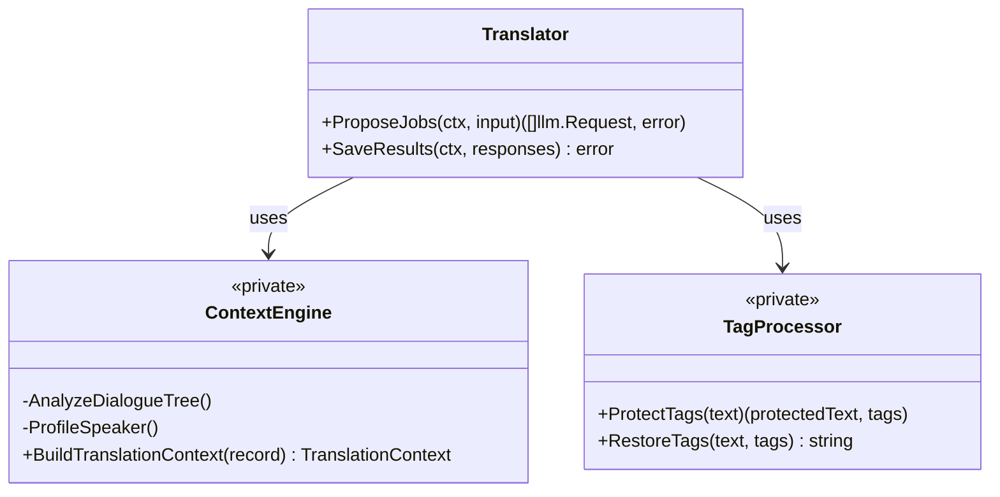
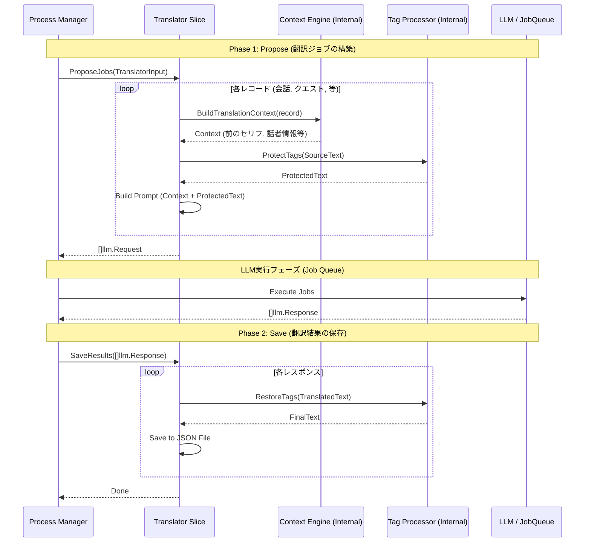

## Context

現状の Pass 2 翻訳システムは、文脈を解析・構築する `lore` スライスと、実際にLLMリクエストを生成・保存する `translator` スライスの2つに分かれています。これらは `TranslationRequest` という中間データ構造を介して `ProcessManager`（オーケストレーター）によって連携されています。
しかし、この構成は `terminology`（用語翻訳）スライスの設計思想（単一のスライスで入力からLLMリクエスト生成まで完結させる垂直スライス）と乖離しており、オーケストレーター層に不要なマッピング負荷を与えています。

## Goals / Non-Goals

**Goals:**
- `lore` と `translator` を単一のスライスに統合し、アーキテクチャを簡素化する。
- `terminology` スライスと同様の **2フェーズモデル (Propose/Save)** に基づく垂直スライス構造に移行する。
- 中間DTOである `TranslationRequest` を廃止（またはスライス内部に隠蔽）し、呼び出し側が直接ゲームデータを渡せるようにする。

**Non-Goals:**
- `lore` スライスが持つ文脈解析ロジック（会話ツリー、話者プロファイリング等）自体の仕様変更。
- LLMクライアントやジョブキューの仕組みの変更。

## Decisions

### 1. スライスの統合と名称
`translator` スライスを存続させ、その中に `lore` の機能を取り込みます。これにより、Pass 2 翻訳の責務を一箇所に集約します。パッケージ名は `translator` を維持するか、明確化のために `pass2` 等への変更を検討します。

### 2. 内部モジュール化 (Encapsulation)
旧 `lore` のロジックは、`translator` パッケージ内のプライベートなコンポーネント（例: `contextEngine`）としてカプセル化します。外部（`ProcessManager`）からは、単一の `ProposeJobs` インターフェースのみが見える状態にします。

### 3. データフローの刷新
`terminology` スライスに倣い、以下のフローに変更します。

1. **Phase 1: Propose**:
   - 入力として `TranslatorInput` (ゲームデータ群) を受け取る。
   - 内部で `contextEngine` を呼び出し、各レコードの文脈を構築する。
   - 履歴確認（Resume）を行い、未処理分に対してタグ保護とプロンプト構築を行う。
   - `[]llm.Request` を返す。
2. **Phase 2: Save**:
   - `[]llm.Response` を受け取り、タグ復元とバリデーションを行う。
   - 結果をソースプラグイン単位のJSONファイルに保存する。

## クラス図 (Class Diagram)

## シーケンス図 (Sequence Diagram)

## Risks / Trade-offs

- **[Risk] 1スライスの肥大化**: 複数の機能が1つのパッケージに集約されるため、コードが複雑になる可能性がある。
  - **[Mitigation]**: パッケージ内でのファイル分割を徹底する（`propose.go`, `save.go`, `context.go`, `tags.go` 等）。また、`ContextEngine` などの内部構造体を定義し、関心の分離（SoC）を維持する。
- **[Trade-off] テストの複雑化**: `TranslationRequest` という中間点がなくなるため、文脈構築だけを単体でテストするのが難しくなる。
  - **[Mitigation]**: `ContextEngine` をインターフェース化し、内部的にモック可能にするか、スライス全体のパラメタライズドテストを強化することで担保する。
