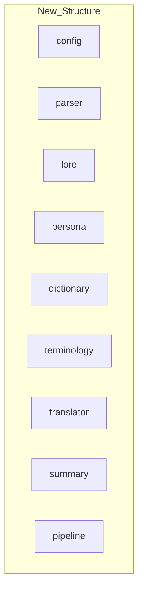

# Design: スライスのリネームと構成の再定義

本ドキュメントでは、各スライスのリネームおよびパッケージ構成の変更に関する具体的な設計方針を定義する。

## Context
現在のパッケージ構成はプロジェクト初期の命名に基づいているが、機能が明確化するにつれ、より抽象度の高い、あるいはドメインに即した名称が求められている。`dictionary-builder` は `dictionary` へ、`term-translator` は `terminology` へ、それぞれ独立したスライスとしてリネームする。

## Goals / Non-Goals

### Goals
- パッケージ名の刷新（`config`, `parser`, `lore`, `persona`, `dictionary`, `terminology`, `translator`, `summary`, `pipeline`）
- `specs/` 以下の構成を新しいパッケージ名に同期させる。
- 全ての相互参照（コード、ドキュメント）を完全に更新する。

### Non-Goals
- 既存のロジックやアルゴリズムの変更（リネームに徹する）。
- 公開インターフェース（外部API等）の破壊的変更（内部実装の整理中心）。

## Decisions

### 1. ディレクトリ構造の変更
`pkg/` および `specs/` 以下を以下の通り変更する。

- **Rationale**: 短い一単語にすることで、コード内でのパッケージ参照（`parser.Parse()`, `lore.Retreive()` 等）を簡潔にする。

### 2. 命名の正規化
- ユーザーの要望に基づき、旧 `dictionary-builder` を `dictionary`（辞書構築）、旧 `term-translator` を `terminology`（用語適用）として明確に分離・定義する。
- 認知負荷を抑えるため、これらを一つにまとめず、独立した役割を持たせる。

### 3. 仕様書 (`specs/`) の同期
- `specs/loader/` → `specs/parser/`
- `specs/context-engine/` → `specs/lore/`
- `specs/persona-gen/` → `specs/persona/`
- `specs/dictionary-builder/` → `specs/dictionary/`
- `specs/term-translator/` → `specs/terminology/`
- `specs/pass2-translator/` → `specs/translator/`
- `specs/summary-generator/` → `specs/summary/`
- `specs/process-manager/` → `specs/pipeline/`
- `specs/refactoring_strategy.md` → `specs/architecture.md` (全リファレンスを更新)

## Risks / Trade-offs

- **[Risk] 一括置換によるバグ** → [Mitigation] 実装フェーズで `go test ./...` を頻繁に回し、ビルドエラーとテスト失敗を確認する。
- **[Risk] Gitの履歴分断** → [Mitigation] `git mv` を使用して履歴を可能な限り保持する。
- **[Risk] 他の進行中のブランチとの衝突** → [Mitigation] 本変更は基盤的なため、できるだけ早期に完了させ、メインブランチにマージする。

##  Migration Plan

1. **仕様書の更新**: `specs/` フォルダのリネームとドキュメント内の用語置換。
2. **コードのリネーム**: `pkg/` 下のフォルダリネーム（`git mv`）。
3. **Importパスの修正**: 全ファイルの `import` 書き換え。
4. **DI構成の更新**: `wire.go` 等の Provider 指定を修正。
5. **ドキュメント更新**: `README.md` や `requirements.md` の修正。
