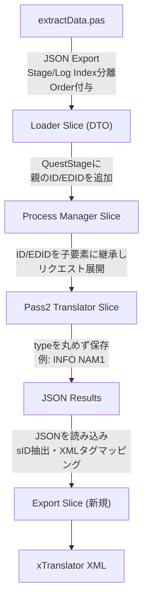

## Context

現在のアーキテクチャでは、抽出から翻訳完了までJSONフォーマットでデータが流通していますが、xTranslator互換のXML(SSTXMLRessources)を出力する機能が欠如しています。また、XML生成に必要な `ID`, `EDID`, および `type`(シグネチャ) などのメタデータが、データ伝播の各スライスで欠落または丸められる設計になっています。

## Architecture

## Goals / Non-Goals

**Goals:**
- xTranslatorが読み込み可能なXMLファイルを生成するExport Sliceの追加。
- Loader, ProcessManager, Pass2Translator の各スライス間で、XML生成に必須のメタデータが正確に伝播されるようにDTOおよび処理ロジックを修正。
- Pascal抽出スクリプトにおけるインデックス分離・順序保証によるデータ基盤の安定化。

**Non-Goals:**
- xTranslatorのXMLフォーマット自体の変更や拡張。
- 翻訳ロジック自体の変更。

## Decisions

### Decision 1: Export Sliceの独立
Pass2Translator内にXML出力処理を組み込むのではなく、独立した Export Slice として新設します。
- **Rationale**: 単一責任の原則に従い、翻訳の処理とエクスポート処理を分離することでテスト容易性を高めるため。

### Decision 2: 抽出から出力までの一貫したID保持
階層化されたデータ（例：Quest -> Stage -> Objective）において、親の FormID と EditorID を子ノードまで引き継ぐ構造（DTOの拡張、リクエストへの展開）を導入します。
- **Rationale**: xTranslator XMLはフラットな `<String>` 要素で構成されるため、どの子ノードがどのクエストに属しているかを示すには個別の要素レベルで sID や EDID を復元できる必要があるため。

### Decision 3: RecordType (シグネチャ) の非丸め化
Pass2TranslatorにおけるJSON保存時、レコードの type を丸めず `INFO NAM1` のようにフル形式で保持します。
- **Rationale**: XML出力の `<REC>` タグ生成において正確なシグネチャ情報が必要となるため。
