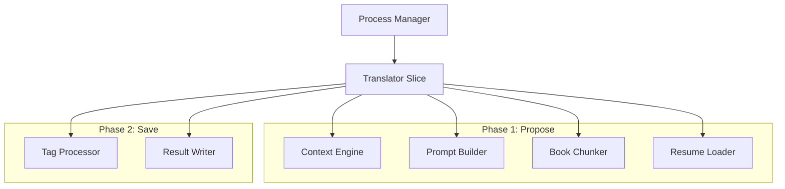

# 設計: Pass 2 Translator Slice 実装詳細

## システム構成図 (Mermaid)

## コンポーネント詳細

### 1. Context Engine (`ContextEngine` interface)
旧 Lore Slice の責務を引き継ぎ、以下の情報を収集・集約します。
- **会話コンテキスト**: `pkg/translator/context_engine.go` に実装。親レコードや兄弟レコードからの文脈抽出。
- **話者プロファイル**: レコードに関連付けられた話者の性格や話し方の情報を取得。
- **辞書検索**: `Term` (用語) 情報を取得し、プロンプトに含める。

### 2. Tag Processor (`TagProcessor` interface)
ゲーム内タグ（例: ``, `<alias=...>`）を保護します。
- `Preprocess`: 正規表現によりタグを `[TAG_N]` に置き換え。
- `Postprocess`: 翻訳後のテキストから `[TAG_N]` を元のタグに戻す。
- `Validate`: タグの数や種類が原文と一致するか検証。

### 3. Book Chunker (`BookChunker` interface)
- `BOOK DESC` などの長文を、HTML構造（改行やタグ）を壊さないように配慮しつつ、指定の最大文字数で分割します。

### 4. Result Writer & Resume Loader
- `Result Writer`: `specs/database_erd.md` で定義された `main_translations` テーブルに結果を保存します。
- `Resume Loader`: 実行前に DB を確認し、既に `status="success"` のレコードをフィルタリング。

## 外部連携
- **Export Slice**: 本スライスが DB に保存した `main_translations` を読み込み、xTranslator XML 形式に変換・出力します。

## データフロー

1.  **Phase 1 (ProposeJobs)**:
    - 入力データを `Resume Loader` でフィルタ。
    - 各レコードに対して `Context Engine` で文脈構築。
    - `Tag Processor` でタグを保護。
    - `Book Chunker` で必要に応じて分割。
    - `Prompt Builder` で最終的な LLM リクエストを生成。
2.  **Phase 2 (SaveResults)**:
    - LLM レスポンスから翻訳文を抽出。
    - `Tag Processor` でタグを復元・検証。
    - `Result Writer` で JSON ファイルに書き出し。

## 依存関係
- `pkg/infrastructure/llm`: 通信用インターフェース。
- `specs/database_erd.md`: 永続化データの整合性確保（今回は JSON ファイルだが、フィールド名は ERD に準拠）。
- `specs/refactoring_strategy.md`: `slog` の代わりに `otel` (OpenTelemetry) を用いた構造化ログ・トレースの実装。
