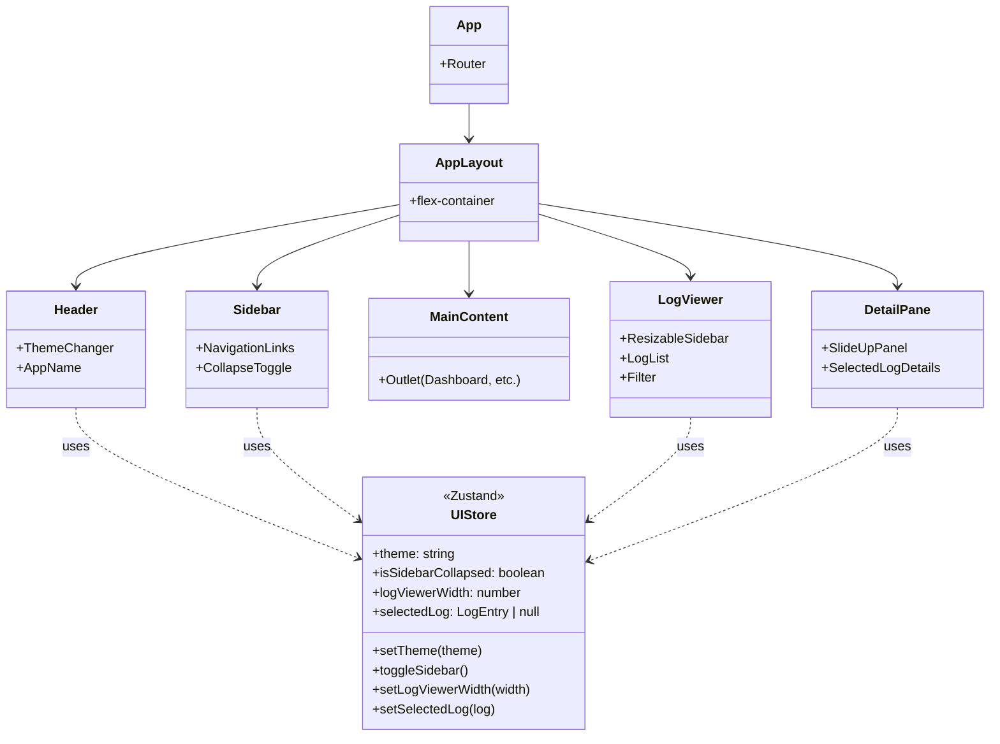
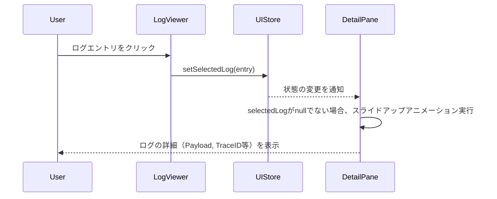

## Context

現在、`mocks-react` に静的なUI部品（レイアウト、サイドバー、ログビューア、ダッシュボード等）が実装されていますが、これらはプロトタイプであるため、UIの状態管理（テーマ、開閉状態など）が1つのコンポーネント内に混在しており、拡張性に乏しい状態です。
また、Wailsを用いた実際のデスクトップアプリケーション（`frontend` プロジェクト）への移行にあたり、ルーティングの設定や、今後のGoバックエンドからの非同期イベント処理（ログのストリーミング等）を見据えたアーキテクチャへのリファクタリングが不可欠です。

## Goals / Non-Goals

**Goals:**
*   `mocks-react`のUIアセットをそのまま活用しつつ、保守性の高いComponent分割を行う（例：`Layout.tsx` から Header への分離など）。
*   UIステート（現在選択中のログ、サイドバーの開閉状態、現在のテーマ設定など）を適切に分離し、アプリケーション全体でスケールする状態管理の基盤（Zustandなど）を策定する。
*   Wails環境における安定した画面遷移を実現するためのルーティング構造の明確化。

**Non-Goals:**
*   本フェーズでは、Goバックエンドとの実際の連携（WailsのEvents Subscribeによる本物のログ取得等）は行いません。あくまでフロントエンド側の受入基盤の構築までとします。

## Decisions

1.  **コンポーネントの分割と責務の明確化**
    *   **Decision**: 巨大な `Layout.tsx` を `Header.tsx`, `Sidebar.tsx`, `LogViewer.tsx`, `DetailPane.tsx` に明確に分割し、`Layout.tsx` 自体はこれらのコンテナ（Grid/Flexレイアウトの枠組み）としてのみ機能するようにする。
    *   **Rationale**: 各UIの役割が異なるため。特にヘッダーはアプリ全体の操作、サイドバーはナビゲーション、ログはシステム状態と別れており、将来個別の再描画最適化が求められるためです。

2.  **グローバルステート管理として Zustand の採用**
    *   **Decision**: テーマ（`theme`）、UIのレイアウト状態（ログビューアの幅、サイドバーの開閉）、現在選択されているログエントリ（`selectedLog`）など、**クロスコンポーネントで共有すべき状態のみ**を管理するために Zustand を用いる。
    *   **Rationale**: React Context では値の更新時に不要な再描画が発生しやすいですが、Zustandであれば必要なコンポーネントだけが状態をSubscribeできるため、高頻度で更新される可能性のあるログ関連のパフォーマンス要件に合致するためです。**注意点として、各コンポーネント内で完結するローカルな状態（例えば開閉トグルのアニメーション中のフラグ等）はZustandに入れないよう徹底し、グローバルストアの肥大化を防ぎます**。
    *   **DetailPane のグローバル化**: ログ詳細だけでなく、任意のコンポーネントから詳細表示ペインを開けるよう、Zustand のストアには「表示するコンポーネントの `type` (例: `'log'`, `'job'`)」と「渡すデータ `payload`」を純粋なデータオブジェクトとして保持します（『シングルトン・ポータルパターン』）。JSX等のReact要素自体はストアに格納しません。

3.  **ルーティング方式 (HashRouter の利用)**
    *   **Decision**: Wails内で動作するReactのルーティング管理には、`react-router-dom` の `HashRouter`（またはこれに準ずるSPA向けルーティング設定）を採用する。
    *   **Rationale**: Wailsのカスタムプロトコル (`wails://`) 下でのページリロード時に、URLパス解決のトラブルを避けるため、ハッシュベースのルーティングが最も安全かつ設定が容易なためです。

## Risks / Trade-offs

*   **[Risk] LogViewerのリサイズイベントがWebViewの境界と干渉する**
    *   **Mitigation**: リサイズ機能(`isResizing`)のの実装において、`mousemove` と `mouseup` イベントは `document` にアタッチしており、モックでの実績はありますが、WailsのWebViewコンテナの境界(Windowsのウィンドウ境界)で正しくイベントが発火し続けるかテストし、必要に応じてフォールバック処理を追記します。
*   **[Risk] Zustandなどの外部ライブラリ導入によるペイロード増**
    *   **Mitigation**: Zustandは非常に軽量（~1KB）であり、パフォーマンスの向上（Context地獄の回避）のメリットが大きくこれを上回ります。

## Architecture Details

### コンポーネント構成 (Mermaid)

### ログ詳細表示のシーケンス

