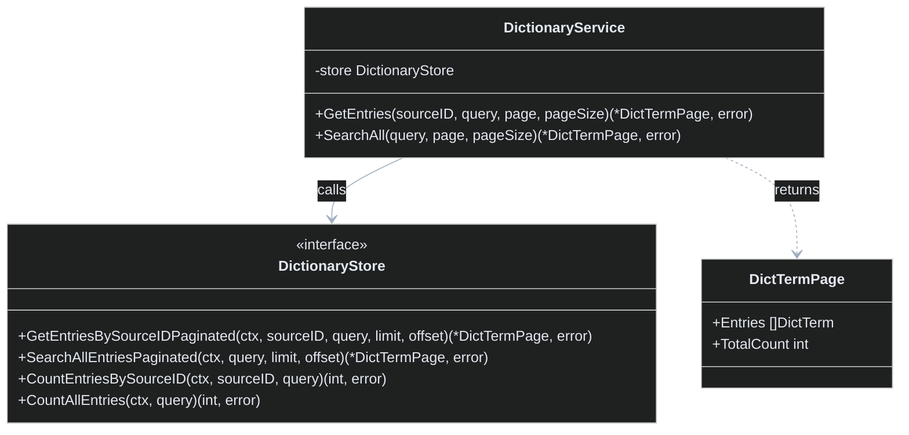
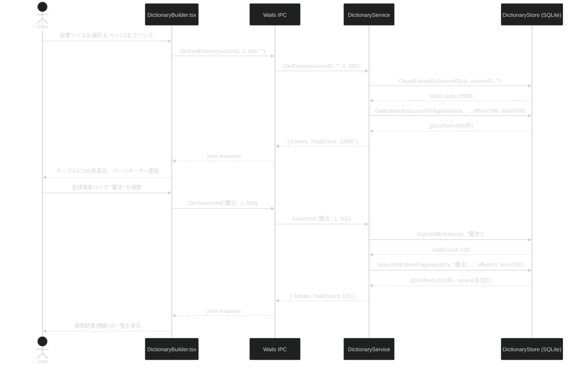

## Context

現在、辞書エントリ一覧画面（`DictionaryBuilder.tsx`）では、特定の辞書ソースに含まれる全てのエントリを一括で取得し、フロントエンドの状態（React State）に保持して描画を行っている。そのため、XMLから10,000件規模のデータをインポートした際に、全てのデータが一度にDOMとしてレンダリングされる（またはメモリ上に保持される）ため、著しいパフォーマンス低下やブラウザのフリーズを引き起こすリスクがある。
加えて、初期状態からインポート用UIが縦長のスペースを占有しており、UX上の課題となっている。また、複数の辞書を横断して検索する機能が存在せず、特定の用語がどの辞書ソースに登録されているかを探すのが困難である。

## Goals / Non-Goals

**Goals:**
- フロントエンドでの辞書エントリ一覧表示をページネーション化（またはサーバーサイドでのバックエンド実装によるLIMIT/OFFSET取得）し、大量データ時でも高速に表示・操作可能にする。
- フロントエンドのメモリ内検索から、バックエンドのSQLクエリ（`LIKE`等）による全件対象の検索機能へ移行する。
- 複数辞書ソースを対象とした全辞書横断検索（Cross-Source Search）を実装する。
- 辞書インポート用UIを、初期状態ではコンパクトに表示し、必要な時（ドラッグ＆ドロップ後など）のみ展開されるようCSS/Tailwindの設定を最適化する。

**Non-Goals:**
- Elasticsearchなどの外部の全文検索エンジンの導入（SQLiteのLIKEで十分とする）。
- インポート処理自体の内部パーサーアルゴリズムの抜本的な改修（UI側の表示と取得ロジックの改善に留める）。
- バーチャルスクロール機能自体の複雑なフロントエンド実装（今回は堅牢なページネーションUIの採用を主軸とし要件を満たす）。

## Decisions

### 1. サーバーサイドページネーションの採用
- **Rationale**: 10,000件のデータを全てフロントエンドに送り、フロントエンド側でページングを行うと通信量やメモリ消費の観点で非効率である。そのため、Goのバックエンド側からDBに対して `LIMIT` / `OFFSET` を用いたクエリを発行するサーバーサイドページネーションを採用する。
- **Alternatives Considered**: クライアントサイドでのVirtual DOM（react-window等）を用いたレンダリングの最適化。しかし、根本的なJSONパース処理や通信量が減らないため、バックエンド側でのページネーションが最適と判断。

### 2. 横断検索 API の新設
- **Rationale**: 単一の `source_id` に縛られない横断的なキーワード検索が必要なため、全ての辞書エントリ（`dlc_entries` 相当）を対象にした `LIKE` 検索を行う専用のクエリおよびAPIを追加する。各エントリには所属する辞書ソースの名前（またはID）を付与して返し、フロントエンドで判別できるようにする。
- **Alternatives Considered**: 既存の一覧取得APIに `source_id = NULL` なら全件というオプションをつける案。しかし、戻り値に「辞書ソース名」を含めるための `JOIN` の必要性や、クエリの複雑化を避けるため、専用のAPI (`SearchAllEntriesPaginated`) を用意するほうがクリーン。

### 3. TailwindCSS によるインポートUIのアコーディオン化・動的リサイズ
- **Rationale**: 辞書のドラッグ＆ドロップエリアはファイルが選択されていない時は高さを抑え（例: `h-32`）、ファイルが選択されたりインポートの進捗が表示される際のみ可変長（`min-h-fit` + Max Height制限とスクロール）となるように状態ベースのクラス切り替えを導入する。

### 4. Wails バインディング構造の変更
`DictTermPage` のようなレスポンス用構造体を新設し、エントリの配列と `TotalCount` （全体件数）を合わせて返すようにする。

```go
type DictTermPage struct {
    Entries    []DictTerm `json:"entries"`
    TotalCount int        `json:"totalCount"`
}
```

## Risks / Trade-offs

- **[Risk] 部分一致検索（LIKE '%query%'）のパフォーマンス低下**
  - **Mitigation**: 辞書の総レコード数は多くても数十万件レベルと想定され、ローカルのSQLite環境であれば数ミリ秒〜数十ミリ秒で返るため、当面はフルスキャンでも問題にならない。もし将来的に速度が問題になった場合は、SQLiteの `FTS5` (Full-Text Search) 拡張モジュールの導入を検討する。
- **[Risk] ソース間でのID重複や一意性の担保**
  - **Mitigation**: 横断検索の戻り値はあくまで閲覧用とし、直接の編集・削除時はそのエントリが持つ独自の主キー (`id`) または `source_id` との複合による一意の更新APIを通すことで安全性を確保する。

---

## アーキテクチャ図解

### クラス図 (Class Diagram)



### シーケンス図 (Sequence Diagram)


