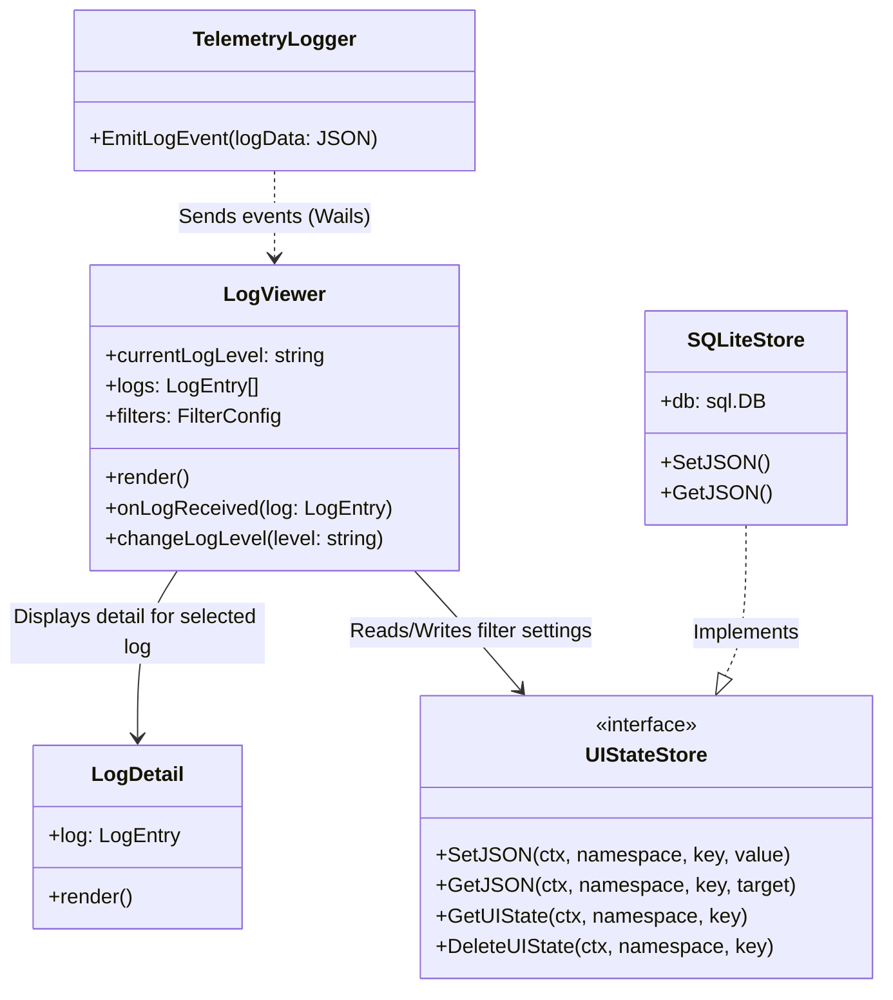
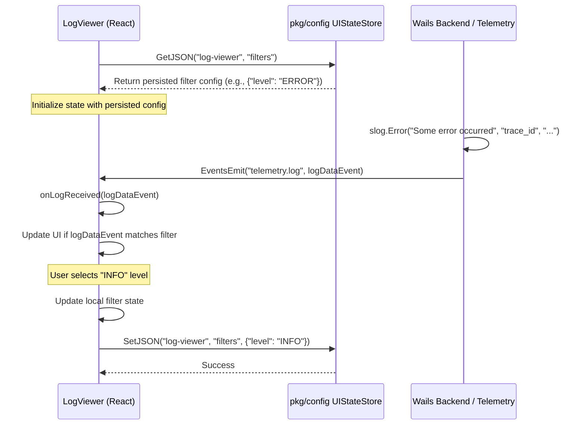

## Context

現在、バックエンド（Go）に実装されている構造化ロガー（Telemetry）とフロントエンド（React/Wails）のログビューワーが正しく連携しておらず、開発者およびシステム管理者がアプリケーションの詳細な稼働状況やエラーの原因を即座にUIから確認できない状態です。
また、フロントエンドにおけるログ設定（ログレベルのフィルター状態など）が永続化されていないため、アプリケーションを再起動するたびに設定がリセットされるというユーザビリティ上の課題があります。さらに、ログ内でリクエスト単位の追跡を行うためのID名称がシステム全体で統一されておらず（`request_id`と`trace_id`の混在）、調査の妨げとなっています。

## Goals / Non-Goals

**Goals:**
- フロントエンドとバックエンドのログシステムを非同期ストリーミングで統合する。
- ログビューワーの詳細ペインで、テレメトリの構造化データ（`ActionType`, `ResourceType`, `trace_id` 等）を表示できるようにする。
- UIのログフィルター状態（ログレベル）を `pkg/config` の `UIStateStore` を用いて永続化し、アプリ再起動後も状態を保持する。
- バックエンドのテレメトリで利用しているリクエスト識別子を `trace_id` に統一する。

**Non-Goals:**
- 外部のログ監視・分析SaaS（Datadog, New Relic等）へのログ転送機能の実装。
- ログのクラウドストレージへのバックアップや長期間のアーカイブ仕組みの構築。
- 高度なクエリ機能（SQLライクな検索、複数条件の複雑なフィルタリング）の提供。

## Decisions

### 1. ログの非同期ストリーミング手法
**決定**: Wailsのエベントシステム（`wails/runtime.EventsEmit`）を利用した非同期ログストリーミングを採用する。
**理由**: WailsアプリにおけるGo層からJS層へのリアルタイムデータ送信の標準的かつ低オーバーヘッドな手法であるため。ポーリングや手動の同期API呼び出しと比較して、UIスレッドをブロックせずリアルタイム性を確保できる。
**代替案**: 定期的にフロントエンドからバックエンドへログをフェッチ（ポーリング）する手法。
**代替案却下の理由**: ポーリング間隔による遅延が発生し、リアルタイム性が損なわれるため。また、不要なポーリングによるリソース消費がある。

### 2. ログフィルター状態の永続化
**決定**: 既に実装されている `pkg/config` の `UIStateStore` インターフェース（`SQLiteStore` による実装）を利用して、ログレベルの選択状態を永続化する。
**理由**: ユーザーのUI設定をフロントエンドのコンポーネント内や LocalStorage だけでなく、アプリケーション全体の永続化ストアに一元化するため。これにより、他の環境や将来的な機能拡張時にも一貫した状態管理が可能となる。
**ユーザー指示による確定**: `@[pkg/config]選択状態の永続化はこれを利用するように` との具体的な指示に従う。

### 3. トレース識別子の名称統一
**決定**: バックエンドのテレメトリで使用している `request_id` を、UIやシステム全体の仕様に合わせ `trace_id` に変更する。
**理由**: コンテキストをまたがったエラー調査において、識別子の揺れは検索性やトレーサビリティを著しく低下させるため。この変更により、システム全体で語彙が統一される。

### 4. フロントエンドでの全メタデータ受信のための型再定義
**決定**: ログ詳細ペイン（`LogDetail.tsx`）等で利用される型（`LogEntry`）を拡張し、バックエンドが送信する任意のカスタム属性（`action`, `resource_type` 等の定数的なコンテキストだけでなく、`slog.Attr` 由来の動的な変数）をすべて受け止める `attributes: Record<string, any>` のような柔軟な枠を導入する。
**理由**: フロントエンド側で事前に定義した限られたプロパティ（`message`, `traceId`など）だけでは、バックエンドが新しく追加したテレメトリコンテキスト情報や、不定形なエラーメタデータをUIに表示できず、調査の阻害となるため。動的に属性を受け取れるようにすることで運用保守の対応性を高める。

## Risks / Trade-offs

- **[Risk] パフォーマンスへの影響**: ログの出力頻度が極端に高くなった場合、Wailsのエベントシステムを通してUIに大量のデータが送信され、Reactのレンダリングパフォーマンスが低下する恐れがある。
  - **Mitigation**: ログビューワー側（フロントエンド）にバッファリングや間引き（throttling/debouncing）の仕組みを検討し、一度にレンダリングする上限数を制限するなどの対策を検討可能にしておく。
- **[Risk] 依存性の結合**: イベント名（例: `onTelemetryLog`）やログデータの型定義（JSON）がフロントエンドとバックエンド間で暗黙の合意となり、変更時に片方の更新を忘れると壊れる。
  - **Mitigation**: GoとTypeScriptで共通の型定義・スキーマを意識したデータ構造（例: `{ level: string, message: string, trace_id: string, action: string, ...}`）をドキュメント化し、テストで接続性を担保する。

## Class Diagram

## Sequence Diagram (Log Streaming & State Persistence)

