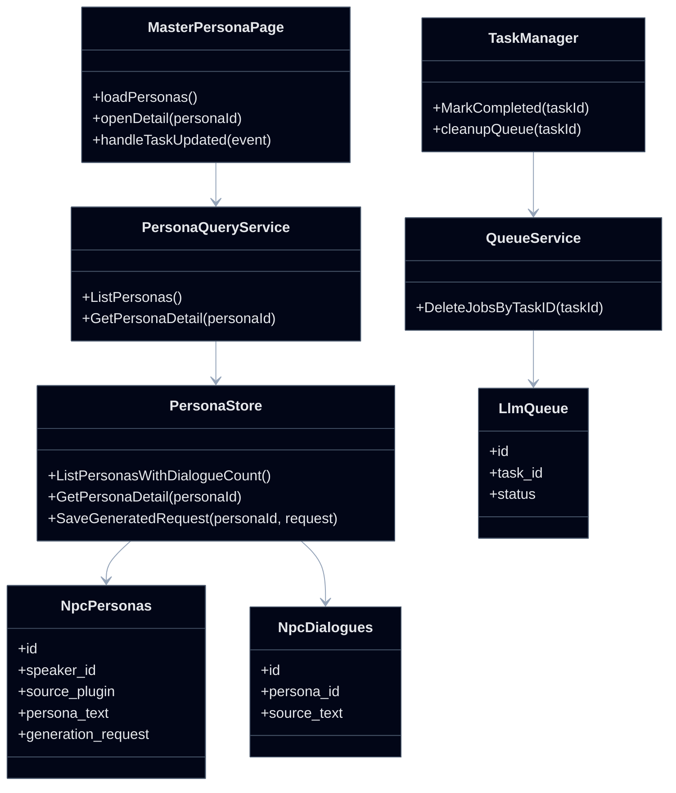
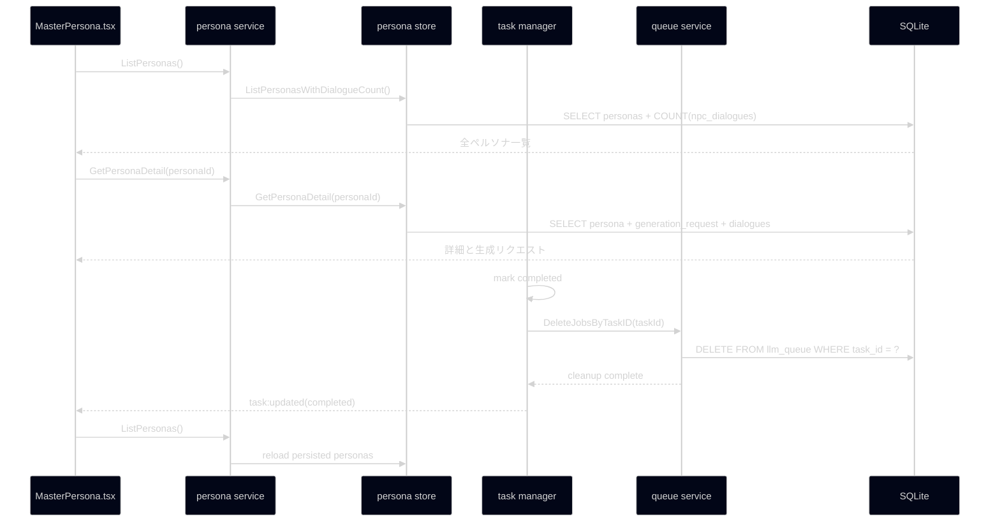

## Context

- `MasterPersona` 画面では、一覧表示・詳細表示・タスク完了後の状態更新が別々のデータ源に依存しており、実データと UI 表示がずれている。
- 現状の一覧は `npc_personas.dialogue_count` をそのまま使っているが、実際にユーザーが確認したい件数は `npc_dialogues` に保存された会話件数である。
- 詳細画面の `RAW response` は、ユーザーにとって確認価値の高い「実際に送った生成リクエスト」ではなく、保存済みレスポンスに寄っている。
- タスク完了後も `llm_queue` に job が残るため、完了済みタスクと未処理ジョブの区別が曖昧になる。
- `specs/architecture.md` の Interface-First / Vertical Slice 方針に従い、`persona` と `queue` の責務をそれぞれのスライス内で完結させ、UI は契約済み DTO にのみ依存させる。

## Goals / Non-Goals

**Goals:**
- ペルソナ一覧のセリフ数を `npc_dialogues` 件数ベースで安定算出する。
- ペルソナ詳細で「生成リクエスト」を確認できるようにし、表示名称と実体を一致させる。
- `MasterPersona` 画面の再表示時に保存済み全ペルソナを毎回再取得し、画面遷移後に一覧が消えないようにする。
- MasterPersona タスク完了時に関連 `llm_queue` job を確実に削除する。
- DB 変更が必要な場合に、ERD 反映ポイントを明確にする。

**Non-Goals:**
- LLM 実行アルゴリズムやリトライ戦略そのものの刷新。
- MasterPersona 以外のタスク種別に対する一括クリーンアップ仕様追加。
- 新規ライブラリ導入や別ストレージへの移行。

## Decisions

### 1. 一覧のセリフ数は `npc_dialogues` 集計値を正とする
- 決定: ペルソナ一覧 DTO の `dialogueCount` は `npc_personas.dialogue_count` を返さず、`npc_dialogues` の件数を `persona_id` または `(source_plugin, speaker_id)` 単位で集計して返す。
- 理由: 一覧表示に必要なのは「現在保存されている会話行数」であり、生成時スナップショットの `dialogue_count` ではないため。
- 代替案:
  - `dialogue_count` を毎回更新して使い続ける。
  - 却下理由: 保存経路が増えるたびに整合性維持が必要になり、表示バグの温床になる。

### 2. 詳細表示用に「生成リクエスト」を persona 側で保持する
- 決定: 既存の `RAW response` 表示領域は廃止し、実際に LLM へ送信するリクエスト本文を、初回の `llm_queue` job 登録前に `生成リクエスト` として保存し、詳細取得で返却する。
- 理由: ユーザーが検証したいのは応答そのものより、どういう条件で生成したかという入力内容だから。
- 代替案:
  - UI 側で過去 task metadata や queue payload から動的に復元する。
  - 却下理由: task/queue の寿命に依存し、一覧再表示時の安定性が落ちる。

### 3. `MasterPersona` はマウント時と関連イベント後に全件再取得する
- 決定: `MasterPersona.tsx` はローカル state の残存に依存せず、初回表示、画面復帰、`task:updated` / `task:phase_completed` の関連イベント受信後に一覧 API を再実行する。
- 理由: 一覧消失の根本原因は画面 state を正として扱っている点にあり、永続化済みデータを毎回再取得する方が単純で壊れにくい。
- 代替案:
  - Zustand 等で一覧を永続保持してページ間共有する。
  - 却下理由: キャッシュ無効化点が増え、保存後反映漏れの温床になる。

### 4. Queue の完了クリーンアップは task 完了確定後に一括削除する
- 決定: MasterPersona タスクが `Completed` へ遷移した直後に、同一 `task_id` に紐づく `llm_queue` job を queue スライス側で全削除する。
- 理由: job ライフサイクル管理は queue の責務であり、UI や task から個別 delete を呼ぶよりも整合性を保ちやすい。
- 代替案:
  - Queue worker が request 完了ごとに逐次削除する。
  - 却下理由: 完了判定前に障害が起きた場合、再開材料を失う可能性がある。

### 5. `dialogue_count` は列ごと削除する
- 決定: 一覧 API と UI カラムでは `dialogue_count` を使わず、`npc_personas.dialogue_count` 列自体を削除する。
- 理由: 表示用意味と保存用意味が違う値を同じ名前で流通させると再発しやすい。
- 代替案:
  - 列を残して内部用途に限定する。
  - 却下理由: 将来再び参照される余地が残り、誤用の防止にならない。

### クラス図

### シーケンス図

## Risks / Trade-offs

- [生成リクエストの保存サイズ増加] → 長文 request が増えるため、必要に応じて detail 取得専用列として分離し、一覧では返さない。
- [一覧再取得の回数増加] → 画面マウントと完了イベント時に限定し、ポーリングは導入しない。
- [完了直後削除で調査材料が減る] → request 本文は初回 enqueue 前に persona 側へ保存し、完了後の検証は detail 画面で行えるようにする。
- [`dialogue_count` 削除による既存クエリ影響] → 参照箇所を事前に洗い出し、一覧取得と保存処理を同じ変更セットで置き換える。

## Migration Plan

1. persona 保存スキーマを更新し、初回の `llm_queue` job 登録前に `generation_request` を保存できる列を追加する。
2. `npc_personas.dialogue_count` 列を削除し、関連クエリと保存処理から参照を除去する。
3. persona 一覧取得クエリを `npc_dialogues` 集計ベースへ差し替える。
4. persona 詳細取得 DTO を更新し、`RAW response` ではなく `生成リクエスト` を返す。
5. `MasterPersona.tsx` の初期読込・画面復帰・完了イベント処理で一覧再取得を共通化する。
6. task 完了処理から queue スライスの `task_id` 単位クリーンアップを呼ぶ。
7. `openspec/specs/database_erd.md` が DB 変更を含む場合は persona / queue セクションを更新する。
8. ロールバック時は `generation_request` 列追加と `dialogue_count` 削除を含む schema 差分を戻し、一覧・完了処理は旧クエリと旧完了ハンドラへ戻せるよう変更点を分離する。

## Open Questions

- `generation_request` を `npc_personas` に直接保持するか、将来の複数生成履歴を見据えて別テーブル化するかは、実装時に既存スキーマ確認後に最終判断する。ただし本変更では単一 request の確認要件を満たせれば十分とする。
