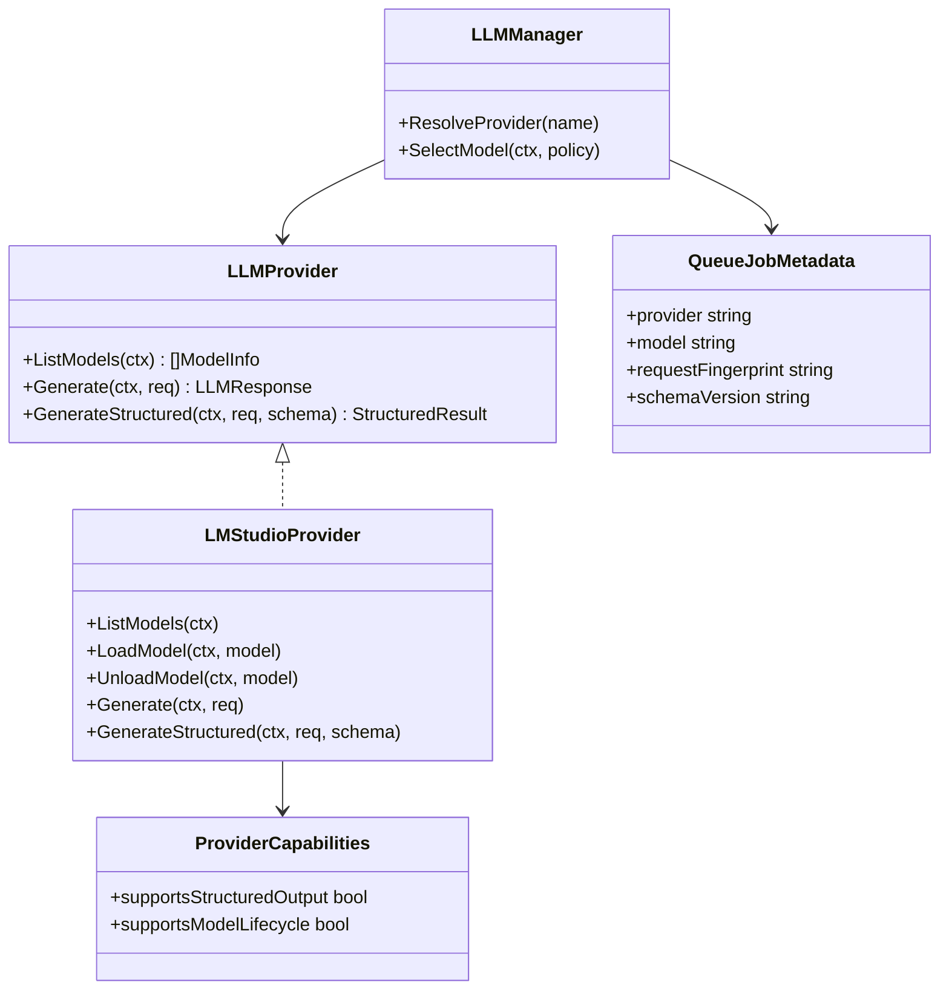
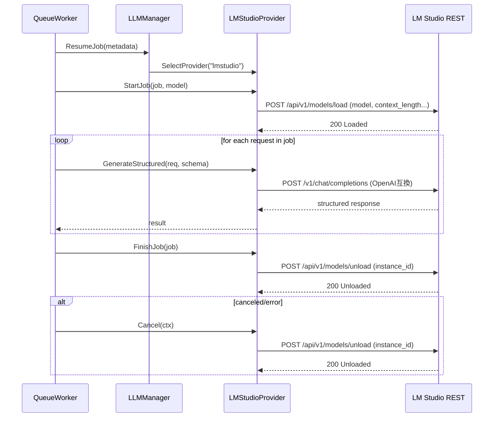

## Context

現行の `pkg/llm` はプロバイダごとの推論呼び出しを中心に構成され、モデル発見（list models）や実行前後のモデルライフサイクル（load/unload）を共通契約として扱っていない。加えて `specs/queue` 側には LLM モデル状態を考慮した再開要件がなく、中断復帰時に「どのモデルでどこまで処理したか」を安全に復元できない。

本変更では以下を同時に満たす必要がある。
- プロバイダ命名を `Local` から `LM Studio` へ統一する。
- `pkg/llm` 全体で「Structured Output は全プロバイダ契約」を明文化する。
- ただし今回の実装スコープは LM Studio のみとし、他プロバイダは契約適合の未実装状態を許容する。
- `specs/queue` と整合した中断・再開時の復元手順を定義する。

## Goals / Non-Goals

**Goals:**
- `pkg/llm` の Provider 契約に `ListModels` と `Structured Output` 対応可否を定義する。
- LM Studio プロバイダで `GET /api/v1/models`、`POST /api/v1/models/load`、`POST /api/v1/models/unload` を利用した実行ライフサイクルを実装可能な設計にする。
- ジョブ中断・再開時に、モデル選択情報とロード状態を再構成できる queue 連携設計を定義する。
- 既存 `local` 設定の移行パス（`lmstudio` へのマッピング）を定義する。

**Non-Goals:**
- LM Studio 以外の各プロバイダで Structured Output を今回実装すること。
- queue バックエンドの全面刷新（永続キュー基盤の差し替え）。
- UI の大幅改修。

## Decisions

### 1) `pkg/llm` の共通契約を拡張する
- Decision:
  - `LLMProvider` 契約に `ListModels(ctx) ([]ModelInfo, error)` を追加する。
  - `Structured Output` は契約上必須機能として定義し、未実装プロバイダは `ErrStructuredOutputNotSupported` を返す。
- Rationale:
  - モデル更新追従をユーザー手動設定に依存させないため。
  - 将来的に全プロバイダ実装へ段階拡張するための先行契約が必要なため。
- Alternatives considered:
  - プロバイダ別にモデル列挙 API を分離: 呼び出し側の分岐が増えるため不採用。
  - Structured Output をオプション契約にする: 呼び出し側のフォールバック分岐が複雑化するため不採用。

### 2) LM Studio の実行ライフサイクルを `withModelLoaded` パターンで統一する
- Decision:
  - Queue ジョブ開始時に `POST /api/v1/models/load` へ `model`（必要に応じて `context_length` 等）を渡してロードし、ジョブ完了時/中断時は `POST /api/v1/models/unload` に `instance_id` を渡してアンロードする。
  - `defer` と `context cancellation` を併用し、正常完了・異常終了・キャンセルで同一の解放経路を通す。
  - モデルロード失敗時は再試行せず即時失敗として扱う。
- Rationale:
  - メモリ占有を抑制し、再開時に同一モデルへ確実復帰するため。
- Alternatives considered:
  - 常時ロード運用: 複数モデル運用時にリソース逼迫を起こしやすく不採用。
  - unload を明示操作のみとする: 中断時リークが発生しうるため不採用。
  - load 再試行を行う: 復旧遅延とキュー滞留を招くため不採用。

### 3) Structured Output はデファクト標準ライブラリで統一する
- Decision:
  - OpenAI 互換呼び出しは既存の `github.com/sashabaranov/go-openai` を継続利用。
  - JSON Schema 生成は `github.com/invopop/jsonschema` を採用候補（必要時のみ）とする。
  - `v1/chat/completions` 呼び出しでは `response_format.type=json_schema` と `response_format.json_schema` を使用し、`strict` は boolean (`true`) で送信する。
- Rationale:
  - 既存実装資産を維持しつつ、契約ベースで安全な構造化出力を実現できるため。
- Alternatives considered:
  - 独自 JSON Schema 生成: 保守コスト増のため不採用。

### 4) queue 連携で再開可能な状態最小集合を保持する
- Decision:
  - ジョブメタデータに `provider`, `model`, `request_fingerprint`, `structured_output_schema_version` を保持する。
  - Resume 時は `provider/model` 復元 -> `load` -> 再実行 の順序を契約化する。
- Rationale:
  - 再開性と冪等性を確保し、重複実行や別モデル実行を防ぐため。
- Alternatives considered:
  - 実行途中トークン位置まで保存: LM Studio 側の一般API契約外であり現時点では不採用。

## クラス図

## シーケンス図

## テスト設計

# LLM Studio Provider テスト設計 (LM Studio Provider Test Spec)

本設計は `architecture.md` セクション 6（テスト戦略）および セクション 7（構造化ログ基盤）に厳密に準拠し、個別関数の細粒度なユニットテストを作成せず、Vertical Slice の Contract に対する網羅的なパラメタライズドテスト（Table-Driven Test）を定義する。

## 1. テスト方針

1. **細粒度ユニットテストの排除**: 内部処理や個別関数単位の振る舞いテストは作成しない。
2. **網羅的パラメタライズドテスト**: すべてのテストを Table-Driven Test として実装し、LM Studio 呼び出しは HTTP モックサーバを用いて Contract 全体の振る舞いを検証する。
3. **構造化ログの強制検証**: テスト実行時においても、必ず `context.Context` （独自の TraceID を内包）を引き回す。

---

## 2. パラメタライズドテストケース (Table-Driven Tests)

各Contractに対する入力（初期状態 + アクション）と期待されるアウトプット（戻り値 + 変更後の状態）を表として定義し、ループ内で検証する。

### 2.1 LMStudioProvider Contract 統合テスト
モデル列挙・ロード/アンロード・構造化出力・キャンセル時解放を一連で検証する。

| ケースID | 目的 | 初期状態 (入力/DB) | アクション (関数呼出) | 期待される結果 (出力 / 状態) |
| :-- | :-- | :-- | :-- | :-- |
| LSP-01 | モデル一覧取得の正常系 | `GET /api/v1/models` が 200 とモデル配列を返す | `ListModels(ctx)` | `models[]` を `ModelInfo` に正規化して返す。空配列でもエラーにしない。 |
| LSP-02 | load 失敗時の異常系 | `POST /api/v1/models/load` が 500 | `GenerateStructured(ctx, req, schema)` | 呼び出しは失敗し、推論APIは呼ばれない。 |
| LSP-03 | ジョブ完了時の unload 保証 | load/completions/unload が 200 | `RunJob(ctx, job)` | ジョブ内の全リクエスト処理後に unload が1回だけ呼ばれる。 |
| LSP-04 | キャンセル時の unload 保証 | ジョブ実行中に `ctx` cancel | `RunJob(ctx, job)` | キャンセルエラーを返し、unload が1回呼ばれる。 |
| LSP-05 | load 失敗時の再試行なし | `POST /api/v1/models/load` が 500 | `RunJob(ctx, job)` | 即時失敗し、load の再試行は行わない。 |
| LSP-06 | 未実装プロバイダ契約 | provider=other, structured未実装 | `GenerateStructured(ctx, req, schema)` | `ErrStructuredOutputNotSupported` を返す。 |
| LSP-07 | structured output リクエスト整形 | JSON Schema を伴う入力 | `GenerateStructured(ctx, req, schema)` | `response_format.type=json_schema` と `json_schema.strict=true` で送信される。 |
| LSP-08 | queue resume 復元 | metadata に provider/model を保持 | `ResumeAndRun(ctx, job)` | 保存済み model を再ロードして同一条件で再実行。 |

---

## 3. 構造化ログとデバッグフロー (Log-based Debugging)

本スライスで不具合が発生した場合やテストが失敗した場合は、ステップ実行やユニットテストの追加による原因追及を行わず、実行生成物である構造化ログを用いたAIデバッグを徹底する。

### 3.1 テスト基盤でのログ準備
テストコードから Contract メソッドを呼び出す際は、サブテスト（Table-Drivenの各ケース）ごとに一意の TraceID を持つ `context.Context` を生成して引き回す。
各テスト実行時の `slog` の出力先はファイル（例: `logs/test_{timestamp}_lmstudio_provider.jsonl`）に記録するようルーティングする。

## Risks / Trade-offs

- [LM Studio API バージョン差異] → `/api/v1/models/*` と OpenAI互換エンドポイントをアダプタ層で分離し、機能フラグで吸収する。
- [全プロバイダ契約と実装進捗のギャップ] → `ErrStructuredOutputNotSupported` を標準化し、呼び出し側で明示分岐可能にする。
- [resume 時の再実行重複] → `request_fingerprint` で冪等キーを管理し、重複登録を検知する。
- [load/unload オーバーヘッド] → 同一ジョブ内ではモデル固定時に再ロードを抑制する最適化余地を残す。

## Migration Plan

1. 既存設定の `local`/`local-llm` を読み込み時に `lmstudio` へマップする互換レイヤーを追加する。
2. `pkg/llm` の provider 契約に `ListModels` と `GenerateStructured` 仕様（エラー契約含む）を追加する。
3. LM Studio 実装に `POST /api/v1/models/load(ジョブ開始) -> /v1/chat/completions(ジョブ内反復) -> POST /api/v1/models/unload(ジョブ終了)` の標準実行パスを導入する。
4. queue 側メタデータに `provider/model/request_fingerprint/schemaVersion` を追加し、resume 手順を反映する。
5. ログとテスト（Table-Driven）で unload 保証・resume 一貫性を検証する。
6. ロールバック時は設定マッピングのみ無効化し、旧 `local` 分岐を一時復帰できるようにする。

## Open Questions

- LM Studio の `load/unload` 呼び出しタイムアウト既定値を何秒にするか。
- Structured Output のスキーマ厳密性（additionalProperties 許容可否）は `pkg/llm` で統制し、各プロバイダへ同一契約で適用する方針でよいか。
