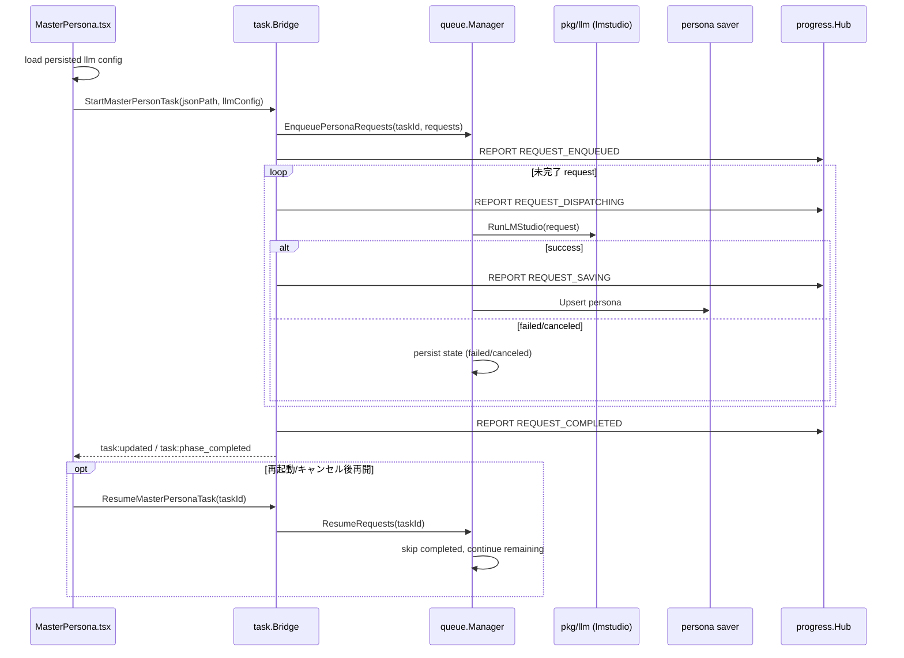

## Context

- 現行 `pkg/task/master_persona_task.go` は `PreparePrompts` までで終了し、`pkg/llm` 実行・レスポンス保存・再開処理に接続されていない。
- `frontend/src/pages/MasterPersona.tsx` は進捗イベント購読はあるが、LLM設定の永続化/再読込、およびキューマネージャーからの再開導線が未整備。
- 既存仕様（`specs/architecture.md`）では Interface-First、Task 境界、Progress 通知、Queue resume メタデータ保持が要求される。
- 今回は対象を `lmstudio` のみとし、他プロバイダ対応は明示的にスコープ外とする。

## Goals / Non-Goals

**Goals:**
- MasterPersona リクエストを LLM キューへ永続化し、タスク再起動/キャンセル後に途中再開できるようにする。
- `progress` を使って「投入・送信・保存」の段階進捗を UI へ通知する。
- `MasterPersona.tsx` の LLM 設定（provider/model/endpoint/apiKey 等）を永続化・再読込可能にする。
- キューマネージャーから未完了リクエストを再開できる。
- 段階的開発（1. キュー保存 2. config 永続化 3. LM Studio 実行 4. ペルソナ保存）を前提に、各段階で手動受け入れテスト可能な設計にする。

**Non-Goals:**
- Gemini/xAI/Batch API など `lmstudio` 以外の再開実装。
- MasterPersona 以外のタスク種別への一括横展開。
- 新規の非デファクトライブラリ導入。

## Decisions

### 1) 実行境界を `task.Manager` + `queue` に一本化する
- 決定: `StartMasterPersonTask` は「リクエスト生成タスク」から「Queue ジョブ登録タスク」へ拡張し、実行状態は Queue 側の request state を正とする。
- 理由: 再起動後再開・キャンセル後再開・キューマネージャー再開を同一基盤で扱える。
- 代替案: task metadata だけで再開。
- 却下理由: request 単位の進捗/失敗再試行が表現できず、途中再開の精度が低い。

### 1.1) インフラ層はスライス非依存を維持する
- 決定: `progress` / `queue` / `llm` は MasterPersona 固有の phase 名・業務語彙を持たず、`task_type` と汎用フィールドのみ扱う。固有フロー定義は `task`/オーケストレーション層に配置する。
- 理由: Interface-First と責務分離を維持し、他スライスへの横展開時の結合を防ぐ。
- 代替案: インフラ層に MasterPersona 専用の状態・イベントを追加する。
- 却下理由: インフラ汚染が発生し、将来の保守コストが増大する。

### 2) Resume は「request state machine + resume_cursor」で実現する
- 決定: Queue 永続化に `pending/running/completed/failed/canceled` と `resume_cursor` を保持し、再開時は `completed` をスキップして残件のみ再送する。モデルやパラメータは再開時点で `config` を再読込して適用する。
- 理由: 途中再開に必要な最小状態だけを保持し、モデル切り替え運用にも追従できる。
- 代替案: 再開時に全件再送。
- 却下理由: APIコスト増大と重複保存リスクが高い。

### 3) Provider 制約は `lmstudio` を明示バリデーションする
- 決定: MasterPersona の Queue 実行は `provider=lmstudio` のみ許可し、それ以外は早期エラーにする。
- 理由: 今回スコープを固定し、運用上の不確実性を排除する。
- 代替案: 既存 provider 抽象をそのまま開放。
- 却下理由: 未検証経路で resume 契約を満たせない。

### 4) 設定永続化は既存 `config` スライスで namespaced 保存する
- 決定: `master_persona.llm.*` キー群として保存し、`MasterPersona.tsx` 初期表示時に読み込む。更新は明示保存アクションまたは開始時自動保存を採用する。
- 理由: `config` 契約に沿って UI と backend の責務を分離できる。
- 代替案: LocalStorage のみ利用。
- 却下理由: Wails 再起動・複数画面整合・Queue 再開時参照に弱い。

### 4.1) `apiKey` は平文保存（暗号化なし）とする
- 決定: `master_persona.llm.apiKey` はローカル用途前提として暗号化を行わず保存する。
- 理由: 本アプリはローカル実行・ローカル配布が前提であり、クラウド共有を想定しないため。
- 代替案: OS キーストア連携や独自暗号化。
- 却下理由: 現時点の要件に対して過剰実装となる。

### 5) Progress は段階イベントに正規化する
- 決定: `REQUEST_ENQUEUED` / `REQUEST_DISPATCHING` / `REQUEST_SAVING` / `REQUEST_COMPLETED` を MasterPersona 共通 phase として `task` が決定し、`progress` は中継のみ行う。
- 理由: UI が実装詳細を知らずに進捗表示できる。
- 代替案: `%` のみ通知。
- 却下理由: 再開時の状態把握が困難。

### 5.1) タスク状態遷移は progress を介さず UI に通知する
- 決定: `pending/running/completed/failed/canceled` の状態遷移は `task` イベント（`task:updated` 等）で UI に直接通知する。`progress` は進捗バー表示のための値のみ扱う。
- 理由: ステータス表示と進捗バー表示の責務を分離し、イベント意味を単純化できる。
- 代替案: 状態遷移を progress ペイロードへ混在させる。
- 却下理由: UI 側の判定ロジックが複雑化し、誤表示リスクが増える。

### 6) ペルソナ保存は idempotent upsert を維持する
- 決定: 保存処理は既存 persona 永続化（`npc_personas`）を upsert 前提で呼び出し、再開/再試行で重複作成しない。
- 理由: resume 時の整合性を確保する最小変更。
- 代替案: 先に delete してから insert。
- 却下理由: 途中失敗時のデータ喪失リスクがある。

### 7) ライブラリ方針（デファクトのみ）
- 採用: 既存 `database/sql` + SQLite driver、Go `context`、`errgroup`、Wails runtime events。
- 非採用: 新規ジョブキュー製品や独自シリアライザ導入。

### クラス図

```mermaid
classDiagram
    direction LR

    class MasterPersonaPage {
      +loadConfig()
      +startTask()
      +resumeFromQueue(taskId)
    }

    class TaskBridge {
      +StartMasterPersonTask(input) taskId
      +ResumeMasterPersonaTask(taskId)
    }

    class QueueManager {
      +EnqueuePersonaRequests(taskId, requests)
      +ResumeRequests(taskId)
      +Cancel(taskId)
    }

    class LLMRunner {
      <<interface>>
      +RunLMStudio(ctx, request) response
    }

    class PersonaSaver {
      +SaveResults(taskId, responses)
    }

    class ConfigStore {
      +Get(namespace, key)
      +Set(namespace, key, value)
    }

    class ProgressHub {
      +ReportProgress(taskId, phase, current, total)
    }

    MasterPersonaPage --> TaskBridge : Wails binding
    MasterPersonaPage --> ConfigStore : load/save llm config
    TaskBridge --> QueueManager : enqueue/resume
    QueueManager --> LLMRunner : dispatch (lmstudio only)
    QueueManager --> PersonaSaver : persist results
    TaskBridge --> ProgressHub : report phase progress

    classDef ui fill:#111827,stroke:#60a5fa,color:#f9fafb
    classDef app fill:#052e16,stroke:#34d399,color:#ecfeff
    classDef infra fill:#3f1d2e,stroke:#f472b6,color:#fff1f2

    class MasterPersonaPage ui
    class TaskBridge,QueueManager,PersonaSaver app
    class LLMRunner,ConfigStore,ProgressHub infra
```

### シーケンス図



## Risks / Trade-offs

- [Risk] Queue state と task metadata の二重管理で不整合が起きる。  
  → Mitigation: 実行状態の正を Queue に一本化し、task は参照キャッシュに限定する。
- [Risk] LM Studio 接続不安定時に running のまま残る。  
  → Mitigation: heartbeat/timestamp による stale 判定で再開可能状態へ遷移させる。
- [Risk] progress イベントが高頻度で UI 負荷を上げる。  
  → Mitigation: request 単位と phase 境界のみ emit し、割合更新は間引く。
- [Risk] config 自動保存で意図しない値が残る。  
  → Mitigation: 保存トリガーを開始時に限定し、画面ロード時に最終更新時刻を表示する。

## Migration Plan

1. Phase 1: 既存 Queue テーブルを拡張し、MasterPersona request を永続化できるようにする。  
   受け入れテスト: 「開始後に再起動しても request レコードが残る」
2. Phase 2: `master_persona.llm` 設定の保存/読込 API を追加し、`MasterPersona.tsx` へ接続する。  
   受け入れテスト: 「再起動後に設定値が復元される」
3. Phase 3: Queue worker から `pkg/llm` の LM Studio 実行を呼び出す。  
   受け入れテスト: 「LM Studio へ実リクエストされ、progress が進む」
4. Phase 4: レスポンス保存（persona upsert）を追加し、再開時の冪等性を確認する。  
   受け入れテスト: 「途中キャンセル後再開しても重複なく保存完了する」
5. Rollback: Phase ごとに feature flag（または task type 分岐）で旧経路へ戻せるよう段階リリースする。

## Fixed Constraints

- 本変更での再開単位は「task 全体」とし、request 単位の個別再実行 UI は将来対応とする。
- Phase 進捗の `total` は常に「全 request 件数」を分母として固定する。

## 追加仕様メモ（実装中に判明）

### A) LM Studio のモデルロード時に context length を指定可能にする
- 要件: `provider=lmstudio` の場合、モデルロード API (`/api/v1/models/load`) に `context_length` を渡せること。
- UI: MasterPersona のモデル設定で `context_length` を入力可能にし、`master_persona.llm.<provider>` に保存すること。
- 実行: Queue worker 再開時も保存済み `context_length` を読み込み、LoadModel に反映すること。

### B) ModelSettings で並列実行数（sync concurrency）を指定可能にする
- 要件: `ModelSettings.tsx` で provider ごとの並列実行数を設定可能にすること。
- 保存先: `master_persona.llm` 名前空間の `sync_concurrency.<provider>` を利用すること。
- 実行: Queue worker は再開時・初回実行時ともに保存済み並列実行数を使用すること。

### C) 停止後の再起動/ダッシュボード再開で進捗を復元する
- 要件: 再開時に `current/total` と progress% を request state から復元し、0% から再開始に見えないこと。
- UI: MasterPersona 画面遷移時に task metadata と queue state を再取得して、停止時点の状態を復元すること。
- 動作: 一時停止後の再開では `completed` 件数をベースに `REQUEST_DISPATCHING/REQUEST_SAVING` が進行すること。
