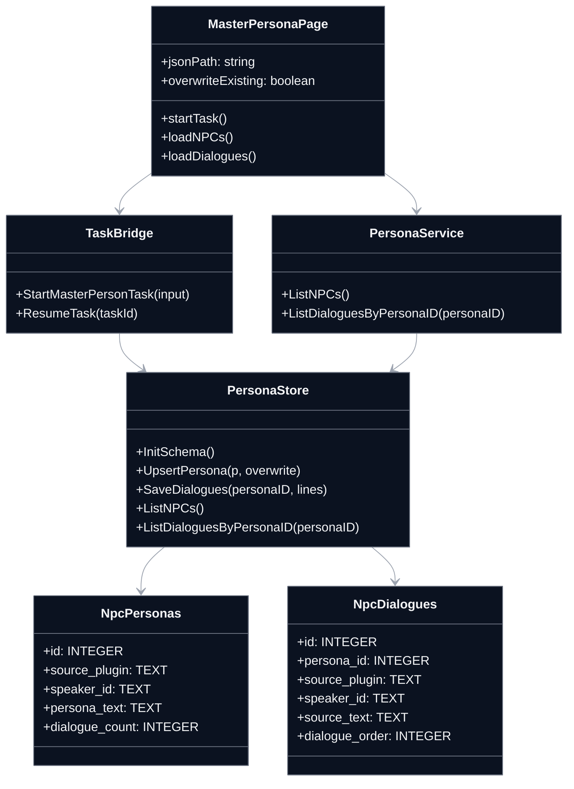
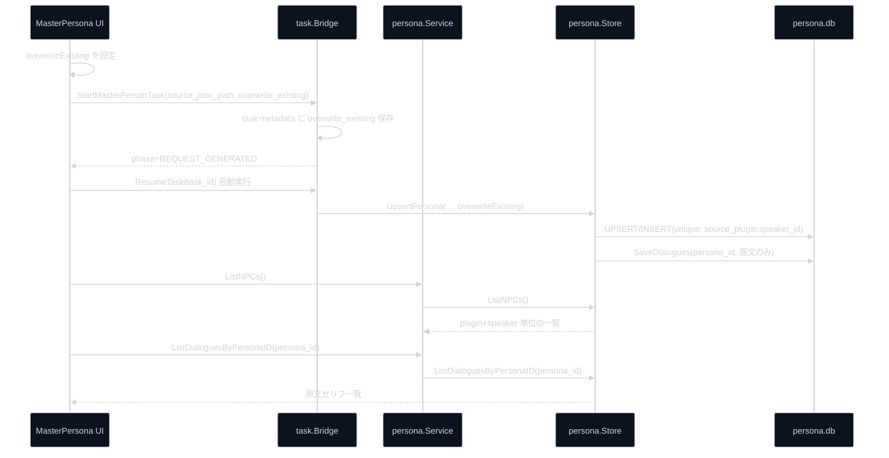

## Context

MasterPersona 画面では `ListNPCs` / `ListDialoguesBySpeaker` の取得結果を表示しているが、詳細ペインのセリフ表示が運用要件（原文のみ）と一致していない。加えて、`npc_personas` が `speaker_id` 単独識別のため、異なる `source_plugin` 間で同一 `speaker_id` が衝突する。

今回の変更は UI（`frontend`）・タスク入力（`pkg/task`）・永続化（`pkg/persona`）をまたぐ横断変更であり、`specs/architecture.md` の Interface-First / VSA 原則に従って、スライス内でスキーマと保存ロジックを完結させる。DB変更を伴うため `specs/database_erd.md` の更新も必須。

## Goals / Non-Goals

**Goals:**
- `PersonaDetail` のセリフ一覧を `npc_dialogues` 由来の原文のみ表示に統一する。
- `npc_personas` の一意性を `source_plugin + speaker_id` に変更し、プラグイン跨ぎの衝突を排除する。
- MasterPersona 開始UIに「重複時上書き」フラグを追加し、task->persona 保存まで一貫して反映する。
- ペルソナ用途の会話保存を最小項目（原文中心）に寄せ、訳文更新運用を前提にしない。

**Non-Goals:**
- 翻訳処理フロー全体（pass2, export）の仕様変更。
- 新規ストレージや外部ライブラリの導入。
- mock UI（`mocks-react`）の修正。

## Decisions

### 1. Persona 主キー戦略を `id` + 複合一意制約へ変更する
- 決定: `npc_personas` は `id`（INTEGER PRIMARY KEY）を主キーとし、`(source_plugin, speaker_id)` に複合一意制約を付与する。
- 理由: `speaker_id` 単独ではプラグイン境界を越えて衝突しうるため。
- 代替案:
  - `speaker_id` 単独のまま運用ルールで回避: データ品質依存が高く不採用。
  - `(source_plugin, speaker_id)` を主キーにする: 実装は可能だが、将来の参照拡張と他テーブル連携の単純化を優先して `id` 主キーを採用する。

### 2. `npc_dialogues` は `persona_id` 参照に変更する
- 決定: `npc_dialogues` 側は `persona_id`（FK -> `npc_personas.id`）で親に紐づけ、必要に応じて `source_plugin` / `speaker_id` は検索補助カラムとして保持する。
- 理由: 同一 `speaker_id` の会話をプラグインごとに正しく分離するため。
- 代替案:
  - `(source_plugin, speaker_id)` 直接参照: 参照カラムが増えて更新・JOIN条件が複雑化するため不採用。

### 3. UI選択IDは `persona_id` を正とする
- 決定: フロントの選択キーは `persona_id` を使用し、詳細取得APIも `persona_id` ベースへ寄せる。
- 理由: 行選択と詳細読込の一意性を担保するため。
- 代替案:
  - `source_plugin + ":" + speaker_id` 文字列連結キー: 一意性は担保できるが、APIとDBの主参照が分岐するため不採用。

### 4. 上書きフラグを StartMasterPersonTask の入力へ追加する
- 決定: `StartMasterPersonTaskInput` に `overwrite_existing`（bool）を追加し、task metadata に保存して再開時も同じ方針を適用する。
- 理由: UIの指定と再開処理の整合性を維持するため。
- 代替案:
  - Config 永続値のみで制御: 実行単位の再現性が弱く不採用。

### 5. REQUEST_GENERATED 後は自動で ResumeTask へ遷移する
- 決定: `REQUEST_GENERATED` イベント受信時、UIは手動再開ボタンを待たず同一 task ID で `ResumeTask` を自動呼び出しする。
- 理由: 生成完了後の手動操作待ちをなくし、実行フローを一貫して自動化するため。
- 代替案:
  - 手動再開のみ: オペレーション漏れで停止状態が残るため不採用。

### 6. セリフ一覧は原文のみ表示・保存
- 決定: `PersonaDetail` の表示列は原文中心（セリフ本文）とし、`translated_text` 依存を削減する。
- 理由: 翻訳のたびに `npc_dialogues` を更新しない運用と一致させるため。
- 代替案:
  - 原文/訳文の両方維持: 運用負荷と表示不整合を維持するため不採用。

### クラス図

### シーケンス図

## Risks / Trade-offs

- [既存データ消失] → 開発中前提として `persona.db` は再作成（テーブル再作成）を許容し、互換マイグレーションは実施しない。
- [UI API 変更の影響] → `ListDialoguesByPersonaID` への切替を呼び出し箇所と型定義で同時反映し、TypeScriptコンパイルで検知する。
- [上書きOFF時の期待差異] → 非上書き時の扱い（skip件数）を task ログへ出し、UIメッセージで結果を明示する。
- [原文のみ運用による情報減少] → `translated_text` 非依存にする代わりに、必要な翻訳参照は他スライス（translator）で行う責務分離を明確化する。

## Migration Plan

1. `pkg/persona/store` のスキーマ初期化を更新し、`npc_personas.id` 主キー + `unique(source_plugin, speaker_id)`、`npc_dialogues.persona_id` FK の新定義でテーブルを再作成する。
2. 既存 `persona.db` は開発中のため破棄を許容し、新スキーマで初期化する（互換マイグレーションは行わない）。
3. 取り込み時に `source_plugin` が空の場合は、入力ファイルパス/名称から `*.esm|*.esl|*.esp` を抽出して補完し、抽出不能時は `UNKNOWN` を設定する。
4. `pkg/persona` サービスAPIを `persona_id` を受け取る形へ更新する。
5. `pkg/task` の `StartMasterPersonTaskInput` と metadata に `overwrite_existing` を追加する。
6. `frontend/src/pages/MasterPersona.tsx` に上書きチェックUIを追加し、開始時に入力を渡す。
7. `REQUEST_GENERATED` 受信時に `ResumeTask` を自動実行する遷移を UI 側で保証する。
8. `frontend/src/components/PersonaDetail.tsx` を原文セリフ表示へ変更する。
9. `openspec/specs/database_erd.md` の persona ER を更新する。
10. テストは `specs/standard_test_spec.md` 準拠で、一意制約衝突・上書きON/OFF・自動再開遷移・原文表示の観点を追加する。

## Open Questions

- なし
