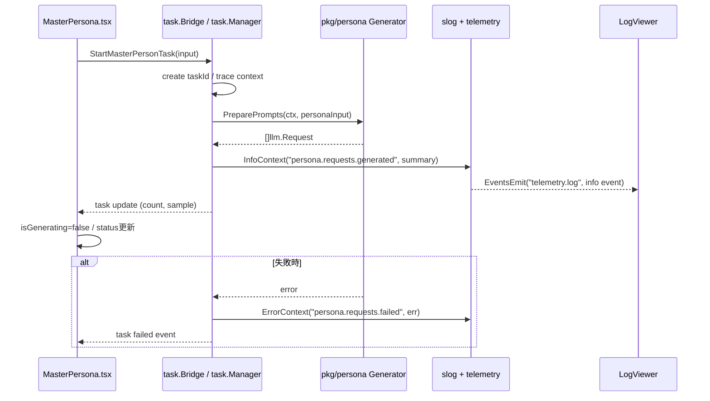

## Context

- 現状の `MasterPersona` 画面は開始ボタンのローカル状態切替のみで、`pkg/persona` の `PreparePrompts` に到達しない。
- 既存のログ基盤は `log/slog` + `pkg/infrastructure/telemetry` + Wails Events (`telemetry.log`) で実装済みで、フロントは `LogViewer` が購読済み。
- 本変更は段階的統合の第1段であり、ゴールは「開始押下でペルソナリクエスト生成が走り、既存 log-viewer で確認できること」。
- `specs/architecture.md` の Interface-First / Context伝播 / 構造化ログ方針に従い、LLM実送信や保存処理は含めない。

## Goals / Non-Goals

**Goals:**
- `MasterPersona` の開始ボタンから `task.Bridge` 経由で `pkg` の Persona Phase 1 を起動する。
- UI呼び出し用の最小境界APIを追加し、`PreparePrompts` の結果サマリを `info` レベルで出力する。
- 既存 `LogViewer`（`telemetry.log`）で、開始操作に対応するリクエスト生成ログを確認できるようにする。
- `probe` 依存の重いスコアリングを廃止し、大文字フレーズ出現率ベースの軽量スコアリングへ置き換える。

**Non-Goals:**
- LLMへのHTTP送信、バッチジョブ投入、レスポンス保存（`SaveResults`）の実装。
- ペルソナDBスキーマ変更、永続化フローの追加。
- 新規ログビューア実装や新規ライブラリ導入。

## Decisions

### 1. UIからの呼び出し境界は `task.Bridge` に統一する
- 決定: 開始操作は `task.Bridge` 起点のタスクとして管理し、Phase 1（今回）から将来の `pkg/llm` 連携まで同一タスクIDで追跡可能にする。
- 理由: 現時点の処理は軽量でも、`pkg/llm` 統合後に重くなることが確実であり、途中で実行モデルを切り替えるより先に一貫化した方が運用と可観測性が安定する。
- 代替案A: `app.go` に同期メソッドを追加して直接呼び出す。
  - 却下理由: Phase 2統合時に再設計が必要になり、進捗管理とキャンセル制御が分断される。
- 代替案B: フロントで直接 `runtime.EventsEmit` に依存して擬似実装する。
  - 却下理由: `pkg` 未接続問題を解決できない。

### 2. ログ可視化は既存 `telemetry.log` へ `info` を出すだけに限定する
- 決定: `PreparePrompts` 呼び出し後に、件数・対象NPC数・先頭数件の要約を `slog.InfoContext` で出力する。
- 理由: 既存 `LogViewer` が `telemetry.log` を購読しているため、追加UIなしで観測可能。
- 代替案A: MasterPersona内に専用ログパネルを新設。
  - 却下理由: 今回の最小接続ゴールを超える。

### 3. `pkg/persona` の契約は変更せず、入力マッピングのみ追加する
- 決定: UI入力（JSON由来）から `persona.PersonaGenInput` へのマッピングは呼び出し層で実施し、`PreparePrompts(ctx, input any)` の既存契約を維持する。
- 理由: `specs/architecture.md` の「オーケストレーターでのマッピング」に一致し、スライスの独立性を保てる。
- 代替案A: `pkg/persona` 側でUI DTOを受け取るよう契約変更。
  - 却下理由: スライス外DTOへの依存が混入しやすい。

### 4. フロントエンドに保持するリクエスト詳細は最小化し、全量保持（1000件）は採用しない
- 決定: フロントは件数・要約・サンプルのみ保持し、全リクエスト本文はバックエンドログ/タスク結果側で管理する。保持上限はUI側で既存の上限制御内（log-viewer側）に収める。
- 理由: 1000件規模の詳細をフロント保持するとメモリ・再描画・デバッグ負荷が増え、将来のLLM連携時にボトルネック化しやすい。
- 代替案A: フロントに最大1000件の全文を保持。
  - 却下理由: UI責務を超過し、通信/描画コストの割にメリットが小さい。

### 5. `probe` ベースの重いスコアリングを廃止し、大文字フレーズ出現率へ置換する
- 決定: ImportanceScorer の特徴量から `probe` 依存処理を除去し、英語ダイアログに対して大文字フレーズ（連続大文字語や強調語）出現率をスコアとして利用する。日本語ダイアログは当該スコアリングをスキップする。
- 理由: 現行 `probe` は計算コストが高く、Phase 1のスループットを悪化させる。大文字フレーズ比率は安価で、英語話者の強調表現シグナルとして実務上十分。
- 代替案A: `probe` の最適化を継続。
  - 却下理由: 改修コストに対して効果が限定的で、運用時の重さを解消しづらい。
- 代替案B: スコアリング自体を無効化。
  - 却下理由: 重要発話選別精度が低下し、リクエスト品質が不安定になる。

### 6. エラー伝播はWails標準の `Promise reject` と `error` ログで統一する
- 決定: バックエンドはエラーを返却し、フロントは開始状態を解除してUI通知（既存パターン）を行う。ログは `slog.ErrorContext`。
- 理由: 既存のWails/TypeScript生成コードと整合し、例外系の観測も log-viewer に集約できる。

### クラス図

```mermaid
classDiagram
    direction LR

    class MasterPersonaPage {
      +onStartClick()
      +setIsGenerating(bool)
    }

    class TaskBridge {
      +StartMasterPersonTask(input) Task
    }

    class NPCPersonaGenerator {
      <<interface>>
      +PreparePrompts(ctx, input) []llm.Request
    }

    class PersonaRequestLogEmitter {
      +InfoContext(ctx, "persona.requests.generated", attrs)
    }

    class LogViewer {
      +EventsOn("telemetry.log")
      +render(entries)
    }

    MasterPersonaPage --> TaskBridge : start task
    TaskBridge --> NPCPersonaGenerator : call
    TaskBridge --> PersonaRequestLogEmitter : emit info/error
    PersonaRequestLogEmitter --> LogViewer : telemetry.log event

    classDef ui fill:#1f2937,stroke:#60a5fa,color:#f9fafb
    classDef backend fill:#052e16,stroke:#34d399,color:#ecfeff
    classDef infra fill:#3f1d2e,stroke:#f472b6,color:#fff1f2

    class MasterPersonaPage,LogViewer ui
    class TaskBridge,NPCPersonaGenerator backend
    class PersonaRequestLogEmitter infra
```

### シーケンス図



## Risks / Trade-offs

- [Risk] `LogViewer` のデフォルトフィルターが `ERROR` のため、`info` ログが見えない可能性。  
  → Mitigation: 受け入れ手順に「レベルを `INFO` 以上へ切替」を明記する。
- [Risk] 生成リクエスト全文をログ出力すると長文化・性能劣化の可能性。  
  → Mitigation: 件数と先頭N件の要約のみを `info` 出力し、本文全量は出さない。
- [Risk] UI入力から `PersonaGenInput` への変換不備で `PreparePrompts` が失敗する可能性。  
  → Mitigation: 必須フィールド検証を境界層で行い、不足時は早期に分かりやすいエラーを返す。
- [Risk] 大文字フレーズ率だけでは一部NPCで重要発話抽出が弱くなる可能性。  
  → Mitigation: クエスト優先度・句読点/感情語スコアとの合成を維持し、重みはテーブル駆動テストで調整する。

## Migration Plan

1. `task.Bridge` / `task.Manager` に Persona Phase 1 起動エントリを追加し、タスクIDで進捗追跡できるようにする。
2. フロント `MasterPersona.tsx` の開始ボタンをタスク起動に接続する。
3. `pkg/persona` のスコアリングから `probe` 処理を除去し、大文字フレーズ出現率 + 日本語スキップ条件を実装する。
4. 成功時に `info` ログ（件数・サマリ）を出力、失敗時に `error` ログを出力する。
5. `wails dev` で「開始押下 -> task更新 -> log-viewerでinfo確認」を手動検証する。
6. ロールバック時は、追加したタスク起動エントリとUI接続を元に戻す（DB変更なしのためデータ移行不要）。

## Log Viewer確認手順（Section 3.3）

1. プロジェクトルートで `wails dev` を起動する。
2. アプリの `MasterPersona` 画面で JSON を選択し、`開始` を押下する。
3. 右ペインの `Telemetry Logs` を開き、レベルフィルターを `INFO以上` に設定する。
4. `persona.requests.generated` が表示され、`request_count` / `npc_count` / `task_id` 属性が確認できることを確認する。
5. エラーケースでは `persona.requests.failed` が `ERROR` で表示され、`task_id` と `reason` が確認できることを確認する。

## Open Questions

- `PersonaPrepareRequests` の返却DTOは「件数 + サンプル」のみか、将来の確認用途を見据えて最小メタ情報（NPC ID, request ID）まで含めるか。
- 入力JSONの取得経路（既存ファイルアップロード状態）をこの変更でどこまで接続するか。
- 大文字フレーズ判定の言語判別閾値（日本語スキップ判定）をどの基準で固定するか。
