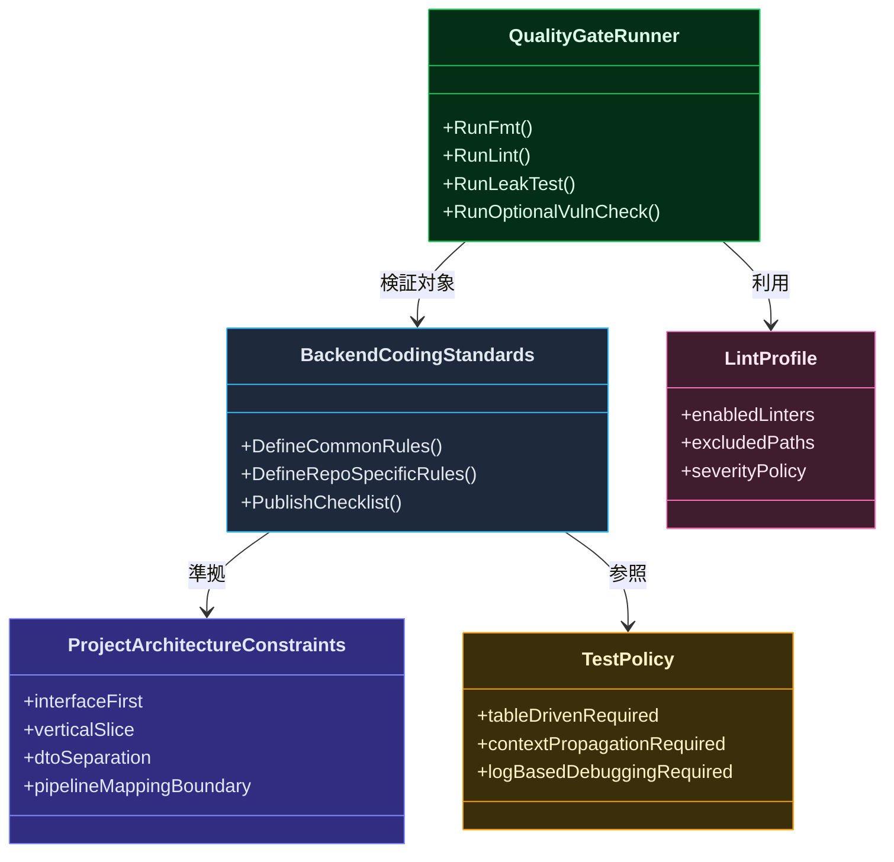
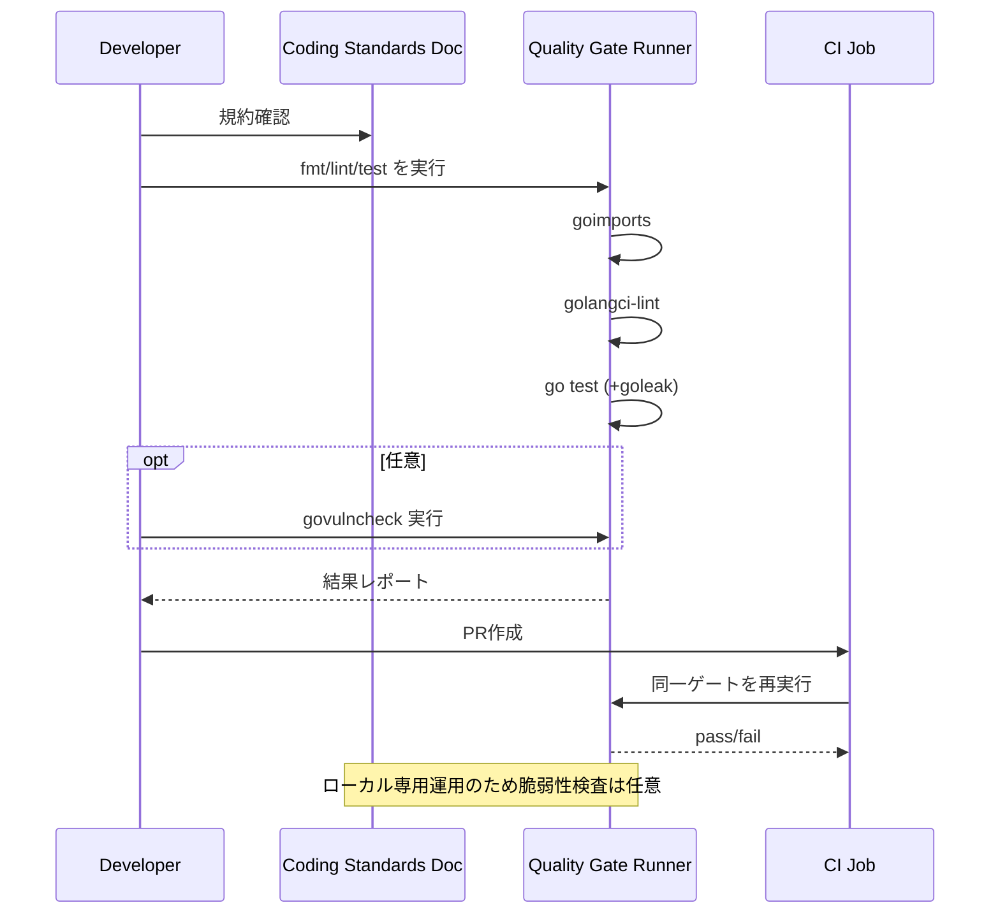

## Context

本変更は、`architecture.md` の Interface-First AIDD / Vertical Slice 原則に沿って、バックエンド改修の前提となる品質基準を先に固定するための設計である。現状は `pkg/` 配下に contract/provider/test の基本構造はあるが、規約の明文化と自動品質ゲートの統一が不足しており、レビュー観点が実装者依存になっている。

特に以下が設計上の制約となる。
- Slice間は Contract と DTO 境界を維持し、マッピングは `pipeline/mapper.go` 側で扱う。
- ログは `slog.*Context` + `telemetry` を前提に運用する。
- テストは `standard_test_spec.md` の方針（Table-Driven を主軸）と整合させる。
- 運用前提はローカル中心のため、脆弱性検査を常時必須ゲートにはしない。

## Goals / Non-Goals

**Goals:**
- バックエンド標準コーディング規約と、リポジトリ固有規約を単一ドキュメントで確立する。
- 共通規約に SRP と公開APIのdoc必須を含め、レビュー観点を統一する。
- de facto standard ライブラリを利用して、lint/format/leak検知の品質ゲートを自動化する。
- リファクタリング開始前に実行すべきチェック手順を固定し、品質の再現性を高める。
- 規約違反時に検知可能な運用（ローカル + CI）を整備する。

**Non-Goals:**
- 各 Slice の業務ロジック変更。
- DB スキーマ変更。
- 既存の全 lint 警告を1回でゼロ化すること。
- リモート配布前提のセキュリティ審査フローの構築。

## Decisions

### 1. 規約を2層（共通 + リポジトリ固有）で定義する
- Decision:
  - 共通Go品質規約（error wrap, context伝播, 構造化ログ, テスト方針）と、AIDD/Vertical Slice 固有規約を分離して記述する。
- Rationale:
  - 一般品質と本リポジトリ特有ルールを混在させると、適用範囲が曖昧になるため。
- Alternatives Considered:
  - 単一ルールセットのみ: 記述は短いが、適用理由が不明瞭になり保守性が下がる。

### 2. 品質ゲートの必須構成は `golangci-lint` + `goimports` + `goleak` とする
- Decision:
  - 必須ゲートは上記3点を採用し、`govulncheck` は任意実行（依存更新時/リリース前）とする。
- Rationale:
  - ローカル利用中心という運用要件に合わせ、開発速度と品質のバランスを優先する。
- Alternatives Considered:
  - `govulncheck` を常時必須化: セキュリティ強度は上がるが、現運用ではコスト過多。
  - `golangci-lint` 非採用で個別実行: ツール分散により運用が煩雑化。

### 3. 規約の遵守点を PR チェック項目に昇格する
- Decision:
  - 規約文書に対応したチェックリストを PR テンプレートに追加する。
- Rationale:
  - ドキュメントのみでは形骸化しやすく、レビュー導線に組み込む必要がある。
- Alternatives Considered:
  - ドキュメント参照のみ: 実効性が低い。

### 5. 共通規約に SRP / doc必須 / チェックスタイルを明示する
- Decision:
  - 共通規約に以下を MUST として定義する。
    - SRP（公開メソッドは1責務、複雑処理は同一ファイル内のプライベートメソッドへ分割）
    - 公開API（公開型・公開関数・公開メソッド）へのdocコメント必須
    - チェックスタイル（MUST/SHOULD区分、レビュー観点、lint違反時のfail条件）
- Rationale:
  - 「良いコード」の判断基準を文章化し、実装者とレビュアの認識差を最小化するため。
- Alternatives Considered:
  - SRP/docを推奨止まりにする: 例外判断が増え、規約の拘束力が弱くなる。

### 4. テスト方針は `standard_test_spec.md` の形式に接続する
- Decision:
  - 今回作る規約は、テスト設計書の標準テンプレート（Table-Driven 中心）を参照必須とする。
- Rationale:
  - テストの粒度・記述形式を統一し、レビュー速度を上げる。
- Alternatives Considered:
  - 各チーム/各機能で自由形式: 読解コストが増え、品質差が拡大。

## クラス図

## シーケンス図

## Risks / Trade-offs

- [Risk] 既存コードに lint 違反が多く、導入直後に開発が停滞する  
  → Mitigation: 初期は警告を段階導入し、優先 lint から fail-on-error に移行する。
- [Risk] 規約が肥大化して読まれなくなる  
  → Mitigation: MUST/SHOULD を分離し、例外条件を明文化する。
- [Risk] `govulncheck` 任意運用により依存脆弱性の検知が遅れる  
  → Mitigation: 依存更新時に必ず手動実行する運用ルールを tasks に入れる。

## Migration Plan

1. `backend-coding-standards` と `backend-quality-gates` の spec を作成する。  
2. 規約ドキュメントを追加し、PRテンプレートにチェック項目を追加する。  
3. `golangci-lint` / `goimports` / `goleak` の実行導線（スクリプトまたは Make ターゲット）を追加する。  
4. CI に同等ゲートを設定する。`govulncheck` は任意ジョブとして分離する。  
5. 段階的に既存警告を解消し、最終的に必須ゲートを fail-on-error に固定する。

Rollback Strategy:
- 運用負荷が高すぎる場合は、CI の fail 条件を lint の一部に限定して暫定運用へ戻す。

## Open Questions

- `golangci-lint` の初期除外対象（legacy ファイル範囲）をどこまで許容するか。
- `goleak` を全テストで有効化するか、並行処理系パッケージのみに限定するか。
- 規約文書の配置先を `docs/` と `openspec/specs/` のどちらに正とするか。
