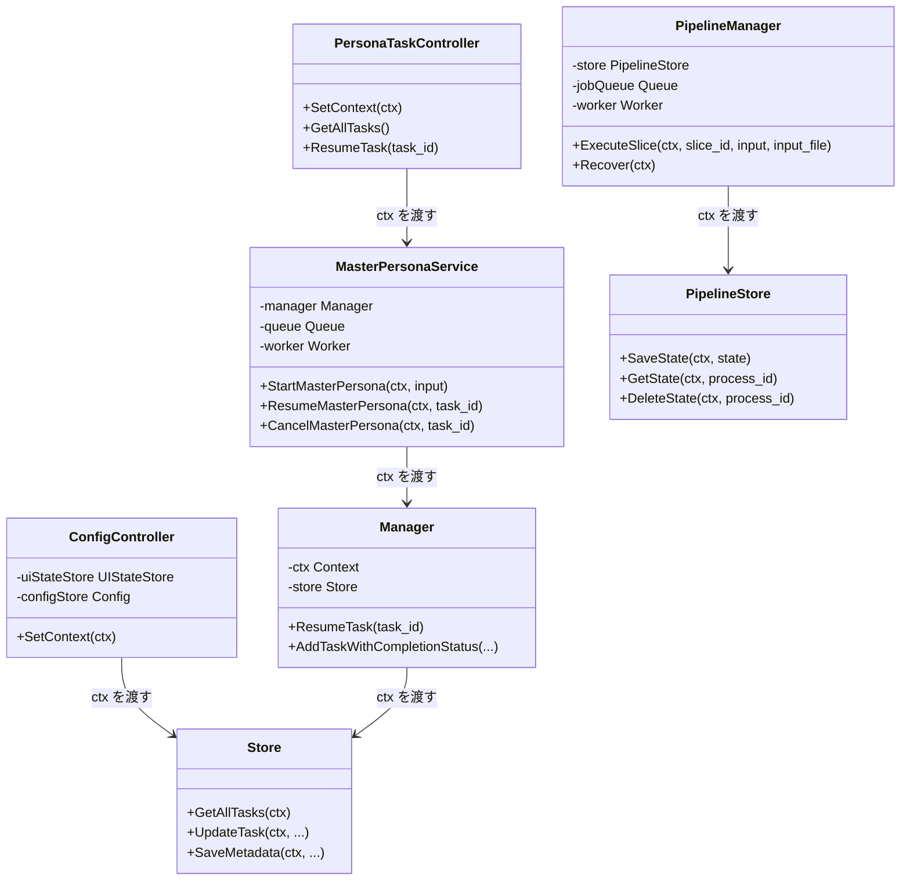
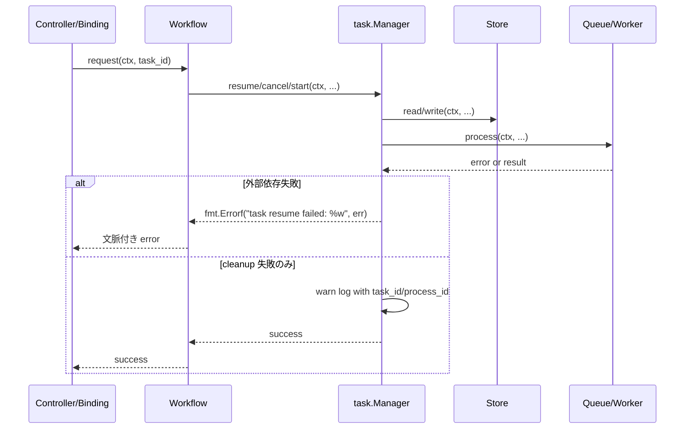

## Context

本 change は新機能追加ではなく、既存バックエンド実装を `openspec/specs/backend_coding_standards.md` に収束させる横断的な是正である。調査では `pkg/task`, `pkg/workflow`, `pkg/config`, `pkg/pipeline` にまたがって、`context.Context` の断絶、error wrap 欠落、`slog.*Context` 非統一、失敗の握りつぶし、公開メソッドの責務過多が確認された。

制約は以下のとおり。
- Wails バインディングの公開シグネチャ互換は原則維持する
- 新規ライブラリは導入しない
- DB スキーマ変更は前提にしない
- バックエンド変更は `backend:lint:file -> 修正 -> 再実行 -> lint:backend` の順で収束させる
- テストは `standard_test_spec.md` に整合する Table-Driven Test を基本とする

修正の主な利害関係者は、Wails 経由でタスク操作を行うフロントエンド、障害解析を行う開発者、今後 `pkg/**` を変更する AI / 人間の実装者である。

## Goals / Non-Goals

**Goals:**
- controller / binding 起点の `context.Context` を workflow・task・store・hook まで途切れさせない
- package 境界をまたぐ error へ文脈付き wrap を追加し、障害解析可能な戻り値へそろえる
- `slog.*Context` と lower_snake_case キーを基準にログを統一する
- 握りつぶしている失敗を warning か error として明示し、無視する場合も理由が読める形にする
- 責務過多な公開メソッドを private method 抽出で分割し、レビュー可能性を上げる
- 修正を段階的に進めても lint と既存 API 互換を維持できる構成にする

**Non-Goals:**
- `backend_coding_standards.md` 自体の要求変更
- Wails API の公開インターフェース刷新
- task / pipeline / config の DB スキーマ変更
- 新しいログ基盤や DI フレームワークの導入
- 全 package の全面リライト

## Decisions

### 1. `context.Context` は公開入口ごとに保持し、内部呼び出しへ明示伝播する

`context.Background()` の散発的な利用をやめ、各 package の既存入口で受け取れる ctx を基準に内部処理へ引き回す。Wails バインディング互換のため引数を増やせない箇所は、既存の `SetContext` や struct 保持済み ctx を利用し、内部 helper へは明示引数で渡す。あわせて、`pkg/config/config_service.go` は責務に合わせて `ConfigController` 相当の命名へ寄せ、Wails binding の入口であることを明確にする。

理由:
- 既存公開 API 形状を大きく壊さずに規約準拠へ寄せられる
- telemetry / slog の相関情報を維持しやすい
- `task.Manager` の resume / cancel / completion hook でも同一文脈を使える
- `ConfigService` という命名より、controller 責務であることが伝わる

代替案:
- 全公開メソッドへ新たに ctx 引数を追加する案
  - 却下理由: Wails バインディング互換への影響が大きい
- `context.Background()` を許容しつつ一部だけ修正する案
  - 却下理由: 再発防止にならず、設計一貫性が残らない
- `ConfigService` のまま責務説明だけ追記する案
  - 却下理由: 命名上の曖昧さが残る

### 2. background 実行は「起点 ctx を元にした派生 ctx」を使う

goroutine 起動が必要な箇所では `context.Background()` を直接使わず、起点 ctx に trace / action / task_id を付与してから `context.WithCancel` 等で派生させる。完全な detach が必要な箇所だけ、意図をコメントまたはメソッド名で明示した専用 helper に閉じ込める。completion hook も基本は呼び出し元の文脈をそのまま引き継ぎ、本当に分離が必要な場合だけ派生 ctx を使う。

理由:
- 非同期処理でもログ相関が維持できる
- キャンセル伝播の設計意図が明確になる
- completion hook 側の差分も最小で済む

代替案:
- 全非同期処理を常に `Background` 起点に固定する案
  - 却下理由: trace 切断と解析困難を温存する
- completion hook を常に専用 ctx へ切り替える案
  - 却下理由: 何が違うのか分かりにくく、必要性も薄い

### 3. error は package 境界・外部 I/O 境界で必ず wrap する

DB、queue、worker、parser、persona generator、config store など外部依存の失敗は、呼び出し側が識別子付きで `fmt.Errorf("...: %w", err)` に包む。内部 helper で十分な文脈がある場合は二重 wrap を避けるが、公開メソッドをまたいで素通しにはしない。

理由:
- 障害時に `task_id`, `process_id`, `namespace` 単位で追跡できる
- `telemetry.ErrorAttrs(err)` と組み合わせたログ出力が意味を持つ

代替案:
- ログだけ詳細化し、返却 error は素通しにする案
  - 却下理由: 呼び出し側やテストで文脈を失う

### 4. ログは `slog.*Context` と識別子ベースのメッセージへ寄せる

`Error`, `Warn`, `Info` の Context なし呼び出しを `*Context` にそろえ、メッセージは自由文よりも `task.resume.started`, `pipeline.recover.completed` のような識別子寄りへ寄せる。キー名は `task_id`, `process_id`, `slice`, `namespace`, `record_count` など固定語彙を優先する。cleanup failure はまずログに確実に出し、そのログが UI へ反映される現在の導線を維持する。

理由:
- 人間と AI の双方がログを機械的に集約しやすい
- 規約の lower_snake_case 方針に合わせやすい
- まずログを整える方が UI 反映との整合を崩しにくい

代替案:
- 既存自由文メッセージを維持してキーだけ整える案
  - 却下理由: 再発防止の規約として弱い
- cleanup failure を即座に UI 専用経路で通知する案
  - 却下理由: 今回の change の主題を超える

### 5. 握りつぶしは「許容する失敗」と「処理継続不可」を分ける

`_ = ...` や `return nil` を見直し、状態整合に影響する失敗は返却する。後処理・掃除の失敗のように継続を優先する箇所は warning ログへ格上げし、どの識別子で失敗したかを残す。実装コストが低い箇所はこの change 内でできるだけ是正する。

理由:
- 失敗の意味づけを統一できる
- 一部の cleanup failure と、本処理失敗を区別できる
- 「できるものはこの change で直す」という方針に合う

代替案:
- すべて返却 error にする案
  - 却下理由: cleanup failure で主要処理の成功まで巻き戻すと挙動変更が大きい
- すべて後続タスクへ積み残す案
  - 却下理由: 改善余地を不必要に先送りする

### 6. 責務過多メソッドは同一ファイル内 private method 抽出で整理する

`task.Manager.ResumeTask`、`workflow.MasterPersonaService.StartMasterPersona`、`runPersonaExecution` などは、状態読込、事前検証、進捗通知、永続化、後処理を private method へ分解する。別 file への細分化は避け、レビュー時に上から主要フローを追える形を維持する。

理由:
- 規約の「同一ファイル内 private method 分割」と一致する
- 差分を局所化しつつ可読性を上げられる

代替案:
- package 再編や大規模分割を先に行う案
  - 却下理由: 今回の change の目的を超え、影響が広すぎる

### 7. 品質確認はファイル単位 lint と関連 Table-Driven Test の組み合わせで進める

修正対象ごとに `backend:lint:file` を先行し、最後に `lint:backend` を通す。テストは `context` 伝播、error wrap、resume/cancel、cleanup failure の扱いを中心に Table-Driven で補強する。加えて、`backend:lint:file` だけでは再発防止しにくい項目は、低コストで静的検査へ落とせるものがあればこの change で追加を検討する。

理由:
- change の粒度に対して最も現実的な品質確認導線である
- 規約と `backend-quality-gates` の運用に一致する
- 将来の同種逸脱を減らせる

代替案:
- 最後に全体 lint / test のみ実行する案
  - 却下理由: 修正途中の逸脱点を潰しにくい
- 静的検査追加を完全に別 change へ分離する案
  - 却下理由: 今回まとめて防げるものまで取り逃す

## Class Diagram

## Sequence Diagram

## Risks / Trade-offs

- [Risk] `context` の伝播を広げた結果、既存の非同期処理が早くキャンセルされる可能性がある → Mitigation: detach が必要な経路だけ専用 helper に閉じ込め、resume/cancel 系テストで確認する
- [Risk] error wrap 追加で既存テストの比較文字列が変わる → Mitigation: `errors.Is` / `errors.As` と部分一致を使うようにテストを調整する
- [Risk] ログメッセージ変更で既存の手動運用メモとズレる → Mitigation: メッセージ識別子は段階的に統一し、主要キーは維持する
- [Risk] 責務分割の途中で挙動差分が入りやすい → Mitigation: 1 package ずつ `backend:lint:file` と関連テストで閉じて進める
- [Risk] cleanup failure を返却し始めると UI 上の完了判定が変わる → Mitigation: cleanup failure はまずログへ出し、UI は既存のログ反映導線で扱う

## Migration Plan

1. `pkg/task` と `pkg/workflow` から着手し、task 起点の `context` 伝播と error wrap を整理する
2. `pkg/config` の Wails binding ラッパーを `ConfigController` 方針で整理し、store 呼び出しを保持済み ctx または注入 ctx ベースへ寄せる
3. `pkg/pipeline` の store / manager / handler で wrap とログ識別子を統一する
4. 低コストで追加できる静的検査があれば `tools/backendquality` への反映も検討する
5. 各段階で `npm run backend:lint:file -- <file...>` を実行して違反を解消する
6. 最終的に `npm run lint:backend` と関連 Go テストを実行する

ロールバック方針:
- DB スキーマ変更はないため、ロールバックはコード差分単位で行う
- 途中段階でも package 単位でテストと lint を通し、壊れた中間状態を長く残さない

## Open Questions

- `ConfigController` への改名を `pkg/config` 内のファイル名変更だけで済ませるか、`pkg/controller` へ責務移動まで含めるか
- 低コストで追加できる静的検査の対象を、`context.Background()` 検出・error wrap 監視・ログ API 統一のどこまで広げるか
