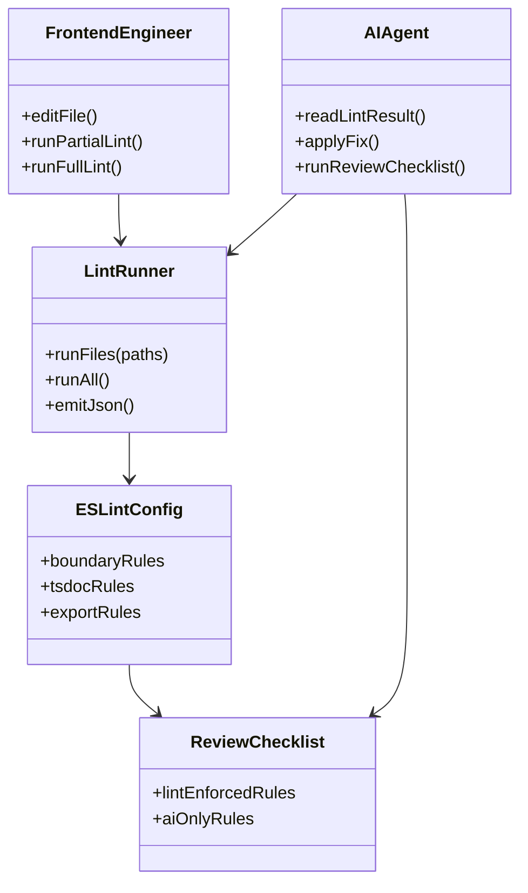
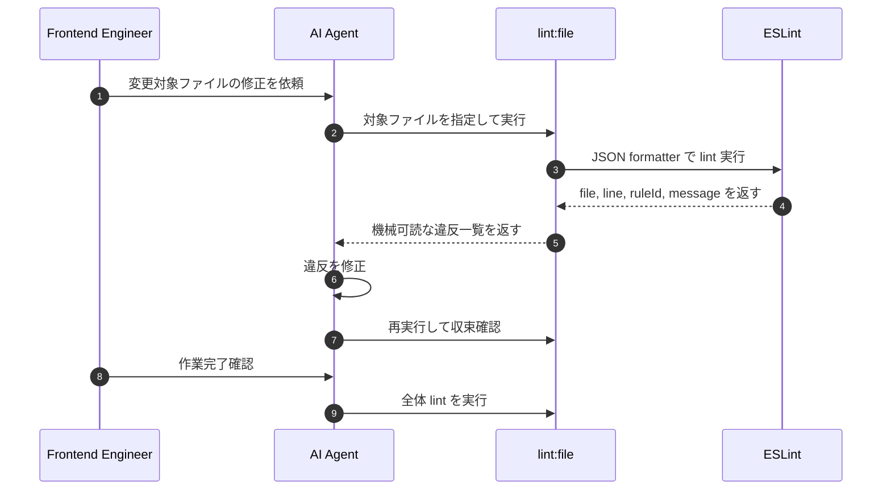

## Context

現在のフロントエンドには `frontend/eslint.config.js` と `frontend/package.json` の lint 基盤があり、`import/no-restricted-paths` による境界検証と `lint:rule3` による局所チェックが導入されている。一方で、[frontend_coding_standards.md](/C:/Users/shiba/.codex/worktrees/f5e4/ai translation engine 2/openspec/specs/frontend_coding_standards.md) に定義された規約の多くは文章規約のままで、TSDoc の有無、不要な `export`、変更中ファイル単位の高速検査、AI による逐次修正フローが未整理である。

今回の変更は、[architecture.md](/C:/Users/shiba/.codex/worktrees/f5e4/ai translation engine 2/openspec/specs/architecture.md) と [frontend_architecture.md](/C:/Users/shiba/.codex/worktrees/f5e4/ai translation engine 2/openspec/specs/frontend_architecture.md) の責務分離方針を維持しながら、フロントエンド規約を「可能な限り lint 化し、lint 化できないものだけ AI が逐次補完確認する」運用へ移行するための設計である。利用者は主にフロントエンドをリファクタする開発者と、その場で修正を行う AI エージェントである。

## Goals / Non-Goals

**Goals:**

- `frontend_coding_standards.md` の規約を lint 可能な範囲で最大限機械検証へ移す。
- 変更中ファイルだけを対象にした高速 lint 実行を標準フローにし、AI が結果を読んで即修正できる形にする。
- TSDoc 必須化、不要な公開範囲の最小化、Headless Architecture の境界検証を既存 ESLint 基盤に統合する。
- lint で判定できない規約を AI の逐次確認チェックリストとして明示し、規約の抜け漏れを減らす。

**Non-Goals:**

- フロントエンド全規約を完全自動判定すること。
- Wails バックエンドや Go 側の lint・ログ方針をこの change に含めること。
- 新しい独自 lint エンジンや重い AST 解析基盤を新設すること。
- 既存画面ロジックの大規模リファクタをこの設計段階で実施すること。

## Decisions

### Decision 1: 既存 ESLint フラット設定を中核に据える

`frontend/eslint.config.js` を拡張し、規約の一次判定は ESLint に集約する。既存で採用済みの `eslint`、`typescript-eslint`、`eslint-plugin-import`、`eslint-plugin-react-hooks` を継続利用し、追加依存はデファクトスタンダードに限定する。

採用理由:

- 現在の基盤をそのまま拡張でき、設定の分散を防げる。
- ファイル単位実行、JSON 出力、CI 連携が既に成熟している。
- `lint:rule3` のような局所チェックを汎化しやすい。

候補比較:

- 採用: ESLint 中心の拡張
- 不採用: 独自 CLI による AST 解析
  理由: 保守コストが高く、AI 修正ループより先にツール保守が主目的化する。

### Decision 2: TSDoc は「構文妥当性」と「必須対象の存在確認」を分けて検査する

TSDoc 関連は二段構えにする。コメント構文の妥当性は `@microsoft/eslint-plugin-tsdoc` で検査し、公開契約にコメントが存在するかは `eslint-plugin-jsdoc` を使って対象シンボル単位で必須化する。

採用理由:

- `tsdoc` プラグインは TSDoc 構文の妥当性を検査できる。
- `eslint-plugin-jsdoc` は公開関数、型、クラス、コンポーネント相当へのコメント必須化に向く。
- 「コメントはあるが TSDoc として不正」と「そもそもコメントがない」を分離できる。

対象範囲:

- `export function useXxx`
- `export type` / `export interface`
- `export const Xxx = () =>` のうち公開コンポーネント
- 必要に応じて `hooks/features/*/types.ts` の公開型

除外方針:

- ファイル内 private helper
- React 内部の短命なローカル関数
- 一時的なテストコード

候補比較:

- 採用: `@microsoft/eslint-plugin-tsdoc` + `eslint-plugin-jsdoc`
- 不採用: `eslint-plugin-jsdoc` のみ
  理由: 存在確認はできても TSDoc 構文の妥当性保証が弱い。
- 不採用: TSDoc を AI レビューのみに委ねる
  理由: 機械検証可能なため、規約としては lint に寄せるべきである。

### Decision 3: 公開範囲最小化は unused export 検出を軸にする

「公開するものを最小化する」は lint が完全には意味理解できないため、まずは `import/no-unused-modules` または同等の unused export 検出を使って、参照されていない `export` を失敗にする。加えて `react-refresh/only-export-components` を維持し、コンポーネントファイルからの余計な export を抑制する。

採用理由:

- 機械判定しやすく、不要 export 削減に直接効く。
- 「外から使われていない公開」を落とすだけでも公開面積をかなり縮小できる。
- 人間や AI が意図判断すべき境界を最小にできる。

補完ルール:

- 同一 feature 内からのみ使う型や helper は非公開化を原則とする。
- lint で判定し切れない「将来使うかもしれない export」は AI チェック対象に残す。

候補比較:

- 採用: unused export 検出 + 既存ルールの併用
- 不採用: TypeScript の `private` 相当だけで制御
  理由: 関数・型レベルの export 制御には不十分である。

### Decision 4: 変更ファイル向け lint は ESLint の file-arg + JSON formatter で提供する

通常の作業フローでは、変更対象ファイルを引数で受け取る `lint:file` 系スクリプトを追加する。実体は `eslint --format json --max-warnings=0 <paths...>` とし、AI が安定して読み取れる出力を返す。全体品質ゲートとして `lint:frontend` は維持し、作業完了前に必ず実行する。

想定コマンド:

- `npm run lint:file -- src/pages/DictionaryBuilder.tsx`
- `npm run lint:file -- src/pages/DictionaryBuilder.tsx src/hooks/features/dictionaryBuilder/useDictionaryBuilder.ts`
- `npm run lint:frontend`

採用理由:

- 追加ツールなしで既存 ESLint だけで成立する。
- AI がファイル名、行、列、ruleId、message を確実に取得できる。
- 人間にも CI にも同じルールセットを使い回せる。

候補比較:

- 採用: ESLint にファイル引数を渡す
- 不採用: 変更ファイル抽出まで npm script に固定する
  理由: Git 依存が強くなり、AI が明示ファイル指定で回しにくい。

### Decision 5: `frontend_coding_standards.md` の規約を「lint 対象」と「AI 補完対象」に分類する

実装時に規約迷子を防ぐため、設計上で規約を二つに分類する。静的解析可能な規約は ESLint ルールへ落とし、静的解析だけでは不足する規約は AI が毎回確認するチェックリストへ落とす。

lint 対象の例:

- `any` 禁止
- `pages` から `wailsjs/store` 直接 import 禁止
- 公開契約への TSDoc 必須
- 不要 export の禁止
- `useEffect` の依存配列検査
- `catch` 握りつぶしの一部パターン検出

AI 補完対象の例:

- 1 関数 1 責務か
- 読解負荷が高すぎないか
- Hook の戻り値が `state / action / selector` に論理分割されているか
- Wails adapter の責務が UI に漏れていないか

採用理由:

- 「lint で拾えるのに人間判断へ逃がす」状態を避けられる。
- AI は lint 結果で即修正しつつ、lint 化不能な規約だけを重点確認できる。

### Decision 6: AI 修正ループは lint 実行とセットで運用する

AI エージェントはフロントエンド変更ごとに次の順序を標準フローとする。

1. 変更対象ファイルを特定する。
2. `npm run lint:file -- <paths...>` を実行する。
3. JSON 出力から違反箇所を抽出する。
4. 違反を修正する。
5. 必要に応じて再度 `lint:file` を実行する。
6. 作業完了前に `npm run lint:frontend` を実行する。

このフローにより、規約確認を人間の記憶ではなく機械実行に寄せる。

## Risks / Trade-offs

- [TSDoc の必須対象が広すぎてノイズ化する] → まずは公開 Hook、公開型、公開コンポーネントに限定し、ローカル helper へは広げない。
- [unused export 検出が barrel export や型再公開で誤検知する] → `src/index.ts` のような集約ファイルの扱いを個別 override で調整する。
- [lint ルールが増えて既存違反が大量に出る] → 変更対象 feature から段階導入し、全体一括適用は最終段階に回す。
- [AI が lint 化不能な規約を見落とす] → AI 補完対象のチェックリストを明文化し、各変更で確認する運用を固定する。
- [JSON 出力をそのまま人間が読むには見づらい] → AI 連携では JSON、人間向けには通常 formatter を使い分ける。

## Migration Plan

1. `frontend/eslint.config.js` の既存ルールを棚卸しし、`frontend_coding_standards.md` の各項目を `lint 化する / AI 補完に回す` に分類する。
2. `@microsoft/eslint-plugin-tsdoc` と `eslint-plugin-jsdoc` を追加し、公開契約の TSDoc 検査を導入する。
3. unused export 検出ルールを追加し、既存 override と競合しないように適用範囲を調整する。
4. `frontend/package.json` に `lint:file` 系 script を追加し、JSON formatter で対象ファイルのみ検査できるようにする。
5. AI の標準修正フローを AGENTS / OpenSpec tasks に反映し、フロント変更時は `lint:file` -> 修正 -> `lint:frontend` を必須化する。
6. 変更対象 feature から段階導入し、最後に `npm run lint:frontend` で全体整合を確認する。

ロールバック方針:

- 新規ルールがノイズ過多の場合は、対象ディレクトリを feature 単位で限定して段階適用に戻す。
- TSDoc 必須範囲が過剰なら、公開 Hook / 公開型のみに絞って再導入する。

## Open Questions

- `import/no-unused-modules` をそのまま使うか、TypeScript プロジェクト構成との相性次第で別の unused export 検出手段に切り替えるか。
- `lint:file` の出力を純粋な ESLint JSON にするか、AI が読みやすいように薄い整形スクリプトを 1 枚挟むか。
- TSDoc 必須対象に `export const Component = () =>` 形式の全コンポーネントを含めるか、`pages` と `hooks/features` の公開面だけに限定するか。
- AI 補完チェックリストを OpenSpec tasks に含めるか、AGENTS 運用ルールとして別管理するか。
