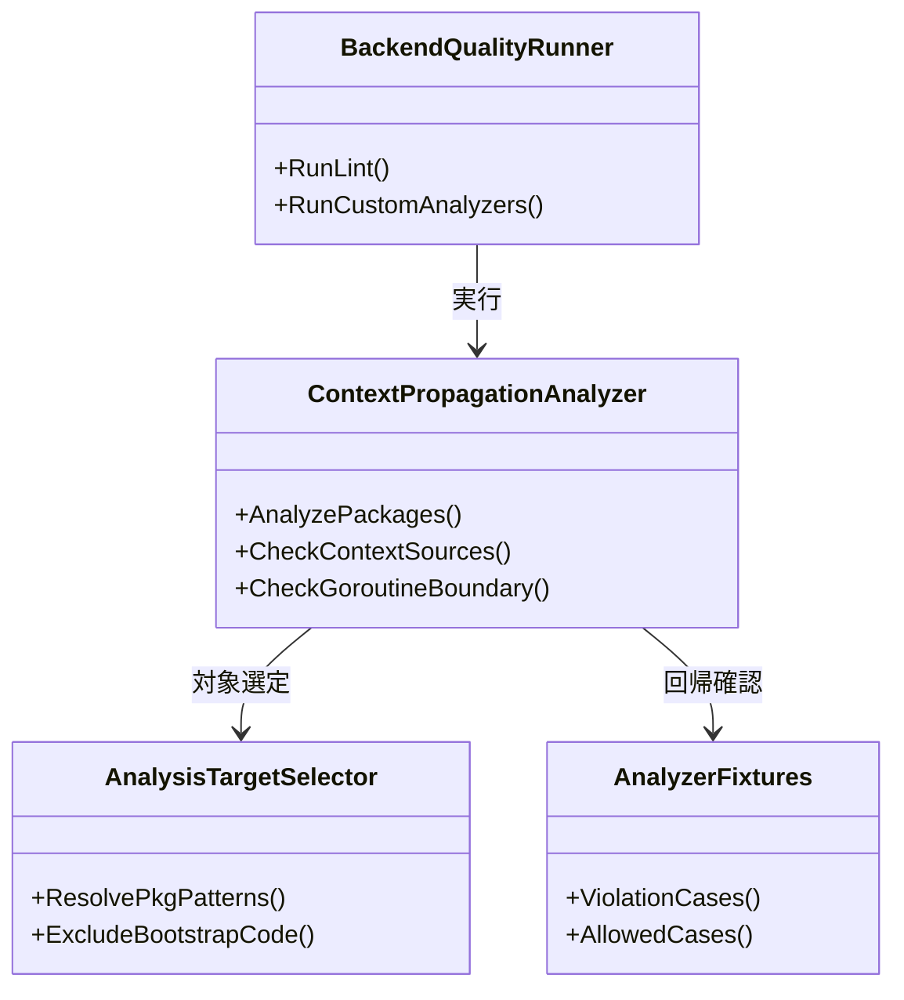
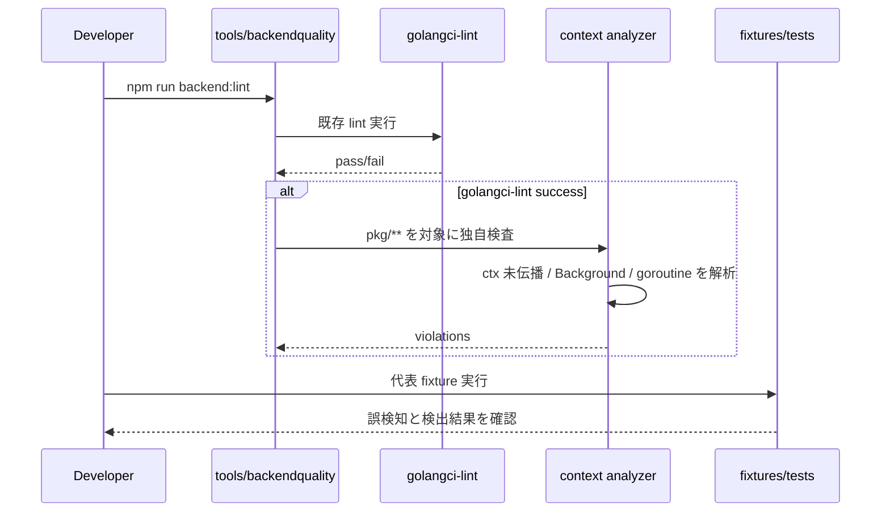

## Context

現状の `tools/backendquality/main.go` は `golangci-lint` と `go-cleanarch` を実行するランナーであり、`context.Context` 伝播のようなリポジトリ固有ルールは機械検査していない。`backend_coding_standards.md` では公開 Contract の第一引数と内部伝播が MUST になっている一方、違反検出はレビュー依存で、goroutine や `context.Background()` の混入を安定して落とせない。

今回の変更は、既存の `backend:lint` 導線を壊さずに `pkg/**` を対象としたカスタム analyzer を組み込み、実装規約と品質ゲートを接続することが目的である。`architecture.md` の責務境界を守るため、検査対象は `pkg/**` のバックエンドコードに限定し、composition root やテスト補助のような正当例外は誤検知抑制の対象として扱う。

## Goals / Non-Goals

**Goals:**
- `backend:lint` で `context.Context` 未伝播、`context.Background()` / `context.TODO()` の不適切利用、goroutine 起点の `ctx` 脱落を検出できるようにする。
- 既存ランナー `tools/backendquality` へ統合し、代表 fixture で回帰確認できる構成を定義する。
- 誤検知を抑えるための除外境界を明文化し、レビューで説明可能な検査範囲にする。

**Non-Goals:**
- `pkg/**` 全体の既存 `context` 違反をこの change で一括修正すること。
- `cmd/**` や Wails エントリポイントまで同じ厳密さで強制すること。
- 動的実行時にしか分からないキャンセル伝播の完全検証。

## Decisions

### 1. `go/analysis` ベースの独自 analyzer を `tools/backendquality` から実行する
- Decision:
  - de facto standard である `golang.org/x/tools/go/analysis` を利用し、`golangci-lint` の外側で追加 analyzer を実行する。
- Rationale:
  - 既存の `tools/backendquality` は品質ゲートの統一入口であり、ここに analyzer 実行を追加するのが最も導線を崩さない。`go/analysis` は AST / 型情報 / SSA に段階的にアクセスでき、誤検知抑制にも向く。
- Alternatives Considered:
  - `golangci-lint` カスタムプラグイン化: Windows と `go run` ベースの現行運用で複雑度が高い。
  - 単純な `grep` / AST 文字列判定: `ctx` 伝播の call site 判定と goroutine 境界の識別に弱い。

### 2. MVP は「危険パターン検出」に絞り、完全な call graph 強制は段階導入にする
- Decision:
  - 初期版は公開入口からの `ctx` なし呼び出し、`context.Background()` / `TODO()`、goroutine 起動時の `ctx` 脱落など、違反シグナルが強いパターンに絞る。
- Rationale:
  - 全経路の完全追跡はコストが高く、誤検知も増えやすい。まずレビュー負荷の高い代表違反を確実に落とす方が効果が大きい。
- Alternatives Considered:
  - SSA / call graph で全 downstream 呼び出しを厳密追跡: 検出力は高いが、導入初期としては重すぎる。

### 3. 除外境界は「業務処理ではないコード」に限定して明示する
- Decision:
  - composition root、テスト補助、純粋関数、`context` を受けない標準ライブラリ初期化のような境界だけを除外候補にする。
- Rationale:
  - 例外を広げすぎると品質ゲートが形骸化する。除外理由を説明できるコードだけに限定する必要がある。
- Alternatives Considered:
  - 例外なしで一律検出: 正当な `context.Background()` まで大量に違反化して運用不能になる。
  - コメントベース suppression を広く許可: 実装者裁量が大きくなり、規約強制として弱い。

## クラス図

## シーケンス図

## Risks / Trade-offs

- [Risk] 呼び出し解析が浅すぎて取りこぼしが出る
  → Mitigation: MVP の検出対象を強い違反パターンに限定し、fixture を追加しながら段階拡張する。
- [Risk] 正当な初期化コードを誤検知して開発速度を落とす
  → Mitigation: 対象ディレクトリと許容ケースを明文化し、除外境界を analyzer 実装に閉じ込める。
- [Risk] `backend:lint` の実行時間が伸びる
  → Mitigation: `pkg/**` に限定し、単純 AST / 型情報で済む判定を優先して重い解析を後段に送る。

## Migration Plan

1. `backend-quality-gates` delta spec を追加し、検査対象と除外境界を固定する。
2. `tools/backendquality` に analyzer 実行層を追加し、`backend:lint` から呼び出す。
3. 代表 fixture と analyzer テストを用意し、未伝播 / `Background` / goroutine ケースを回帰確認する。
4. 既存コードで発見された違反は別修正に切り出し、必要なら fail 条件の段階導入を行う。

Rollback Strategy:
- 誤検知が許容範囲を超える場合は、analyzer を warning 相当の任意実行へ一時退避し、除外境界を再設計してから blocking に戻す。

## Open Questions

- goroutine 起点の判定は、クロージャ capture と helper 関数呼び出しのどこまでを MVP に含めるか。
- `pkg/**` 以外の `tools/**` や `cmd/**` を同一 analyzer の対象へ広げるか。
