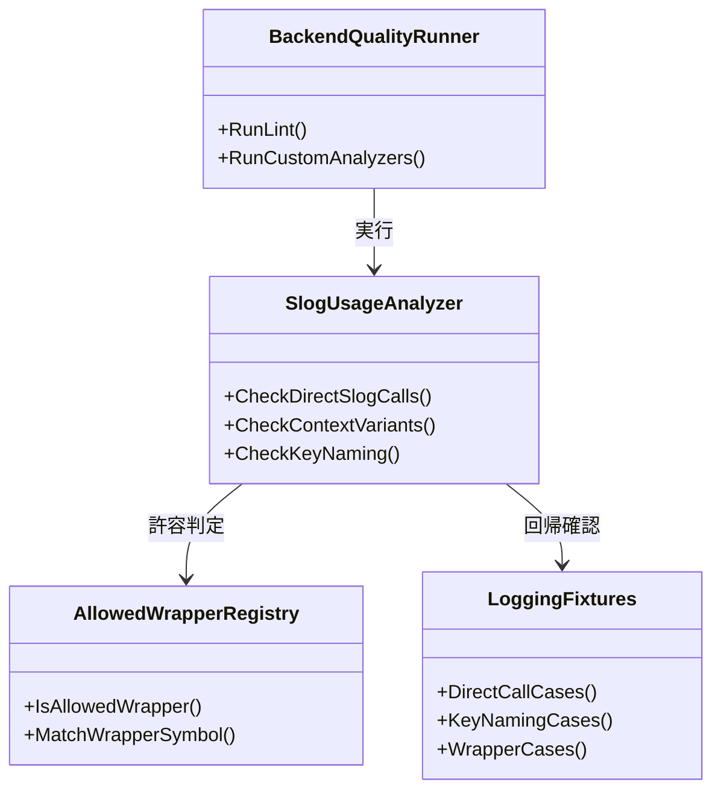
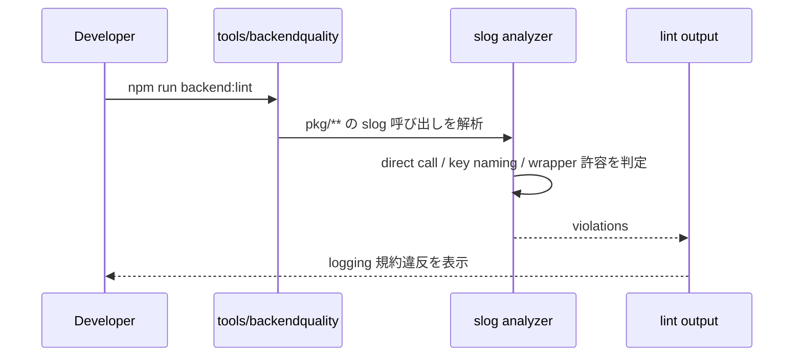

## Context

このリポジトリのバックエンド標準では、`slog.*Context` による構造化ログと lower_snake_case の key 命名が推奨されている。にもかかわらず、現行の品質ゲートは logging 規約を検査しておらず、`slog.Info` などの直接利用や key 命名の揺れがレビュー依存になっている。

`tools/backendquality` は `backend:lint` の単一入口として機能しているため、ここに logging 規約 analyzer を追加するのが最も自然である。一方で logging は wrapper や helper を介した利用も多く、単純なシンボル名一致だけでは誤検知が増えるため、MVP では「禁止パターンが強いもの」から段階導入する。

## Goals / Non-Goals

**Goals:**
- `slog.Info/Error/Warn/Debug` の直接利用と `*Context` 未使用を `backend:lint` で検出できるようにする。
- 主要ログ key の lower_snake_case 違反を一定範囲で機械検査する。
- wrapper 経由の正当利用を許容し、実運用可能な誤検知率に抑える。

**Non-Goals:**
- すべてのログメッセージの文言品質を完全自動判定すること。
- key の動的生成や複雑な wrapper 実装を完全理解すること。
- 本 change だけで既存 logging 呼び出しをすべて修正すること。

## Decisions

### 1. analyzer は禁止 API と key 命名を分けて実装する
- Decision:
  - `slog` 関数選択の検査と key 命名検査を別ルールとして実装し、報告理由を分離する。
- Rationale:
  - `*Context` 未使用と key 命名違反は修正方針が異なるため、同一 violation にまとめると修正コストが読みづらい。
- Alternatives Considered:
  - 単一ルールでまとめて報告: 実装は短いが、違反理由が曖昧になる。

### 2. key 命名の MVP は文字列リテラルに限定する
- Decision:
  - まずは `slog.String("taskId", ...)` のような文字列リテラル key を対象に lower_snake_case を判定する。
- Rationale:
  - 動的組み立て key や定数展開まで一気に対応すると誤検知率と実装コストが跳ね上がる。
- Alternatives Considered:
  - 定数展開や式評価まで実施: 将来の拡張候補だが MVP としては重い。

### 3. wrapper 許容は「内部で `slog.*Context` を呼ぶことが明らかなもの」に限定する
- Decision:
  - 直接 `slog` 呼び出しは blocking にし、wrapper は明示的な許容リストまたは analyzer の軽量追跡で扱う。
- Rationale:
  - logging wrapper を全面禁止すると既存の抽象化を壊すが、無制限に許すと規約強制にならない。
- Alternatives Considered:
  - wrapper を全面禁止: 実装自由度を不必要に落とす。
  - wrapper を全面許容: 違反検出の抜け穴になる。

## クラス図

## シーケンス図

## Risks / Trade-offs

- [Risk] wrapper 許容の判定が弱く、正当な abstraction を誤検知する
  → Mitigation: MVP は明示的な許容リストまたは単純な内部呼び出し判定に限定する。
- [Risk] key 命名検査が文字列リテラル以外を見逃す
  → Mitigation: MVP では coverage より誤検知抑制を優先し、未対応ケースはレビュー観点に残す。
- [Risk] logging 規約の blocking 導入で既存違反が大量に顕在化する
  → Mitigation: fixture と代表パッケージで精度確認後、必要なら段階導入にする。

## Migration Plan

1. `backend-quality-gates` delta spec に logging 規約の検出対象と許容境界を追加する。
2. `tools/backendquality` に `slog` analyzer を追加し、`backend:lint` へ統合する。
3. 直接 `slog` 呼び出し、key 命名違反、wrapper 許容の fixture を整備する。
4. 既存コードに対する影響を確認し、必要なら段階導入または別修正チケットへ切り出す。

Rollback Strategy:
- 誤検知が多い場合は key 命名チェックを warning 相当に下げ、`*Context` 強制から先に安定化する。

## Open Questions

- wrapper 許容を明示リストで持つか、軽量な内部呼び出し追跡で自動判定するか。
- key 命名チェックを `task_id` など主要キーだけに絞るか、全 key へ拡大するか。

## Implementation Notes

- MVP では wrapper の許容判定を「`log/slog` パッケージまたは `*slog.Logger` のシンボルだけを検査対象にする」方式で実装する。
- これにより `slog.*Context` を内部で呼ぶ独自 wrapper は analyzer 対象外となり、明示リストなしで代表的な誤検知を避ける。
- key 命名検査は文字列リテラルのみを対象にし、定数展開・動的生成・message 文言品質は将来拡張へ残す。
- 既存 `pkg/**` への導入では、まず direct `slog` 呼び出しと key 命名違反の顕在化を `backend:lint` で確認し、必要な既存修正は別 change へ切り出せる前提で進める。
