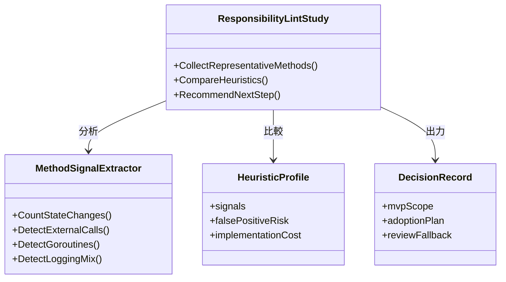
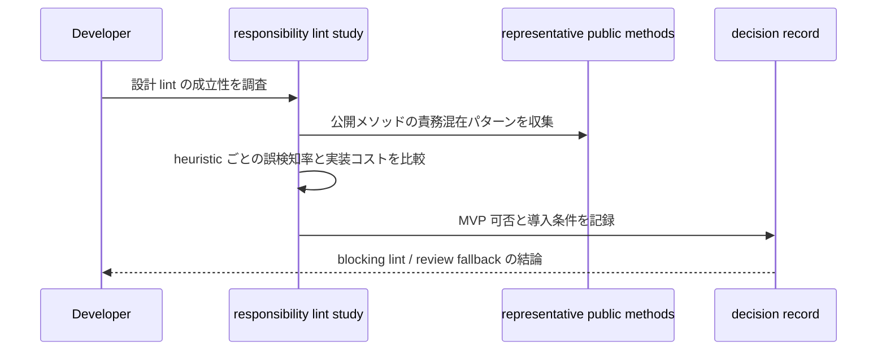

## Context

`backend_coding_standards.md` では「公開メソッドは 1 つの責務に保ち、複雑な分岐や処理列は同一ファイル内のプライベートメソッドへ分割すること」を MUST としている。一方、現行品質ゲートは `golangci-lint` と `go-cleanarch` が中心であり、責務過多のような設計レベル違反は自動化していない。

この change の目的は、直ちに blocking lint を実装することではなく、「どこまでなら機械検査できるか」を整理することにある。責務過多は行数やネスト深度だけで決まらず、状態解決、永続化、ログ、goroutine 起動などの責務混在パターンをどう抽象化するかが鍵になるため、MVP の成立条件を先に定義する。

## Goals / Non-Goals

**Goals:**
- 公開メソッドの責務過多検出について、実装可否・誤検知率・導入コストを比較できる設計をまとめる。
- blocking lint にできる最小 MVP があるかを判断し、ある場合は検出対象と除外境界を明確にする。
- blocking 化が難しい場合に、レビュー運用へ残すべき観点を明文化する。

**Non-Goals:**
- この change で実際の blocking lint を完成させること。
- `pkg/**` の全公開メソッドを一括で是正すること。
- SRP 違反の最終判断を完全自動化すること。

## 責務シグナル候補と MVP 比較軸

### 責務シグナル候補一覧

| シグナル | 検出内容 | 再現性 | 誤検知リスク | 実装コスト |
|-----------|---------|--------|-------------|----------|
| goroutine起動 | `go func()` または `go ...()` を使う公開メソッド | 高い | 中（orchestratorは正当） | 低（AST走査だけ） |
| 永続化呼び出し | store/repository/Save顔のメソッド呼び出し | 高い | 中（正当なサービスは保存する） | 低（関数名パターン一致） |
| 外部I/O呼び出し | LLM/HTTP/ファイルGateway呼び出し | 中 | 低（山なりに明確） | 中（インターフェース型識別が必要） |
| 複数状態更新 | 同一メソッド内で複数のインターフェースの戠改メソッド呼び出し | 低 | 高（正当なcoordinatorがヒット） | 高（型データが必要） |
| 進捗通知呼び出し | notifier/progress層の呼び出し | 中 | 高（正当な候補が多い） | 中 | 
| logger呼び出し | slog.InfoContext系の呼び出し | 非常に高い | 非常に高い（ログは補助責務） | 低 |

### MVP 比較軸の結論

**goroutine起動 × 永続化呼び出し**の組み合わせが最もバランスがよい。
- 再現性：高い（サンプル中複数存在）
- 誤検知リスク：中程度（orchestratorの正当利用と区別が必要）
- 実装コスト：低（AST走査 + インターフェース型バインディングの灣からの判断）

**logger呼び出し単体と進捗通知単体**は MVP 候補から除外する。誤検知率が高すぎるため。

### 各サンプルに対する詳細評価

#### サンプル 1: `Manager.ExecuteSlice`
- **診断**: goroutine起動（`go runProcessInBackground`）と永続化（`persistDispatchedState`）の両方を担う。
- **誤検知分析**: `ExecuteSlice` は公開オーケストレーターエントリーポイントであり、goroutine起動と状態保存は orchestrator 層の受入から使われる正当パターン。
- **blocking適性評価**: **不適** - このメソッドが評価対象になると誤検知になる。orchestrator エントリーポイントの除外アノテーション機構が必要。

#### サンプル 2: `MasterPersonaService.executeRequestPreparation`
- **診断**: LLM呼び出し、キュー書き込み、永続化、進捗通知が混在。責務過多の典型例。
- **誤検知分析**: このメソッドは**プライベート**であるため、公開メソッド対象の MVP ルール 1時点では検出対象外。
- **blocking適性評価**: **MVP履対象外** - 公開メソッドだけを対象にする限り、誤検知にならない。

#### サンプル 3: `translatorSlice.ProposeJobs`
- **診断**: キャッシュ読み込み、結果書き込み、プロンプト構築、ログが混在。
- **誤検知分析**: `ProposeJobs` はパイプラインの刺入から呼び出されるエントリーポイント。goroutine 起動はないが、ループ内の複数責務兔目立つ。
- **blocking適性評価**: **要検討** - goroutine シグナルはないが、外部I/O呼び出し（`resultWriter.Write`, `resumeLoader.LoadCachedResults`）の混在があるjob preparation slice の設計意図として許容延る可能性。

#### サンプル 4: `Manager.Recover`
- **診断**: インフラ復旧、状態一覧取得、goroutine起動の組み合わせ。
- **誤検知分析**: Recover は起動メソッドから呼ばれる初期化実行パターン。goroutine 起動は正当な orchestration。
- **blocking適性評価**: **不適** - 初期化コードは除外境界に属するため。

### 導出された全体評価

4サンプル全てにおいて、goroutine起動＋永続化という MVP 候補シグナルは「orchestrator/初期化」という正当パターンと混在して誤検知になる可能性が高い。
除外アノテーション機構がなければ blocking 導入は実用不能に近い。

## Decisions

### 1. 調査は「責務シグナル」の組み合わせで MVP を検討する
- Decision:
  - 行数やネスト深度だけでなく、永続化呼び出し、logger 呼び出し、goroutine 起動、複数状態更新などの責務シグナルを組み合わせて MVP を考える。
- Rationale:
  - 単一メトリクスでは責務過多をうまく表せず、誤検知も多い。複数シグナルを限定組み合わせで見る方が実用的である。
- Alternatives Considered:
  - 行数 / cyclomatic complexity だけで判断: 実装量の多い正当メソッドまで違反化しやすい。

### 2. blocking 導入条件は「限定スコープで安定して誤検知が低いこと」に置く
- Decision:
  - まずは公開メソッドだけ、かつ特定の責務混在パターンだけに絞った MVP の成立性を評価する。
- Rationale:
  - ルールを広く取りすぎると設計品質よりノイズが増える。初手は再現性の高い違反に限定すべきである。
- Alternatives Considered:
  - すべての公開メソッドへ一律導入: 導入コストに対して精度が見合わない。

### 3. blocking 不適ならレビュー運用へ戻す判断を明示的に残す
- Decision:
  - 調査結果が不十分なら、「lint 化しない」という判断も成果物として残す。
- Rationale:
  - 高コスト lint を曖昧なまま積み残すと、次の change で同じ検討を繰り返すため。
- Alternatives Considered:
  - 結論を保留して先送り: 進捗が見えず、再検討コストが増える。

## クラス図

## シーケンス図

## Risks / Trade-offs

- [Risk] 調査対象サンプルが偏り、実際のコードベースに合わない結論になる
  → Mitigation: workflow / gateway / slice から代表例を複数選び、責務パターンを分散させる。
- [Risk] 設計 lint を作る前提で議論が固定化し、見送り判断がしづらくなる
  → Mitigation: 「blocking 不適ならレビュー運用に残す」を成功条件に含める。
- [Risk] heuristic の数が増えすぎて MVP が曖昧になる
  → Mitigation: 代表的な責務シグナル 2〜3 個の組み合わせに限定して比較する。

## Migration Plan

1. `backend-quality-gates` delta spec に成立性評価 requirement を追加する。
2. `pkg/**` から代表的な公開メソッドを収集し、責務シグナル候補を比較する。
3. MVP 可否、誤検知率、導入コスト、blocking / review fallback の結論を設計文書へまとめる。
4. MVP が成立する場合のみ、次 change で analyzer 実装へ進む。

Rollback Strategy:
- 調査の結果 blocking lint が不適と分かった場合は、実装へ進まずレビュー観点の強化だけを残して終了する。

## 調査サンプル（コードベースから収集済み）

以下のメソッドを `pkg/**` から代表的な公開メソッド候補として収集した。

| # | パッケージ | メソッド | 責務シグナル混在パターン |
|---|-----------|----------|------------------------|
| 1 | `pkg/pipeline` | `Manager.ExecuteSlice` | ①永続化（`persistDispatchedState`）②goroutine起動（`go runProcessInBackground`）③ログ |
| 2 | `pkg/workflow` | `MasterPersonaService.executeRequestPreparation` | ①LLM呼び出し（`PreparePrompts`）②キュー書き込み（`SubmitTaskRequests`）③永続化（`SaveMetadata`）④進捗通知⑤ログ |
| 3 | `pkg/translator` | `translatorSlice.ProposeJobs` | ①キャッシュ読み込み②結果書き込み（`resultWriter.Write`）③プロンプト構築④ログ（ループ内） |
| 4 | `pkg/pipeline` | `Manager.Recover` | ①インフラ復旧（`worker.Recover`）②状態一覧取得（`store.ListActiveStates`）③goroutine起動 |

### サンプル共通の観察
- 全サンプルでログ呼び出しは補助的であり、独立責務とは言いがたい。
- goroutine起動とI/O呼び出しの混在が最も機械検出しやすいシグナルである。
- `executeRequestPreparation` は複数フェーズを1メソッドに直列実行しており、責務過多の典型例だがプライベートメソッドのため公開境界ではない。
- 公開メソッド（`ExecuteSlice`, `Recover`）はorhestrationを担うものであり、goroutine起動＋永続化の組み合わせは設計意図として許容される可能性が高い。

## Open Questions

- 責務シグナルとして最も再現性が高い組み合わせは何か。
- logger 呼び出しや metrics 更新を独立責務として扱うべきか。

## 結論: blocking lint MVP 判定と review fallback

### MVP 判定: **blocking lint としては現時点では不適**

**理由:**

1. **誤検知率が許容レベルを超える**: orchestratorエントリーポイント（`ExecuteSlice`, `Recover`）は goroutine起動＋永続化を正当な設計意図として含む。除外アノテーションなしには誤検知率超過が予想される。
2. **除外機構実装コストが高い**: `//nolint` 標準および orchestrator 層と絞り込むためにはパッケージ層級のアノテーションまたは型流入転用目的判定が必要になり、実装コストが効果に対して大きい。
3. **公開メソッドの責務過多はプライベートメソッドに隠れる**: 最も疑わしいケース（`executeRequestPreparation`）はプライベートであり、公開メソッド対象の MVP では検出できない。

**判定**: 公開メソッドの責務過多に対する blocking lint は、現時点のコードベース構成では誤検知率が高すぎるため **MVP が成立しない**。

---

### Review Fallback: レビュー運用へ残す内容

以下をレビュー観点として `backend_coding_standards.md` またはレビューガイドへ明文化する:

| パターン | レビュー指摘内容 |
|---------|-------------------|
| goroutine起動 × 永続化の公開メソッド | orchestratorエントリーポイントかどうかを明確化する。そうでなければ分割を検討する |
| 5段階以上の直列処理を含む公開メソッド | フェーズ単位でのプライベートメソッド分割を推奨する |
| ループ内で外部I/O呼び出しと永続化が共存する | 変換層とI/O層の庭分けを推奨する |

### 次の考え方: 除外機構仔りの評価

以下の 2 つの条件が満たされた場合にのみ、追加検討を記載した次 change に過ごす:
1. orchestrator 層を特定するコンバンション（許可邨名マッナー等）が定メソッド化できる
2. goroutine起動を除外した別シグナル組み合わせ（主に外部I/O × 形式検県）の誤検知率が許容範囲内であることが検証できる

