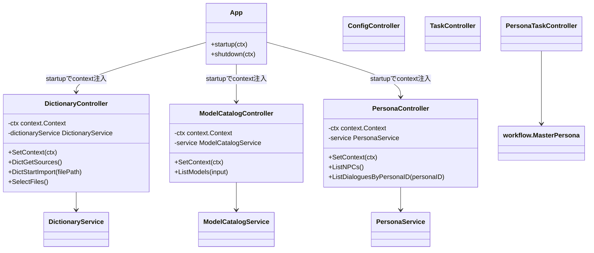
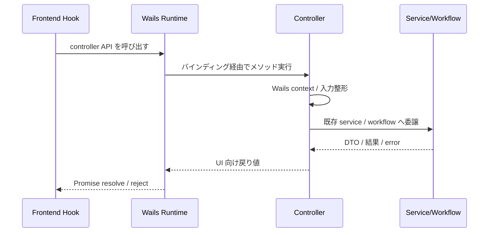

## Context

現状の Wails バインディングは `main.go` の `Bind` に `main.App`、`pkg/controller` の controller 群、`pkg/modelcatalog.ModelCatalogService`、`pkg/persona.Service` が混在している。`app.go` には辞書 API ラッパーとファイルダイアログ API が残り、`modelcatalog` / `persona` も usecase slice 側の service を直接 Wails 公開しているため、`architecture.md` が定義する `controller -> workflow` の境界と一致していない。

既存の frontend は `frontend/src/wailsjs/go/main/App.*`、`frontend/src/wailsjs/go/modelcatalog/ModelCatalogService.*`、`frontend/src/wailsjs/go/persona/Service.*` を参照しうるため、Go 側の bind 対象変更は `wailsjs` 生成物の名前と import 経路に波及する。`frontend_architecture.md` と `frontend_coding_standards.md` に従い、UI からの Wails 呼び出しは feature hook に閉じ込めたまま移行する必要がある。

## Goals / Non-Goals

**Goals:**

- Wails に公開する Go API を `pkg/controller` 配下の型に限定する
- `main.App` から UI-facing API を外し、ライフサイクル保持専用に縮退させる
- `modelcatalog` と `persona` の UI-facing read API を controller 化し、usecase slice 直 bind をやめる
- `frontend/src/wailsjs` 再生成後も、既存画面の利用経路を controller ベースへ追従させる
- 今後の追加 API も `pkg/controller` に集約するための判断基準を明文化する

**Non-Goals:**

- `modelcatalog` / `persona` / `dictionary` の業務ロジック自体を再設計しない
- Wails 以外の入口（CLI、HTTP 等）の導入は行わない
- Wire 導入や DI 全面刷新は今回の変更範囲に含めない
- フロントエンドの画面設計や state 設計を全面的に作り直さない

## Decisions

### 1. Wails 公開面は controller 型に一本化する

`main.go` の `Bind` には `pkg/controller` 配下の型だけを残す。`main.App`、`pkg/modelcatalog.ModelCatalogService`、`pkg/persona.Service` の直接 bind は廃止し、必要な UI 向けメソッドは専用 controller へ移す。

理由:

- `architecture.md` の責務境界に整合する
- Wails へ露出するメソッドを adapter 層に閉じ込められる
- usecase slice の公開メソッド追加がそのまま UI API 露出につながる事故を防げる

代替案:

- `main.App` を controller 相当と見なして継続利用する案
  - 却下理由: `main` は composition root / lifecycle に寄せるべきで、adapter を持ち続けると責務が再拡散する
- service 側へ `wails` 専用 wrapper を増やす案
  - 却下理由: UI-facing contract が slice 側に残り、controller 境界を作れない

### 2. `App` はライフサイクル保持と共通 Wails runtime 依存の最小ホストに縮退する

`App` は `startup` / `shutdown` と、必要であれば controller に注入する共有 `context.Context` の起点だけを担う。辞書 API ラッパーや `SelectFiles` / `SelectJSONFile` のような UI 向け公開メソッドは controller に移管する。

理由:

- `main` 配下の公開メソッド削減で bind 対象を明確化できる
- Wails runtime 依存を controller に閉じた形で注入しやすくなる
- `frontend/src/wailsjs/go/main/App.*` 依存を最終的に解消できる

代替案:

- ファイルダイアログ API だけ `App` に残す案
  - 却下理由: UI 向け API が `main` に残り、設計上の例外が増える

### 3. controller は「Wails adapter」として service / workflow を注入される

新規または拡張する controller は、業務処理を持たず、Wails から受けた入力を既存の `dictionary.DictionaryService`、`modelcatalog.ModelCatalogService`、`persona.Service`、`workflow.MasterPersona` などへ委譲する。`context.Context` が必要な controller は既存の `SetContext` パターンを踏襲し、Wails 起動時に `OnStartup` から注入する。

理由:

- 既存の service / workflow を大きく壊さず移行できる
- controller が orchestration を持たない構成を保ちやすい
- 変更の主眼を「公開境界の整理」に限定できる

代替案:

- controller から workflow への統一を強制し、read API も workflow 化する案
  - 却下理由: 今回は bind 集約が主題であり、read 系 slice API まで orchestration 層へ再配置するとスコープが過大になる

### 4. 旧版互換は取らず、フロント側を新 controller API へ全面追従させる

この変更では旧 `App` / `Service` bind 名との互換は維持しない。ローカル開発中の未公開アプリであり、外部利用者との公開契約が存在しないため、Wails bind 名の変更は frontend 側を一括で追従させる前提で進める。

理由:

- bind 構成の終着点を明確にできる
- 旧名互換のための二重公開や移行コードを完全に排除できる
- frontend 側は hook 境界に閉じているため、変更点を局所化しやすい

代替案:

- 旧 bind 名を残しつつ新 controller も追加する案
  - 却下理由: 移行期間中の API 二重化で責務境界が曖昧なまま残る

### 5. controller 分割は責務別に行い、既存 controller への過積載を避ける

辞書 API、モデル一覧 API、persona 読み取り API、設定 API、タスク API は責務ごとに controller 型を分ける。辞書 API やファイルダイアログを `ConfigController` など既存型へ無理に寄せず、Wails 公開名が明快な単位で分割する。

理由:

- 公開 API の責務が読みやすくなる
- frontend 側も feature ごとに依存先を切り替えやすい
- 今後の API 追加時に単一巨大 controller 化を防げる

代替案:

- `UIController` のような総合 controller へ統合する案
  - 却下理由: 境界は一見まとまるが、変更密度が高い巨大 adapter になりやすい

## Class Diagram

## Sequence Diagram

## Risks / Trade-offs

- [Risk] `frontend/src/wailsjs/go/*` の生成名変更で feature hook の import が即座に壊れる → Mitigation: bind 変更と frontend 追従を同一実装単位で行い、中間互換レイヤーを作らずに一括置換する
- [Risk] `SelectFiles` / `SelectJSONFile` の移管で Wails runtime context 未設定の controller が増える → Mitigation: context を持つ controller の生成規約を `SetContext` に統一し、`OnStartup` で一括注入する
- [Risk] 辞書 API を controller 化する過程で `App` 依存のフロント呼び出しが取りこぼされる → Mitigation: `frontend/src/wailsjs/go/main/App.*` の使用箇所を洗い出してから切り替え、最終的に `App` 参照ゼロを確認する
- [Risk] controller が単なる移植先ではなく新たな業務ロジック置き場になる → Mitigation: controller は入力整形と委譲に限定し、複数 service を束ねる判断が必要な場合は workflow へ送る

## Migration Plan

1. 現在の bind 対象と frontend の `wailsjs` 利用箇所を列挙し、`App` / `ModelCatalogService` / `persona.Service` 依存箇所を確定する
2. 辞書、モデル一覧、persona 読み取りを受ける controller を `pkg/controller` に追加または拡張する
3. `main.go` の DI と `OnStartup` を更新し、新 controller へ依存注入と context 注入を行う
4. `main.go` の `Bind` から `App`、`ModelCatalogService`、`persona.Service` を外し、controller 群のみに置き換える
5. Wails 生成物を更新し、frontend の feature hook を新しい controller import へ一括追従させる
6. frontend lint と backend lint を変更ファイル単位で潰し、その後全体 lint を通す

ロールバック方針:

- bind 切替後にフロントが動作しない場合は、controller 化した変更全体を commit 単位で戻せるよう `Bind` 更新と frontend 追従を同一変更内で完結させる
- 旧 API の暫定温存は行わず、壊れた場合は部分互換ではなく変更全体を戻す

## Open Questions

- ファイルダイアログ API は辞書 controller に寄せるか、共通の file-dialog controller として独立させるか
- `modelcatalog` と `persona` の controller 名を feature 名ベースにするか、`ReadController` のような操作別命名にするか
- `App.Greet` のような初期テンプレート由来 API をこの change で完全撤去するか、別 cleanup に分けるか
