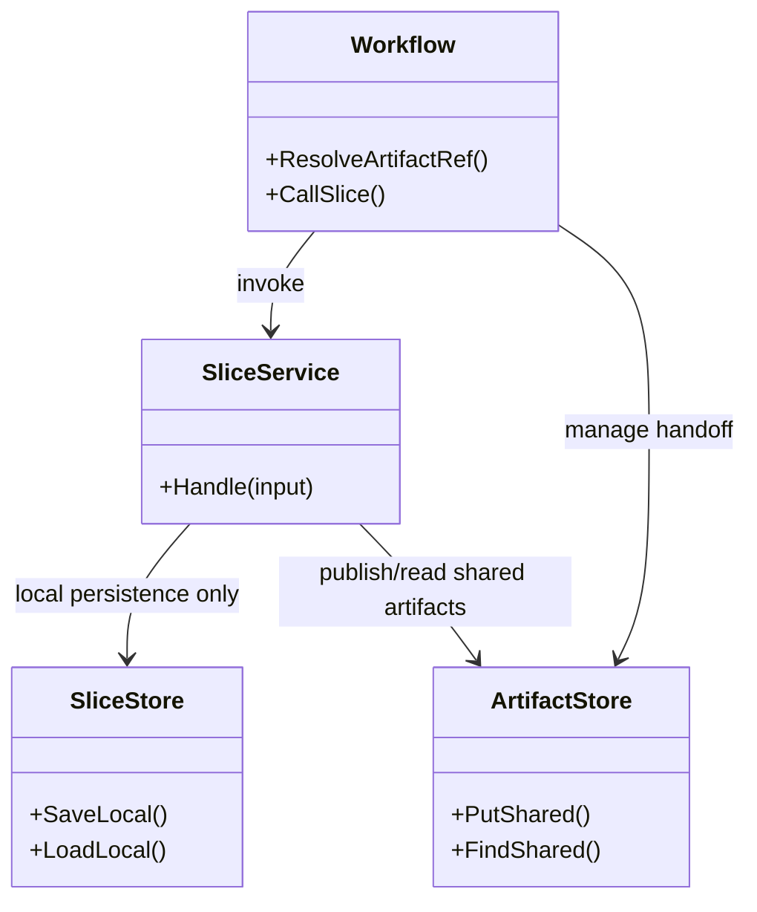
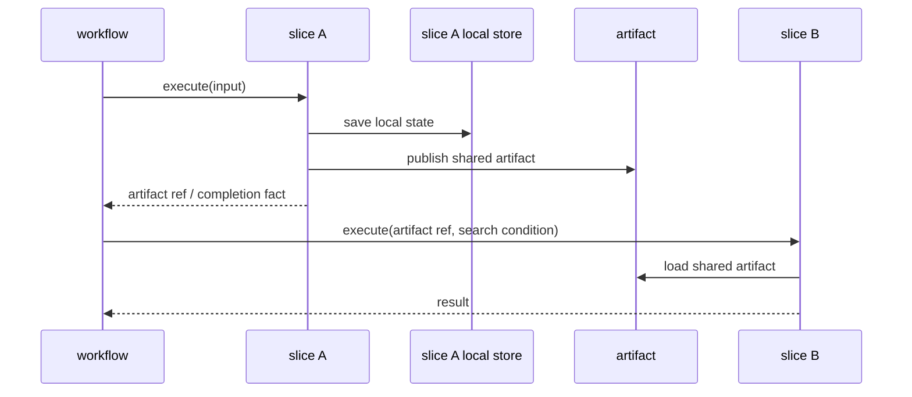

## Context

`pkg/slice/**` には `runtime`、`gateway`、`workflow`、他 slice への直接依存が残っており、`architecture.md` の責務境界と実装が乖離している。特に、slice ごとの SQLite 永続化と slice 間共有データの保存先が混在しており、ローカル DB に残すべきデータと `artifact` へ出すべきデータの判断基準を先に固定しないと、depguard 強化だけでは実装修正が進まない。

この change では、slice ローカル永続化は各 slice 内に閉じ、複数 slice から参照されるデータのみ `artifact` に出す方針を先に決める。あわせて、`depguard` を package 区分ごとに対応するルールだけへ適用し、slice 本番コードとテストコードの両方で境界違反を検出できる状態にする。

## Goals / Non-Goals

**Goals:**
- slice ローカル DB と `artifact` の責務境界を明文化する。
- slice 間受け渡しを `workflow` + `artifact` 経由へ寄せる設計原則を固定する。
- `depguard` が `controller/workflow/slice/runtime/artifact/gateway` の 6 区分に対応し、対象 package にだけ適用されるようにする。
- `pkg/slice/**` のテストを含めて、`artifact` 以外への依存を検知できるようにする。

**Non-Goals:**
- この design 単体で全 slice 実装の移行手順を詳細化しない。
- DB スキーマ自体をこの change で新規追加・変更することは前提にしない。
- `workflow`、`runtime`、`gateway` の違反修正方針までは扱わない。

## Decisions

### 1. slice ローカル永続化と共有データを明示的に分離する
- Decision:
  slice 固有の SQLite / store / persistence は各 slice 配下に残す。後続 slice から再利用される共有データ、中間成果物、resume 用状態だけを `artifact` に置く。
- Rationale:
  既存コードベースは slice ごとに DB が分かれており、ローカル永続化まで `artifact` へ寄せると責務が膨らみすぎる。問題は「ローカル DB を持つこと」ではなく、「他 slice がそれを直接読むこと」なので、共有境界だけを `artifact` に限定する。
- Alternatives Considered:
  - すべての永続化を `artifact` へ統一する案
    - 却下。slice 内完結の保存まで共有境界へ寄せると `artifact` が巨大化し、局所性を失う。
  - 現状の slice 間直接依存を一部黙認する案
    - 却下。`architecture.md` と矛盾し、品質ゲートの基準がぶれる。

### 2. slice 間受け渡しは workflow が artifact 識別子で束ねる
- Decision:
  ある slice の成果物を後続 slice が使う場合、`workflow` が `artifact` 識別子、検索条件、batch / page / cursor を束ねて後続 slice へ渡す。artifact 識別子の粒度は slice と 1:1 を基本とし、各 slice が自身の共有成果物集合を代表する ref を持つ。
- Rationale:
  `architecture.md` の「Explicit Orchestration」「Artifact Is Shared Handoff Boundary」に一致する。slice が他 slice DTO や内部 DB に直接触れずに済み、workflow 側でもどの slice の成果物を扱っているかを一意に判断しやすい。
- Alternatives Considered:
  - slice が他 slice の contract を import して取りに行く案
    - 却下。`slice -> slice` 具象依存を助長する。
  - runtime が slice 間受け渡しを担当する案
    - 却下。runtime は進行決定や slice 固有解釈を持たない。
  - artifact 識別子を用途ごとに細粒度化する案
    - 見送り。まずは slice と 1:1 の ref を基本単位にした方が移行時の判断がぶれにくい。

### 3. pkg/artifact には共通検索契約を先に整備する
- Decision:
  `pkg/artifact/**` が未整備な領域では、capability ごとの shared artifact 実装を増やす前に、まず共通検索契約を整備する。
- Rationale:
  共有境界の初手で capability ごとに保存・検索 API を分断すると、slice 移行中に artifact 契約が乱立しやすい。まず共通検索契約を先に置くことで、workflow が束ねる検索条件と artifact ref の形を揃えやすい。
- Alternatives Considered:
  - capability ごとに個別 artifact 実装を先行する案
    - 見送り。初期移行で契約が分散しやすく、再整理コストが増える。

### 4. depguard は package 区分ごとの files ルールで適用する
- Decision:
  `depguard` は `**/pkg/controller/**/*.go` のような package 区分ごとの `files` パターンを使い、対応する責務区分ルールだけを適用する。
- Rationale:
  `files` を外した全体適用では、`controller` や `workflow` に `slice_boundary` が当たる誤検知が多発した。`**/pkg/...` 形式の `files` なら対象区分へ限定して適用できることを確認済みである。
- Alternatives Considered:
  - `files` を使わず全 package に deny を当てる案
    - 却下。誤検知が多く、違反の優先順位が崩れる。
  - custom linter を追加する案
    - 却下。現時点では `depguard` で十分に表現でき、追加実装コストが不要。

### 5. slice 配下の test code も本番コードと同じ境界で扱う
- Decision:
  `pkg/slice/**` 配下の `*_test.go` にも slice 境界ルールを適用し、`artifact` 以外の他区分 import を禁止する。
- Rationale:
  slice テストで他区分依存を許すと、本流コードの設計違反をテストが補強してしまう。統合検証が必要なら、より上位の `workflow` か専用 integration test の責務に寄せる。
- Alternatives Considered:
  - test code だけ例外にする案
    - 却下。境界崩れの温床になる。

### 6. 移行は lint 設定更新と slice 修正を段階分離する
- Decision:
  この change ではまず仕様と lint 基準を固定し、その後に違反 slice を優先度順に修正する。
- Rationale:
  先にルールと移行先を固定しないと、違反修正ごとに判断がぶれる。OpenSpec でも proposal/specs/design で原則を固めてから tasks 化する方が追跡しやすい。
- Alternatives Considered:
  - lint を先に厳格化して違反修正を都度判断する案
    - 却下。大量違反時にノイズと本命の切り分けが不安定になる。

## Class Diagram

## Sequence Diagram

## Risks / Trade-offs

- [Risk] `artifact` に寄せるべき共有データの境界が曖昧なまま移行すると、slice ローカル DB を過剰に削りすぎる → Mitigation: 「複数 slice から読むか」で一次判定し、単一 slice 専用の保存物は slice 内へ残す。
- [Risk] `depguard` 強化で test code まで大量違反になり、作業量が急増する → Mitigation: tasks で slice ごとに分割し、まず本流 import と共有境界の修正を優先する。
- [Risk] 既存の SQLite 配置方針と `artifact` 導入方針の説明が不足し、再び他 slice 参照が増える → Mitigation: spec に「ローカル DB は slice 内、共有データのみ artifact」を明記し、review.md にも確認観点を追加する。

## Migration Plan

1. `backend-quality-gates` の spec と `.golangci.yml` の depguard ルールを 6 区分前提へ更新する。
2. `pkg/slice/**` の違反を `runtime`、`gateway`、`workflow`、`slice -> slice` に分類する。
3. 各違反について、slice ローカル永続化に残すものと `artifact` へ移す共有データを仕分ける。
4. `pkg/artifact/**` に共通検索契約を先に整備し、slice と 1:1 の artifact ref を前提に呼び出し経路を組み替える。
5. `database_erd.md` に artifact 用ストアを追記し、shared artifact の保存境界を文書化する。
6. slice 配下の test code も同じ境界へ合わせ、必要な結合検証は上位層へ移す。
7. `npm run lint:backend` で depguard 違反が slice 観点で収束したことを確認する。

## Open Questions

- 共通検索契約の検索キーを slice 名ベースだけで足りる形にするか、plugin / task / subject など追加軸を必須化するか。
