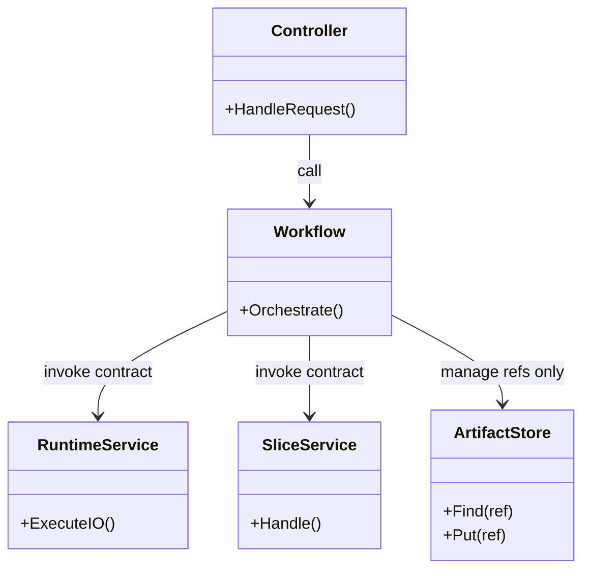
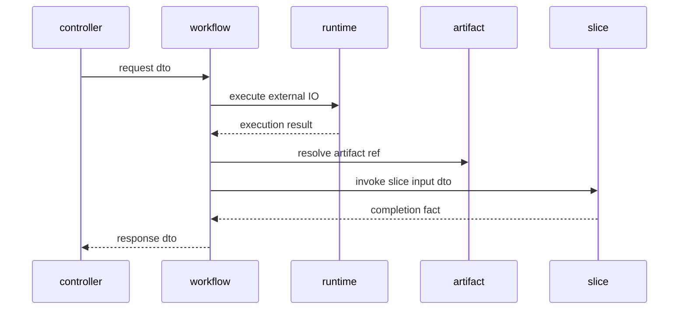

## Context

`pkg/workflow/**` はユースケース進行の orchestration を担う区分だが、現状は `gateway` や `controller` への直接依存が残っている。これにより、workflow が外部 I/O の詳細や UI 境界に引きずられ、`runtime` / `slice` / `artifact` の責務分離が崩れている。workflow 境界違反は test code にも存在し、上位層で検証すべき結合確認が workflow 配下に滞留している。

この change では、workflow を `slice` と `runtime` を束ねる orchestration に絞り、`gateway` 直依存は runtime 契約側へ、UI 境界は controller 側へ戻す。共有データは workflow 自身が本体を持つのではなく、artifact 識別子や検索条件だけを管理する方針で統一する。

## Goals / Non-Goals

**Goals:**
- workflow から `gateway`、`controller`、`artifact` 実装詳細への直接依存を除去する方針を固定する。
- workflow は `slice` 呼び分け、`runtime` 利用、artifact 識別子管理に集中する。
- `pkg/workflow/**` の本番コードと test code に同じ depguard 境界を適用できるようにする。
- 既存 workflow 実装の違反を、runtime 契約・controller 境界・artifact 参照へ移す移行順序を整理する。

**Non-Goals:**
- runtime や gateway 自身の詳細設計をこの change 単体で完了させない。
- 全 integration test の最終配置を一気に確定しない。
- DB スキーマ変更を前提にしない。

## Decisions

### 1. workflow は gateway を直接 import せず共通 executor 契約を先に runtime へ整備する
- Decision:
  workflow が直接呼んでいる LLM や外部 I/O は、capability ごとに個別分割する前に、まず runtime 側の共通 executor 契約へ寄せる。workflow はその共通 executor 契約を介して利用する。
- Rationale:
  `architecture.md` では外部 I/O を伴う実処理は runtime が実行する。まず共通 executor 契約を立てることで、workflow から gateway を剥がしつつ、後続で capability 別契約へ分割する余地を残せる。
- Alternatives Considered:
  - capability ごとに runtime 契約を先に細分化する案
    - 見送り。現状の違反を剥がす初手としては分割単位の判断コストが高い。
  - workflow に gateway 直接依存を一部残す案
    - 却下。責務境界が曖昧になり、runtime の存在理由が弱くなる。
  - slice 側へ gateway 依存を戻す案
    - 却下。slice autonomy に反する。

### 2. workflow は共有データ本体ではなく artifact 参照情報だけを保持する
- Decision:
  workflow は後続 slice へ渡す共有データ本体を自前保持せず、artifact 識別子、検索条件、batch / page / cursor だけを管理する。
- Rationale:
  workflow がデータ本体まで抱えると、保存境界と進行制御が再び密結合する。artifact を handoff boundary として固定する方が resume と再実行も整理しやすい。
- Alternatives Considered:
  - workflow メモリ内へ共有データを保持する案
    - 却下。再開性と責務境界が悪化する。
  - slice 間で直接 DTO を受け渡す案
    - 却下。`slice -> slice` 依存を助長する。

### 3. workflow 配下の integration test は上位 API テスト資産へ移管する
- Decision:
  `pkg/workflow/**` 配下の test code にも workflow 境界を適用し、controller / gateway 直接依存は原則禁止する。現在 workflow 配下にある integration test は、最終的に API テスト相当の上位テスト資産として移管し、workflow 配下からは削除する。
- Rationale:
  test だけ例外にすると、workflow の責務外依存をテストが固定化してしまう。結合検証が必要なケースは、workflow 単体責務ではなく上位層の API / integration asset として管理した方が責務分離に合う。
- Alternatives Considered:
  - workflow test だけ controller / gateway を許可する案
    - 却下。実装境界の退行を見逃しやすい。
  - workflow 配下に integration test を残す案
    - 却下。将来の API テスト資産と責務が二重化する。

### 4. artifact ref は所有者が分かる命名へ統一する
- Decision:
  workflow が扱う artifact ref は、誰の成果物かが識別できる命名と検索条件へ統一する。少なくとも owner slice / producer capability / logical subject が読み取れる識別子を前提にする。
- Rationale:
  artifact ref が匿名的だと、workflow 間で共有ルールが揺れ、検索条件も個別最適化されやすい。所有者と生成元が分かる命名に寄せることで、handoff と再開時の追跡性が上がる。
- Alternatives Considered:
  - artifact ref 命名規則を後続 change へ先送りする案
    - 見送り。workflow の移行設計と不可分であり、この段階で前提を固定した方が task 化しやすい。
  - ランダム ID のみで扱う案
    - 却下。検索条件設計が分散しやすい。

### 5. depguard は workflow 専用 files ルールで適用する
- Decision:
  `depguard` は `**/pkg/workflow/**/*.go` に対して workflow 専用ルールだけを適用する。
- Rationale:
  全 package へ一括適用すると、workflow 以外への誤検知が増える。対象 package ごとの `files` ルールで適用範囲を絞る必要がある。
- Alternatives Considered:
  - workflow ルールを全 package へ適用する案
    - 却下。lint ノイズが増え、違反優先度が崩れる。

## Class Diagram

## Sequence Diagram

## Risks / Trade-offs

- [Risk] workflow 直下の integration test を上位層へ寄せる過程で、既存の検証粒度が一時的に崩れる → Mitigation: test ごとに「workflow 単体責務か、上位結合か」を仕分けて移す。
- [Risk] gateway 依存を runtime 契約へ寄せる途中で interface 分割が増えすぎる → Mitigation: 初手は共通 executor 契約で受け、実装収束後に capability 単位へ再分割する。
- [Risk] artifact 識別子設計が曖昧だと workflow がデータ本体を抱え続ける → Mitigation: owner slice / producer capability / logical subject が読める artifact ref 命名規則を先に定義する。

## Migration Plan

1. `backend-quality-gates` に workflow 境界違反検知要件を反映する。
2. `pkg/workflow/**` の depguard 違反を `gateway` / `controller` / `artifact` 依存に分類する。
3. gateway 直依存はまず共通 executor 契約へ寄せ、UI 境界は controller 側へ移す。
4. workflow が保持している共有データ本体を、owner が分かる artifact ref 管理へ置き換える。
5. workflow 配下の integration test を API テスト相当の上位テスト資産へ順次移管し、workflow 配下からは削除する。
6. `npm run lint:backend` で workflow 境界違反が想定どおり収束することを確認する。

## Open Questions

- 共通 executor 契約を capability 単位へ再分割するタイミングをどの change で扱うか。
- API テスト資産の最終配置を `controller` 近傍に置くか、専用 integration test パッケージへ切り出すか。
- artifact ref の owner / producer / logical subject をどの粒度まで必須フィールドにするか。
