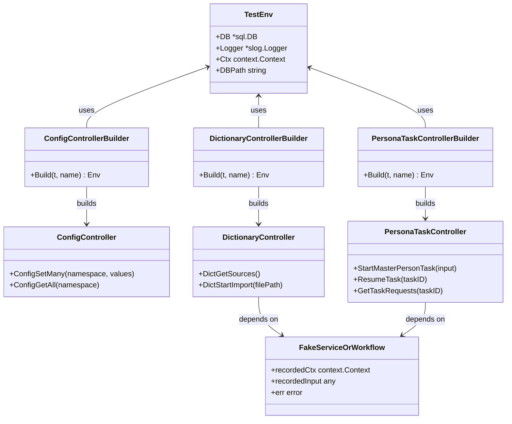
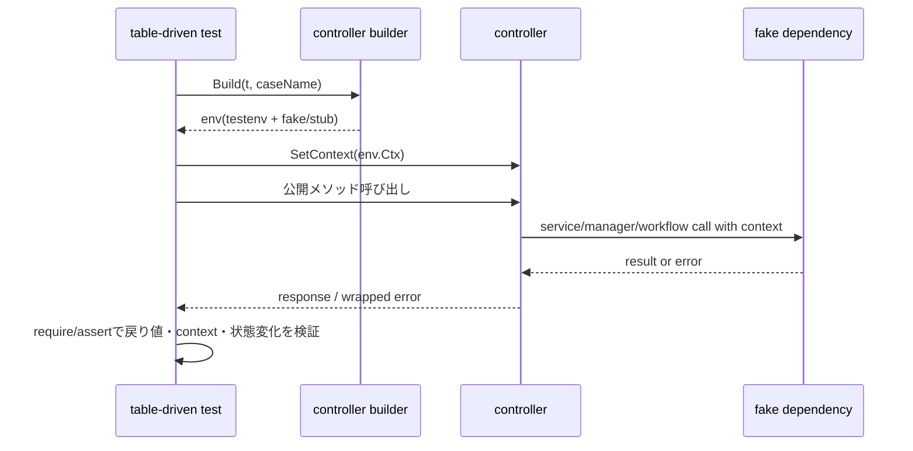

## Context

`pkg/controller` には `ConfigController` 以外にも `DictionaryController`、`ModelCatalogController`、`PersonaController`、`PersonaTaskController`、`TaskController`、`FileDialogController` が存在し、それぞれ公開メソッドを Wails 境界として提供している。現状の API テストは `ConfigController` のみが先行しており、controller 追加や workflow 変更時に公開 API の退行を横断的に検知できない。

この変更は `openspec/specs/architecture.md` の controller 責務に従い、controller 自身では orchestration を持たず、request/response 境界と context 伝播を検証対象に据える。テスト形式は `openspec/specs/standard_test_spec.md` と `openspec/specs/api-test/spec.md` に合わせ、公開メソッド単位の table-driven test を `pkg/tests/api_tests` 配下の testenv / builder で支える。

既存 controller は依存構成が一様ではない。`ConfigController` は SQLite ベースの store を伴い、`DictionaryController` と `ModelCatalogController` は service 呼び出し中心、`PersonaTaskController` と `TaskController` は manager / workflow の組み合わせ、`FileDialogController` は Wails runtime 依存を持つ。この差を 1 つの巨大 testenv に押し込むと責務が崩れるため、共通基盤は最小限に留め、controller 別 builder で差分を吸収する必要がある。Dictionary Builder と Master Persona の主要テスト対象は `specs/api-test/spec.md` を親 spec としつつ、`specs/api-test/dictionary-builder.md` と `specs/api-test/master-persona.md` に分割して管理する。

## Goals / Non-Goals

**Goals:**
- `pkg/controller` の既存公開メソッドを controller ごとに棚卸しし、未整備 API テストを段階的ではなく一括で回帰保護できる状態にする。
- table-driven test を基本形として、正常系と主要異常系、入力検証、context 伝播、error wrap のような controller 境界の責務を固定する。
- Dictionary Builder と Master Persona について、主要ワークフローを controller API 経由でテストできる状態にする。
- `pkg/tests/api_tests/testenv` は DB / logger / trace context など共通土台のみに限定し、controller 固有依存は controller 別 builder に分離する。
- `go test ./pkg/...` と既存 backend 品質導線で継続実行できる配置を維持する。

**Non-Goals:**
- `pkg/workflow`、`pkg/slice`、`pkg/runtime` の内部ロジックを API テストで網羅すること。
- 新しいテストフレームワークや非標準ライブラリを導入すること。
- controller 公開 API のシグネチャ変更や機能追加を行うこと。
- Wails ネイティブダイアログそのものの E2E 挙動を backend API テストで完全再現すること。

## Decisions

### 1. controller を依存パターン別に分類して builder を増設する
- 方針: `pkg/tests/api_tests/testenv` は file-based SQLite、logger、trace context のような共有基盤に限定し、controller ごとに `pkg/tests/api_tests/<controller>/builder.go` を追加して依存組み立てを行う。
- 理由: `api-test` spec が求める「共通化し過ぎない builder 分離」に合致し、architecture.md の責務境界も守れるため。
- 代替案A: すべての controller 依存を 1 つの巨大 `testenv.Env` に詰め込む。
  - 不採用理由: workflow / store / service の境界が曖昧になり、未使用依存が増えて保守性が落ちる。
- 代替案B: controller ごとに個別セットアップをテストファイルへ直書きする。
  - 不採用理由: DB 準備、trace context、logger 初期化の重複が発生し、テストの追加コストが高い。

### 2. controller API テストは「公開メソッドの入出力契約」と「境界責務」に集中する
- 方針: 各 controller の table-driven test では、公開メソッド呼び出しに対する戻り値、error、状態変化、context 伝播を検証し、内部 service / manager の詳細アルゴリズムまでは掘り下げない。
- 理由: controller の責務は request/response 整形と workflow / service 呼び出しであり、内部ロジックの詳細まで API テストで追うと slice / workflow テストとの責務競合が起きる。
- 代替案A: controller から下流の workflow / slice の実処理まで一体で検証する。
  - 不採用理由: 失敗原因の切り分けが悪化し、controller API テストの保守単位として大きすぎる。
- 代替案B: 返り値のみを検証し、context や error wrap は見ない。
  - 不採用理由: backend coding standards の MUST である context 伝播と error 文脈付与を固定できない。

### 3. service / manager / workflow 依存は局所スタブで置き換える
- 方針: `DictionaryController`、`ModelCatalogController`、`PersonaController`、`TaskController`、`PersonaTaskController` では、必要なメソッドだけを持つテスト用スタブまたは薄い fake を controller 別 builder 配下に置く。
- 理由: `stretchr/testify` を使った table-driven test と相性が良く、外部 I/O や複雑な永続化を持ち込まずに controller の振る舞いへ焦点を当てられる。
- 代替案A: gomock などのモック生成ライブラリを導入する。
  - 不採用理由: この変更の対象は既存 controller API の回帰保護であり、現状の規模では手書きスタブの方が依存追加なしで十分。
- 代替案B: 実サービスを毎回組み立てる。
  - 不採用理由: テストの準備コストが高く、controller 境界以外の失敗要因が増える。

### 4. `FileDialogController` は Wails runtime を直接叩かない seam を導入するか、最小責務に限定して検証する
- 方針: API テスト可能性を確保するため、`FileDialogController` にはダイアログ呼び出し関数を差し替え可能にする小さな seam を追加する案を採る。これにより、公開 API のタイトル・フィルタ・error wrap を table-driven で検証できる。
- 理由: 現状の `runtime.OpenFileDialog` / `runtime.OpenMultipleFilesDialog` 直呼びでは unit/API テストから差し替えできず、controller 群の中でこのファイルだけ未カバーになる可能性が高い。
- 代替案A: `FileDialogController` はテスト対象外として明示する。
  - 不採用理由: `api-test` spec の「対象を `pkg/controller/**` の公開メソッドに限定する」という要求と齟齬が出る。
- 代替案B: Playwright や Wails 実行下の E2E のみで担保する。
  - 不採用理由: backend API テスト基盤の責務から外れ、日常の `go test ./pkg/...` 導線で退行検知できない。

### 5. テストケース設計は controller ごとの公開メソッド群を 1 ファイル 1 table-driven 集約で扱う
- 方針: 既存 `config_controller_test.go` と同様に、controller ごとに公開メソッドを複数ケースとしてまとめた table-driven test を基本にし、DB path 検証や context 伝播のような横断観点は別テストとして補助する。
- 理由: `standard_test_spec.md` の parameterized test 方針に沿いながら、controller 単位で失敗箇所を追いやすくできる。
- 代替案A: 公開メソッドごとにテストファイルを分ける。
  - 不採用理由: 依存準備が分散し、builder 追加時の修正点が増える。
- 代替案B: すべての controller を 1 つの巨大テストにまとめる。
  - 不採用理由: 差分確認と失敗解析がしづらい。

### 6. 既存 capability 変更として `api-test` spec を拡張する
- 方針: 新規 capability は増やさず、既存 `openspec/specs/api-test/spec.md` に「現行 controller 群の公開メソッドへ実テストを整備する」要求と scenario を追加する。Dictionary Builder と Master Persona の詳細対象は `specs/api-test/dictionary-builder.md` と `specs/api-test/master-persona.md` に分割して保持する。
- 理由: 今回の変更は新しい基盤の発明ではなく、既存 API テスト能力を現行コードへ適用範囲拡大する作業だから。
- 代替案A: `controller-api-coverage` のような新 spec を作る。
  - 不採用理由: `api-test` と責務が重複し、spec の境界が不必要に細分化される。
- 代替案B: すべての詳細ケースを親 spec に詰め込む。
  - 不採用理由: 親 spec が肥大化し、どこまでが共通要件でどこからが個別対象かが読みにくくなる。
## Class Diagram

## Sequence Diagram

## Risks / Trade-offs

- [Risk] `FileDialogController` の Wails runtime 依存が強く、差し替え seam を入れないとテスト不能になる → Mitigation: 小さな関数フィールドまたは package-level wrapper を追加し、controller の公開 API は維持したまま差し替え可能にする。
- [Risk] 実サービスを使わないスタブ中心のテストでは、service 側仕様変更とのズレが起きうる → Mitigation: controller テストの責務を境界整形と呼び出し契約に限定し、下流仕様は各 slice / workflow 側テストで担保する。
- [Risk] controller ごとに builder を増やしすぎると構成が散らばる → Mitigation: `pkg/tests/api_tests/<controller>/builder.go` という固定配置に統一し、共有化は testenv に最小限だけ戻す。
- [Risk] 既存 controller の公開メソッド数が増えた場合にテストケース表の保守量が上がる → Mitigation: controller 単位で table-driven に集約し、ケース ID と目的を揃えた記法で追加する。

## Migration Plan

1. `api-test` spec に、現行 controller 群の公開メソッドへ API テストを整備する requirement / scenario を追加する。
2. `pkg/controller` の公開メソッドを棚卸しし、依存パターンごとに必要な builder と fake を `pkg/tests/api_tests` 配下へ追加する。
3. 各 controller の table-driven test を追加し、正常系・主要異常系・入力検証・context 伝播・error wrap を順に固定する。
4. `backend:lint:file` を変更ファイル単位で回しながら調整し、最後に `lint:backend` と `go test ./pkg/...` 相当の導線で確認する。
5. ロールバックが必要な場合は、追加した test / builder / seam を差し戻して既存 `ConfigController` テストのみの状態へ戻す。公開 API の互換性は維持するため、データ移行は不要。

## Open Questions

- `DictionaryController`、`ModelCatalogController`、`PersonaController` の依存型が具象 service ポインタで固定されているため、テスト seam を interface 化せずにどう差し替えるか。最小変更で済ませるには builder で実サービスを組むか、controller 側コンストラクタを interface 受けに寄せるか判断が必要。
- `FileDialogController` の seam はコンストラクタ引数、構造体フィールド、package-level wrapper のどれが既存 Wails 配線への影響が最小か。
- `PersonaTaskController.CancelTask` は error を返さずログのみ出すため、API テストで何をもって成功判定とするか。呼び出し有無、nil workflow 時の no-op、ログ出力のいずれまで確認するか整理が必要。
