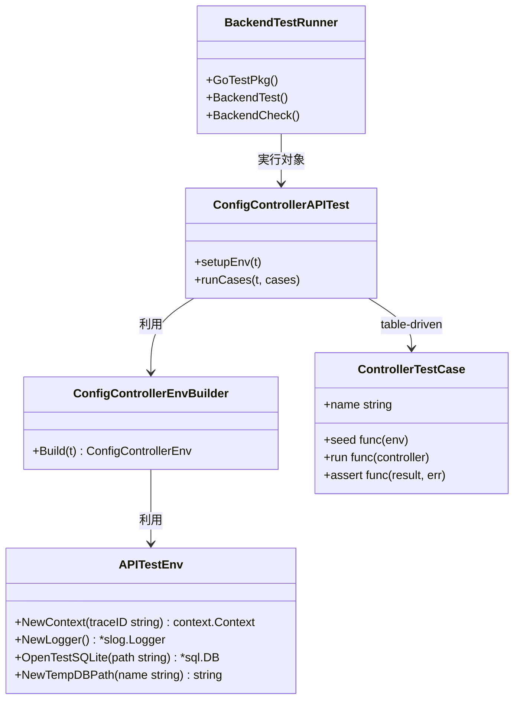
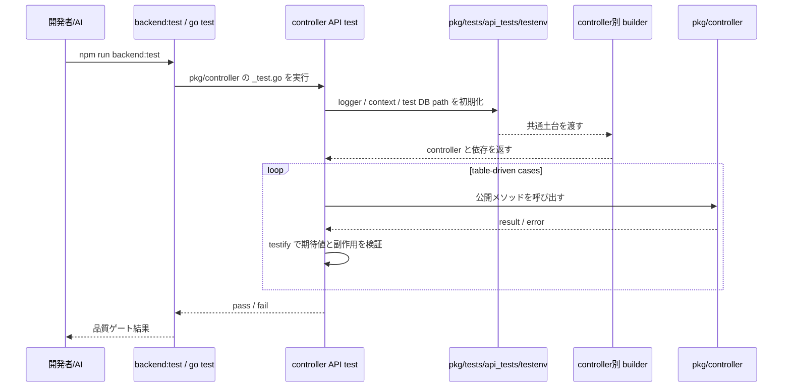

## Context

本変更は、`pkg/controller/**` の公開メソッドを API とみなし、controller API テストを追加しやすくする共通実行基盤を整備するための設計である。`architecture.md` では外部入力の入口が `controller` に集約されているため、API テスト基盤も同じ責務境界に合わせて `pkg/controller` へ限定する。

現状でも `pkg/controller/config_controller_test.go` のような個別テストは存在するが、controller ごとに DB 初期化、store 準備、logger、`context.Context` を都度組み立てており、今後 controller が増えるとセットアップの重複と品質のばらつきが増えやすい。今回の変更では、`standard_test_spec.md` に沿う table-driven test を前提に、controller API テストで共通利用する `testenv` と配置方針を定義する。

制約は次のとおり。

- 対象は `pkg/controller/**` の公開メソッドに限定し、`workflow`、`slice`、`runtime` の内部契約テスト基盤は扱わない
- テスト補助の物理配置は `pkg/tests/api_tests` とする
- テストアサーションは `stretchr/testify` を採用する
- ファイルベース SQLite を使う場合、テスト用 DB は通常の `db/` とは別の `tmp/api_test_db/` へ生成する
- 実行導線は既存の `go test ./pkg/...`、`npm run backend:test`、`npm run backend:check` を崩さずに拡張する
- `standard_test_spec.md` の table-driven / context 伝播 / 構造化ログ前提を満たす

## Goals / Non-Goals

**Goals:**

- controller API テストで再利用する共通 `testenv` を `pkg/tests/api_tests` に定義する
- DB、config store、logger、`context.Context` などのセットアップ重複を減らす
- controller 公開メソッドの正常系・異常系を table-driven に追加しやすくする
- `testify` によりアサーション記法を統一する
- テスト用 SQLite DB を通常の `db/` と分離して扱えるようにする
- 既存の `backend:test` / `backend:check` 導線へ自然に接続する

**Non-Goals:**

- `pkg/workflow/**`、`pkg/slice/**`、`pkg/runtime/**` のテスト基盤整備
- HTTP サーバーや外部実サービスを起動する結合テスト基盤の導入
- テストランナーの全面刷新
- フロントエンド E2E や Wails UI テストの追加

## Decisions

### 1. API テスト対象は `pkg/controller/**` の公開メソッドに限定する

- Decision:
  - API テスト基盤は controller 公開メソッドだけを対象とする。
- Rationale:
  - `architecture.md` 上の外部入口は controller であり、API テストの責務境界もそこへ揃えるのが自然だから。
- Alternatives Considered:
  - `pkg/**` 全体を API テスト対象にする案
    - 却下。workflow / slice / runtime は内部契約であり、API テストと内部テストの境界が曖昧になる。

### 2. testenv の物理配置は `pkg/tests/api_tests` に固定する

- Decision:
  - 共通 `testenv` と API テスト helper は `pkg/tests/api_tests` 配下へ配置する。
  - controller 別の builder や env 作成関数も同配下で整理する。
- Rationale:
  - controller 直下へテスト補助を分散させず、API テスト基盤を 1 箇所へ集約できるから。
- Alternatives Considered:
  - `pkg/controller/test` に置く案
    - 却下。controller 実装とテスト補助の責務が混ざりやすい。
  - ルート共通の `testutil` を作る案
    - 却下。API テスト以外まで巻き込みやすく、共通化が肥大化しやすい。

### 3. 共通 testenv は土台に限定し、controller ごとの差分は builder で吸収する

- Decision:
  - 共通 `testenv` は DB、logger、trace 付き `context.Context`、共通 utility の提供に限定する。
  - controller ごとに必要な workflow、store、gateway などの依存差分は controller 別 builder または env 作成関数で組み立てる。
- Rationale:
  - controller ごとに依存構成が異なるため、単一 `testenv` に全依存を押し込むと肥大化して見通しが悪くなるから。
- Alternatives Considered:
  - 単一の巨大 testenv ですべての依存を初期化する案
    - 却下。使わない依存まで毎回初期化され、変更影響も広がる。
  - 完全に controller ごとの helper だけで運用する案
    - 却下。DB、logger、context などの共通土台まで重複しやすい。

### 4. テストケースは table-driven を標準形にする

- Decision:
  - controller API テストは、原則として入力、前提状態、期待結果を持つ table-driven test で記述する。
  - 1 つの公開メソッドに対して正常系と異常系を同じテーブルで管理できる形を優先する。
- Rationale:
  - `standard_test_spec.md` と整合し、ケース追加時の差分が読みやすくなるから。
- Alternatives Considered:
  - 単発テストを公開メソッドごとに増やす案
    - 却下。ケースが増えたときに網羅性と見通しが落ちる。

### 5. アサーションは `stretchr/testify` を採用する

- Decision:
  - API テストの標準アサーションとして `stretchr/testify` の `require` / `assert` を採用する。
- Rationale:
  - table-driven test で失敗条件と期待値を簡潔に書け、テスト補助の独自実装を減らせるから。
- Alternatives Considered:
  - Go 標準 `testing` のみで運用する案
    - 却下。テストコードの重複が増えやすく、可読性も落ちやすい。

### 6. テスト用 SQLite DB は `tmp/api_test_db/` に分離する

- Decision:
  - ファイルベース SQLite を利用する API テストでは、DB ファイルを `tmp/api_test_db/` 配下へ生成する。
  - この保存先は `.gitignore` へ追加し、通常の `db/` 配下とは明確に分離する。
- Rationale:
  - 開発用の永続 DB を誤って汚染せず、テスト生成物の位置も追いやすくなるから。
- Alternatives Considered:
  - 通常の `db/` 配下を流用する案
    - 却下。通常 DB とテスト DB が混在し、事故の元になる。
  - 常に `:memory:` だけで運用する案
    - 却下。ファイルベースで確認したいケースやデバッグ時の再現性を失う。

### 7. 実行導線は既存 `go test ./pkg/...` に統合する

- Decision:
  - controller API テストは通常の `_test.go` として `pkg/controller/**` 配下で実装し、既存の `go test ./pkg/...`、`npm run backend:test`、`npm run backend:check` から実行されるようにする。
- Rationale:
  - 新しい専用ランナーを作らずに、既存品質ゲートへ最小変更で統合できるから。
- Alternatives Considered:
  - `backend:api-test` のような別コマンドを必須化する案
    - 却下。日常フローが増え、既存の `backend:test` との責務が分散する。

## クラス図

## シーケンス図

## Risks / Trade-offs

- [Risk] `pkg/tests/api_tests` が汎用 testutil 化して肥大化する
  - Mitigation: API テスト専用責務に限定し、共通土台以外は controller 別 builder に分離する
- [Risk] `testify` への依存追加で記法が二重化する
  - Mitigation: 新規 API テストでは `testify` を標準に統一し、独自アサーション helper を増やさない
- [Risk] `tmp/api_test_db/` の掃除漏れで生成物が残る
  - Mitigation: `.gitignore` へ追加し、テスト終了時に削除可能な helper を持たせる
- [Risk] `backend:check` 実行時間が増える
  - Mitigation: API テストは `pkg/controller/**` 配下の通常テストとして実装し、外部プロセス起動や重い統合処理は含めない

## Migration Plan

1. `openspec` 上で `api-test` と `backend-quality-gates` の変更 spec を確定する
2. `pkg/controller/**` の既存テストを棚卸しし、重複しているセットアップを抽出する
3. `pkg/tests/api_tests` 配下に共通 `testenv` と controller 別 builder を追加する
4. `stretchr/testify` を導入し、API テストのアサーションを統一する
5. `tmp/api_test_db/` をテスト用 SQLite 保存先として追加し、`.gitignore` へ反映する
6. 既存 controller テストを必要に応じて table-driven へ寄せながら `testenv` 利用へ移行する
7. `go test ./pkg/...`、`npm run backend:test`、`npm run backend:check` で controller API テストが通ることを確認する

Rollback Strategy:
- `pkg/tests/api_tests` の共通土台が過剰になった場合は、controller 別 builder へ責務を戻す
- `testify` 導入が不適切と判断された場合は、新規テストから標準 `testing` に戻す
- テスト用 DB 保存先は `tmp/api_test_db/` に閉じているため、削除で巻き戻せる

## Open Questions

- なし。配置、アサーションライブラリ、テスト用 DB 保存先は本 change で確定済み
