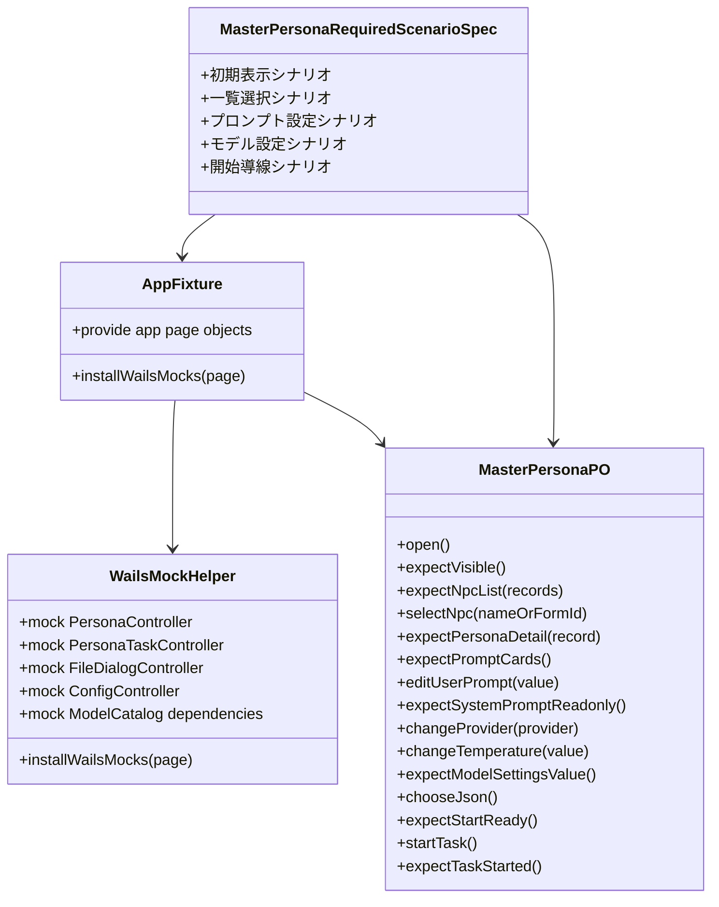
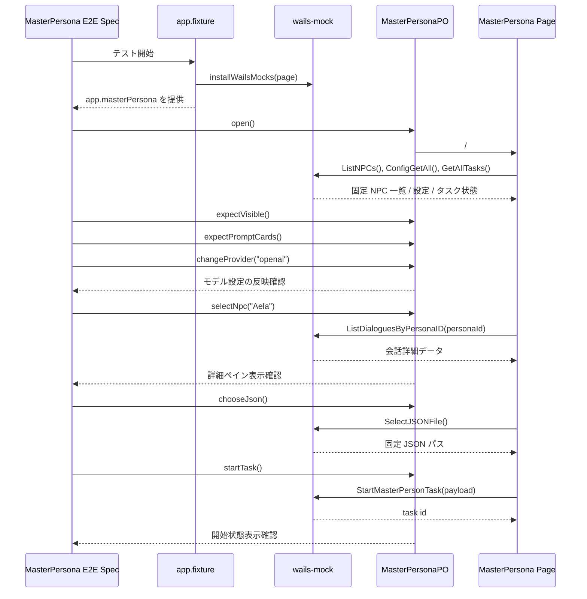

## Context

現在の Playwright E2E は `app-shell.spec.ts` により `MasterPersona` への遷移自体は検証しているが、ページ内で利用者が実際に行う主要操作までは品質ゲートに含まれていない。`frontend/src/e2e` は fixture から Wails binding をモックし、spec から PageObject を呼び出す構成へ移行済みであり、今回の変更はその枠組みの上で `MasterPersona` 向け必須シナリオを追加するものになる。

`MasterPersona` ページは headless hook `useMasterPersona` にロジックを集約し、UI 側は JSON 選択、進捗表示、プロンプト設定、モデル設定、NPC 一覧、詳細表示、タスク操作を描画している。特に `PromptSettingCard` と `ModelSettings` はページの利用価値を支える主要 UI であり、ここが壊れると生成フロー全体が成立しない。既存の E2E モックでは `PersonaController.ListNPCs` や `FileDialogController` が空実装寄りのため、一覧選択、設定編集、開始導線まで検証するには fixture / mock / page object を一貫して拡張する設計が必要である。

## Goals / Non-Goals

**Goals:**
- `MasterPersona` ページに対するページ単位 E2E の必須シナリオを定義し、Playwright で継続実行できるようにする。
- 既存の PageObject 中心アーキテクチャを維持し、spec から直接 locator を増やさない。
- Wails モックを `MasterPersona` の主要導線が成立する最小データセットへ拡張し、一覧表示・詳細表示・設定編集・タスク開始状態の退行を検出できるようにする。
- `e2e-required-scenarios` のページ別 spec に落とし込める粒度で、シナリオの責務境界を明確にする。

**Non-Goals:**
- Wails ネイティブ実行や実バックエンド接続を前提にした統合試験へ拡張しない。
- LLM 実行完了、進捗イベントの最終完了、永続化結果の厳密検証までは今回の必須シナリオに含めない。
- `MasterPersona` UI 自体のレイアウト変更や hook 分割リファクタは行わない。
- `DictionaryBuilder` など他ページの既存必須シナリオ構成は変更しない。

## Decisions

### 1. 必須シナリオは `MasterPersona` の主要な 5 導線に広げる
今回のページ別必須シナリオは以下の 5 本とする。
- 初期表示: ページタイトル、JSON 選択領域、進捗表示、プロンプト設定、モデル設定が見えること
- 一覧選択: モックされた NPC 一覧が表示され、行選択に応じて詳細ペインに対象 NPC 情報が表示されること
- プロンプト設定表示: ユーザープロンプトとシステムプロンプトのカードが表示され、編集可 / Read Only の区別を識別できること
- モデル設定操作: プロバイダ切替やスライダー操作など `ModelSettings` の主要 UI が反応し、値変更が画面に反映されること
- タスク開始準備: JSON 選択後に開始ボタンが有効になり、開始操作で「実行中」状態または開始要求反映を確認できること

代替案として、これらを単一の長い統合シナリオへまとめる方法もあるが、失敗時の切り分けが悪くなる。ページ品質ゲートとして必要な利用目的ごとに分けて定義する。

### 2. `MasterPersonaPO` をページ操作の単一入口として拡張する
既存 `MasterPersonaPO` は可視確認だけを持つため、シナリオを実装すると spec 側へ locator が漏れやすい。そこで以下の API を `MasterPersonaPO` に集約する。
- `open()`
- `expectVisible()`
- `expectNpcList(records)`
- `selectNpc(nameOrFormId)`
- `expectPersonaDetail(record)`
- `expectPromptCards()`
- `editUserPrompt(value)`
- `expectUserPromptValue(value)`
- `expectSystemPromptReadonly()`
- `changeProvider(provider)`
- `changeTemperature(value)`
- `expectModelSettingsValue(...)`
- `chooseJson()`
- `expectStartReady()`
- `startTask()`
- `expectTaskStarted()`

代替案として spec 側に `page.getByRole` を直接書く方法は、既存の `playwright-quality-gate` と `e2e-page-object-architecture` の責務境界に反するため採用しない。

### 3. Wails モックは fixture で注入し、`MasterPersona` 専用データを fixture 配下へ閉じ込める
`useMasterPersona` は `ListNPCs`、`ListDialoguesByPersonaID`、`SelectJSONFile`、`StartMasterPersonTask`、`GetAllTasks`、`ConfigGetAll` に依存する。`ModelSettings` は provider ごとの設定値とモデル一覧の応答に依存し、`PromptSettingCard` は初期表示値と編集結果の反映が観測点になる。E2E では UI 操作に必要な最小応答だけを fixture に寄せ、spec はデータ構築責務を持たないようにする。

追加するモックデータは少なくとも以下を含む。
- NPC 一覧 2 件程度
- 選択 NPC に対応する会話サンプルまたは詳細表示に必要なデータ
- プロンプト設定の初期値
- provider ごとのモデル設定値とモデル選択候補
- JSON 選択結果として返す固定ファイルパス
- タスク開始後に UI が `running` または開始済み状態を判定できる最小レスポンス

代替案として spec ごとに `page.evaluate` で `window.go` を差し替える方法もあるが、fixture と helper に責務を閉じ込める現行構成を崩すため採用しない。

### 4. `PromptSettingCard` と `ModelSettings` は単独ページではなく `MasterPersona` の必須シナリオとして扱う
両コンポーネントは `MasterPersona` ページの一部であり、独立したルーティングや独立データ境界を持たない。そのため OpenSpec でも Playwright 実装でも、独立 capability ではなく `MasterPersona` ページ別 spec の中で「主要導線の一部」として定義する。

代替案として別 spec / 別テストファイルに分離する方法もあるが、ページ品質ゲートの責務が分散し、どこまで通れば `MasterPersona` が合格か分かりにくくなるため採用しない。

### 5. タスク開始シナリオは「開始要求が UI に反映されること」までを合格条件にする
`MasterPersona` の本来の完了状態は進捗イベントやタスク再取得に依存するため、E2E で厳密に完走まで追うと brittle になりやすい。今回は `SelectJSONFile` の結果で `jsonPath` が表示され、開始ボタン押下により `StartMasterPersonTask` が返した task id をもとに UI が開始中または開始済みのステータスへ遷移するところまでを必須シナリオとする。

代替案として進捗イベントを完全モックし、完了件数表示や停止 / 再開まで含める案もあるが、必須シナリオとしては過剰であり保守コストが高い。詳細なジョブ進行検証は後続 change に分離する。

### 6. ページ別 spec は `e2e-required-scenarios/master-persona/spec.md` として追加する
既存の `e2e-required-scenarios` は親 spec と `dictionary-builder` のページ別 spec に分かれている。今回も同じ責務境界を保ち、`MasterPersona` 固有の必須シナリオ定義は `openspec/specs/e2e-required-scenarios/master-persona/spec.md` に置く。

代替案として親 spec に直接追記する方法は、ページ固有シナリオ列挙を共通ルールへ混在させるため採用しない。

## Class Diagram

## Sequence Diagram

## Risks / Trade-offs

- [Risk] 文言依存の locator が UI 文言修正に弱い → Mitigation: 初期実装は既存文言で進めるが、必要なら `data-testid` を最小追加し、PageObject 内だけで参照する。
- [Risk] `MasterPersona` は初期化依存が多く、モック不足で画面描画自体が崩れる → Mitigation: `useMasterPersona` と `useModelSettings` が参照する Wails API を棚卸しし、fixture で最低限の正常応答を網羅する。
- [Risk] モデル設定やプロンプト編集は非同期保存に依存し、E2E が不安定になりやすい → Mitigation: 永続化の完了そのものではなく、編集後の observable state と read-only / editable の境界を合格条件にする。
- [Risk] タスク開始状態の確認が実装詳細に寄りすぎる → Mitigation: 完了判定ではなく、ボタン状態・ステータスメッセージ・オーバーレイ表示など利用者視点の observable state に限定する。
- [Risk] ページ別 spec と Playwright 実装の責務が再び混ざる → Mitigation: spec は必須シナリオの列挙と合格条件だけを記述し、locator / mock / 実装詳細は frontend 側へ閉じ込める。

## Migration Plan

1. `openspec/specs/e2e-required-scenarios/master-persona/spec.md` を追加し、`MasterPersona` の必須シナリオを定義する。
2. `frontend/src/e2e/fixtures` 配下に `MasterPersona` 用 mock データを追加し、`helpers/wails-mock.ts` から利用できるようにする。
3. `frontend/src/e2e/page-objects/pages/master-persona.po.ts` をシナリオ操作 API まで拡張する。
4. `frontend/src/e2e` に `MasterPersona` 必須シナリオ spec を追加する。
5. `npm run lint:file -- <変更ファイル>`、`npm run lint:frontend`、Playwright E2E を順に実行して品質ゲートを確認する。
6. 問題があれば `MasterPersona` 向け追加 spec と page object 拡張を単位に切り戻せる。既存 app-shell smoke は独立して残る。

## Open Questions

- 現時点の未解決事項はない。フィルタ操作や一時停止 / 再開、設定永続化完了までの厳密検証を必須シナリオへ昇格させるかは、この change の対象外として後続判断に分離する。
